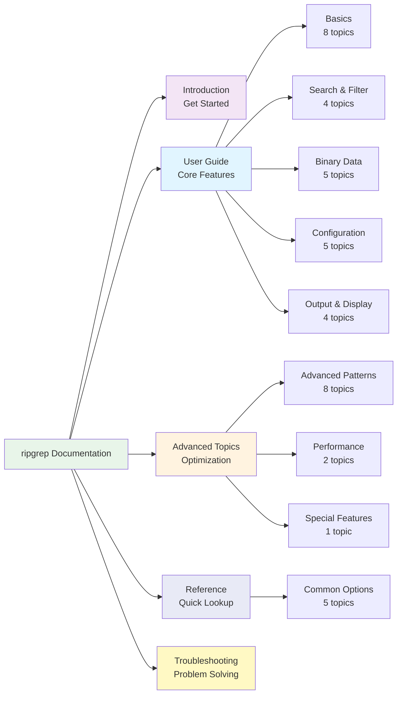

# Summary

!!! note "Documentation Navigation"
    This page provides a structured table of contents for the documentation.
    The documentation is organized into five main sections: Introduction, User Guide, Advanced Topics, Reference, and Troubleshooting.

**Figure**: Documentation structure showing the five main sections and key topic groups.

!!! tip "Getting Started"
    New users should start with the [Introduction](introduction.md), then explore the [Basics](basics/index.md) to learn fundamental concepts. After mastering the basics, explore other User Guide topics based on your needs. Advanced Topics cover performance optimization and specialized features.

## Introduction

[Introduction](introduction.md)

## User Guide

!!! info "User Guide Overview"
    The User Guide covers all core features organized by functionality. Start with Basics if you're new to ripgrep, then explore search capabilities, filtering options, configuration, and output formatting. These topics build on each other progressively.

### Basics

- [Basics](basics/index.md) - Fundamental usage including pattern matching, literal strings, regular expressions, and basic output formatting
  - [Pattern Matching](basics/pattern-matching.md)
  - [Literal Search](basics/literal-search.md)
  - [Regex Basics](basics/regex-basics.md)
  - [Case Sensitivity](basics/case-sensitivity.md)
  - [Word Boundaries](basics/boundaries.md)
  - [Output Basics](basics/output.md)
  - [Count and List](basics/count-list.md)
  - [Practice Exercises](basics/practice.md)

### Search Features

- [Recursive Search](recursive-search.md)

### Filtering

- [Automatic Filtering](automatic-filtering.md)
- [Manual Filtering: Globs](manual-filtering-globs.md)
- [Manual Filtering: File Types](manual-filtering-types.md)

### Binary Data Handling

- [Binary Data](binary-data/index.md) - How ripgrep detects and processes binary files
  - [Binary Detection](binary-data/detection.md)
  - [Explicit vs Implicit Mode](binary-data/explicit-implicit.md)
  - [Binary Flags](binary-data/flags.md)
  - [Binary Modes](binary-data/modes.md)
  - [Examples](binary-data/examples.md)

### Configuration

- [Replacements](replacements.md)
- [Configuration File](configuration-file.md)
- [File Encoding](file-encoding.md)
- [Compressed Files](compressed-files.md)
- [Preprocessor](preprocessor.md)

### Output & Display

- [Context Lines](context-lines.md)
- [Output Formats](output-formats.md)
- [Sorting Results](sorting-results.md)
- [Utility Modes](utility-modes.md)

## Advanced Topics

!!! warning "Advanced Features"
    These topics cover advanced regex patterns, performance tuning, metrics collection, and specialized features. Familiarity with the User Guide is recommended before exploring these advanced capabilities.

### Advanced Regex Patterns

- [Advanced Patterns](advanced-patterns/index.md) - Advanced regex pattern features including multiline search, PCRE2, lookaround, backreferences, and Unicode
  - [Multiline Search](advanced-patterns/multiline.md)
  - [PCRE2 Engine](advanced-patterns/pcre2.md)
  - [Lookaround Assertions](advanced-patterns/lookaround.md)
  - [Backreferences](advanced-patterns/backreferences.md)
  - [Unicode Patterns](advanced-patterns/unicode.md)
  - [Inline Regex Flags](advanced-patterns/inline-flags.md)
  - [Performance Considerations](advanced-patterns/performance.md)
  - [Practical Examples](advanced-patterns/examples.md)

### Performance & Metrics

- [Performance](performance.md)
- [Statistics and Metrics](statistics.md)

### Special Features

- [Hyperlinks](hyperlinks.md)

## Reference

!!! info "Reference Material"
    Quick reference guides for frequently used options and command syntax.

- [Common Options](common-options/index.md) - Most frequently used flags organized by use case
  - [Search Basics](common-options/search-basics.md)
  - [Output Formatting](common-options/output-formatting.md)
  - [Output Modes](common-options/output-modes.md)
  - [File Filtering](common-options/file-filtering.md)
  - [Quick Reference](common-options/reference.md)

## Troubleshooting

!!! tip "Troubleshooting Guide"
    If you're experiencing unexpected behavior, the Troubleshooting section provides diagnostic techniques and solutions to common problems.

- [Troubleshooting](troubleshooting/index.md) - Diagnose and solve common problems
  - [No Results Found](troubleshooting/no-results.md)
  - [Binary and Encoding Issues](troubleshooting/binary-encoding.md)
  - [Error Messages](troubleshooting/errors.md)
  - [Performance Issues](troubleshooting/performance.md)
  - [Debug Flags](troubleshooting/debug-flags.md)
  - [Bug Reports](troubleshooting/bug-reports.md)
