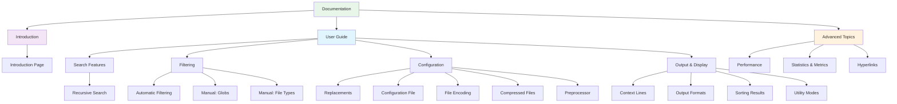

# Summary

!!! note "Documentation Navigation"
    This page provides a structured table of contents for the documentation.
    The documentation is organized into three main sections: Introduction, User Guide, and Advanced Topics.

**Figure**: Documentation structure showing the organization of topics across three main sections.

!!! tip "Getting Started"
    New users should start with the [Introduction](introduction.md), then explore the User Guide topics based on your needs. Advanced Topics cover performance optimization and specialized features.

[Introduction](introduction.md)

# User Guide

!!! info "User Guide Overview"
    The User Guide covers all core features organized by functionality: search capabilities, filtering options, configuration, and output formatting. These topics build on each other progressively.

- [Recursive Search](recursive-search.md)
- [Automatic Filtering](automatic-filtering.md)
- [Manual Filtering: Globs](manual-filtering-globs.md)
- [Manual Filtering: File Types](manual-filtering-types.md)
- [Replacements](replacements.md)
- [Configuration File](configuration-file.md)
- [File Encoding](file-encoding.md)
- [Compressed Files](compressed-files.md)
- [Preprocessor](preprocessor.md)
- [Context Lines](context-lines.md)
- [Output Formats](output-formats.md)
- [Sorting Results](sorting-results.md)
- [Utility Modes](utility-modes.md)

# Advanced Topics

!!! warning "Advanced Features"
    These topics cover performance tuning, metrics collection, and specialized features. Familiarity with the User Guide is recommended before exploring these advanced capabilities.

- [Performance](performance.md)
- [Statistics and Metrics](statistics.md)
- [Hyperlinks](hyperlinks.md)
