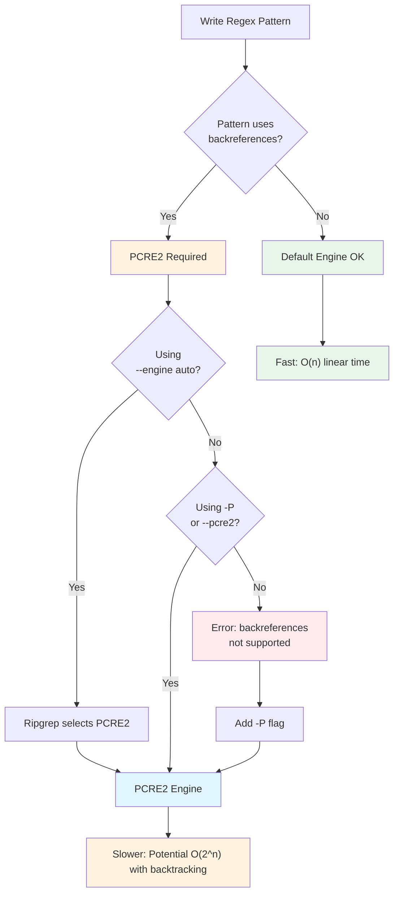

# Backreferences

> Part of the [Advanced Patterns](./index.md) page

Backreferences allow you to match previously captured groups within a regex pattern. **Requires PCRE2** (`-P` flag).

!!! warning "PCRE2 Engine Required"
    Backreferences are **ONLY** available with the PCRE2 engine and are **NOT supported** by ripgrep's default regex engine.

    The default engine uses finite automata which cannot support backreferences. PCRE2 uses a backtracking algorithm that enables backreferences, but at a performance cost (see [Performance Considerations](#performance-considerations) below).

    **Quick tip**: Use `--engine auto` to let ripgrep automatically select PCRE2 when your pattern contains backreferences.



**Figure**: Engine selection flow for backreference patterns - shows automatic detection and performance trade-offs.

## Numbered Backreferences

```bash
# Find repeated words (word followed by same word)
rg -P '(\w+)\s+\1'              # (1)!

# Find repeated patterns
rg -P '(\d{3})-\1'               # (2)!
```

1. `(\w+)` captures a word, `\1` matches the same word again - finds "the the" or "test test"
2. `(\d{3})` captures 3 digits, `\1` matches same digits - finds "123-123" pattern

The `\1` refers to the first capture group, `\2` to the second, etc.

## Named Backreferences

Use named captures with `(?P<name>...)` and reference with `\k<name>`:

```bash
# Find repeated words using named captures
rg -P '(?P<word>\w+)\s+\k<word>'    # (1)!
```

1. `(?P<word>\w+)` captures word with name "word", `\k<word>` references it by name - more readable than `\1`

## Backreferences in Replacements

Backreferences are particularly useful with the `-r` flag for replacements:

```bash
# Swap two words
rg -P '(\w+)\s+(\w+)' -r '$2 $1'                        # (1)!

# Transform patterns
rg -P '(\w+)@(\w+)\.com' -r 'User: $1, Domain: $2'     # (2)!
```

1. Captures two words, swaps their order in replacement - "foo bar" becomes "bar foo"
2. Extracts email parts into structured format - "john@example.com" becomes "User: john, Domain: example"

### Replacement Syntax Rules

When using backreferences in replacements, keep these syntax constraints in mind:

- **Group names** must use only `[_0-9A-Za-z]` characters
- **Longest match rule**: `$1a` attempts to match a group named `1a` first
- **Disambiguation**: Use `${1}a` to reference group `1` followed by literal `a`
- **Invalid references** are replaced with empty strings

!!! example "Disambiguation Examples"
    ```bash
    # Without braces - tries to match group '1a'
    rg '(?P<word>\w+)' -r '$1a'

    # With braces - group 1 followed by 'a'
    rg '(?P<word>\w+)' -r '${1}a'

    # Named groups with braces for clarity
    rg '(?P<word>\w+)' -r '${word}s'  # Pluralize
    ```

See the [Replacements chapter](../replacements.md) for more details.

## Performance Considerations

Backreferences have significant performance implications compared to ripgrep's default engine:

### Why PCRE2 is Slower

**Engine Architecture Differences:**

- **Default engine**: Uses finite automata with guaranteed **linear time complexity** O(n)
- **PCRE2 engine**: Uses backtracking algorithm with potential for **exponential time complexity** O(2^n) on pathological patterns

**Backtracking Complexity**: PCRE2's backtracking can exhibit catastrophic performance on certain patterns, especially:

- Nested quantifiers like `(a+)+` or `(a*)*`
- Complex alternations with overlapping possibilities
- Patterns with extensive backtracking on non-matches

!!! danger "Pathological Pattern Example"
    ```bash
    # This pattern can cause exponential backtracking
    # Avoid patterns like this on large inputs:
    rg -P '(a+)+b' file.txt

    # On input 'aaaaaaaaaa' (no 'b'), this pattern tests
    # exponentially many ways to split the a's between groups
    ```


**Figure**: Comparison of engine complexity - default engine maintains linear time, PCRE2 can be linear for good patterns but exponential for pathological ones.

### Performance Optimizations

**PCRE2 JIT Compilation**: When available, PCRE2's JIT (Just-In-Time) compiler can improve performance by 2-10x compared to interpreted PCRE2. However, JIT-compiled PCRE2 is typically still slower than ripgrep's default engine.

**Automatic Engine Selection**: Use `--engine auto` to let ripgrep choose the best engine based on pattern features:

```bash
# Source: crates/core/flags/defs.rs:1710-1721
# Automatically selects PCRE2 for backreferences
rg --engine auto '(\w+)\s+\1'

# Automatically uses default engine for simple patterns
rg --engine auto 'simple_pattern'
```

### Best Practices

- **Use default engine** unless you specifically need backreferences or other PCRE2-only features
- **Test patterns** on representative data before using in production
- **Limit search scope** when using PCRE2 (specific files/directories rather than entire codebases)
- **Avoid nested quantifiers** that can cause exponential backtracking
- **Profile with `--stats`** to measure actual performance impact

See [Performance](./performance.md) for detailed comparisons and optimization techniques.

## Troubleshooting

### "Backreferences are not supported" Error

If you try to use backreferences without the PCRE2 engine, ripgrep will detect this and provide a helpful error message:

```bash
# This will fail with default engine
$ rg '(\w+)\s+\1' file.txt
error: regex parse error:
    (\w+)\s+\1
            ^^
backreferences are not supported

Consider enabling PCRE2 with the --pcre2 flag, which can handle backreferences
and look-around.
```

**Solutions:**

=== "Use -P flag"
    ```bash
    # Source: crates/core/flags/hiargs.rs:1430-1448
    # Explicitly enable PCRE2
    rg -P '(\w+)\s+\1' file.txt
    ```

=== "Use --engine auto"
    ```bash
    # Let ripgrep choose the right engine automatically
    rg --engine auto '(\w+)\s+\1' file.txt
    ```

=== "Use --pcre2 long form"
    ```bash
    # Long form of the -P flag
    rg --pcre2 '(\w+)\s+\1' file.txt
    ```

!!! tip "Automatic Detection"
    Ripgrep analyzes error messages and automatically suggests using `--pcre2` when it detects backreference syntax in patterns that fail with the default engine.

## Named Capture Groups

Named capture groups make complex patterns more readable and are essential for sophisticated replacements.

### Defining Named Captures

Both engines support named capture groups with `(?P<name>...)` syntax:

```bash
# Define named groups
rg '(?P<func>\w+)\((?P<args>.*)\)'
```

### Using Named Captures in Replacements

Reference named captures in replacements with `$name` or `${name}`:

```bash
# Extract function names
rg '(?P<func>\w+)\(' -r 'Function: $func'

# Restructure matches
rg '(?P<first>\w+), (?P<last>\w+)' -r '$last, $first'

# Use braces for disambiguation
rg '(?P<word>\w+)' -r '${word}s'  # Pluralize
```

### Named vs Numbered Captures

```bash
# Numbered captures ($1, $2, ...)
rg '(\w+)@(\w+)\.com' -r 'User: $1, Domain: $2'

# Named captures (more readable for complex patterns)
rg '(?P<user>\w+)@(?P<domain>\w+)\.com' -r 'User: $user, Domain: $domain'
```

Named captures are particularly valuable for:
- Complex patterns with many capture groups
- Making replacement expressions self-documenting
- Maintaining readability in large patterns

See the [Replacements chapter](../replacements.md) for more examples.

## Related Topics

- **[PCRE2 Engine](./pcre2.md)** - Comprehensive guide to PCRE2 features and capabilities
- **[Regex Basics](../basics/regex-basics.md)** - Understanding default engine limitations and when to use PCRE2
- **[Performance](./performance.md)** - Detailed performance comparisons and optimization strategies
- **[Replacements](../replacements.md)** - Using backreferences in replacement expressions
