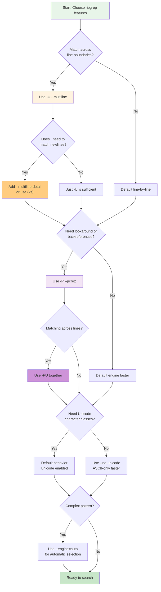

# Advanced Patterns

This chapter covers advanced regex pattern features in ripgrep, including multiline search, PCRE2 engine support, lookaround assertions, backreferences, Unicode patterns, and performance considerations.

## Table of Contents

- [Multiline Search](./multiline.md)
- [PCRE2 Engine](./pcre2.md)
- [Lookaround Assertions](./lookaround.md)
- [Backreferences](./backreferences.md)
- [Unicode Patterns](./unicode.md)
- [Inline Regex Flags](./inline-flags.md)
- [Performance Considerations](./performance.md)
- [Practical Examples](./examples.md)

## Quick Reference

### Feature Architecture

The advanced features in ripgrep are organized into layers that can be combined:

```mermaid
graph TB
    subgraph "Search Modes"
        Line["Line-by-line Mode
        Default behavior"]
        Multi["Multiline Mode
        -U flag"]
        Dotall["Dotall Mode
        --multiline-dotall
        (requires -U)"]

        Multi --> Dotall
    end

    subgraph "Regex Engines"
        Default["Default Engine
        Fast, limited features"]
        PCRE["PCRE2 Engine
        -P flag
        Advanced features"]

        Default --> Unicode1["Unicode Support
        \\p Properties"]
        PCRE --> Unicode2["Unicode Support
        \\p Properties"]
        PCRE --> Look["Lookaround
        Assertions"]
        PCRE --> Back["Backreferences
        \\1, \\2, etc."]
    end

    subgraph "Combined"
        Combined["PCRE2 + Multiline
        -PU flag
        Full feature set"]
    end

    Multi -.->|"Can combine"| PCRE
    Multi -.->|"Produces"| Combined
    PCRE -.->|"Produces"| Combined

    style Line fill:#e8f5e9
    style Default fill:#e1f5ff
    style PCRE fill:#fff3e0
    style Multi fill:#f3e5f5
    style Combined fill:#ffebee
    style Dotall fill:#f3e5f5
```

**Figure**: Ripgrep advanced feature layers showing how flags and modes combine.

!!! tip "Feature Composition"
    Advanced features can be combined (e.g., `-PU` for PCRE2 + multiline), but each addition has a performance cost. Start with the simplest pattern that works and add features only when needed.

### Decision Tree: Choosing the Right Features

Use this guide to select appropriate flags for your search:



!!! note "About --engine=auto"
    The `--engine=auto` flag analyzes your pattern and automatically selects the best regex engine. It chooses the default engine for simple patterns (faster) or switches to PCRE2 when it detects features like lookaround or backreferences. This is useful when you're not sure which engine to use.

### Engine Comparison: Default vs PCRE2

=== "Feature Comparison"

    | Feature | Default Engine | PCRE2 Engine (`-P`) |
    |---------|---------------|---------------------|
    | **Performance** | Faster - optimized for speed | Slower - more feature-rich |
    | **Lookaround** | Not supported | ✓ `(?=...)` `(?!...)` `(?<=...)` `(?<!...)` |
    | **Backreferences** | Not supported | ✓ `\1` `\2` etc. |
    | **Named captures** | ✓ Supported | ✓ Supported |
    | **Unicode classes** | ✓ `\p{Letter}` etc. | ✓ `\p{Letter}` etc. |
    | **Multiline mode** | ✓ With `-U` | ✓ With `-U` (use `-PU`) |
    | **When to use** | Most searches - default choice | When you need lookaround or backreferences |

=== "Performance Impact"

    **Default Engine:**

    - Uses optimized automata-based matching
    - Typically 2-10x faster than PCRE2
    - Scales well with file size
    - Best for production searches

    **PCRE2 Engine:**

    - Backtracking-based matching
    - Feature-rich but slower
    - Can be catastrophically slow with certain patterns (e.g., nested quantifiers)
    - Use only when features are required

    !!! warning "Catastrophic Backtracking Risk"
        PCRE2 patterns with nested quantifiers like `(a+)+b` can cause exponential slowdown. Always test complex PCRE2 patterns with `--stats` on sample data before running on large codebases.

=== "When to Switch Engines"

    **Stay with Default Engine when:**

    - Simple text matching
    - Character classes and alternation
    - Named capture groups
    - Unicode property matching
    - Performance is critical

    **Switch to PCRE2 (`-P`) when you need:**

    - Positive/negative lookahead: `(?=...)`, `(?!...)`
    - Positive/negative lookbehind: `(?<=...)`, `(?<!...)`
    - Backreferences: `\1`, `\2`, etc.
    - Conditional patterns: `(?(condition)yes|no)`

    !!! example "Common PCRE2 Use Case"
        Finding duplicate words requires backreferences:
        ```bash
        rg -P '\b(\w+)\s+\1\b'  # Matches "the the", "is is", etc.
        ```
        This pattern is impossible with the default engine.

!!! tip "Choosing the Right Engine"
    Start with the default engine. Only use `-P` (PCRE2) when you specifically need lookaround assertions or backreferences. The default engine is significantly faster for most search patterns.

## Summary

Advanced regex features in ripgrep provide powerful search capabilities:

- **Multiline mode** (`-U`) for patterns spanning lines
- **PCRE2 engine** (`-P`) for lookaround and backreferences
- **Unicode support** for international text with `\p{Property}`
- **Named captures** for readable complex patterns
- **Inline flags** for fine-grained control

!!! success "Key Principles for Advanced Patterns"
    1. **Start simple**: Use default engine unless you need PCRE2 features
    2. **Avoid multiline mode** for performance unless necessary
    3. **Test complex patterns**: Use `--stats` to understand performance impact
    4. **Combine thoughtfully**: Each flag adds overhead - only use what you need
    5. **Remember gotchas**: `.` doesn't match `\n` by default, PCRE2 requires `-P`

!!! warning "Common Pitfalls"
    - **Forgetting `-P`**: Lookaround and backreferences require PCRE2 engine
    - **Multiline without dotall**: `-U` alone doesn't make `.` match newlines (use `--multiline-dotall` or `(?s)`)
    - **Performance blind spots**: PCRE2 can be orders of magnitude slower - always test on representative data
    - **Combining `-P` and `-U`**: When you need both, use `-PU` together

For most searches, simple patterns with the default engine are sufficient. Use advanced features when the problem requires them, understanding the performance tradeoffs.

### Quick Command Reference

```bash
# Multiline search with dotall
rg -U --multiline-dotall 'pattern'     # (1)!

# PCRE2 for lookaround
rg -P '(?<=prefix)pattern'             # (2)!

# Combined PCRE2 + multiline
rg -PU 'pattern.*\n.*match'            # (3)!

# Test pattern performance
rg -P 'complex.*pattern' --stats       # (4)!

# Auto-select engine
rg --engine=auto 'pattern'             # (5)!
```

1. Search across line boundaries with `.` matching newlines
2. Use PCRE2 for positive lookbehind assertion
3. Combine PCRE2 and multiline for complex cross-line patterns
4. Show performance statistics to identify slow patterns
5. Let ripgrep choose the best engine for your pattern

## Related Chapters

- [Basic Usage](../basics/index.md) - Fundamental regex patterns
- [Replacements](../replacements.md) - Using captures in replacements
- [File Encoding](../file-encoding.md) - Handling different encodings
