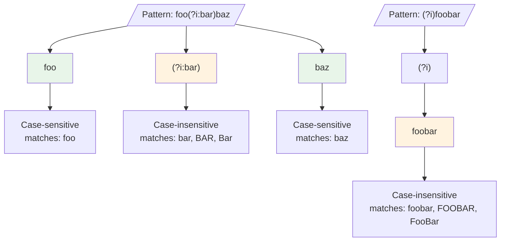

# Inline Regex Flags

> Part of the [Advanced Patterns](./index.md) page

Inline flags allow you to control regex behavior within the pattern itself, without using command-line options. This gives you fine-grained control over different parts of your pattern.

## Common Inline Flags

| Flag | Effect |
|------|--------|
| `(?s)` | Dotall: `.` matches newlines (see [multiline.md](./multiline.md#multiline-dotall-mode)) |
| `(?i)` | Case-insensitive matching |
| `(?m)` | Multi-line: `^` and `$` match line boundaries |
| `(?x)` | Verbose: allow whitespace and comments |
| `(?u)` | Enable Unicode mode (default in Rust regex) |
| `(?R)` | CRLF mode: treat `\r\n` as line terminators |
| `(?U)` | Swap greedy/lazy quantifiers (non-greedy by default) |
| `(?-s)` | Disable dotall mode |
| `(?-i)` | Case-sensitive matching |
| `(?-u)` | Disable Unicode mode (ASCII-only matching) |

!!! tip "When to Use Inline Flags"
    Inline flags are particularly useful when you need different behaviors in different parts of your pattern, or when you want patterns to be portable across different invocations without remembering specific command-line flags.

## Inline Flag Syntax

There are three ways to use inline flags:

1. **For entire pattern**: `(?flags)pattern` - Apply flags to everything after
2. **For specific part**: `(?flags:pattern)` - Apply flags only within the group
3. **Set and clear flags**: `(?flags-otherflags)` - Enable some flags while disabling others



**Figure**: Inline flag scope - scoped `(?i:...)` affects only enclosed pattern, global `(?i)` affects everything after.

=== "Global Scope"

    ```bash
    # Source: tests/regression.rs:1451
    # Dotall for entire pattern
    rg -U '(?s)world.+detective'

    # Case-insensitive for entire pattern
    rg '(?i)foo.*bar'  # Matches "FOO anything BAR"
    ```

=== "Scoped"

    ```bash
    # Source: tests/regression.rs:1451
    # Dotall only for middle part
    rg -U 'world(?s:.+)detective'

    # Case-insensitive for specific part
    rg 'foo(?i:bar|baz)qux'  # Matches "foobarqux", "fooBarqux", "fooBAZqux"
    ```

=== "Combined"

    ```bash
    # Source: tests/regression.rs:1286
    # Enable case-insensitive, disable multiline
    rg '(?i-m)^pattern'

    # Disable Unicode mode for performance
    rg '(?-u)[a-z]+' file
    ```

!!! note "Flag Scope"
    When using `(?flags)`, all text after the flag is affected. To limit the scope, use the `(?flags:pattern)` syntax which only applies flags within the parentheses.

!!! warning "Common Pitfall: Flag Placement"
    Inline flags must appear before the text they affect. `foo(?i)bar` applies case-insensitivity only to `bar`, not `foo`. To affect the entire pattern, place flags at the start: `(?i)foobar`.

## Flag Precedence

Inline flags override command-line flags, giving you precise control:

```bash
# Source: tests/regression.rs:1286
# -i flag overridden by (?-i) in pattern
rg -i 'foo(?-i:bar)'  # "foo" is case-insensitive, "bar" is case-sensitive
```

!!! warning "Inline Flags Take Precedence"
    When an inline flag conflicts with a command-line flag, the inline flag always wins. This allows you to create self-contained patterns that work consistently regardless of how ripgrep is invoked.

## Verbose Mode for Complex Patterns

The `(?x)` flag enables verbose mode, which allows whitespace and comments in your pattern. This is invaluable for documenting complex regex patterns.

### Basic Verbose Example

```bash
# Match phone numbers with documentation
rg '(?x)
    \d{3}    # Area code
    -        # Separator
    \d{4}    # Number
'
```

### Real-World Example: Parsing Log Entries

```bash
# Match structured log entries with timestamps
rg '(?x)                      # (1)!
    \[                        # (2)!
    \d{4}-\d{2}-\d{2}        # Date: YYYY-MM-DD
    \s+                       # Whitespace
    \d{2}:\d{2}:\d{2}        # Time: HH:MM:SS
    \]                        # Closing bracket
    \s+                       # Separator whitespace
    (?:ERROR|WARN)            # (3)!
    .*                        # Rest of message
'
```

1. Verbose mode allows whitespace and comments in pattern
2. Literal brackets must be escaped even in verbose mode
3. Non-capturing group `(?:...)` for alternation without creating a capture group

!!! tip "Verbose Mode Best Practices"
    Use `(?x)` for any pattern longer than 20-30 characters. The documentation value outweighs the slight overhead, especially when you or teammates need to modify the pattern later.

!!! note "Shell Quoting"
    For multiline patterns, use single quotes in bash and ensure proper escaping. Alternatively, store complex patterns in files and use `-f pattern.txt`.

## Unicode Mode Control

The `(?u)` and `(?-u)` flags control Unicode handling in patterns.

### Unicode Mode (Default)

By default, Rust regex enables Unicode mode, which means character classes and word boundaries understand Unicode:

```bash
# With Unicode mode (default), \w matches Unicode word characters
rg '\w+' file  # Matches "hello", "世界", "Привет"

# Explicitly enable Unicode mode
rg '(?u)\w+' file
```

### ASCII-Only Mode

Use `(?-u)` to disable Unicode mode for better performance when working with ASCII-only text:

```bash
# Source: crates/regex/src/non_matching.rs:136
# Disable Unicode mode for ASCII-only matching
rg '(?-u)[a-z]+' file  # Only matches ASCII a-z

# Performance-sensitive ASCII matching
rg '(?-u)\w+' large_ascii_file.txt
```

!!! tip "Performance Consideration"
    When you know your input is ASCII-only, using `(?-u)` can provide a significant performance improvement, especially for large files.

## Greedy vs. Lazy Quantifiers

The `(?U)` flag swaps the behavior of greedy and lazy quantifiers.

### Default Greedy Behavior

```bash
# By default, quantifiers are greedy (match as much as possible)
echo 'foo bar baz' | rg 'f.*z'  # Matches entire "foo bar baz"
```

### Non-Greedy by Default

```bash
# Make quantifiers non-greedy by default
echo 'foo bar baz' | rg '(?U)f.*z'  # Matches up to first 'z'

# Individual quantifiers can override
echo 'foo bar baz' | rg '(?U)f.*?z'  # ? makes it greedy in this context
```

!!! note "Rarely Used"
    The `(?U)` flag is rarely needed in practice. Most users prefer the standard greedy behavior and use `*?`, `+?`, `??` explicitly when non-greedy matching is desired.

## CRLF Line Handling

The `(?R)` flag treats `\r\n` (Windows line endings) as line terminators.

```bash
# Handle Windows-style line endings
rg '(?Rm)^pattern' windows_file.txt
```

!!! warning "Engine Compatibility"
    Some inline flags may behave differently depending on whether you're using the default Rust regex engine or PCRE2 (with `-P` flag). See [PCRE2 Engine](./pcre2.md) for details on engine differences.

## Related Topics

- [Multiline Search](./multiline.md) - Understanding `(?s)` dotall mode in multiline context
- [PCRE2 Engine](./pcre2.md) - Engine compatibility and flag differences
- [Unicode Patterns](./unicode.md) - Deep dive into Unicode support and `(?u)` mode
