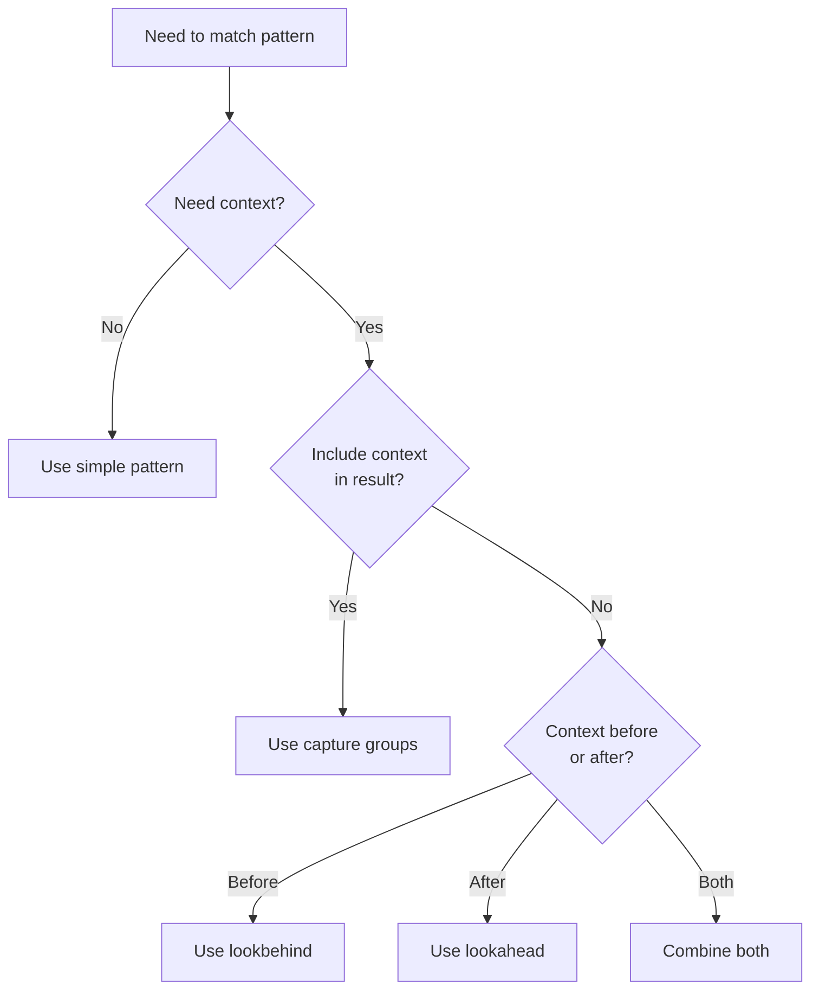

# Lookaround Assertions

> Part of the [Advanced Patterns](./index.md) page

Lookaround assertions match patterns based on surrounding context without including that context in the match. **Requires PCRE2** (`-P` flag).

!!! warning "PCRE2 Required"
    Lookaround assertions require the `-P` flag. Without it, patterns will fail with regex parse errors. See [PCRE2 Engine](./pcre2.md) for details.

## Types of Lookaround

Lookaround assertions are **zero-width**, meaning they match a position without consuming characters. This makes them ideal for context-based filtering and extraction.

=== "Lookahead"
    **Positive Lookahead** `(?=...)`: Assert pattern ahead matches

    - Checks if pattern exists **after** current position
    - Doesn't include the matched pattern in result
    - Common use: "Find X followed by Y, but only return X"

    **Negative Lookahead** `(?!...)`: Assert pattern ahead doesn't match

    - Checks if pattern does **not** exist after current position
    - Common use: "Find X not followed by Y"

=== "Lookbehind"
    **Positive Lookbehind** `(?<=...)`: Assert pattern behind matches

    - Checks if pattern exists **before** current position
    - Doesn't include the matched pattern in result
    - Common use: "Find X preceded by Y, but only return X"

    **Negative Lookbehind** `(?<!...)`: Assert pattern behind doesn't match

    - Checks if pattern does **not** exist before current position
    - Common use: "Find X not preceded by Y"

## Lookahead Examples

```bash
# Find lines ending with 'o' before the last word
# Source: tests/regression.rs:1046
rg -P '.*o(?!.*\s)' # (1)!

# Find "foo" only if followed by "bar"
rg -P 'foo(?=bar)' # (2)!

# Find "foo" NOT followed by "bar"
rg -P 'foo(?!bar)' # (3)!
```

1. **Negative lookahead**: `(?!.*\s)` asserts no whitespace follows, ensuring we match the last 'o' before end of line
2. **Positive lookahead**: `(?=bar)` checks that "bar" follows "foo", but only "foo" is matched
3. **Negative lookahead**: `(?!bar)` checks that "bar" does NOT follow "foo"

## Lookbehind Examples

```bash
# Find "bar" preceded by "foo" on previous line
rg -UP '(?<=foo\n)bar' # (1)!

# Find digits preceded by "$"
rg -P '(?<=\$)\d+' # (2)!

# Find words NOT preceded by "un"
rg -P '(?<!un)\w+able' # (3)!
```

1. **Positive lookbehind with multiline**: `(?<=foo\n)` checks for "foo" followed by newline before "bar". Requires `-U` (multiline mode) to match across lines. See [Multiline Search](./multiline.md) for details.
2. **Positive lookbehind**: `(?<=\$)` checks for dollar sign before digits. The `$` must be escaped as `\$` in the pattern.
3. **Negative lookbehind**: `(?<!un)` ensures "un" does NOT precede the word, so matches "capable" but not "uncapable"

## Combining with --only-matching

Lookaround is powerful when combined with `-o`/`--only-matching` for precise extraction:

```bash
# Extract numbers preceded by "$"
rg -Po '(?<=\$)\d+\.?\d*' # (1)!

# Extract words between quotes
rg -Po '(?<=").*?(?=")' # (2)!
```

1. **Extraction with lookbehind**: Only extracts the digits, not the `$` symbol. `\d+\.?\d*` matches integers or decimals.
2. **Extraction with both**: `(?<=")` asserts opening quote before, `(?=")` asserts closing quote after. Only the content between quotes is extracted. The `.*?` uses non-greedy matching.

## Use Cases

### When to Use Lookaround



### Common Scenarios

**Filtering matches based on context**

- ✓ Use lookaround when context shouldn't be in the result
- ✗ Use capture groups if you need the context too

**Extracting specific parts without surrounding text**

- ✓ Combine with `-o`/`--only-matching` for precise extraction
- Example: Extract prices without currency symbol

**Complex validation patterns**

- ✓ Use when you need to check multiple conditions
- Example: Password must contain digit but not start with one

**Finding patterns with specific neighboring content**

- ✓ Use when neighbors are variable length or complex
- ✗ Use simpler patterns if neighbors are fixed

!!! example "Real-World Examples"
    **Log parsing**: Extract error codes only from lines containing "FATAL"
    ```bash
    rg -Po '(?<=FATAL:).*(?=\|)'
    ```

    **Code analysis**: Find function calls not in comments
    ```bash
    rg -P '(?<!//.*)\bfoo\('
    ```

    **Data extraction**: Get values from key-value pairs
    ```bash
    rg -Po '(?<=temperature: )\d+\.?\d*'
    ```

## Performance Considerations

!!! tip "Performance Note"
    Lookaround assertions can be slower than simple patterns, especially with backtracking. Use the simplest pattern that meets your needs.

    **Optimization tips**:

    - Use fixed-length lookbehind when possible (faster than variable-length)
    - Avoid nested lookaround assertions
    - Test patterns on representative data to measure performance
    - Consider simpler alternatives if lookaround isn't strictly necessary

    See [Performance Considerations](./performance.md) for detailed optimization strategies.
