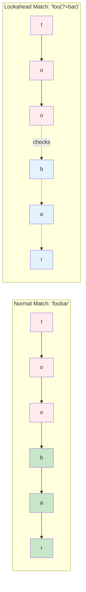
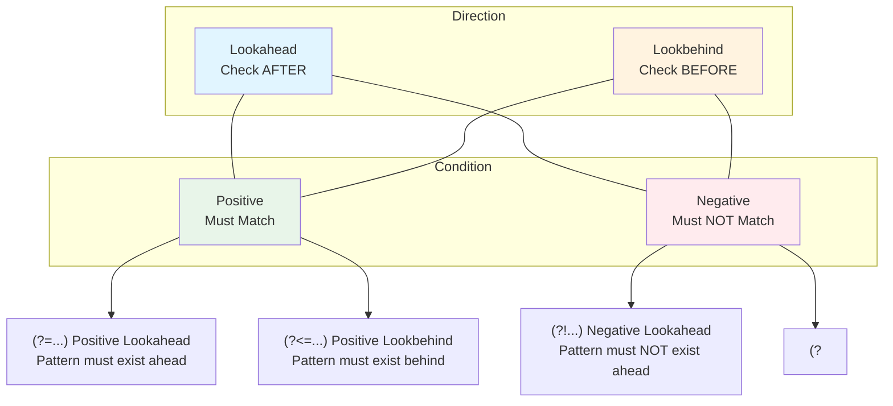
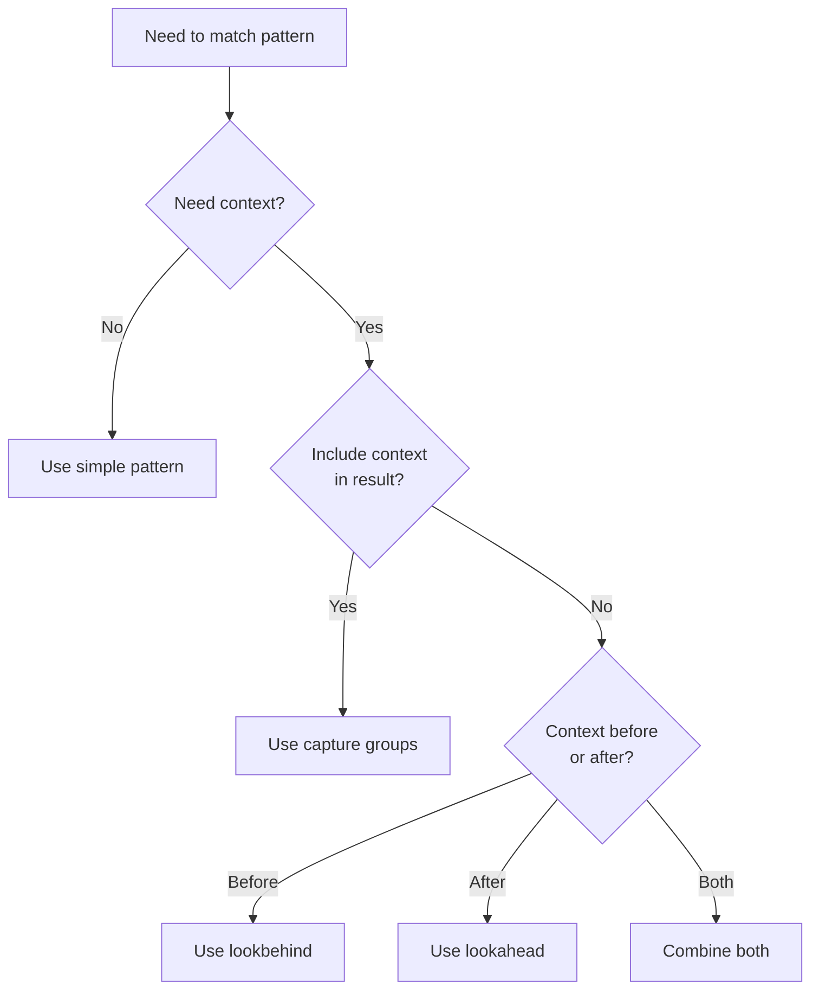

# Lookaround Assertions

Lookaround assertions match patterns based on surrounding context without including that context in the match. **Requires PCRE2** (`-P` flag).

!!! warning "PCRE2 Required"
    Lookaround assertions require the `-P` flag. Without it, patterns will fail with regex parse errors. See [PCRE2 Engine](./pcre2.md) for details.

## Types of Lookaround

Lookaround assertions are **zero-width**, meaning they match a position without consuming characters. This makes them ideal for context-based filtering and extraction.



**Figure**: Normal match vs lookahead. Red = matched and consumed; Green = matched and consumed; Blue = checked but not consumed (zero-width).

### Four Types at a Glance



**Figure**: The four lookaround types combine direction (ahead/behind) with condition (positive/negative).

=== "Lookahead"
    **Positive Lookahead** `(?=...)`: Assert pattern ahead matches

    - Checks if pattern exists **after** current position
    - Doesn't include the matched pattern in result
    - Common use: "Find X followed by Y, but only return X"

    **Negative Lookahead** `(?!...)`: Assert pattern ahead doesn't match

    - Checks if pattern does **not** exist after current position
    - Common use: "Find X not followed by Y"

=== "Lookbehind"
    **Positive Lookbehind** `(?<=...)`: Assert pattern behind matches

    - Checks if pattern exists **before** current position
    - Doesn't include the matched pattern in result
    - Common use: "Find X preceded by Y, but only return X"

    **Negative Lookbehind** `(?<!...)`: Assert pattern behind doesn't match

    - Checks if pattern does **not** exist before current position
    - Common use: "Find X not preceded by Y"

## Lookahead Examples

```bash
# Find lines ending with 'o' before the last word
# Source: tests/regression.rs:1046
rg -P '.*o(?!.*\s)' # (1)!

# Find "foo" only if followed by "bar"
rg -P 'foo(?=bar)' # (2)!

# Find "foo" NOT followed by "bar"
rg -P 'foo(?!bar)' # (3)!
```

1. **Negative lookahead**: `(?!.*\s)` asserts no whitespace follows, ensuring we match the last 'o' before end of line
2. **Positive lookahead**: `(?=bar)` checks that "bar" follows "foo", but only "foo" is matched
3. **Negative lookahead**: `(?!bar)` checks that "bar" does NOT follow "foo"

## Lookbehind Examples

```bash
# Find "bar" preceded by "foo" on previous line
rg -UP '(?<=foo\n)bar' # (1)!

# Find digits preceded by "$"
rg -P '(?<=\$)\d+' # (2)!

# Find words NOT preceded by "un"
rg -P '(?<!un)\w+able' # (3)!
```

1. **Positive lookbehind with multiline**: `(?<=foo\n)` checks for "foo" followed by newline before "bar". Requires `-U` (multiline mode) to match across lines. See [Multiline Search](./multiline.md) for details.
2. **Positive lookbehind**: `(?<=\$)` checks for dollar sign before digits. The `$` must be escaped as `\$` in the pattern.
3. **Negative lookbehind**: `(?<!un)` ensures "un" does NOT precede the word, so matches "capable" but not "uncapable"

## Combining with --only-matching

!!! tip "Power Technique: Lookaround + Only Matching"
    Combining lookaround with `-o`/`--only-matching` enables surgical extraction of data. The lookaround provides context checking while `-o` ensures only the target content is returned—no surrounding text.

Lookaround is powerful when combined with `-o`/`--only-matching` for precise extraction:

```bash
# Extract numbers preceded by "$"
rg -Po '(?<=\$)\d+\.?\d*' # (1)!

# Extract words between quotes
rg -Po '(?<=").*?(?=")' # (2)!

# Extract HTML content between title tags
rg -Po '(?<=<title>).*(?=</title>)' # (3)!

# Extract variable names in assignments (not declarations)
rg -Po '(?<!let\s)(?<!const\s)\b\w+(?=\s*=)' # (4)!
```

1. **Extraction with lookbehind**: Only extracts the digits, not the `$` symbol. `\d+\.?\d*` matches integers or decimals.
2. **Extraction with both lookahead and lookbehind**: `(?<=")` asserts opening quote before, `(?=")` asserts closing quote after. Only the content between quotes is extracted. The `.*?` uses non-greedy matching.
3. **Combined lookaround for HTML extraction**: `(?<=<title>)` ensures we start after the opening tag, `(?=</title>)` ensures we stop before the closing tag. Only the title content is extracted, not the tags.
4. **Multiple negative lookbehinds with positive lookahead**: `(?<!let\s)(?<!const\s)` ensures the variable is NOT preceded by `let` or `const` (not a declaration), while `(?=\s*=)` ensures an assignment follows. Extracts variable names only in assignments like `x = 5`, not declarations like `let x = 5`.

## Use Cases

### When to Use Lookaround



### Common Scenarios

**Filtering matches based on context**

- ✓ Use lookaround when context shouldn't be in the result
- ✗ Use capture groups if you need the context too

**Extracting specific parts without surrounding text**

- ✓ Combine with `-o`/`--only-matching` for precise extraction
- Example: Extract prices without currency symbol

**Complex validation patterns**

- ✓ Use when you need to check multiple conditions
- Example: Password must contain digit but not start with one

**Finding patterns with specific neighboring content**

- ✓ Use when neighbors are variable length or complex
- ✗ Use simpler patterns if neighbors are fixed

!!! example "Real-World Examples"
    **Log parsing**: Extract error codes only from lines containing "FATAL"
    ```bash
    rg -Po '(?<=FATAL:).*(?=\|)'
    ```

    **Code analysis**: Find function calls not in comments
    ```bash
    rg -P '(?<!//.*)\bfoo\('
    ```

    **Data extraction**: Get values from key-value pairs
    ```bash
    rg -Po '(?<=temperature: )\d+\.?\d*'
    ```

## Performance Considerations

!!! tip "Performance Note"
    Lookaround assertions can be slower than simple patterns, especially with backtracking. Use the simplest pattern that meets your needs.

    **Optimization tips**:

    - Use fixed-length lookbehind when possible (faster than variable-length)
    - Avoid nested lookaround assertions
    - Test patterns on representative data to measure performance
    - Consider simpler alternatives if lookaround isn't strictly necessary

    See [Performance Considerations](./performance.md) for detailed optimization strategies.

### Fixed-Length vs Variable-Length Lookbehind

PCRE2 supports both fixed-length and variable-length lookbehind patterns, with significant performance differences:

**Fixed-Length Lookbehind** (faster):
```bash
# Fixed: always checks exactly 3 characters
rg -P '(?<=foo)\w+'     # (1)!

# Fixed: always checks exactly 4 characters
rg -P '(?<=\$\d{2})\w+' # (2)!
```

1. **Fixed-length**: The pattern `foo` is always exactly 3 characters, allowing PCRE2 to optimize by stepping back a known distance
2. **Fixed-length**: `\$\d{2}` always matches exactly 3 characters ($ plus two digits), enabling the same optimization

**Variable-Length Lookbehind** (slower):
```bash
# Variable: can match 3-10 characters
rg -P '(?<=foo.*)\w+'   # (3)!

# Variable: can match varying lengths
rg -P '(?<=\w+:)\d+'    # (4)!
```

3. **Variable-length**: `foo.*` can match different lengths, requiring PCRE2 to try multiple starting positions with backtracking
4. **Variable-length**: `\w+:` matches one or more word characters followed by colon, varying in length

**Performance Impact**: Fixed-length lookbehind can be 10-100x faster because the regex engine knows exactly how far to step back. Variable-length requires backtracking to find all possible starting positions.

**Best Practice**: Use fixed-length lookbehind whenever possible. If you need variable-length, consider if a simpler pattern or capture group might work instead.

### Avoiding Nested Lookaround

Nested lookaround assertions should be avoided due to exponential backtracking:

```bash
# Bad: nested lookaround (exponential backtracking)
rg -P '(?=(?!bad))\w+'  # (1)!

# Good: simplified to single lookahead
rg -P '(?!bad)\w+'      # (2)!

# Bad: complex nesting
rg -P '(?=(?<=foo)bar)' # (3)!

# Good: combine conditions differently
rg -P '(?<=foo)bar'     # (4)!
```

1. **Nested lookaround**: Double assertion `(?=(?!bad))` causes PCRE2 to evaluate both the outer lookahead and inner negative lookahead at each position, leading to quadratic or worse time complexity
2. **Simplified**: Single negative lookahead `(?!bad)` achieves the same result with linear time
3. **Complex nesting**: Combining lookahead and lookbehind in nested fashion is rarely necessary and very slow
4. **Simplified**: In most cases, assertions can be combined at the same level rather than nested

**Why Nested Lookaround is Slow**: Each nesting level multiplies the number of positions the regex engine must check. With backtracking, this can lead to exponential time complexity on certain inputs, especially with patterns that can match in multiple ways.
