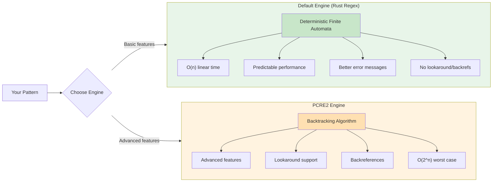

# PCRE2 Engine

> Part of the [Advanced Patterns](./index.md) page

Ripgrep supports two regex engines:

1. **Default engine**: Fast Rust regex with finite automata
2. **PCRE2 engine**: Provides advanced features like lookaround and backreferences

## Enabling PCRE2

Use the `-P` or `--pcre2` flag to enable the PCRE2 engine:

```bash
# Use PCRE2 for lookahead
rg -P 'foo(?=bar)'              # (1)!

# Check if PCRE2 is available
rg --pcre2-version              # (2)!
```

1. `-P` enables PCRE2 engine; `(?=bar)` is a lookahead assertion (matches 'foo' only if followed by 'bar')
2. `--pcre2-version` displays PCRE2 library version and JIT compilation status

## PCRE2 Availability

PCRE2 is an optional compile-time feature. Check availability with:

```bash
# Source: crates/pcre2/src/lib.rs
rg --pcre2-version
```

If PCRE2 is not compiled in, this command exits with an error.

## Default vs PCRE2 Features



**Figure**: Architecture comparison of ripgrep's two regex engines and their fundamental algorithmic differences.

| Feature | Default Engine | PCRE2 Engine |
|---------|---------------|--------------|
| Basic regex | ✓ | ✓ |
| Character classes | ✓ | ✓ |
| Quantifiers | ✓ | ✓ |
| Unicode support | ✓ | ✓ |
| Named captures | ✓ | ✓ |
| Lookahead/Lookbehind | ✗ | ✓ |
| Backreferences | ✗ | ✓ |
| Performance | Faster | Slower |
| Error messages | Better | Less helpful |

## When to Use PCRE2

!!! tip "Engine Selection Strategy"
    Start with the default engine for best performance. Only switch to PCRE2 if you need lookaround or backreferences. Use `--engine=auto` to let ripgrep choose automatically based on your pattern.

Use PCRE2 when you need:

- Lookahead or lookbehind assertions (see [Lookaround](./lookaround.md))
- Backreferences for matching repeated patterns (see [Backreferences](./backreferences.md))
- Complex pattern features not in the default engine

For most searches, the default engine is faster and sufficient.

!!! example "Practical Use Cases"
    **Default engine** (fast):
    ```bash
    rg 'function \w+\('           # Find function definitions
    rg 'TODO.*@username'          # Find TODOs by user
    ```

    **PCRE2 engine** (advanced):
    ```bash
    rg -P '(?<=class )\w+'        # Lookbehind: extract class names
    rg -P '(\w+)=\1'              # Backreference: find duplicated words
    ```

## PCRE2 Error Messages

!!! warning "PCRE2 Error Messages"
    PCRE2 provides less helpful error messages than the default engine. If you get cryptic errors, try your pattern with the default engine first to debug.

## Engine Selection

The `--engine` flag allows you to explicitly choose which regex engine to use, or let ripgrep choose automatically.

```mermaid
flowchart TD
    Start[Choose Regex Engine] --> Need{Need PCRE2<br/>features?}

    Need -->|Yes: lookaround<br/>or backrefs| PCRE2[--engine=pcre2]
    Need -->|No| Performance{Performance<br/>critical?}
    Need -->|Unsure| Auto[--engine=auto]

    Performance -->|Yes| Default[--engine=default]
    Performance -->|No| Auto

    PCRE2 --> PCRENote[Slower but feature-rich<br/>Backtracking algorithm]
    Default --> DefaultNote[Fastest<br/>Finite automata: O&#40;n&#41;]
    Auto --> AutoNote[Analyzes pattern<br/>Selects best engine]

    AutoNote --> AutoCheck{Pattern has<br/>PCRE2 features?}
    AutoCheck -->|Yes| AutoPCRE[Uses PCRE2]
    AutoCheck -->|No| AutoDefault[Uses default]

    style PCRE2 fill:#fff3e0
    style Default fill:#e8f5e9
    style Auto fill:#e1f5ff
    style PCRENote fill:#fff3e0
    style DefaultNote fill:#e8f5e9
    style AutoPCRE fill:#fff3e0
    style AutoDefault fill:#e8f5e9
```



**Figure**: Decision flow for selecting the appropriate regex engine based on pattern requirements and performance needs.

### Engine Options

```bash
# Use default Rust regex engine (fastest)
rg --engine=default 'pattern'        # (1)!

# Use PCRE2 engine (advanced features)
rg --engine=pcre2 'pattern'          # (2)!

# Automatically choose based on pattern (recommended for complex patterns)
rg --engine=auto 'pattern'           # (3)!
```

1. `--engine=default` forces the fast finite automata engine (O(n) performance, no lookaround/backrefs)
2. `--engine=pcre2` forces PCRE2 backtracking engine (enables advanced features, potentially slower)
3. `--engine=auto` analyzes the pattern and automatically selects PCRE2 if needed, otherwise uses default

### Auto Engine Selection

The `auto` option analyzes your pattern and chooses the appropriate engine:

- Uses **PCRE2** if pattern requires lookaround or backreferences
- Uses **default** engine otherwise for better performance

```bash
# Source: crates/core/flags/defs.rs:5330-5449
# Uses PCRE2 automatically (requires lookahead)
rg --engine=auto 'foo(?=bar)'        # (1)!

# Uses default engine automatically (no PCRE2 features)
rg --engine=auto 'foo.*bar'          # (2)!
```

1. Pattern contains `(?=bar)` lookahead, so `auto` selects PCRE2 engine
2. Pattern uses only basic regex features, so `auto` selects faster default engine

### Tradeoffs

Understanding the algorithmic differences helps explain the performance tradeoffs:

**Default engine** (finite automata):
- Uses **deterministic finite automata (DFA)** for pattern matching
- Guarantees **O(n) linear time** complexity - scans input once
- Predictable, consistent performance regardless of pattern complexity
- Cannot support backreferences or lookaround (requires infinite states)

**PCRE2 engine** (backtracking):
- Uses **recursive backtracking** algorithm to explore pattern matches
- Worst-case **O(2^n) exponential time** with pathological patterns
- Enables advanced features (backreferences, lookaround) at performance cost
- Can suffer from "catastrophic backtracking" with certain patterns

!!! warning "Catastrophic Backtracking"
    PCRE2's backtracking algorithm can become extremely slow with certain patterns. Avoid patterns like `(a+)+b` or `(a*)*b` that create exponential exploration paths. If a PCRE2 search hangs, this is likely the cause. Test complex patterns on small inputs first.

**Explicit engine choice** (`--engine=default` or `--engine=pcre2`):
- Predictable performance characteristics
- Clear error messages if features unavailable
- Recommended for scripts and automation
- Forces specific algorithm regardless of pattern

**Auto engine** (`--engine=auto`):
- Convenient for interactive use
- May have surprising performance changes with pattern modifications
- Good for complex ad-hoc queries
- Balances feature availability with performance

### Deprecated Flag

**Note**: `--auto-hybrid-regex` is deprecated. Use `--engine=auto` instead.

## PCRE2 Version Check

Before using PCRE2 features, check availability:

```bash
# Source: crates/pcre2/src/lib.rs
# Show PCRE2 version and JIT status
rg --pcre2-version                   # (1)!

# Output example:
# PCRE2 10.42 (JIT: enabled)
```

1. Displays PCRE2 library version and JIT compilation status; exits with error if PCRE2 not compiled in

If PCRE2 is not compiled in, this command exits with an error.

!!! note "JIT Compilation Performance"
    The "JIT: enabled" status indicates that PCRE2's Just-In-Time compiler is available. JIT compilation converts regex patterns into native machine code at runtime, providing significant performance improvements (often 2-10x faster) for PCRE2 pattern matching. When JIT is enabled, PCRE2 patterns run much faster, though still typically slower than ripgrep's default finite automata engine.
