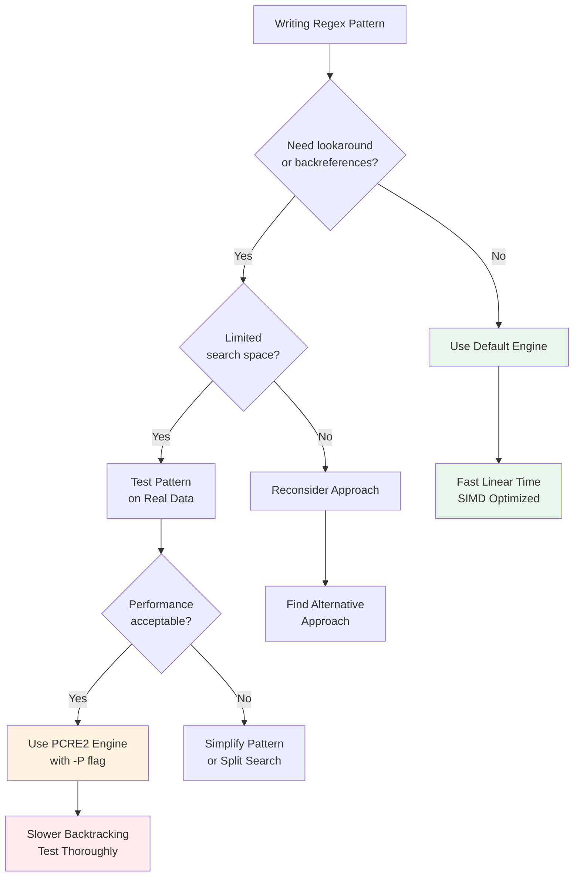
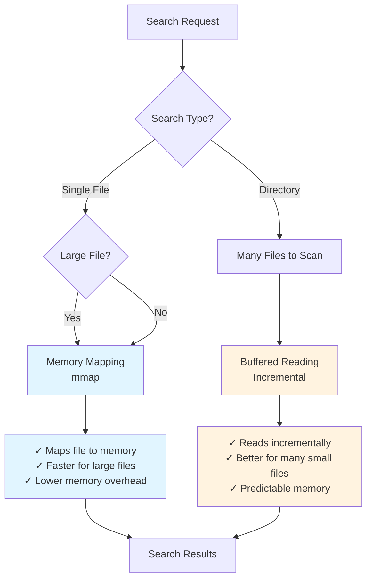

# Performance Considerations

> Part of the [Advanced Patterns](./index.md) page

Advanced regex features can impact performance. Understanding these implications helps you write efficient searches.

## Multiline Mode Performance

**Memory usage**:
- Multiline mode reads entire files into memory
- Cannot use memory mapping
- Large files can consume significant RAM

!!! warning "Multiline Memory Impact"
    Multiline mode (`-U`) reads entire files into memory and disables memory mapping. A 1GB file will consume 1GB+ of RAM. Test on your largest files before using multiline mode in production scripts.

**Automatic optimization**:
- Ripgrep detects when patterns don't actually need multiline mode
- Avoids memory penalty when possible

**Recommendations**:
- Use multiline mode only when actually matching across lines
- Test on large files if memory is a concern
- Consider line-based alternatives when possible

## PCRE2 Engine Performance

**Generally slower** than default engine:
- Backtracking regex implementation vs finite automata
- More complex matching algorithm
- Less optimized for large-scale text search

**Backtracking Complexity**: PCRE2's backtracking algorithm can exhibit exponential time complexity on certain "pathological" patterns, especially those with:
- Nested quantifiers (e.g., `(a+)+`)
- Complex alternations with overlapping possibilities
- Patterns that cause extensive backtracking on non-matches

!!! warning "PCRE2 Backtracking Risk"
    PCRE2 patterns can cause exponential time complexity with nested quantifiers like `(a+)+` or `(.*)*`. This can lead to extremely slow searches or even appear to hang on large files. Always test PCRE2 patterns on representative data before using in production scripts.

The default engine uses finite automata which guarantees linear time complexity regardless of pattern complexity. This makes it much more predictable and safer for untrusted input.

**When PCRE2 is worth it**:
- Need lookaround or backreferences
- Pattern complexity requires PCRE2 features
- Search space is limited (specific files/directories)
- You've tested the pattern on representative data and performance is acceptable

**Recommendation**: Use default engine unless you need PCRE2-specific features. When using PCRE2, test patterns on representative data to ensure acceptable performance, especially before using in production scripts or on large codebases.



**Figure**: Decision flow for choosing between default engine and PCRE2 based on feature requirements and performance characteristics.

## Backreferences and Lookaround

These features prevent some optimizations:
- Backreferences require backtracking
- Lookaround can be expensive for complex patterns
- May scan more text than simple patterns

**Use sparingly** for best performance.

## Parallelism and Threading

Ripgrep uses parallel search by default for maximum performance:

**Thread Control**:
- Uses all CPU cores by default with work-stealing scheduler
- Control threads with `-j/--threads N` flag
- Single-threaded mode: `--threads 1`

!!! example "Thread Control Examples"
    ```bash
    # Use 4 threads
    rg --threads 4 'pattern'

    # Single-threaded for deterministic output
    rg --threads 1 'pattern'
    ```

**When to use single-threaded mode**:
- Need deterministic output order
- Running in constrained environments
- Debugging search behavior
- Benchmarking without parallelism variance

!!! note
    Some flags like `--sort` automatically disable parallelism to maintain order.

## I/O Strategies

Ripgrep automatically selects the best I/O strategy based on your search:

**Memory Mapping vs Buffered Reading**:

- **Memory mapping** (`mmap`): Used for single file searches
    - Maps file directly into memory
    - Faster for large files
    - Lower memory overhead
- **Buffered reading**: Used for directory searches
    - Reads files incrementally
    - Better for many small files
    - More predictable memory usage

**Manual Control**:
```bash
# Force memory mapping
rg --mmap 'pattern'

# Force buffered reading
rg --no-mmap 'pattern'
```



**Figure**: I/O strategy selection showing how ripgrep automatically chooses between memory mapping and buffered reading based on search type.

!!! tip
    Let ripgrep choose automatically unless you have specific performance issues.

## Performance Testing

Use `--stats` flag to see performance metrics:

```bash
rg --stats -U 'pattern'
```

This shows:
- Files searched
- Bytes searched
- Matches found
- Search time

## Performance Tips

### Quick Performance Wins

!!! tip "Most Impactful Optimizations"
    1. **Use literal search** with `-F` when not needing regex - significantly faster
    2. **Use file type filters** (`-t`) to limit search space
    3. **Skip large files** with `--max-filesize`
    4. **Prefer default engine** over PCRE2

### Search Optimization

1. **Prefer default engine** when possible - uses SIMD acceleration and finite automata
2. **Use literal search** (`-F`) for plain strings - much faster than regex
3. **Avoid multiline** unless necessary
4. **Limit search scope** with file type filters (`-t`) - see [File Filtering](../common-options/file-filtering.md) for details

### Performance Tuning Flags

**Skip large files**:
```bash
# Skip files larger than 10MB
rg --max-filesize 10M 'pattern'  # (1)!
```

1. Ignores files larger than 10MB. Useful for avoiding slow searches through large binary files or logs.

**Handle long lines**:
```bash
# Set maximum line length to process
rg --max-columns 500 'pattern'  # (1)!
```

1. Ignores lines longer than 500 characters. Prevents slow regex matching on extremely long lines like minified code.

**Stop after N matches**:
```bash
# Stop searching after finding 100 matches
rg --max-count 100 'pattern'  # (1)!
```

1. Stops after finding 100 matches. Useful for quick verification or when you only need a few examples.

**Avoid crossing filesystem boundaries**:
```bash
# Stay on one filesystem
rg --one-file-system 'pattern'  # (1)!
```

1. Prevents searching across mount points. Avoids accidentally searching network drives or external disks.

### Testing and Profiling

- **Test with `--stats`** on representative data
- **Profile complex patterns** before using in production scripts
- Use `time` command for comparing different approaches
- Test on your actual datasets, not toy examples

## Regex Limits

Ripgrep has configurable limits to prevent excessive memory use and compilation time.

### Regex Size Limit

Controls the maximum size of compiled regex (default: 10M):

```bash
# Increase for extremely complex patterns
rg --regex-size-limit 100M 'very_complex_pattern'  # (1)!
```

1. Sets max compiled regex size to 100MB (default: 10M). Use when searching with large alternations or auto-generated patterns.

**When you might need this**:
- Very large alternations (`pattern1|pattern2|...|pattern1000`)
- Extremely complex nested patterns
- Auto-generated regexes

**Error message**:
```
error: compiled regex exceeds size limit
```

### DFA Size Limit

Controls DFA (deterministic finite automaton) size for the default engine:

```bash
# Increase DFA size limit
rg --dfa-size-limit 100M 'pattern'  # (1)!
```

1. Sets max DFA size to 100MB (default: 10M). Needed for patterns with many states or large character class combinations.

**When you might need this**:
- Complex patterns with many possible states
- Large character class combinations

### Automatic Limit Suggestions

When you hit a limit, ripgrep's error message suggests the appropriate flag to increase it:

```
error: regex compiled too large
help: use --regex-size-limit to increase the limit
```

### When to Increase Limits vs Simplify Patterns

!!! tip "Limit Errors Are Often Design Signals"
    Hitting regex limits usually means your pattern is too complex and should be simplified. Only increase limits for legitimate use cases like auto-generated patterns or comprehensive matching needs.

Hitting regex limits is often a sign that your pattern needs simplification, but sometimes large patterns are legitimate. Here's how to decide:

**Increase limits for**:
- **Auto-generated patterns**: Patterns produced by tools or scripts (e.g., generated from configuration)
- **Large alternations**: Legitimate need to match many alternatives (`word1|word2|...|word1000`)
- **Comprehensive matching**: Domain-specific patterns covering many cases (e.g., all valid email formats, file extensions)
- **One-time searches**: Complex ad-hoc queries that won't be reused

**Simplify patterns instead for**:
- **Deeply nested groups**: Patterns with excessive nesting usually can be refactored
- **Repeated similar logic**: Extract common patterns or use multiple simpler searches
- **Unclear complexity**: If you can't explain why the pattern is complex, it's probably poorly designed
- **Production scripts**: Patterns used repeatedly should be simple and maintainable

**Simplification strategies**:
```bash
# Instead of huge alternation, use multiple searches
rg -e 'pattern1' -e 'pattern2' -e 'pattern3'

# Instead of complex nested groups, break into stages
rg 'simple_pattern1' | rg 'simple_pattern2'

# Use character classes instead of alternations
# Bad: (a|b|c|d|e)
# Good: [a-e]
```

**Rule of thumb**: If increasing the limit solves a one-time problem, that's fine. If you're hitting limits regularly, invest time in understanding and simplifying your patterns.
