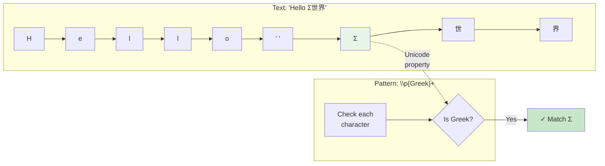

# Unicode Patterns

> Part of the [Advanced Patterns](./index.md) page

Ripgrep has excellent Unicode support enabled by default. All regex metacharacters are Unicode-aware.

## Unicode Character Classes

Use `\p{Property}` syntax to match Unicode character properties:

```bash
# Find emoji
rg '\p{Emoji}'

# Find Greek text
rg '\p{Greek}+'

# Find alphabetic characters (all scripts)
rg '\p{Alphabetic}+'

# Find uppercase letters (all scripts)
rg '\p{Uppercase}+'
```

### How Unicode Properties Work

Unicode properties categorize characters by script, category, or attribute. When ripgrep evaluates a `\p{Property}` pattern, it checks each character's Unicode metadata:



**Figure**: Unicode property matching examines character metadata. Only 'Σ' matches `\p{Greek}` in this example.

## Common Unicode Properties

| Property | Matches |
|----------|---------|
| `\p{Emoji}` | Emoji characters |
| `\p{Greek}` | Greek script |
| `\p{Han}` | Chinese characters |
| `\p{Cyrillic}` | Cyrillic script |
| `\p{Alphabetic}` | Alphabetic characters |
| `\p{Uppercase}` | Uppercase letters |
| `\p{Lowercase}` | Lowercase letters |
| `\p{White_Space}` | Whitespace |
| `\p{any}` | Any character (including newlines) |

!!! note "Property Names Are Case-Insensitive"
    Unicode property names can be written in any case: `\p{Greek}`, `\p{greek}`, and `\p{GREEK}` are all equivalent.

!!! tip "Using \\p{any} for Newline Matching"
    `\p{any}` matches **any** Unicode codepoint, including newlines (`\n`), regardless of [multiline mode](./multiline.md) settings. This provides an alternative to using `.` with the `--multiline-dotall` flag.

    ```bash
    # Match any character including newlines without --multiline-dotall
    rg '\p{any}+'

    # Equivalent to using . with multiline-dotall
    rg --multiline-dotall '.+'
    ```

    See `crates/core/flags/defs.rs:4249-4250` for implementation details.

**Note on Emoji Matching**: Emoji matching with `\p{Emoji}` may vary across different regex engines and Unicode versions. Some complex emoji (like multi-codepoint sequences, skin tone modifiers, or zero-width joiners) may require additional pattern logic. Always test emoji patterns with your specific use case and data.

For a comprehensive list of Unicode properties, see the [Rust regex Unicode documentation](https://github.com/rust-lang/regex/blob/master/UNICODE.md).

## Unicode-Aware Metacharacters

By default, these metacharacters are Unicode-aware:

- `\w`: Matches all Unicode word characters (not just ASCII)
- `\s`: Matches all Unicode whitespace
- `\d`: Matches Unicode decimal digits
- `\b`: Unicode word boundaries

```bash
# Match Unicode word characters (includes accented letters, etc.)
rg '\w+'

# Match Unicode whitespace
rg '\s+'
```

## Case-Insensitive Unicode

The `-i` flag performs Unicode case folding:

```bash
# Matches "café", "CAFÉ", "Café", etc.
rg -i 'café'

# Works across all scripts
rg -i 'Σ'  # Matches Σ and σ (Greek)
```

## Disabling Unicode

For ASCII-only searches with better performance, use `--no-unicode`:

=== "Unicode Mode (Default)"
    ```bash
    # Matches all Unicode word characters
    rg '\w+'  # Includes café, Σ, 世界, etc.
    ```

=== "ASCII-Only Mode"
    ```bash
    # ASCII-only mode (faster for ASCII text)
    rg --no-unicode '\w+'  # Only [a-zA-Z0-9_]
    ```

!!! warning "Performance Considerations"
    While Unicode mode provides rich character class support, it can impact performance in certain scenarios:

    - **Frequent word character matching**: Patterns like `\w{100}` (repeated Unicode word checks) are slower than their ASCII equivalents
    - **Large files with ASCII-only content**: If you know your content is ASCII-only, `--no-unicode` provides measurable speedup
    - **Word boundaries**: `\b` and `\B` use Unicode word definitions, which are more computationally expensive than ASCII boundaries

    **When to disable Unicode**:

    - Processing ASCII-only data (source code, logs, configuration files)
    - Performance-critical searches on large codebases
    - Pattern uses `\w`, `\d`, `\s`, or `\b` extensively

    See `crates/core/flags/defs.rs:4930-4934` for implementation context.

**Note**: `--no-unicode` affects the entire search, not individual patterns.

## Common Use Cases

### Validating International Names

!!! example "Pattern for International Names"
    This pattern validates names that may contain accents, diacritics, or non-Latin scripts:

```bash
# Match names with Unicode letters (supports accents, non-Latin scripts)
rg '^\p{Alphabetic}+( \p{Alphabetic}+)*$'  # (1)!

# Find names containing specific scripts
rg '\p{Han}+\s+\p{Latin}+'  # Chinese + Latin names
```

1. Matches one or more alphabetic characters, followed by optional space-separated words (e.g., "José García", "李明", "Müller")

### Processing Multilingual Text

```bash
# Extract sentences from mixed-script documents
rg '\p{Uppercase}\p{Alphabetic}+.*?[.!?]'

# Find all non-ASCII text
rg '[^\p{ASCII}]+'

# Identify specific language blocks
rg '\p{Arabic}+' --only-matching  # Extract Arabic text
```

### Data Validation

!!! tip "Cleaning Unicode Text"
    These patterns help identify and clean problematic Unicode characters in data files:

```bash
# Validate Unicode whitespace handling
rg '\p{White_Space}+' --replace ' '  # (1)!

# Find problematic characters
rg '[^\p{Print}\p{White_Space}]'  # (2)!
```

1. Normalize all types of Unicode whitespace (tabs, non-breaking spaces, etc.) to regular spaces
2. Find non-printable control characters that may cause display or parsing issues

### Working with Emoji

```bash
# Find lines containing emoji
rg '\p{Emoji}'

# Extract emoji from text
rg '\p{Emoji}+' --only-matching

# Find text without emoji (using negative pattern in broader search)
rg '^[^\p{Emoji}]+$'
```
