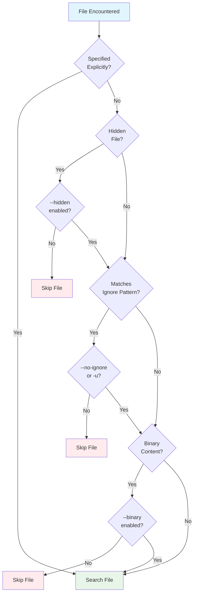
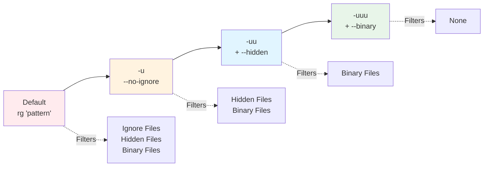

# Automatic Filtering

When you run `rg` recursively, ripgrep automatically filters out many files and directories to make searches faster and more relevant. This chapter explains ripgrep's automatic filtering mechanisms and how to control them.

## Overview

By default, ripgrep respects various ignore files, skips hidden files and directories, and avoids searching binary files. This behavior makes searches faster and reduces noise in results. Understanding these filters helps you search effectively and know when to disable them.



**Figure**: Ripgrep's automatic filtering decision flow. Files specified explicitly bypass most filters.

## Ignore Files

Ripgrep automatically respects several types of ignore files during recursive search:

### Supported Ignore File Types

**`.ignore` files**: Ripgrep-specific ignore files with the same syntax as `.gitignore`. These have the highest precedence.

**`.gitignore` files**: Standard Git ignore files used by version control systems.

**`.git/info/exclude` files**: Repository-specific Git ignore files not committed to the repository.

**Global gitignore**: Your global Git ignore file, typically located at `$XDG_CONFIG_HOME/git/ignore` or `~/.config/git/ignore`.

**`.rgignore` files**: Legacy ripgrep ignore files (replaced by `.ignore`).

### Example Usage

Create a `.ignore` file to exclude specific patterns:

```
# Ignore all log files
*.log

# Ignore node_modules directory
node_modules/

# Ignore temporary files
tmp/
*.tmp
```

Now when you search, these patterns are automatically excluded:

```bash
$ rg 'TODO'
# Searches all files except those matching .ignore patterns
```

??? tip "Common .ignore Patterns by Project Type"

    === "JavaScript/Node.js"
        ```
        # Dependencies
        node_modules/
        bower_components/

        # Build outputs
        dist/
        build/
        *.bundle.js

        # Package manager
        package-lock.json
        yarn.lock

        # Logs and temp
        *.log
        .cache/
        ```

    === "Rust"
        ```
        # Build artifacts
        target/
        Cargo.lock

        # IDE files
        .idea/
        *.swp
        *.swo

        # Test coverage
        tarpaulin-report.html
        ```

    === "Python"
        ```
        # Virtual environments
        venv/
        env/
        .venv/

        # Bytecode
        __pycache__/
        *.pyc
        *.pyo

        # Distribution
        dist/
        build/
        *.egg-info/
        ```

    === "General"
        ```
        # Version control
        .git/
        .svn/

        # OS files
        .DS_Store
        Thumbs.db

        # Editor files
        *.swp
        *~
        .vscode/
        .idea/
        ```

### Precedence Rules

When multiple ignore files exist, ripgrep applies them in a specific order:

1. **`.ignore` files override all `.gitignore` files**, regardless of directory hierarchy
2. Within each ignore file type, more nested files have higher precedence
3. Parent directory ignore files are respected by default

!!! note "Ignore File Precedence Hierarchy"
    ```
    Highest Priority
    ↓
    .ignore files (ripgrep-specific)
    ↓
    .gitignore files (nested overrides parent)
    ↓
    .git/info/exclude (repository-specific)
    ↓
    Global gitignore (~/.config/git/ignore)
    ↓
    Custom ignore files (--ignore-file)
    ↓
    Lowest Priority
    ```

For example, if you have:
- `/project/.gitignore` with `*.log`
- `/project/subdir/.ignore` with `!important.log`

The `.ignore` file's whitelist pattern (`!important.log`) will override the `.gitignore` pattern, allowing `important.log` to be searched even in the root directory.

Within the same ignore file type:
- `/project/subdir/.gitignore` overrides `/project/.gitignore` for files in `subdir/`

### Whitelist Patterns

You can use the `!` prefix in ignore files to whitelist paths, overriding earlier ignore rules:

```
# In .gitignore
*.log

# Except this specific log file
!important.log

# Whitelist an entire directory
!logs/keep/
```

!!! tip "Whitelist Override Power"
    Whitelist patterns in `.ignore` files can override exclusions from `.gitignore` files, even in parent directories. This makes `.ignore` files powerful for project-specific ripgrep configurations without modifying your Git settings.

### VCS and Global Ignore Files

Ripgrep respects VCS-specific ignore files:

- `.git/info/exclude`: Repository-specific patterns not in `.gitignore`
- Global gitignore: System-wide patterns from your Git configuration

These can be disabled with `--no-ignore-vcs` and `--no-ignore-global`:

```bash
$ rg 'pattern' --no-ignore-vcs
# Ignores .gitignore and .git/info/exclude

$ rg 'pattern' --no-ignore-global
# Ignores global gitignore only
```

### Custom Ignore Files

Use `--ignore-file` to add custom ignore file paths:

```bash
$ rg 'pattern' --ignore-file /path/to/custom-ignore
```

Custom ignore files:
- Have the lowest precedence (below all standard ignore files)
- Are never disabled by `--no-ignore`
- Can be specified multiple times

### Git Repository Requirements

By default, `.gitignore` files are only respected inside Git repositories. Use `--no-require-git` to respect `.gitignore` files even outside repositories:

```bash
$ rg 'pattern' --no-require-git
```

The default behavior can be made explicit with `--require-git`, which ensures `.gitignore` files are only respected inside Git repositories.

## Hidden Files

Ripgrep skips hidden files and directories by default.

### What is Hidden?

A file or directory is considered hidden if:
- Its name starts with a dot (`.`), like `.bashrc` or `.config/`
- On Windows, it has the "hidden" file attribute set

### Searching Hidden Files

Use `-.`/`--hidden` to search hidden files:

```bash
$ rg 'pattern' --hidden
# Searches all files including .bashrc, .git/, etc.
```

!!! warning "Hidden Directories and Version Control"
    `--hidden` will search inside directories like `.git/` regardless of `--no-ignore-vcs`. To exclude such paths when using `--hidden`, you must explicitly ignore them:

    ```bash
    $ rg 'pattern' --hidden --glob '!.git/'
    # Search hidden files but exclude .git directory
    ```

### Explicit Hidden Files

Hidden files specified directly on the command line are always searched, even without `--hidden`:

```bash
$ rg 'pattern' .bashrc
# Searches .bashrc even though it's hidden
```

## Binary Files

Ripgrep automatically detects and skips binary files during recursive search.

### Binary Detection

Ripgrep uses a NUL byte (`\0`) heuristic:
- If a file contains a NUL byte in the first few kilobytes, it's considered binary
- Binary detection only applies during **recursive search**
- Files specified directly are always searched

!!! note "Binary Detection Scope"
    Binary filtering only applies to recursive search. When you specify a file directly on the command line, ripgrep searches it regardless of content. Use `--no-binary` to force binary detection for explicit files.

### Controlling Binary Search

**Search binary files** with `--binary` or `-a/--text`:

```bash
$ rg 'pattern' --binary
# Searches all files including detected binary files
```

**Force binary detection** with `--no-binary`:

```bash
$ rg 'pattern' file.exe --no-binary
# Skip file.exe if it contains NUL bytes
```

Note: Binary filtering only applies to recursive search. When you specify a file directly, it's searched regardless of content.

## Parent Directory Ignore Files

By default, ripgrep reads ignore files from parent directories of each searched path. This ensures that ignore rules are consistently applied across the directory tree.

Disable this with `--no-ignore-parent`:

```bash
$ rg 'pattern' --no-ignore-parent
# Only respect ignore files in or below current directory
```

## Symlinks

By default, ripgrep does not follow symbolic links during recursive search.

### Following Symlinks

Use `-L`/`--follow` to follow symbolic links:

```bash
$ rg 'pattern' --follow
# Follows symlinks to files and directories
```

!!! tip "Loop Prevention"
    Ripgrep automatically detects and prevents infinite loops when following symlinks that create circular directory structures. It's safe to use `--follow` even in complex directory trees.

### Symlinks and Ignore Files

When following symlinks with `--follow`, ignore files are still respected:
- The symlink target is subject to ignore rules in its actual location
- If a symlinked directory contains `.gitignore` or `.ignore` files, they apply to files within that directory

To follow symlinks while bypassing ignore files:

```bash
$ rg 'pattern' --follow --no-ignore
# Follow symlinks and ignore all ignore files
```

## Disabling Automatic Filtering

Ripgrep provides several ways to disable automatic filtering.

!!! tip "Choosing the Right Flag: Decision Tree"
    ```
    Do you need to search ignored files?
    │
    ├─ Yes, and also hidden files?
    │  │
    │  ├─ Yes, and also binary files?
    │  │  └─ Use: -uuu (or --no-ignore --hidden --binary)
    │  │
    │  └─ No, just ignored + hidden
    │     └─ Use: -uu (or --no-ignore --hidden)
    │
    ├─ Yes, just ignored files
    │  └─ Use: -u (or --no-ignore)
    │
    └─ No, but need hidden files?
       │
       ├─ Yes → Use: --hidden
       │
       └─ No, just need specific control?
          └─ Use: --no-ignore-vcs / --no-ignore-dot / etc.
    ```

### Progressive Unrestricted Flags

The `-u/--unrestricted` flag can be used up to three times for progressive filtering removal:



**Figure**: Progressive filter removal with `-u` flags. Each level disables more filters.

**`-u` (once)**: Disable ignore files (`.gitignore`, `.ignore`, etc.)
```bash
$ rg 'pattern' -u
# Same as --no-ignore
```

**`-uu` (twice)**: Disable ignore files + search hidden files
```bash
$ rg 'pattern' -uu
# Same as --no-ignore --hidden
```

**`-uuu` (three times)**: Disable ignore files + search hidden files + search binary files
```bash
$ rg 'pattern' -uuu
# Same as --no-ignore --hidden --binary
```

### Fine-Grained Control

For more precise control, use specific `--no-ignore-*` flags:

| Flag | Effect |
|------|--------|
| `--no-ignore` | Disable all standard ignore files |
| `--no-ignore-dot` | Disable `.ignore` and `.rgignore` files only |
| `--no-ignore-vcs` | Disable `.gitignore` and `.git/info/exclude` only |
| `--no-ignore-exclude` | Disable `.git/info/exclude` only |
| `--no-ignore-global` | Disable global gitignore only |
| `--no-ignore-parent` | Don't read ignore files from parent directories |
| `--no-ignore-files` | Disable custom ignore files from `--ignore-file` |

Example combining flags:

```bash
$ rg 'pattern' --no-ignore-vcs --hidden
# Ignore .gitignore but respect .ignore, and search hidden files
```

## Ignore File Error Handling

By default, ripgrep reports errors when ignore files are malformed. Suppress these messages with `--no-ignore-messages`:

```bash
$ rg 'pattern' --no-ignore-messages
# Silently skip malformed ignore files
```

## Case Insensitive Ignore Files

On Windows or case-insensitive filesystems, you may want case-insensitive glob matching in ignore files. Use `--ignore-file-case-insensitive`:

```bash
$ rg 'pattern' --ignore-file-case-insensitive
# *.LOG in ignore file will match file.log
```

## Interaction with Explicit Paths

Files and directories specified explicitly on the command line bypass automatic filtering:

```bash
$ rg 'pattern' ignored-file.txt
# Searches ignored-file.txt even if it's in .gitignore
```

!!! example "Explicit Path Behavior"

    **Files bypass all filters:**

    ```bash
    $ rg 'pattern' .bashrc          # Searches hidden file
    $ rg 'pattern' ignored.txt      # Searches ignored file
    $ rg 'pattern' binary.exe       # Searches binary file
    ```

    **Directories still apply filters:**

    ```bash
    $ rg 'pattern' some-dir/
    # Applies ignore rules to files inside some-dir/
    ```

This applies to:
- Files listed in `.gitignore` or `.ignore`
- Hidden files (when `--hidden` is not used)
- Binary files (during recursive search)

## Interaction with Manual Filtering

Automatic filtering works alongside manual filtering options like `--glob` and `--type`. The filters are combined:

```bash
$ rg 'pattern' --type rust --hidden
# Search Rust files, including hidden ones, respecting ignore files
```

All filtering mechanisms are applied:
1. Glob overrides from `--glob`
2. Ignore files (`.gitignore`, `.ignore`, etc.)
3. File type filters (`--type`)
4. Hidden file filtering (unless `--hidden`)
5. Binary file filtering (unless `--binary`)

See the [Manual Filtering: Globs](manual-filtering-globs.md) and [Manual Filtering: Types](manual-filtering-types.md) chapters for more details.

## Common Use Cases

!!! example "Quick Reference: Common Scenarios"

    === "Search Everything"
        **Including hidden and binary files:**
        ```bash
        $ rg 'pattern' -uuu
        ```

    === "Hidden Config Files"
        **Search hidden files but respect .gitignore:**
        ```bash
        $ rg 'pattern' --hidden
        ```

    === "Custom Ignore File"
        **Ignore Git files but use custom ignore file:**
        ```bash
        $ rg 'pattern' --no-ignore-vcs --ignore-file my-ignores.txt
        ```

    === "Specific Ignored File"
        **Search a specific file even if ignored:**
        ```bash
        $ rg 'pattern' node_modules/package/file.js
        ```

    === "Only .ignore Files"
        **Search without .gitignore but with .ignore:**
        ```bash
        $ rg 'pattern' --no-ignore-vcs
        ```

## Troubleshooting

### Files Are Being Ignored Unexpectedly

1. Check if the file matches an ignore pattern:
   ```bash
   $ rg --files | grep filename
   # If missing, the file is being filtered
   ```

2. Use `--debug` to see why files are ignored:
   ```bash
   $ rg 'pattern' --debug 2>&1 | grep filename
   ```

3. Try disabling ignore files progressively:
   ```bash
   $ rg 'pattern' -u      # Disable ignore files
   $ rg 'pattern' -uu     # Also search hidden
   $ rg 'pattern' -uuu    # Also search binary
   ```

### Hidden Files Aren't Being Searched

Ensure you're using `--hidden` or specifying the file directly:

```bash
$ rg 'pattern' --hidden           # Search all hidden files
$ rg 'pattern' .config/file.conf  # Search specific hidden file
```

### Binary Files Are Being Searched

If you don't want binary files, ensure you're not using `--binary` or `-uuu`:

```bash
$ rg 'pattern'  # Binary files skipped by default in recursive search
```

### Ignore Files Aren't Being Respected

Check if you've accidentally disabled them:

```bash
$ rg 'pattern'  # Default: ignore files enabled
# Not: rg 'pattern' --no-ignore
```

Verify ignore file syntax matches `.gitignore` format.

## Summary

Ripgrep's automatic filtering makes searches fast and relevant by:
- Respecting `.ignore`, `.gitignore`, and other ignore files with clear precedence rules
- Skipping hidden files and directories by default
- Detecting and skipping binary files during recursive search
- Providing progressive `-u/-uu/-uuu` flags and fine-grained `--no-ignore-*` options for control

Understanding these filters helps you search effectively and know when to use flags like `--hidden`, `--binary`, or `-uuu` to broaden your search.
