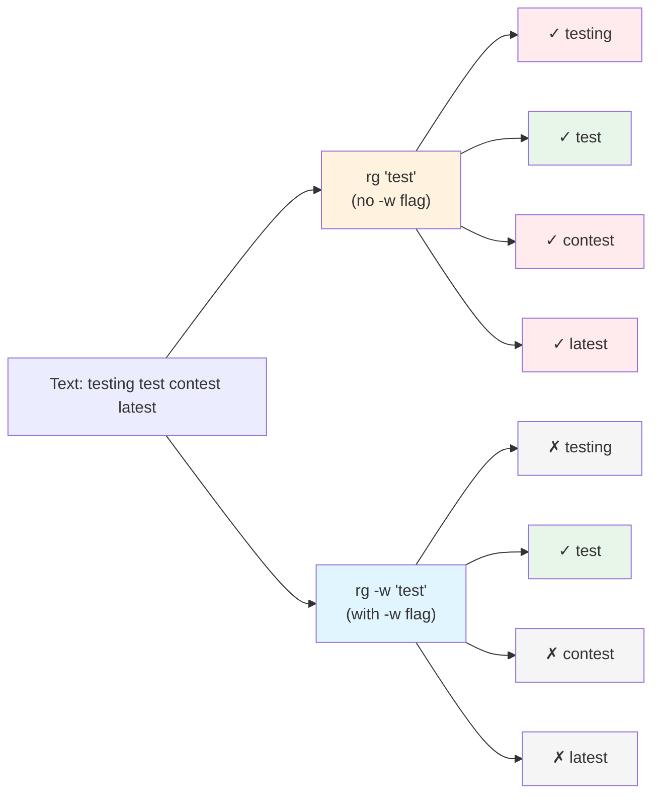
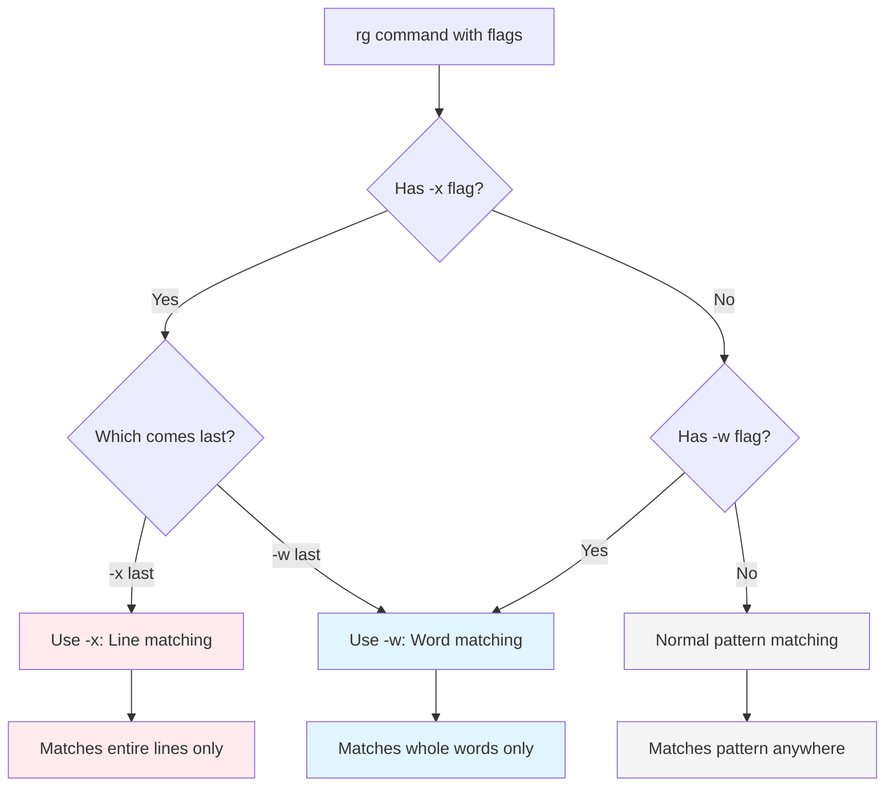

# Word and Line Boundaries

> Part of the [Basics](./index.md) page

Boundary matching ensures you match complete words or lines, preventing partial matches that can clutter search results.

## Whole Word Matching

Use `-w` or `--word-regexp` to match whole words only:

```bash
# Without -w
rg "test"           # Matches "test", "testing", "contest", "latest"

# With -w
rg -w "test"        # Matches only "test"
```



**Figure**: Comparison of pattern matching with and without `-w` flag showing how word boundaries prevent partial matches.

!!! tip "When to use -w vs \\b boundaries"
    Use `-w` when you want to match complete words with a simple pattern. It's cleaner and more readable than manually adding `\b` boundaries. Use `\b` in regex when you need more complex patterns or want boundary matching on only one side of the pattern.

### Practical Use Cases

!!! example "Searching for function names without matching similar variables"
    Without `-w`, short names match too many variations:

    ```bash
    # Find the "log" function, not "logger" or "login"
    rg -w "log"

    # Find "test" in test names, not "latest" or "contest"
    rg -w "test"

    # Find "error" variable, not "errors" or "error_handler"
    rg -w "error"
    ```

**Why this matters:** Without word boundaries, searching for common terms returns too many false positives, making it hard to find what you actually need.

## Whole Line Matching

Use `-x` or `--line-regexp` to match entire lines only:

```bash
# Match lines that are exactly "TODO"
rg -x "TODO"

# Match lines containing only digits
rg -x "[0-9]+"

# Combined with other flags
rg -x -i "error"    # Match lines that are exactly "error" (any case)
```

This is equivalent to surrounding your pattern with `^` and `$` line anchors.



**Figure**: Flag precedence decision flow showing how `-x` and `-w` interact when both are specified.

!!! warning "Flag precedence: -x overrides -w"
    When both flags are specified, `-x` (line-regexp) takes precedence over `-w` (word-regexp). The last flag wins:
    ```bash
    rg -w -x "test"   # Uses -x (line matching)
    rg -x -w "test"   # Uses -w (word matching)
    ```
    Source: crates/core/flags/defs.rs:7541

## Word Boundaries in Regex

### Basic Boundary Matching

```bash
# \b matches word boundary
rg "\btest\b"        # Matches "test" but not "testing" or "contest"

# \B matches non-word boundary
rg "\Btest"          # Matches "contest" but not "test"
rg "test\B"          # Matches "testing" but not "test"
```

### Unicode Word Boundaries

Word boundaries work correctly with Unicode characters, treating them according to Unicode word boundary rules:

```bash
# Works with Unicode words
rg -w "café"         # Matches "café" as a complete word

# Unicode-aware boundaries in regex
rg "\bcafé\b"        # Matches complete Unicode word "café"

# Handles grapheme clusters correctly
rg -w "naïve"        # Matches "naïve" but not "naive"
```

!!! note "Unicode boundary behavior"
    Ripgrep uses `\b{start-half}` and `\b{end-half}` for word boundaries, which properly handle Unicode word characters, including accented letters, non-ASCII alphabets (Cyrillic, Arabic, etc.), and grapheme clusters.

    Source: crates/core/flags/defs.rs:7538-7539

### Advanced Boundary Examples

```bash
# Match word starting with prefix
rg "\btest\w*"       # (1)!

# Match word ending with suffix
rg "\w*ing\b"        # (2)!

# Negative word boundary - match within words only
rg "\Btest\B"        # (3)!
```

1. `\b` ensures start of word, `\w*` matches remaining word characters. Matches "test", "testing", "tests"
2. `\w*` matches any word characters before "ing", `\b` ensures end of word. Matches "testing", "running", "coding"
3. `\B` matches non-word boundaries on both sides. Only matches "test" when surrounded by word characters (e.g., "contest")
