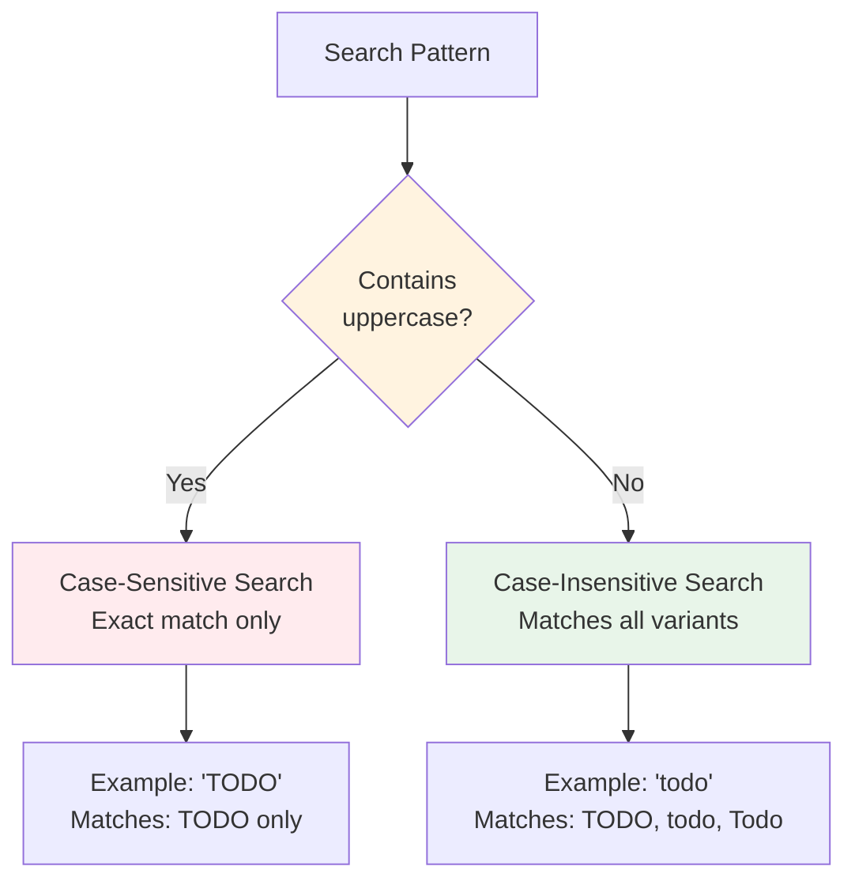

# Case Sensitivity

By default, ripgrep performs case-sensitive searches.

!!! warning "Default Behavior"
    Ripgrep is case-sensitive by default. Searching for `error` will NOT match `ERROR` or `Error` unless you use `-i` (case-insensitive) or `-S` (smart case).

## Comparison of Case Modes

| Mode | Flag | Behavior | Example Pattern | Matches |
|------|------|----------|----------------|---------|
| **Case-Insensitive** | `-i` / `--ignore-case` | Matches regardless of case | `todo` | TODO, todo, Todo, ToDo |
| **Case-Sensitive** | `-s` / `--case-sensitive` | Matches exact case only | `TODO` | TODO only |
| **Smart Case** | `-S` / `--smart-case` | Lowercase → insensitive; Uppercase → sensitive | `todo`; `TODO` | TODO, todo, Todo; TODO only |

## Case-Insensitive Search

Use `-i` or `--ignore-case` to search case-insensitively:

!!! example "Case-Insensitive Examples"
    ```bash
    # Matches "TODO", "todo", "Todo", "ToDo", etc.
    rg -i todo

    # Case-insensitive search for error messages
    rg -i "error: .+"
    ```

## Case-Sensitive Search

Use `-s` or `--case-sensitive` to force case-sensitive search (useful to override config files):

!!! note "Overriding Configuration"
    The `-s` flag is particularly useful when you have case-insensitive or smart case configured globally but need exact case matching for a specific search.

```bash
rg -s TODO
```

## Smart Case

Use `-S` or `--smart-case` for automatic case sensitivity:
- If pattern is all lowercase → case-insensitive search
- If pattern contains uppercase → case-sensitive search



**Figure**: Smart case decision logic based on pattern casing.

!!! tip "Smart case is very popular"
    Smart case is often set in [configuration files](../configuration-file.md) as a default, providing the best of both worlds: convenient case-insensitive search for lowercase patterns, and precise case-sensitive search when you capitalize.

### Smart Case Examples

=== "Lowercase pattern (case-insensitive)"

    ```bash
    # Case-insensitive (pattern is all lowercase)
    rg -S todo          # Matches "TODO", "todo", "Todo"
    ```

=== "Uppercase pattern (case-sensitive)"

    ```bash
    # Case-sensitive (pattern contains uppercase)
    rg -S TODO          # Matches only "TODO"

    # Case-sensitive (pattern contains uppercase)
    rg -S Error         # Matches "Error" but not "error"
    ```

### Visual Comparison

Here's how the same search behaves with different case modes:

```bash
# Searching for "error" in a log file

# Case-insensitive (-i): finds all variants
rg -i error app.log
# → Matches: "ERROR", "Error", "error"

# Case-sensitive (default or -s): exact match only
rg -s error app.log
# → Matches: "error" only

# Smart case (-S): depends on pattern
rg -S error app.log   # lowercase pattern
# → Matches: "ERROR", "Error", "error"

rg -S Error app.log   # uppercase in pattern
# → Matches: "Error" only
```
