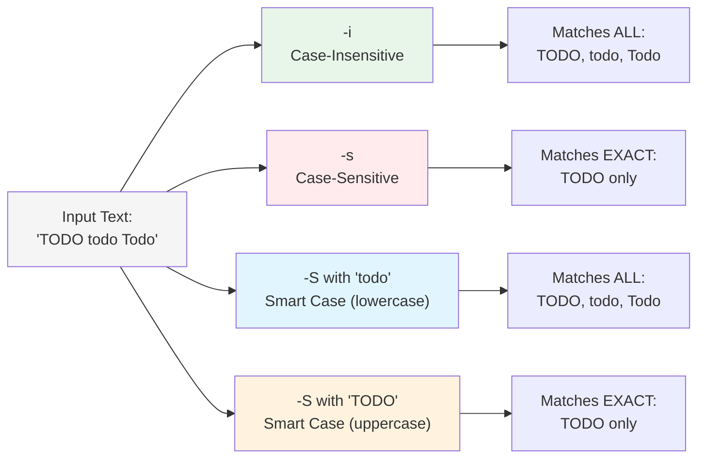
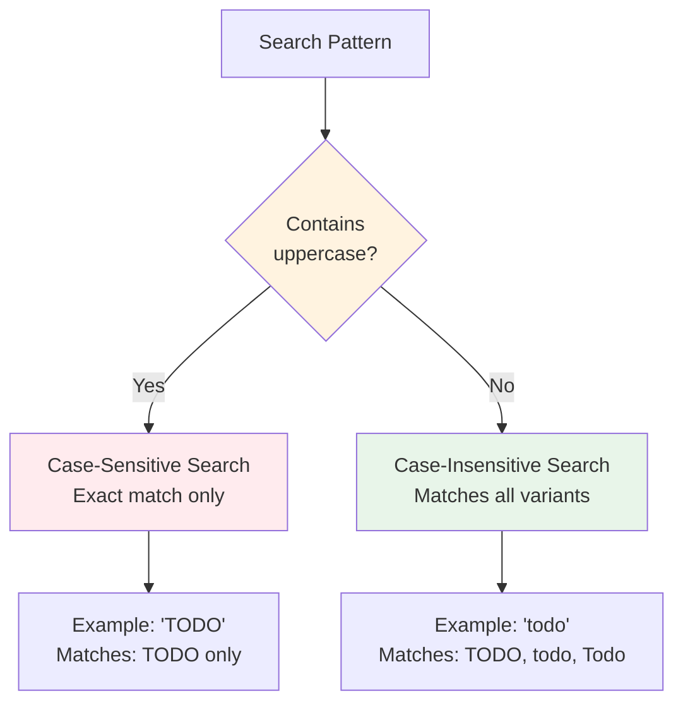

# Case Sensitivity

By default, ripgrep performs case-sensitive searches.

!!! warning "Default Behavior"
    Ripgrep is case-sensitive by default. Searching for `error` will NOT match `ERROR` or `Error` unless you use `-i` (case-insensitive) or `-S` (smart case).

## Comparison of Case Modes

| Mode | Flag | Behavior | Example Pattern | Matches |
|------|------|----------|----------------|---------|
| **Case-Insensitive** | `-i` / `--ignore-case` | Matches regardless of case | `todo` | TODO, todo, Todo, ToDo |
| **Case-Sensitive** | `-s` / `--case-sensitive` | Matches exact case only | `TODO` | TODO only |
| **Smart Case** | `-S` / `--smart-case` | Lowercase → insensitive; Uppercase → sensitive | `todo`; `TODO` | TODO, todo, Todo; TODO only |



**Figure**: How different case modes handle the same input text.

## Case-Insensitive Search

Use `-i` or `--ignore-case` to search case-insensitively:

!!! example "Case-Insensitive Examples"
    ```bash
    # Matches "TODO", "todo", "Todo", "ToDo", etc.
    rg -i todo

    # Case-insensitive search for error messages
    rg -i "error: .+"
    ```

!!! tip "Unicode Case Folding"
    Case-insensitive mode uses Unicode's simple case folding rules, so it correctly handles international characters. For example, searching for `café` with `-i` will match `CAFÉ`, `Café`, `café`, etc. This works for characters like `é/É`, `ñ/Ñ`, `ø/Ø`, and thousands of other Unicode letters.

## Case-Sensitive Search

Use `-s` or `--case-sensitive` to force case-sensitive search (useful to override config files):

!!! note "Overriding Configuration"
    The `-s` flag is particularly useful when you have case-insensitive or smart case configured globally but need exact case matching for a specific search.

```bash
rg -s TODO
```

## Smart Case

Use `-S` or `--smart-case` for automatic case sensitivity:
- If pattern is all lowercase → case-insensitive search
- If pattern contains uppercase → case-sensitive search



**Figure**: Smart case decision logic based on pattern casing.

!!! tip "Smart case is very popular"
    Smart case is often set in [configuration files](../configuration-file.md) as a default, providing the best of both worlds: convenient case-insensitive search for lowercase patterns, and precise case-sensitive search when you capitalize.

### How Smart Case Detects Pattern Case

Smart case uses these rules to decide case sensitivity:

1. **Pattern must contain at least one literal character** (not just regex metacharacters)
2. **None of the literal characters can be uppercase** (according to Unicode)

If both conditions are met, the search is case-insensitive. Otherwise, it's case-sensitive.

!!! note "Patterns Without Literals"
    Regex patterns consisting entirely of metacharacters (like `\w+`, `\d{3}`, `.*`) have no literal characters, so smart case treats them as case-insensitive by default. If you need case-sensitive matching for such patterns, use `-s` or add an uppercase literal to the pattern.

!!! warning "Common Smart Case Pitfall"
    Character classes like `[A-Z]` or `[a-z]` are treated as **literals** for smart case detection. So the pattern `[A-Z]+` contains uppercase literals, making smart case use case-sensitive mode even though the intent is to match any uppercase letters. If you want case-insensitive matching with character classes, use `-i` explicitly or use `(?i)` inline flags.

### Configuring Smart Case as Default

Many users prefer to enable smart case by default via a configuration file:

!!! example "Configuration File Setup"
    === "Unix/Linux/macOS"
        ```bash
        # Create config file
        mkdir -p ~/.config/ripgrep
        echo "--smart-case" > ~/.config/ripgrep/ripgreprc

        # Set environment variable (add to ~/.bashrc or ~/.zshrc)
        export RIPGREP_CONFIG_PATH="$HOME/.config/ripgrep/ripgreprc"
        ```

    === "Windows"
        ```powershell
        # Create config file
        New-Item -ItemType Directory -Force "$env:APPDATA\ripgrep"
        "--smart-case" | Out-File "$env:APPDATA\ripgrep\ripgreprc"

        # Set environment variable (PowerShell profile)
        $env:RIPGREP_CONFIG_PATH = "$env:APPDATA\ripgrep\ripgreprc"
        ```

    With smart case configured, you can still override it per-search with `-i` (always case-insensitive) or `-s` (always case-sensitive).

### Smart Case Examples

=== "Lowercase pattern (case-insensitive)"

    ```bash
    # Case-insensitive (pattern is all lowercase)
    rg -S todo          # Matches "TODO", "todo", "Todo"
    ```

=== "Uppercase pattern (case-sensitive)"

    ```bash
    # Case-sensitive (pattern contains uppercase)
    rg -S TODO          # Matches only "TODO"

    # Case-sensitive (pattern contains uppercase)
    rg -S Error         # Matches "Error" but not "error"
    ```

### Visual Comparison

Here's how the same search behaves with different case modes:

```bash
# Searching for "error" in a log file

# Case-insensitive (-i): finds all variants
rg -i error app.log
# → Matches: "ERROR", "Error", "error"

# Case-sensitive (default or -s): exact match only
rg -s error app.log
# → Matches: "error" only

# Smart case (-S): depends on pattern
rg -S error app.log   # lowercase pattern
# → Matches: "ERROR", "Error", "error"

rg -S Error app.log   # uppercase in pattern
# → Matches: "Error" only
```

## Advanced: Inline Regex Flags

For fine-grained control, you can use inline regex flags to change case sensitivity within a pattern:

- `(?i)` - Enable case-insensitive matching
- `(?-i)` - Disable case-insensitive matching (back to case-sensitive)

!!! example "Per-Pattern Case Control"
    ```bash
    # Case-insensitive "error" followed by case-sensitive "FATAL"
    rg "(?i)error.*(?-i)FATAL"  # (1)!

    # Mixed case matching in a single pattern
    rg "(?i)warning(?-i):.*CRITICAL"  # (2)!

    # Case-insensitive search even when using -s flag
    rg -s "(?i)todo"  # (3)!
    ```

    1. `(?i)` makes "error" case-insensitive, then `(?-i)` switches back to case-sensitive for "FATAL"
    2. Combines case-insensitive prefix with case-sensitive suffix in one pattern
    3. Inline `(?i)` flag overrides the `-s` command-line flag

These flags override any command-line flags (`-i`, `-s`, `-S`) for the portion of the pattern they affect.

!!! tip "When to Use Inline Flags"
    Inline regex flags are most useful when you need different case sensitivity for different parts of a pattern. For example, searching for log entries where the severity level must be exact case (`ERROR`, `WARN`) but the message can be any case: `rg "(?-i)(ERROR|WARN)(?i):.*timeout"`
