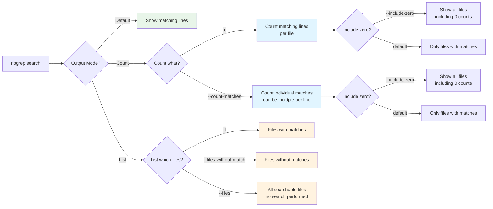

# Count and List Modes

Ripgrep provides several modes for counting and listing files instead of showing matching content. This is useful for getting an overview of matches across your codebase.



**Figure**: Ripgrep output modes showing the relationship between counting, listing, and content display options.

## Counting Matches

```bash
# Count matching lines per file
# Source: crates/core/flags/defs.rs:1260-1295
rg -c pattern                  # (1)!

# Count individual matches (can be multiple per line)
# Source: crates/core/flags/defs.rs:1320-1355
rg --count-matches pattern     # (2)!
```

1. Counts **lines** containing the pattern (one count per line, even if pattern appears multiple times)
2. Counts **individual occurrences** of the pattern (can be multiple per line)

!!! note "Difference between -c and --count-matches"
    `-c` counts matching **lines**, while `--count-matches` counts individual **matches**.

    For example, in a line containing `"error error error"`:

    - `rg -c "error"` returns `1` (one line)
    - `rg --count-matches "error"` returns `3` (three matches)

**Example output:**
```
src/main.rs:2
tests/test.rs:1
```

### Include Zero Count Files

By default, files with zero matches are not shown in count output. Use `--include-zero` to include them:

```bash
# Source: crates/core/flags/defs.rs:3328-3361
# Show all files, including those with zero matches
rg -c --include-zero pattern
```

**Example output:**
```
src/main.rs:2
tests/test.rs:1
README.md:0
```

!!! tip "Grep-like behavior"
    Use `--include-zero` to make ripgrep behave more like grep, which shows zero-count files by default.

## Listing Files

```bash
# List files with matches
rg -l pattern                        # (1)!

# List files without matches
rg --files-without-match pattern     # (2)!
```

1. Shows only filenames that contain at least one match (no match content displayed)
2. Shows filenames that do NOT contain any matches (useful for finding gaps in test coverage)

**Practical use:**
```bash
# Find all Rust files containing "unsafe"
rg -l "unsafe" -t rust

# Find test files that don't test the API
rg --files-without-match "test_api" -g "*test*.rs"
```

### List All Searchable Files

Use `--files` to see which files would be searched, without performing a search:

```bash
# Source: crates/core/flags/defs.rs:2129-2160
# List all files that would be searched
rg --files

# List files with specific filtering
rg --files -t rust
rg --files -g "*.toml"
```

!!! tip "Debugging file filtering"
    Use `rg --files` to verify your glob patterns and type filters are working as expected before running the actual search.

## Inverted Matching

!!! tip "Powerful Filtering Technique"
    Inverted matching (`-v`) is incredibly useful for filtering out noise from logs, excluding certain files from results, or finding lines that lack expected patterns (like missing documentation).

Use `-v` or `--invert-match` to show lines that do NOT match the pattern:

```bash
# Show all lines without "debug"
rg -v "debug"

# Show all non-empty lines
rg -v "^$"

# Find files without TODO comments
rg -l "TODO" | rg -v README
```

**Practical examples:**
```bash
# Filter out log lines with "DEBUG" level
rg "error" app.log | rg -v "DEBUG"

# Find Rust files without documentation comments
rg -v "^///" -t rust

# Show configuration without comments
rg -v "^#" config.conf
```
