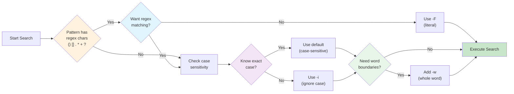

# Basics

This chapter covers the fundamental usage of ripgrep, including pattern matching, literal strings, regular expressions, and basic output formatting. If you're new to ripgrep, start here.

## Quick Start

Here are the most common ripgrep commands to get you started:



**Figure**: Decision flow for choosing the right ripgrep search flags based on your pattern and requirements.

!!! tip "New to ripgrep?"
    If you're coming from `grep`, most basic patterns work the same. The key difference: ripgrep uses Rust regex syntax and automatically respects `.gitignore` files.

```bash
# Simple search for a pattern
rg TODO                        # (1)!

# Case-insensitive search
rg -i error                    # (2)!

# Search for exact string (no regex)
rg -F "function()"              # (3)!

# Count matches per file
rg -c pattern                  # (4)!

# List files containing matches
rg -l pattern                  # (5)!

# Search with line numbers and context
rg -n -C 2 pattern             # (6)!

# Match whole lines only
rg -x "import sys"             # (7)!

# Search for multiple patterns
rg -e TODO -e FIXME            # (8)!

# Combine flags: case-insensitive word search with context
rg -i -w -C 2 function         # (9)!
```

1. Searches recursively from current directory for "TODO"
2. Use `-i` when you don't know the exact case (ERROR, error, Error all match)
3. Use `-F` for literal strings containing regex special characters like `()[].*+?`
4. Shows count of matching lines per file, useful for statistics
5. Just shows filenames, not the matches themselves
6. `-C 2` shows 2 lines before and after each match for context
7. `-x` matches entire line exactly - useful for finding exact imports or function signatures
8. `-e` allows searching for multiple patterns in one command - finds lines with TODO OR FIXME
9. `-w` ensures "function" matches as whole word, not "functions" or "malfunction"

!!! tip "Smart Case Matching"
    Use `-S` or `--smart-case` for intelligent case sensitivity:

    - `rg -S error` → matches "error", "Error", "ERROR" (all lowercase pattern = case-insensitive)
    - `rg -S Error` → matches only "Error" (has uppercase = case-sensitive)

    This is useful when you want flexibility without typing `-i` every time.

!!! example "Invert Match: Finding What's NOT There"
    Use `-v` or `--invert-match` to find lines that DON'T contain a pattern:

    ```bash
    # Find all lines without "test" or "Test"
    rg -v test

    # Find configuration files without comments
    rg -v "^#" config.yml

    # Find imports that aren't from standard library
    rg "^import" | rg -v "^import (os|sys|re)"
    ```

!!! warning "Common Pitfalls"
    **Regex special characters**: Without `-F`, characters like `.` `*` `+` `?` `()` `[]` have special meaning:

    - `rg file.txt` matches "file.txt" but also "fileXtxt" (`.` = any character)
    - `rg -F file.txt` matches only literal "file.txt"

    **Word boundaries**: `-w` requires word boundaries on both sides:

    - `rg -w test` matches "test" and "test()" but NOT "testing" or "attest"

## Common Flags Cheat Sheet

!!! note "Flag Syntax"
    All flags support both long form (`--ignore-case`) and short form (`-i`). Short forms can be combined: `rg -iwn pattern` is the same as `rg -i -w -n pattern`.

=== "Pattern Matching"

    | Flag | Short | Description |
    |------|-------|-------------|
    | `--fixed-strings` | `-F` | Literal string search (no regex) |
    | `--ignore-case` | `-i` | Case-insensitive search |
    | `--smart-case` | `-S` | Smart case sensitivity |
    | `--word-regexp` | `-w` | Match whole words only |
    | `--line-regexp` | `-x` | Match whole lines only |
    | `--invert-match` | `-v` | Show non-matching lines |

=== "Output Control"

    | Flag | Short | Description |
    |------|-------|-------------|
    | `--line-number` | `-n` | Show line numbers |
    | `--no-line-number` | `-N` | Suppress line numbers |
    | `--only-matching` | `-o` | Show only matching part of lines |
    | `--column` | | Show column numbers |
    | `--no-heading` | | Print file path on each line |
    | `--color` | | Control color output |

=== "Counting & Listing"

    | Flag | Short | Description |
    |------|-------|-------------|
    | `--count` | `-c` | Count matches per file |
    | `--count-matches` | | Count individual matches |
    | `--files-with-matches` | `-l` | List files with matches |
    | `--files-without-match` | | List files without matches |

    !!! warning "Commonly Confused Flags"
        **`-c` vs `--count-matches`**: These behave differently!

        - `rg -c pattern` → counts matching **lines** per file (one line with 3 matches = count of 1)
        - `rg --count-matches pattern` → counts **individual matches** (one line with 3 matches = count of 3)

        **Example**: Searching for "the" in a file with one line "the theater"

        - `rg -c the` → outputs `1` (one matching line)
        - `rg --count-matches the` → outputs `2` (two matches: "the" and "the" in "theater")

=== "Context Lines"

    | Flag | Short | Description |
    |------|-------|-------------|
    | `--after-context` | `-A` | Show N lines after match |
    | `--before-context` | `-B` | Show N lines before match |
    | `--context` | `-C` | Show N lines before and after |

## Next Steps

!!! tip "Learning Path"
    New users should work through the subsections above first, then explore these advanced topics in order. Each builds on concepts from the previous sections.

Now that you understand the basics, you can explore more advanced topics:

- **[Recursive Search](../recursive-search.md)** - Control how ripgrep traverses directories
- **[Automatic Filtering](../automatic-filtering.md)** - Understand gitignore and automatic file filtering
- **[Manual Filtering](../manual-filtering-globs.md)** - Use globs and file types to filter searches
- **[Advanced Patterns](../advanced-patterns/index.md)** - Multiline search, PCRE2, and complex regex
- **[Replacements](../replacements.md)** - Find and replace with capture groups
- **[Output Formats](../output-formats.md)** - JSON output, custom formats, and more
