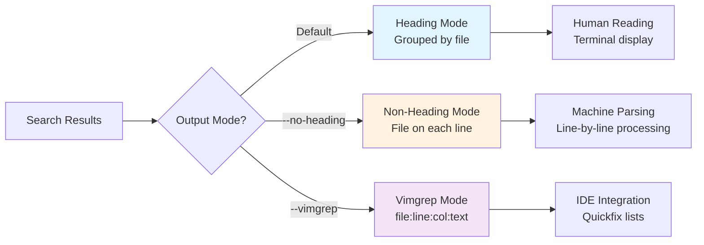
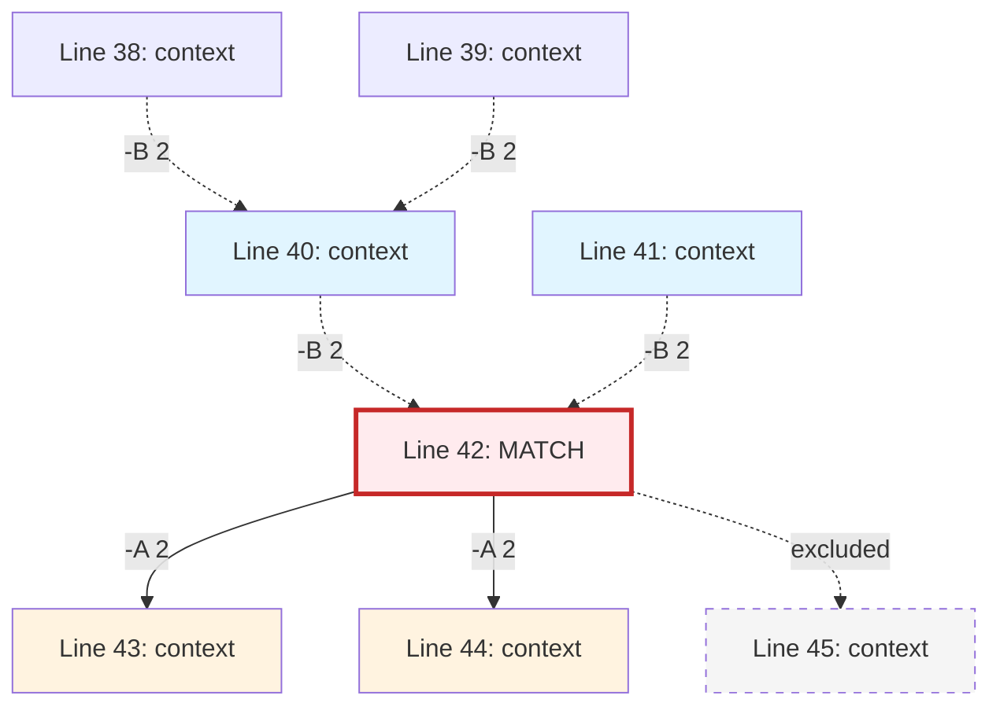

# Output Format

> Part of the [Basics](./index.md) page

## Default Output

By default, ripgrep shows:
- File path (in heading mode)
- Line number (when enabled with `-n`)
- Matching line with colored highlights

```bash
# Basic output
rg pattern

# Output with line numbers (very common)
rg -n pattern
```

**Example output:**
```
src/main.rs
42:    let pattern = "TODO";
107:    // TODO: implement error handling

tests/test.rs
23:    // TODO: add more test cases
```

!!! tip "Common Usage"
    Most users add `-n` to their shell aliases or ripgrep config file, as line numbers are helpful for navigation and editor integration.

## Standard Output Options

### Line Numbers

```bash
# Show line numbers (very common, often in config)
rg -n pattern

# Suppress line numbers
rg -N pattern
```

### Column Numbers

```bash
# Show column numbers (byte offset within line)
rg --column pattern

# Combined with line numbers
rg -n --column pattern
```

**Example output:**
```
src/main.rs
42:15:    let pattern = "TODO";
```
(line 42, column 15)

### Byte Offset

Print the 0-based byte offset within the input file before each matching line:

```bash
# Source: crates/core/flags/defs.rs:576-609
rg -b pattern
rg --byte-offset pattern

# Combined with line numbers
rg -n -b pattern
```

**Example output:**
```
src/main.rs
1847:42:    let pattern = "TODO";
```
(byte offset 1847, line 42)

!!! note
    Byte offset is useful for large files or binary analysis where exact file position matters.

### Only Matching Parts

Print only the matched parts of a line, each on a separate line:

```bash
# Source: crates/core/flags/defs.rs:4180-4219
rg -o pattern
rg --only-matching pattern
```

**Example:**
```bash
rg -o '\b\w+@\w+\.\w+\b' emails.txt
```

**Output:**
```
user@example.com
admin@test.org
contact@domain.net
```

!!! tip "Use Case"
    `-o` is excellent for extracting specific data patterns like emails, URLs, or structured tokens from text files.

## File Path Display

Control when and how file paths are shown in output:

```bash
# Source: crates/core/flags/defs.rs:5516-5579

# Always show filename (overrides default heuristic)
rg --with-filename pattern
rg -H pattern

# Never show filename
rg --no-filename pattern
rg -I pattern
```

**Default behavior:**
- Single file searched: no filename shown
- Multiple files searched: filenames shown
- Use `-H` or `-I` to override

## Heading vs Non-Heading Mode

Ripgrep offers two distinct output grouping modes optimized for different use cases:



**Figure**: Output mode selection based on use case.

**Heading mode** (default): Group matches by file with file path as heading:
```
src/main.rs
42:    let pattern = "TODO";
107:    // TODO: implement error handling

tests/test.rs
23:    // TODO: add more test cases
```

**Non-heading mode** (`--no-heading`): Show file path on each line:
```bash
rg --no-heading pattern
```

Output:
```
src/main.rs:42:    let pattern = "TODO";
src/main.rs:107:    // TODO: implement error handling
tests/test.rs:23:    // TODO: add more test cases
```

!!! tip "Editor Integration"
    Many editors and IDE integrations prefer `--no-heading` format as it's easier to parse programmatically.

## Color Output

```bash
# Source: crates/core/flags/defs.rs:691-791

# Auto color (default): colors when outputting to terminal
rg --color auto pattern

# Always use colors (useful when piping to less -R)
rg --color always pattern | less -R

# Never use colors (useful for machine processing)
rg --color never pattern

# ANSI mode (escape sequences only, no Windows console)
rg --color ansi pattern
```

**Color modes explained:**

=== "auto (default)"
    Automatically detects if output is a TTY (terminal). Colors are shown in terminals but stripped when piping to files or other commands.

    ```bash
    rg pattern              # Colors shown in terminal
    rg pattern > out.txt    # No colors in file
    ```

=== "always"
    Always include color codes, even when piping. Use with `less -R` for colored paging.

    ```bash
    rg --color always pattern | less -R
    ```

=== "never"
    Never use colors. Useful for machine processing or when colors cause issues.

    ```bash
    rg --color never pattern | process-output.sh
    ```

=== "ansi"
    Use ANSI escape sequences only (no Windows console API). Rarely needed.

!!! warning "Common Pitfall"
    If you pipe to `less` without `-R`, you'll see raw ANSI escape codes. Use `rg --color always pattern | less -R` or configure `less` with `export LESS="-R"`.

## Count Modes

### Count Matches Per File

Show the count of matches per file instead of the matches themselves:

```bash
# Source: crates/core/flags/defs.rs:1171-1242
rg -c pattern
rg --count pattern
```

**Example output:**
```
src/main.rs:12
tests/test.rs:5
lib/utils.rs:3
```

### Count Total Matches

Show the total count of matches across all files:

```bash
rg --count-matches pattern
```

**Example output:**
```
src/main.rs:15
tests/test.rs:7
lib/utils.rs:3
```

**Understanding the difference:**

```mermaid
graph TD
    Line[Line: "error: failed, error: timeout, error: crash"]
    Line --> CountLine["-c counts lines"]
    Line --> CountMatch["--count-matches counts"]

    CountLine --> Result1["Result: 1
(one matching line)"]
    CountMatch --> Result2["Result: 3
(three 'error' matches)"]

    style Line fill:#f5f5f5
    style CountLine fill:#e1f5ff
    style CountMatch fill:#fff3e0
    style Result1 fill:#e1f5ff
    style Result2 fill:#fff3e0
```

**Figure**: Difference between `-c` (counts lines) and `--count-matches` (counts individual matches).

!!! note "Difference"
    `-c` counts matching lines (a line with multiple matches counts as 1), while `--count-matches` counts each individual match (a line with 3 matches counts as 3).

## Alternative Output Formats

### Vim Quickfix Format

Output in Vim's quickfix format for easy integration:

```bash
# Source: crates/core/flags/defs.rs:5360-5396
rg --vimgrep pattern
```

**Example output:**
```
src/main.rs:42:15:    let pattern = "TODO";
src/main.rs:107:9:    // TODO: implement error handling
tests/test.rs:23:9:    // TODO: add more test cases
```

Format: `filename:line:column:text`

!!! tip "Vim Integration"
    Use `:cgetexpr system('rg --vimgrep pattern')` in Vim to populate the quickfix list.

### Files-Only Modes

List only filenames without showing matches:

```bash
# Source: crates/core/flags/defs.rs:2258-2286

# Files WITH matches
rg -l pattern
rg --files-with-matches pattern

# Files WITHOUT matches
rg --files-without-match pattern
```

**Example:**
```bash
rg -l "TODO"
```

**Output:**
```
src/main.rs
tests/test.rs
lib/utils.rs
```

!!! tip "Use Case"
    Useful for batch operations: `rg -l "old_api" | xargs sed -i 's/old_api/new_api/g'`

## JSON Output

Output matches in JSON Lines format for machine processing:

```bash
# Source: crates/core/flags/defs.rs:2987-3041
rg --json pattern
```

**Example output:**
```json
{"type":"begin","data":{"path":{"text":"src/main.rs"}}}  // (1)!
{"type":"match","data":{"path":{"text":"src/main.rs"},"lines":{"text":"    let pattern = \"TODO\";\n"},"line_number":42,"absolute_offset":1847,"submatches":[{"match":{"text":"TODO"},"start":20,"end":24}]}}  // (2)!
{"type":"end","data":{"path":{"text":"src/main.rs"},"binary_offset":null,"stats":{"elapsed":{"secs":0,"nanos":123456},"searches":1,"searches_with_match":1}}}  // (3)!
```

1. **Begin message**: Signals the start of results for a file
2. **Match message**: Contains the actual match with line number, byte offset, and submatch positions (start/end columns)
3. **End message**: Signals completion with statistics (elapsed time, search counts)

!!! note "JSON Lines Format"
    Each line is a separate JSON object. Use `jq` for processing: `rg --json pattern | jq -r '.data.path.text'`

## Output Sorting

Sort results by various criteria:

```bash
# Source: crates/core/flags/defs.rs:4668-4754

# Sort by path (default: ascending)
rg --sort path pattern

# Sort by modification time
rg --sort modified pattern

# Sort by access time
rg --sort accessed pattern

# Sort by creation time
rg --sort created pattern

# Reverse sort
rg --sortr path pattern
```

!!! warning "Performance Impact"
    Sorting requires collecting all results before output, which **disables parallelism**. Use only when needed, especially on large codebases.

## Context Lines

Show lines before and after each match:

```bash
# Show 2 lines after each match
rg -A 2 pattern

# Show 2 lines before each match
rg -B 2 pattern

# Show 2 lines before and after (context)
rg -C 2 pattern

# Asymmetric context
rg -B 3 -A 1 pattern
```



**Figure**: Context line inclusion with `-C 2` (2 lines before and after match). Blue = before context, red = match, orange = after context.

**Example:**
```bash
rg -C 2 "TODO"
```

Output:
```
src/main.rs
40-    fn process_data() {
41-        // Initialize
42:        // TODO: implement error handling
43-        let data = vec![];
44-        process(&data);
```

!!! note "Context Line Markers"
    Lines with `:` are matches, lines with `-` are context. Groups are separated by `--` when matches are far apart.

## Quick Reference

| Flag | Description | Use Case |
|------|-------------|----------|
| `-n` | Line numbers | Editor integration, navigation |
| `--column` | Column numbers | Precise location, IDE integration |
| `-b` | Byte offset | Binary analysis, large files |
| `-o` | Only matching parts | Extract specific patterns |
| `-c` | Count matches per file | Statistics, overview |
| `--count-matches` | Total match count | Detailed statistics |
| `-l` | Files with matches | Batch operations |
| `--vimgrep` | Vim quickfix format | Vim/IDE integration |
| `--json` | JSON output | Machine processing, tools |
| `-A/-B/-C` | Context lines | Understanding context |
| `--sort` | Sort results | Organized output |
| `--color` | Color control | Readability, piping |

## Combining Flags

Flags can be combined for powerful output control:

```bash
# Line numbers + column + context
rg -n --column -C 2 pattern

# Only matching parts + line numbers
rg -o -n 'error:\s+\w+' logs.txt

# Count + sort by modification time
rg -c --sort modified "import" src/

# JSON + only files with matches (implicit in JSON)
rg --json --files-with-matches pattern
```

!!! example "Common Combinations"
    - **IDE integration:** `rg -n --column --no-heading pattern`
    - **Debugging logs:** `rg -C 5 --color always "ERROR" | less -R`
    - **Data extraction:** `rg -o -I '\b\d{3}-\d{3}-\d{4}\b' files/`
    - **Quick overview:** `rg -c --sort path "TODO"`
