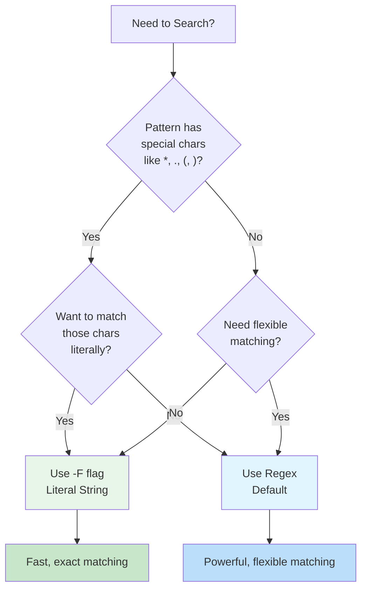
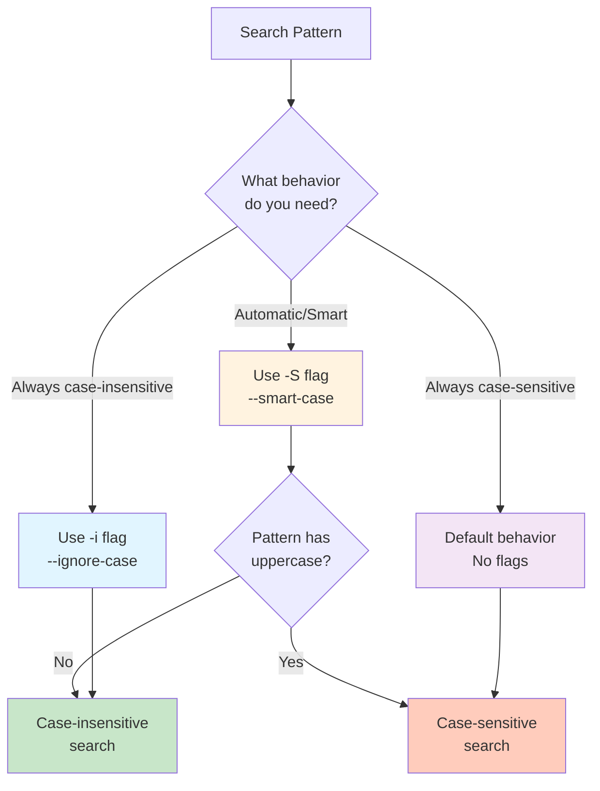
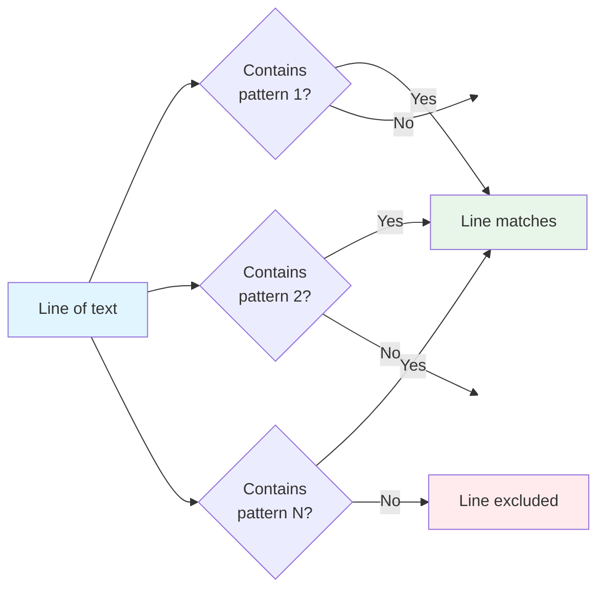

# Pattern Matching

Pattern matching is the core functionality of ripgrep. By default, ripgrep uses regular expressions to search through files, but it also supports literal string matching for simpler searches. Understanding when to use each approach will help you search more effectively.

## Pattern Types

Ripgrep supports two main types of pattern matching:



**Figure**: Decision flow for choosing between regex and literal pattern matching.

### Regular Expressions (Default)

By default, ripgrep treats patterns as regular expressions. This gives you powerful pattern matching capabilities but requires special characters to be escaped if you want to search for them literally.

```bash
# Search for function definitions (regex pattern)
rg "fn \w+\("  # (1)!

# Search for TODO followed by any text
rg "TODO:.*"   # (2)!
```

1. `\w+` matches one or more word characters (function name), `\(` matches literal parenthesis
2. `.*` matches any characters after the colon (wildcard pattern)

!!! tip "When to use regex patterns"
    Use regular expressions when you need:

    - Flexible matching with wildcards or character classes
    - Word boundaries or anchors
    - Complex patterns with alternation or grouping
    - Case-insensitive matching with patterns

### Literal Strings

Use the `-F` or `--fixed-strings` flag to treat patterns as literal strings. This is faster and doesn't require escaping special regex characters.

```bash
# Search for literal parentheses (no escaping needed)
rg -F "function()"

# Search for regex characters literally
rg -F "*.txt"
```

!!! tip "When to use literal strings"
    Use the `-F` flag when you:

    - Need to search for exact text containing special characters
    - Want faster searches for simple strings
    - Are searching for code snippets with regex metacharacters
    - Need predictable behavior without regex interpretation

For more details on literal string matching, see [Literal Search](literal-search.md).

## Case Sensitivity

Ripgrep provides flexible case sensitivity options:



**Figure**: Case sensitivity options and their behavior.

### Case-Insensitive Search

Use `-i` or `--ignore-case` to search without regard to case:

```bash
# Match TODO, todo, Todo, etc.
rg -i "todo"
```

### Smart Case

Use `-S` or `--smart-case` for automatic case sensitivity: searches are case-insensitive unless the pattern contains uppercase letters.

```bash
# Case-insensitive (no uppercase in pattern)
rg -S "todo"  # (1)!

# Case-sensitive (uppercase present)
rg -S "TODO"  # (2)!
```

1. Pattern is all lowercase → automatically searches case-insensitively (matches TODO, todo, Todo)
2. Pattern has uppercase → automatically searches case-sensitively (matches only TODO)

!!! note
    Smart case is especially useful for interactive searches where you want case-insensitivity by default but can trigger case-sensitive matching by capitalizing your pattern.

For more information, see [Case Sensitivity](case-sensitivity.md).

## Multiple Patterns

You can search for multiple patterns in a single command. Ripgrep uses **OR logic** - a line matches if it contains any of the specified patterns.



**Figure**: OR logic - a line matches if it contains ANY of the specified patterns.

### Using -e Flag

The `-e` or `--regexp` flag allows you to specify multiple patterns:

```bash
# Match lines containing either TODO or FIXME
rg -e TODO -e FIXME  # (1)!

# Match multiple error levels
rg -e "error" -e "warning" -e "critical"  # (2)!
```

1. Each `-e` flag adds a pattern; matches lines with TODO OR FIXME (or both)
2. Searches for any of the three error levels in the same command

!!! example "Output behavior"
    When using multiple patterns, ripgrep will show any line that matches **at least one** pattern. The patterns are combined with OR logic, not AND.

    For example, `rg -e foo -e bar` will match:

    - Lines containing "foo"
    - Lines containing "bar"
    - Lines containing both "foo" and "bar"

### Combining Pattern Types

You can mix literal and regex patterns by using `-F` with individual patterns:

```bash
# Search for multiple literal strings
rg -F -e "function()" -e "class{"
```

## Patterns from a File

For complex searches with many patterns, you can store them in a file and use `-f` or `--file`:

```bash
# Create a patterns file
echo "TODO" > patterns.txt
echo "FIXME" >> patterns.txt
echo "HACK" >> patterns.txt

# Search using patterns from file
rg -f patterns.txt
```

Each line in the patterns file is treated as a separate pattern, combined with OR logic.

!!! tip "Use cases for pattern files"
    Pattern files are especially useful for:

    - **Large lists of error codes or identifiers** - When you have dozens or hundreds of patterns to search
    - **Shared search configurations** - Store common patterns in a file that the team can reuse
    - **Excluding patterns** - Combine with `--invert-match` to exclude many patterns at once
    - **Version-controlled searches** - Keep important search patterns in your repository
    - **Dynamic pattern generation** - Generate patterns programmatically and feed them to ripgrep

### Pattern File Format

```text
# This is a comment (lines starting with # are ignored)
TODO
FIXME
HACK
DEPRECATED
```

## Common Pattern Examples

Here are some practical real-world pattern examples:

=== "Code Review"

    ```bash
    # Find todos by author
    rg "TODO\(.*?\):"

    # Find all commented code
    rg "^\s*(//|#|/\*)"
    ```

=== "Error Analysis"

    ```bash
    # Multiple error levels
    rg -e "ERROR" -e "FATAL" -e "CRITICAL"

    # Error patterns from log files
    rg -i "exception|error|fail(ed|ure)"
    ```

=== "Code Search"

    ```bash
    # Find function definitions
    rg "fn \w+\(|def \w+\(|function \w+\("

    # Find console statements
    rg -e "console\." -e "print\(" -e "println!"
    ```

=== "Advanced Patterns"

    For more complex pattern matching needs, ripgrep supports advanced features:

    ```bash
    # Multiline patterns (search across multiple lines)
    rg -U "struct.*\{.*\}" --multiline-dotall

    # PCRE2 engine for advanced regex features
    rg -P "(?<=TODO: ).*"  # lookbehind assertions
    ```

    !!! info "Learn more about advanced patterns"
        - **Multiline mode** (`-U`/`--multiline`) - Match patterns across line boundaries
        - **PCRE2 engine** (`-P`/`--pcre2`) - Use Perl-compatible regex features like lookahead/lookbehind

        See the [Advanced Regex](regex-basics.md) documentation for detailed examples and use cases.

## Troubleshooting

### Pattern not matching expected text

If your pattern isn't matching text you expect:

!!! warning "Common issue: Special characters"
    **Problem:** Searching for `*.txt` or `function()` doesn't match literal text.

    **Solution:** Use `-F` for literal string matching:
    ```bash
    rg -F "*.txt"
    rg -F "function()"
    ```

!!! warning "Common issue: Case sensitivity"
    **Problem:** Pattern matches differently than expected due to case.

    **Solution:** Use `-i` for case-insensitive or `-S` for smart case:
    ```bash
    rg -i "todo"    # matches TODO, Todo, todo
    rg -S "todo"    # automatically case-insensitive
    ```

### Testing patterns

To test if your pattern works as expected:

```bash
# Use --count to see how many matches
rg --count "pattern"

# Use --files-with-matches to see which files match
rg --files-with-matches "pattern"

# Test on a small sample first
rg "pattern" sample-file.txt
```

## See Also

- [Regex Basics](regex-basics.md) - Learn regex syntax for complex patterns
- [Literal Search](literal-search.md) - Deep dive into `-F` flag and literal matching
- [Case Sensitivity](case-sensitivity.md) - More on `-i` and `-S` flags
- [Replacements](../replacements.md) - Use patterns with find-and-replace
- [Manual Filtering with Globs](../manual-filtering-globs.md) - Combine patterns with file filtering
