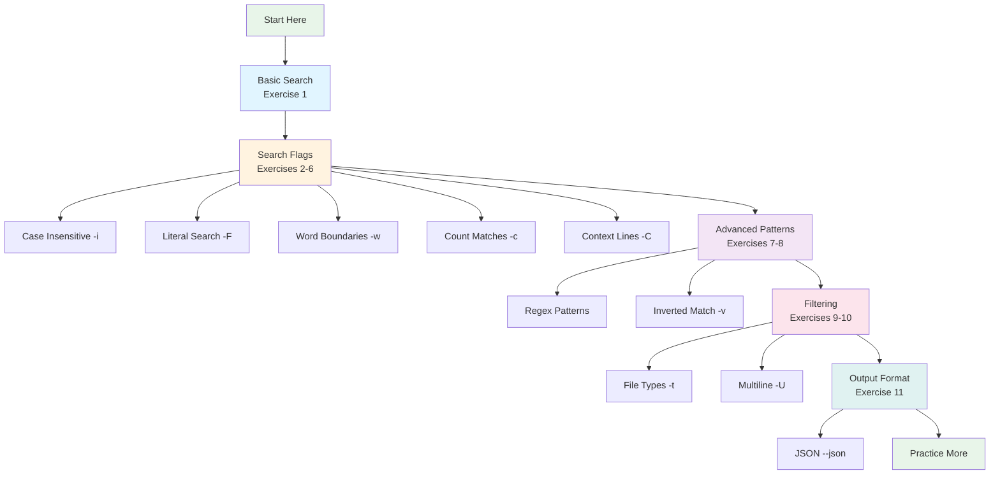
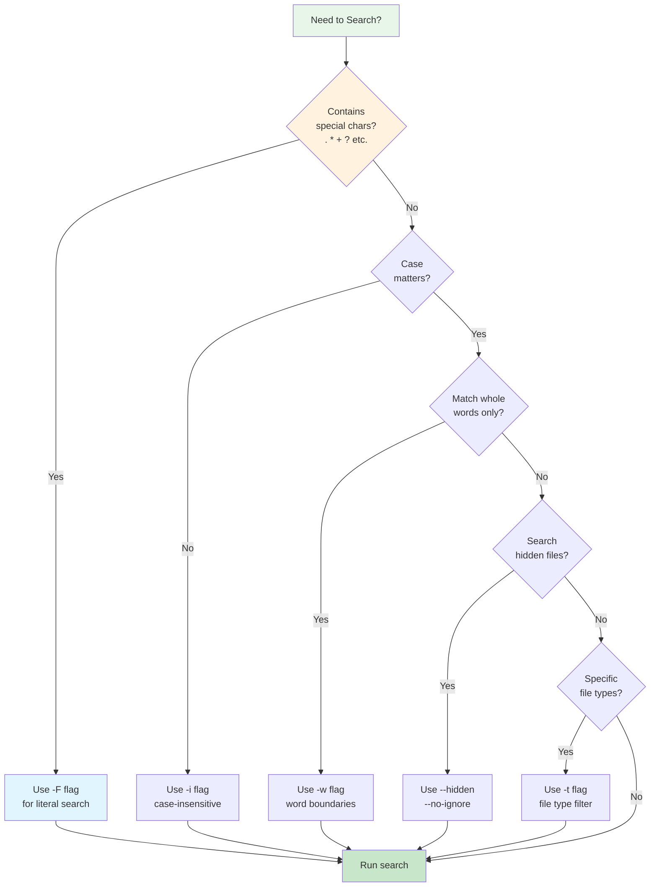

# Practice Examples

Try these exercises to solidify your understanding:

## Practice Exercises

!!! tip "Learning by Doing"
    Try each exercise in order. The expected output is shown to help you verify your results.



**Figure**: Learning progression showing how exercises build from basic to advanced techniques.

### 1. Basic Search

Find all TODO comments in your project:

```bash
rg "TODO"
```

!!! example "Expected Output"
    ```
    src/main.rs
    15:    // TODO: Implement error handling
    42:    // TODO: Add validation
    ```

### 2. Case-Insensitive Search

Find all error messages (any case):

```bash
rg -i "error"
```

!!! example "Expected Output"
    ```
    src/lib.rs
    23:    return Err("Error: invalid input");
    src/utils.rs
    8:    log.error("Connection failed");
    ```

### 3. Literal Search

Find function calls to "log()" (literal match, not regex):

```bash
rg -F "log()"
```

!!! note
    The `-F` flag treats the pattern as a literal string, so special regex characters like `()` are matched exactly.

!!! example "Expected Output"
    ```
    src/main.rs
    67:    log("Starting process");
    ```

### 4. Word Boundaries

Find variable named "id" (not "valid", "identity", etc.):

```bash
rg -w "id"
```

!!! example "Expected Output"
    ```
    src/models.rs
    12:    pub id: u64,
    34:    let id = self.get_id();
    ```

### 5. Count Matches

Count how many times each file uses "import":

```bash
rg -c "import"
```

!!! example "Expected Output"
    ```
    src/main.rs:3
    src/lib.rs:7
    src/utils.rs:2
    ```

!!! note
    Files with zero matches are not shown by default.

### 6. Context Lines

Find errors with surrounding context:

```bash
rg -C 3 "error"
```

!!! example "Expected Output"
    ```
    src/lib.rs
    20-    fn process() -> Result<()> {
    21-        if !valid {
    22-            return Err("error: validation failed");
    23-        }
    24-        Ok(())
    25-    }
    ```

### 7. Regex Pattern

Find hexadecimal numbers:

```bash
rg "0x[0-9a-fA-F]+"  # (1)!
```

1. **Pattern breakdown**: `0x` matches literal "0x" prefix, `[0-9a-fA-F]` matches any hex digit (0-9, a-f, A-F), `+` matches one or more digits

!!! example "Expected Output"
    ```
    src/constants.rs
    5:    const MASK: u32 = 0xFF00;
    8:    const OFFSET: u64 = 0x1000ABCD;
    ```

### 8. Inverted Match

Find all non-empty lines:

```bash
rg -v "^$"
```

!!! note
    This is useful for filtering out blank lines from output or counting lines of actual content.

### 9. File Type Filtering

Find imports only in Rust files:

```bash
rg -t rust "^use "
```

!!! example "Expected Output"
    ```
    src/main.rs
    1:use std::fs;
    2:use std::io;
    ```

!!! tip
    Use `rg --type-list` to see all available file types.

### 10. Multiline Search

Find struct definitions that span multiple lines:

```bash
rg -U "struct \w+\s*\{[^}]+\}" --type rust  # (1)!
```

1. **Pattern breakdown**: `-U` enables multiline mode, `struct \w+` matches "struct" followed by a name, `\s*\{` matches optional whitespace and opening brace, `[^}]+` matches one or more non-brace characters (the struct body), `\}` matches closing brace

!!! example "Expected Output"
    ```
    src/config.rs
    10:struct Config {
    11:    pub enabled: bool,
    12:    pub timeout: Duration,
    13:}
    ```

!!! note "Advanced Pattern"
    The `-U` flag enables multiline mode. Source: tests/multiline.rs

### 11. JSON Output

Get structured JSON output for parsing:

```bash
rg "TODO" --json
```

!!! example "Expected Output"
    ```json
    {"type":"match","data":{"path":{"text":"src/main.rs"},"lines":{"text":"    // TODO: Implement\n"},"line_number":15,"absolute_offset":342,"submatches":[{"match":{"text":"TODO"},"start":7,"end":11}]}}
    ```

!!! tip
    JSON output is useful for integrating ripgrep into tools and scripts.

## Common Mistakes



**Figure**: Decision flowchart for choosing the right ripgrep flags to avoid common mistakes.

!!! warning "Forgetting to Escape Regex Metacharacters"
    **Problem:**
    ```bash
    # This searches for regex pattern "file.txt", which matches "file_txt", "fileXtxt", etc.
    rg "file.txt"
    ```

    **Solution:**
    ```bash
    # Use -F for literal search
    rg -F "file.txt"

    # Or escape the dot
    rg "file\.txt"
    ```

!!! warning "Case Sensitivity Confusion"
    **Problem:**
    ```bash
    # Doesn't match "TODO", "Todo"
    rg "todo"
    ```

    **Solution:**
    ```bash
    # Use -i or -S for smart case
    rg -i "todo"
    rg -S todo
    ```

!!! warning "Matching Partial Words"
    **Problem:**
    ```bash
    # Matches "test", "testing", "contest", "latest", etc.
    rg "test"
    ```

    **Solution:**
    ```bash
    # Use -w for whole words only
    rg -w "test"
    ```

!!! warning "Hidden Files Not Searched by Default"
    **Problem:**
    ```bash
    # Doesn't search .env, .gitignore, or files in .git/
    rg "SECRET_KEY"
    ```

    **Solution:**
    ```bash
    # Use --hidden to search hidden files
    rg --hidden "SECRET_KEY"

    # Use --no-ignore to also search ignored files
    rg --hidden --no-ignore "SECRET_KEY"
    ```

    !!! note
        ripgrep respects `.gitignore` by default for better performance. Source: crates/ignore/src/lib.rs

!!! warning "Binary Files Skipped Automatically"
    **Problem:**
    ```bash
    # Searches text files but skips binary files like images, executables
    rg "pattern"
    ```

    **Solution:**
    ```bash
    # Use -a to search binary files (may produce garbled output)
    rg -a "pattern"

    # Use --binary to search binary files but show only filenames
    rg --binary "pattern"
    ```

    !!! tip
        For searching specific binary formats, consider specialized tools or convert to text first.

!!! warning "Not Using File Type Filters"
    **Problem:**
    ```bash
    # Searches all files, slower on large codebases
    rg "function"
    ```

    **Solution:**
    ```bash
    # Much faster: only search JavaScript/TypeScript files
    rg -t js -t ts "function"

    # Exclude test files
    rg -t rust "TODO" -g '!*test*'
    ```

    !!! tip "Performance Boost"
        File type filters dramatically improve speed on large projects. Source: crates/ignore/src/types.rs
