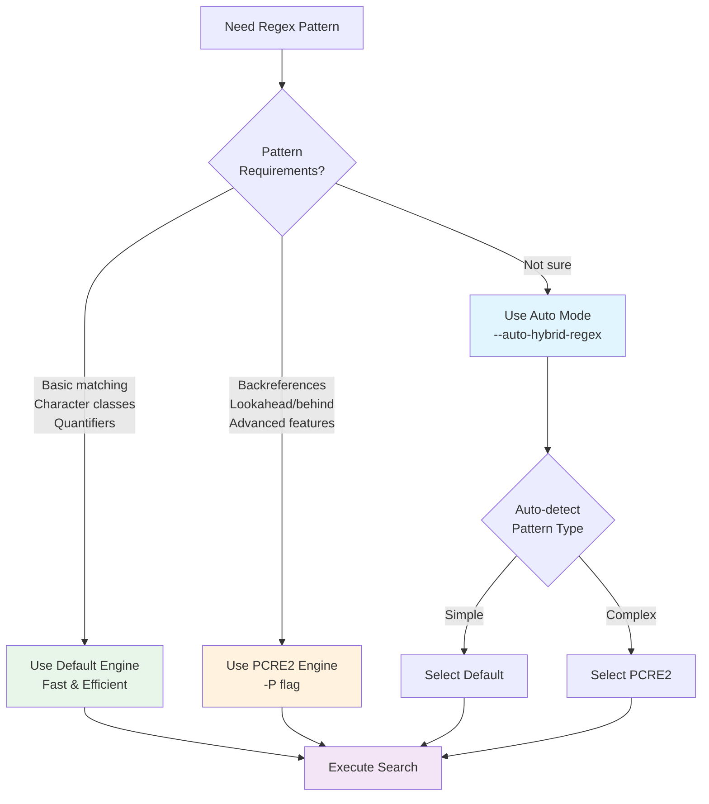

# Regular Expressions

> Part of the [Basics](./index.md) page

Ripgrep uses Rust's regex-automata library (a DFA-based engine) by default, which provides excellent performance for most patterns while supporting a rich set of regex features.

## Basic Metacharacters

```bash
# . matches any character (except newline)
rg "error."          # Matches "error1", "errors", "error!"

# * means zero or more of the preceding element
rg "lo*p"            # Matches "lp", "loop", "looop"

# + means one or more of the preceding element
rg "lo+p"            # Matches "loop", "looop" but not "lp"

# ? means zero or one of the preceding element
rg "colou?r"         # Matches "color" or "colour"

# ^ matches start of line
rg "^TODO"           # Matches lines starting with "TODO"

# $ matches end of line
rg "error$"          # Matches lines ending with "error"
```

## Character Classes

```bash
# [abc] matches any single character a, b, or c
rg "[aeiou]"         # Matches any vowel

# [a-z] matches any character in the range
rg "[0-9]+"          # Matches one or more digits
rg "[a-zA-Z]+"       # Matches alphabetic words

# [^abc] matches any character except a, b, or c
rg "[^0-9]"          # Matches any non-digit character
```

!!! tip "Prefer Predefined Classes"
    Use predefined classes like `\d` instead of `[0-9]` and `\w` instead of `[a-zA-Z0-9_]` for better readability and Unicode support. For example, `\d` matches Unicode digits in all scripts, not just ASCII 0-9.

## Predefined Character Classes

```bash
# \d matches any digit [0-9]
rg "\d+"             # Matches numbers like "42", "123"

# \w matches word characters [a-zA-Z0-9_]
rg "\w+"             # Matches words

# \s matches whitespace characters (space, tab, newline)
rg "\s+error"        # Matches "error" with leading whitespace

# \D matches non-digits
# \W matches non-word characters
# \S matches non-whitespace
```

## Unicode Character Classes

Ripgrep supports Unicode character classes using the `\p{}` syntax:

```bash
# \p{L} matches any Unicode letter
rg "\p{L}+"          # Matches words in any language

# \p{N} matches any Unicode number
rg "\p{N}+"          # Matches numeric characters

# \p{P} matches any Unicode punctuation
rg "\p{P}"           # Matches punctuation marks

# \p{Ll} matches lowercase letters
rg "\p{Ll}+"         # Matches lowercase words

# \p{Lu} matches uppercase letters
rg "\p{Lu}+"         # Matches uppercase words

# \P{} negates the class (matches anything except)
rg "\P{L}+"          # Matches non-letter characters
```

**Common Unicode categories:**

| Pattern | Description | Example |
|---------|-------------|---------|
| `\p{L}` | Any letter | Matches "café", "日本", "hello" |
| `\p{N}` | Any number | Matches "42", "৪২" (Bengali) |
| `\p{P}` | Any punctuation | Matches ".", "!", "?" |
| `\p{S}` | Any symbol | Matches "$", "€", "©" |
| `\p{Ll}` | Lowercase letter | Matches "abc", "ñ" |
| `\p{Lu}` | Uppercase letter | Matches "ABC", "Ñ" |

**Unicode scripts** allow matching specific writing systems:

```bash
# \p{Greek} matches Greek script characters
rg "\p{Greek}+"       # Matches "Ελληνικά", "Ω"

# \p{Han} matches Chinese/Japanese/Korean Han characters
rg "\p{Han}+"         # Matches "日本語", "中文"

# \p{Arabic} matches Arabic script
rg "\p{Arabic}+"      # Matches "العربية"

# \p{Cyrillic} matches Cyrillic script
rg "\p{Cyrillic}+"    # Matches "Русский"
```

## Quantifiers

```bash
# {n} matches exactly n times
rg "[0-9]{3}"        # Matches exactly 3 digits like "123"

# {n,} matches n or more times
rg "[a-z]{5,}"       # Matches words with 5 or more letters

# {n,m} matches between n and m times
rg "[0-9]{2,4}"      # Matches 2-4 digits like "42", "123", "1234"
```

## Groups and Alternation

```bash
# () creates a capturing group
rg "(error|warning): (.+)"    # Captures error/warning and message

# Named capture groups with (?P<name>...)
rg "(?P<level>error|warning): (?P<msg>.+)"   # Named captures for clarity

# | means "or"
rg "error|warning"            # Matches either "error" or "warning"

# Non-capturing groups with (?:)
rg "(?:http|https)://\S+"     # Matches URLs
```

**Named capture groups** are especially useful with replacement operations (see the [Replacements](../replacements.md) chapter) where you can refer to captures by name instead of number.

## Common Pattern Examples

!!! example "Real-World Patterns"
    These patterns are useful for searching codebases and logs:

```bash
# Email addresses
rg "\b[A-Za-z0-9._%+-]+@[A-Za-z0-9.-]+\.[A-Z|a-z]{2,}\b"

# IP addresses (simplified)
rg "\b\d{1,3}\.\d{1,3}\.\d{1,3}\.\d{1,3}\b"

# Hexadecimal colors
rg "#[0-9a-fA-F]{6}"

# Function calls (basic)
rg "\w+\([^)]*\)"

# URLs
rg "https?://[^\s]+"
```

## Regex Engine Selection

Ripgrep supports multiple regex engines that you can select using the `--engine` flag:

```bash
# Use default engine (Rust regex-automata, DFA-based)
rg pattern              # Implicit default
rg --engine default pattern

# Use PCRE2 engine (same as -P flag)
rg --engine pcre2 pattern
rg -P pattern           # Shorthand

# Auto-select engine based on pattern
rg --engine auto pattern
rg --auto-hybrid-regex pattern  # Synonym for --engine auto
```

**When to use different engines:**

- **Default (regex-automata)**: Fast, efficient for most patterns. Use for general searches.
- **PCRE2**: Supports advanced features not in default engine. Use when you need backreferences, lookahead/lookbehind, or other Perl-compatible features.
- **Auto**: Lets ripgrep choose the best engine for your pattern.



**Figure**: Decision flow for selecting the appropriate regex engine based on pattern requirements.

!!! tip "Auto Engine Selection"
    Use `--auto-hybrid-regex` when you're not sure which engine to use. Ripgrep will automatically select the best engine based on your pattern's complexity.

## PCRE2 Engine

Use the `-P` or `--pcre2` flag to enable the Perl-compatible regex engine, which supports advanced features not available in the default engine.

**Features available only with PCRE2:**

=== "Backreferences"
    ```bash
    # Refer to previously captured groups with \1, \2, etc.
    rg -P "(\w+)\s+\1"       # Finds repeated words like "the the"

    # Named backreferences
    rg -P "(?P<word>\w+)\s+\k<word>"  # Same with named groups
    ```

=== "Lookahead/Lookbehind"
    ```bash
    # Positive lookahead (?=...)
    rg -P "error(?=:)"       # Matches "error" only if followed by ":"

    # Negative lookahead (?!...)
    rg -P "test(?!ing)"      # Matches "test" but not "testing"

    # Positive lookbehind (?<=...)
    rg -P "(?<=@)\w+"        # Matches username after "@" in email

    # Negative lookbehind (?<!...)
    rg -P "(?<!un)happy"     # Matches "happy" but not "unhappy"
    ```

=== "Advanced Features"
    ```bash
    # Possessive quantifiers (prevent backtracking)
    rg -P "\d++\."           # More efficient matching with possessive +

    # Atomic groups (?>...) - also prevent backtracking
    rg -P "(?>error|warning):"   # No backtracking in group
    ```

!!! warning "Performance Tradeoffs"
    - PCRE2 is more powerful but typically slower than the default engine
    - Use PCRE2 only when you need its specific features
    - The default engine is optimized for speed and handles most use cases

## Default Engine Limitations

The default Rust regex engine provides excellent performance but does not support some advanced features:

**Not supported in default engine:**
- Backreferences (`\1`, `\2`, etc.)
- Lookahead and lookbehind assertions
- Possessive quantifiers (`*+`, `++`, etc.)
- Atomic groups (`(?>...)`)

**If you need these features, use the PCRE2 engine with `-P`:**

```bash
# This pattern requires PCRE2 for backreferences
rg -P "(\w+)\s+\1"

# This pattern requires PCRE2 for lookahead
rg -P "error(?=:)"
```

!!! tip "Troubleshooting Regex Patterns"
    If your regex pattern isn't working as expected and uses backreferences or lookahead/lookbehind, try adding the `-P` flag to enable PCRE2.

!!! note "Multiline Patterns"
    For multiline pattern matching, ripgrep provides the `-U` flag. You can also use `--multiline-dotall` to make `.` match newlines in multiline mode. See the [Advanced Patterns](../advanced-patterns/index.md) chapter for details.
