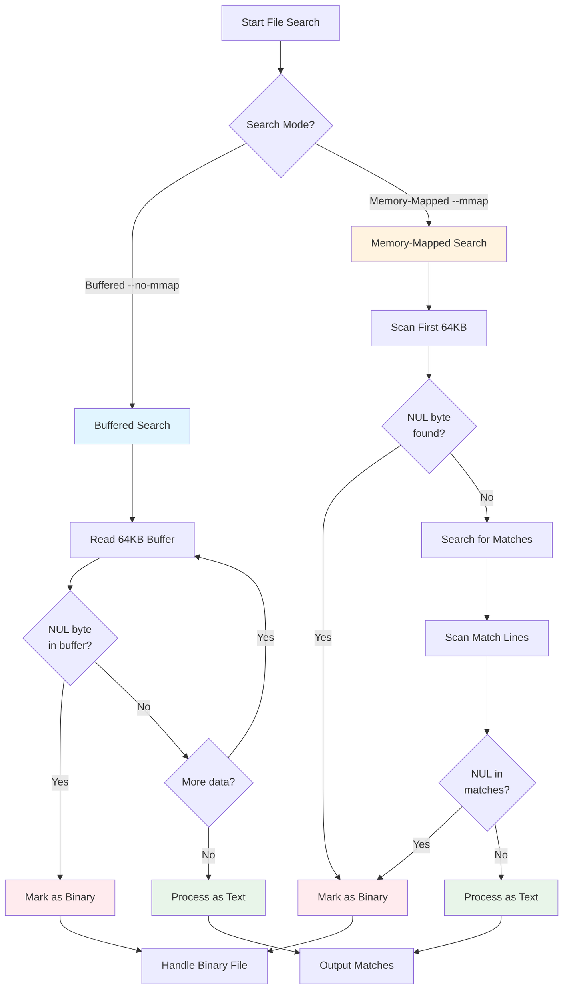

# Binary Detection

## What is Binary Detection?

Binary detection is a **heuristic process** that identifies whether a file contains binary (non-text) data and handles it differently from plain text files. The primary motivation is that binary files—like executables, images, or compressed archives—often produce nonsensical or disruptive output when searched with textual patterns.

Ripgrep uses a simple but effective heuristic: **the presence of NUL bytes** (`\x00`). When a NUL byte is encountered, the file is considered binary. While not perfect (some text encodings may contain NUL bytes, and some binary formats may not), this heuristic works well in practice since:

- Text files rarely contain NUL bytes
- Binary files typically do contain NUL bytes
- The check is extremely fast

!!! warning "Binary Detection Default"
    Binary detection is **disabled by default** in the `grep-searcher` library but **enabled by default** in ripgrep's CLI for implicit file searches (recursive directory traversal).

    **Why the difference?** The library is designed to be flexible for different use cases, while the CLI enables binary detection by default for typical grep-like workflows where binary files should be skipped. If you use ripgrep as a library, you need to explicitly enable binary detection if you want it.

    See [Explicit vs Implicit](explicit-implicit.md) for more details on detection strategies.

    ```rust
    // Source: crates/searcher/src/line_buffer.rs:66-69
    impl Default for BinaryDetection {
        fn default() -> BinaryDetection {
            BinaryDetection::None  // Disabled by default in library
        }
    }
    ```

## How Binary Detection Works

Binary detection behavior depends on the search mode ripgrep uses. The CLI provides several flags to control this behavior (see [Binary Flags](flags.md)), and different binary handling modes are available (see [Binary Modes](modes.md)).



**Figure**: Binary detection flow comparing buffered search (continuous scanning) vs memory-mapped search (limited initial scan + match scanning).

### Buffered Search (Default, or `--no-mmap`)

When ripgrep reads files using a fixed-size buffer (the default for most files, or explicitly with `--no-mmap`):

1. As each buffer is filled from the file, ripgrep scans it for NUL bytes
2. If a NUL byte is found, the file is classified as binary
3. Depending on the mode, ripgrep either stops searching or shows a warning
4. This happens **continuously** as the file is read, so binary detection is thorough

!!! note "Buffer Size"
    The default buffer size is **64 KB (65,536 bytes)**, defined as `DEFAULT_BUFFER_CAPACITY` in the searcher library.

    ```rust
    // Source: crates/searcher/src/line_buffer.rs:6
    pub(crate) const DEFAULT_BUFFER_CAPACITY: usize = 64 * (1 << 10); // 64 KB
    ```

**Example:**
```bash
# Buffered search with binary detection
rg --no-mmap "pattern" file.bin
```

### Memory-Mapped Search (`--mmap`)

When ripgrep uses memory mapping (explicit with `--mmap`, or automatically for some files):

1. Only the **first 64 KB (65,536 bytes)** of the file is scanned for NUL bytes initially
2. Additionally, **matching lines and context lines** are scanned for NUL bytes
3. If a NUL byte is found in either location, the file is classified as binary
4. This is more conservative (less thorough) but much more efficient for large files

!!! tip "Why Limit Initial Scan?"
    **Memory efficiency.** Scanning an entire 10 GB memory-mapped file for NUL bytes would be wasteful if ripgrep can make a reasonable determination from the first 64 KB.

    The mmap searcher uses the same buffer capacity constant to limit the initial binary detection scan:

    ```rust
    // Source: crates/searcher/src/searcher/glue.rs:119-120
    let binary_upto = std::cmp::min(self.slice.len(), DEFAULT_BUFFER_CAPACITY);
    ```

**Example:**
```bash
# Memory-mapped search - only checks first 64KB + matches
rg --mmap "pattern" largefile.bin
```

### Comparison: Buffered vs Memory-Mapped

Understanding when each mode is most effective:

=== "Buffered Search"
    **Best for:**

    - Small to medium files (< 100 MB)
    - Files where you need thorough binary detection
    - When you want to detect binary data anywhere in the file

    **Characteristics:**

    - Scans entire file continuously
    - More thorough detection (checks every byte)
    - Lower memory usage (64KB buffer)
    - Slower for very large files

    ```bash
    # Force buffered search
    rg --no-mmap "pattern" file.txt
    ```

=== "Memory-Mapped Search"
    **Best for:**

    - Large files (> 100 MB)
    - Performance-critical searches
    - Files where binary data is likely early or in matches

    **Characteristics:**

    - Scans only first 64KB + match lines
    - Faster for large files
    - Higher memory usage (maps entire file)
    - May miss binary data after first 64KB (if no matches)

    ```bash
    # Force memory-mapped search
    rg --mmap "pattern" largefile.txt
    ```

## See Also

- **[Binary Flags](flags.md)** - Command-line flags to control binary detection (`--binary`, `--no-binary`, `-a/--text`)
- **[Binary Modes](modes.md)** - Different binary handling modes (Auto, SearchAndSuppress, AsText)
- **[Explicit vs Implicit](explicit-implicit.md)** - Understanding detection strategies and default behaviors
- **[Examples](examples.md)** - Practical examples of binary detection in action
