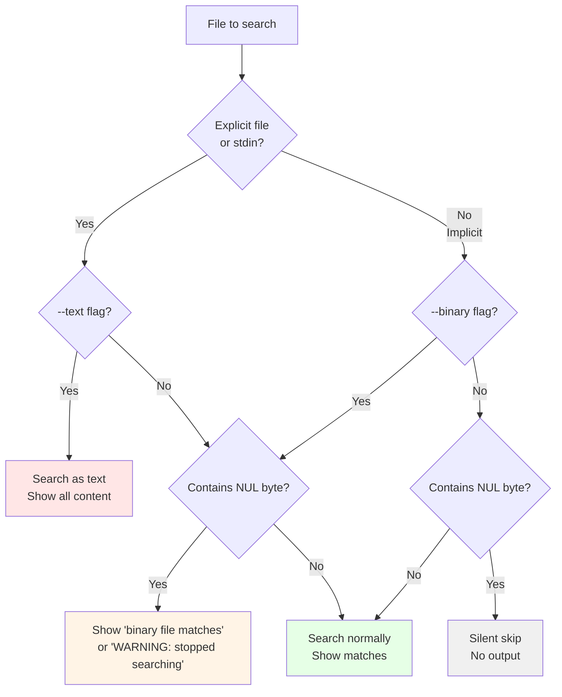

# Examples and Troubleshooting

> Part of the [Binary Data](./index.md) page

## Quick Reference

This table summarizes when binary detection triggers and what output you'll see:

| Scenario | File Type | Flag | Binary Detection? | Output |
|----------|-----------|------|-------------------|--------|
| Recursive search | Binary | (none) | Yes | Silent skip |
| Recursive search | Binary | `--binary` | Yes | Shows WARNING |
| Explicit file | Binary | (none) | Yes | Shows warning |
| Any file | Any | `--text` | No | Raw output (may corrupt terminal) |
| Large file (>64KB) | Binary | `--mmap` | Maybe | Only checks first 64KB + match regions |
| Large file (>64KB) | Binary | `--no-mmap` | Yes | Checks all buffers |
| stdin | Binary | (none) | Yes | Shows warning (treated as explicit) |

## Binary Detection Decision Flow



## Examples

### Example 1: Default Behavior (Implicit Files)

```bash
# Recursive search - binary files are silently skipped
$ rg "config"
src/config.rs:10:pub struct Config {
```

!!! info "Source: tests/binary.rs:328"
    No output for `compiled.bin` because it's binary and implicit. This is the default behavior for recursive searches to avoid performance issues.

### Example 2: With `--binary` Flag

```bash
# Recursive search - binary files show warnings
$ rg --binary "config"
src/config.rs:10:pub struct Config {
compiled.bin: WARNING: stopped searching binary file after match (found "\0" byte around offset 1234)
```

!!! info "Source: tests/binary.rs:168, crates/printer/src/standard.rs:1401"
    The `--binary` flag enables warnings for implicit binary files. The warning format comes from the printer implementation.

### Example 3: Explicit File (Always Searched)

```bash
# Explicit file - shows binary warning
$ rg "signature" compiled.bin
binary file matches (found "\0" byte around offset 2048)
```

!!! info "Source: tests/binary.rs:70, crates/printer/src/standard.rs:1412"
    Explicit files are always searched, even if binary. The offset value helps locate where binary content was detected.

### Example 4: Force Text Mode

```bash
# Search binary as text (may show garbage)
$ rg --text "signature" compiled.bin
[raw binary output, possibly terminal corruption]
```

!!! warning "Terminal Safety"
    The `--text` flag bypasses binary detection entirely. This can corrupt your terminal with control characters. Use with caution or pipe to `cat -v` to visualize control characters safely.

### Example 5: Memory Map vs. Buffered

```bash
# With mmap (only checks first 64KB + matches)
$ rg --mmap "pattern" largefile.bin
# Match near start of file: shown
# Binary data after 64KB: might not be detected unless pattern matches

# With buffered reading (thorough detection)
$ rg --no-mmap "pattern" largefile.bin
# All buffers scanned for NUL bytes
```

!!! tip "Source: crates/searcher/src/line_buffer.rs:6"
    The default buffer capacity is 64KB (65536 bytes). Memory-mapped files only check the first buffer plus regions around matches, while buffered reading checks every 64KB chunk sequentially for more thorough binary detection.

### Example 6: stdin Input

```bash
# stdin is treated like explicit file
$ cat binary.bin | rg "pattern"
binary file matches (found "\0" byte around offset 512)
```

!!! info "Source: tests/misc.rs:803"
    stdin is always treated as an explicit file, so binary detection warnings are shown even without `--binary`.

## Troubleshooting

### "I expected a match but got a binary warning"

!!! question "Problem"
    The file contains a NUL byte and is being treated as binary.

!!! success "Solution"
    Use `--text` to force text mode:
    ```bash
    rg --text "pattern" file
    ```

### "My UTF-16 file isn't being searched"

!!! question "Problem"
    UTF-16 encoding uses NUL bytes, triggering binary detection.

!!! success "Solution"
    Use `--text` or convert the file to UTF-8 first:
    ```bash
    # Force text mode
    rg --text "pattern" utf16file.txt

    # Or use --encoding (if supported)
    rg --encoding utf-16le "pattern" utf16file.txt
    ```

### "Binary detection seems inconsistent with large files"

!!! question "Problem"
    Memory-mapped mode only checks the first 64KB + match regions.

!!! success "Solution"
    Use `--no-mmap` to force buffered reading:
    ```bash
    rg --no-mmap "pattern" largefile
    ```

    This ensures every 64KB buffer is checked for NUL bytes, providing consistent binary detection throughout the file.

### "Recursive search misses files that explicit search finds"

!!! question "Problem"
    Implicit files are silently skipped when binary, explicit files show warnings.

!!! success "Solution"
    Use `--binary` to see warnings for implicit files:
    ```bash
    rg --binary "pattern"
    ```

    This reveals which files were skipped due to binary content, helping you identify files that need explicit searching or `--text` mode.
