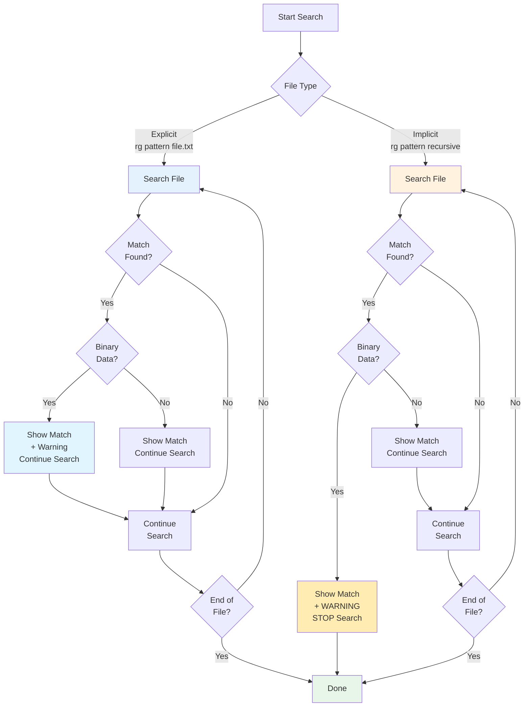

# Explicit vs Implicit Files

> Part of the [Binary Data](./index.md) page

One of the most important concepts in ripgrep's binary handling is the distinction between **implicit** and **explicit** files:

| File Type | How Specified | Binary Behavior | Warning Message |
|-----------|---------------|-----------------|-----------------|
| **Explicit** | `rg pattern file.txt` or `cat file.txt \| rg pattern` | Search continues, warning shown if binary data found | `binary file matches (found "\0" byte around offset N)` |
| **Implicit** | `rg pattern` (recursive), `rg pattern -g '*.txt'` | Search stops immediately, warning shown if binary data found after a match | `WARNING: stopped searching binary file after match (found "\0" byte around offset N)` |

**Why this distinction?** It's about user intent:

- If you explicitly name a file, you probably want to search it even if it's binary
- If ripgrep discovers a file during recursive search, it should skip binary files to avoid wasting time and producing garbage output



**Figure**: Explicit vs implicit file search behavior showing how binary detection affects search continuation.

## Example - Implicit (recursive search)

!!! example "Implicit File Behavior"
    When ripgrep discovers files recursively, it stops searching after finding binary data to avoid wasting time.

```bash
# Recursive search stops at binary files
$ rg "Project Gutenberg" -g 'hay'
hay:1:The Project Gutenberg EBook of A Study In Scarlet
hay: WARNING: stopped searching binary file after match (found "\0" byte around offset 77041)
```

## Example - Explicit file

!!! example "Explicit File Behavior"
    When you explicitly specify a file, ripgrep assumes you want to search it regardless of binary content.

```bash
# Explicit file shows warning but continues
$ rg "Project Gutenberg" hay
1:The Project Gutenberg EBook of A Study In Scarlet
binary file matches (found "\0" byte around offset 77041)
```

## Making implicit files behave like explicit files

!!! tip "Converting Implicit to Explicit Behavior"
    Use the `--binary` flag when you want recursive searches to treat all files like they were explicitly specified. This is useful when you need comprehensive search results even from binary files.

```bash
# Recursive search with binary warnings
rg --binary "pattern" -g '*.bin'  # (1)!

# 1. Treats discovered files as explicit - shows warnings but continues searching
```

## Edge Cases and Gotchas

!!! info "Performance vs Accuracy Tradeoffs"
    Ripgrep makes several performance optimizations that can affect binary detection. These tradeoffs favor speed while maintaining useful behavior.

### Performance Optimizations

#### 1. `--files-with-matches` / `-l`

When using `-l` (just list filenames), ripgrep can list a binary file before detecting the NUL byte, because it stops reading after the first match:

```bash
# Binary file might be listed even if it's binary
rg -l "pattern"  # (1)!

# 1. Stops after first match - may list binary files before detecting NUL bytes
```

This is an acceptable tradeoff: showing the filename is still useful, and the performance gain from stopping early is significant.

#### 2. `--quiet` / `-q`

Similar to `-l`, quiet mode may skip binary detection because it exits immediately upon finding any match:

```bash
# May exit before detecting binary data
rg --quiet "pattern"  # (1)!

# 1. Exits on first match - binary detection may not occur
```

#### 3. `--count` / `-c`

Count mode scans the entire file to count all matches, so binary detection works correctly:

```bash
# Binary detection works properly with count
rg -c "pattern"  # (1)!

# 1. Scans entire file - binary detection always occurs
```

### Matches Before NUL Bytes

!!! warning "Edge Case: Matches Before NUL Bytes"
    If a match occurs in the same buffer as a NUL byte but **before** the NUL byte, that match may not be printed. This is because ripgrep processes the buffer sequentially and classifies it as binary before outputting the match.

    **Example scenario:**
    ```
    Buffer contents: "match_text ... \x00 ..."
                         ^           ^
                      match here   NUL here
    ```

    The match might not be shown because the buffer is classified as binary before the match is output.

## For Library Users

If you're using the `grep-searcher` crate in your own Rust code, binary detection works differently:

!!! note "Library vs CLI Defaults"
    Binary detection is **disabled by default** in the library, unlike the CLI where binary files are skipped by default. You must explicitly enable it using the `BinaryDetection` API.

### Default Behavior

```rust
use grep_searcher::SearcherBuilder;

// By default, no binary detection
let searcher = SearcherBuilder::new().build();
```

### Enabling Binary Detection

Use the `BinaryDetection` API to configure detection:

=== "Quit on NUL"

    Stop searching when a NUL byte is found (similar to implicit file behavior):

    ```rust
    use grep_searcher::{BinaryDetection, SearcherBuilder};

    let searcher = SearcherBuilder::new()
        .binary_detection(BinaryDetection::quit(b'\x00'))
        .build();
    ```

=== "Convert NUL"

    Replace NUL bytes with line terminators to continue searching:

    ```rust
    use grep_searcher::{BinaryDetection, SearcherBuilder};

    let searcher = SearcherBuilder::new()
        .binary_detection(BinaryDetection::convert(b'\x00'))
        .build();
    ```

    !!! warning "Buffered Search Only"
        The `convert` strategy only works with buffered search, not memory-mapped search.

=== "None (Default)"

    Disable binary detection entirely:

    ```rust
    use grep_searcher::{BinaryDetection, SearcherBuilder};

    let searcher = SearcherBuilder::new()
        .binary_detection(BinaryDetection::none())
        .build();
    ```

### API Methods

- **`BinaryDetection::none()`**: No binary detection (default for library)
- **`BinaryDetection::quit(byte)`**: Stop searching when `byte` is found
- **`BinaryDetection::convert(byte)`**: Replace `byte` with line terminator
