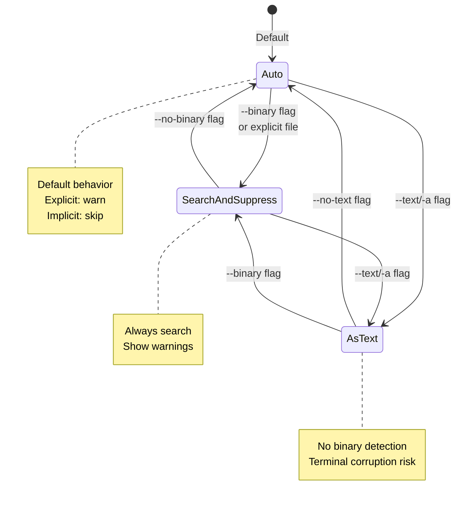
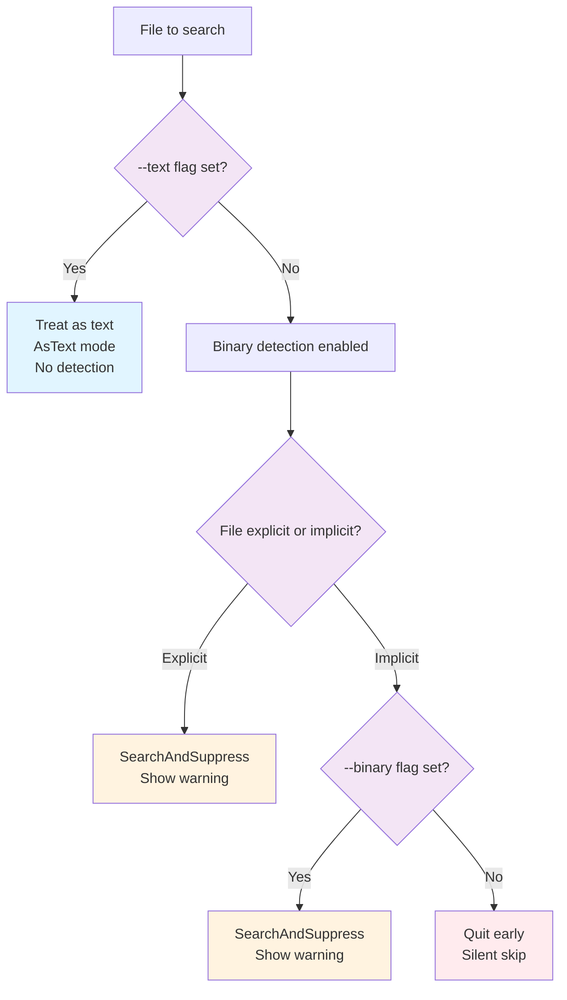

# Binary Flags Reference

> Part of the [Binary Data](./index.md) page

Ripgrep provides several flags to control how binary files are handled during search operations. These flags determine whether binary files are skipped, searched with warnings, or treated as plain text.

## Binary Detection Modes

Ripgrep uses three binary handling modes (defined in `crates/core/flags/lowargs.rs:233`):

| Mode | Description | Behavior | When Used |
|------|-------------|----------|-----------|
| **Auto** (default) | Automatically determines binary handling | Explicit files: SearchAndSuppress<br>Implicit files: Skip binary files | Default behavior |
| **SearchAndSuppress** | Search binary files but suppress matches | Shows warning when binary match found<br>NUL bytes replaced with line terminators | Explicit files, or `--binary` flag |
| **AsText** | Treat everything as text | No binary detection<br>No NUL byte replacement | `--text` / `-a` flag |



**Figure**: Binary mode state transitions showing how flags switch between modes.

!!! info "Binary Detection Mechanism"
    Ripgrep detects binary files by searching for NUL bytes (`\0`) in the first few KB of data. This is implemented in the `BinaryDetection` struct (`crates/searcher/src/searcher/mod.rs:55`).

## `--binary`

**Purpose:** Search binary files and show warnings instead of skipping them.

**Effect:** Applies `SearchAndSuppress` mode to implicit files, making them behave like explicit files.

!!! tip "When to use"
    - You want to know which binary files contain matches
    - You're searching in directories that mix text and binary files
    - You suspect binary files might contain text patterns you care about

**Example:**
```bash
# Show warnings for binary files in recursive search
rg --binary TODO  # (1)!

1. Applies SearchAndSuppress mode to implicit files (from recursive search)
```

!!! warning "Important: Implicit vs Explicit Files"
    This flag **only affects implicit files** (those found via recursive search or globs). Explicit file arguments already get warnings by default.

## `--text` / `-a`

**Purpose:** Completely disable binary detection, treating all files as text.

**Effect:** Sets `AsText` mode—no NUL byte detection, no special handling.

!!! tip "When to use"
    - Searching files with unusual encodings that contain NUL bytes
    - Searching data formats that are technically binary but human-readable (some JSON variants, etc.)
    - Debugging when you suspect binary detection is interfering

!!! danger "Terminal Corruption Risk"
    Can print raw binary data that may corrupt your terminal display. Use with caution and consider redirecting output to a file.

**Example:**
```bash
# Treat everything as text, even binaries
rg --text "pattern" binary_file.bin  # (1)!

1. Disables all binary detection - searches everything as plain text
```

## `--no-binary`

**Purpose:** Disable the `--binary` flag.

**Effect:** Reverts to default `Auto` mode behavior.

**Example:**
```bash
# Explicitly disable binary warnings
rg --no-binary "pattern"
```

## `--no-text`

**Purpose:** Disable the `--text` flag.

**Effect:** Re-enables binary detection if `--text` was set.

**Example:**
```bash
# Re-enable binary detection
rg --no-text "pattern"
```

## Common Use Cases

Here are practical scenarios showing when to use each flag:

=== "Mixed Directories"
    **Scenario**: Find patterns in source code that may include compiled binaries

    ```bash
    # Find TODO comments in source code, including compiled binaries
    rg --binary "TODO"
    ```

    **Output**:
    ```
    src/main.rs:42:    // TODO: refactor this
    Binary file libfoo.so matches (found "\0" byte around offset 123)
    Binary file app.exe matches (found "\0" byte around offset 456)
    ```

    !!! tip
        Use `--binary` when you want to know which binary files contain matches without seeing the actual (potentially corrupted) output.

=== "Database Dumps"
    **Scenario**: Search database dumps that may contain NUL bytes but are mostly text

    ```bash
    # Search PostgreSQL dump that may contain NUL bytes
    rg --text "user@example.com" database.dump
    ```

    **Why `--text`**: Database dumps may have embedded binary data but are primarily text. The `--text` flag treats everything as searchable text.

    !!! warning
        Redirect output to a file to avoid terminal corruption from binary data.

=== "Log Files"
    **Scenario**: Search logs that occasionally contain binary data

    ```bash
    # Search logs that occasionally contain binary data
    rg --binary "ERROR" /var/log/
    ```

    **Output**:
    ```
    /var/log/app.log:1234:ERROR: Connection failed
    Binary file /var/log/metrics.bin matches (found "\0" byte around offset 789)
    ```

    !!! tip
        Gets warnings for binary matches instead of silently skipping them.

=== "Safe Binary Search"
    **Scenario**: Search binary files without risking terminal corruption

    ```bash
    # Search binary files with output redirection
    rg --text "pattern" *.bin > results.txt 2>&1
    ```

    **Why redirect**: All output (including potential binary garbage) goes to the file instead of your terminal.

    !!! example "Alternative: Use --binary for safer output"
        ```bash
        rg --binary "pattern" *.bin
        ```
        Shows only warnings instead of binary content.

=== "Explicit Files"
    **Scenario**: Understanding explicit vs implicit file behavior

    ```bash
    # These behave identically - explicit files use SearchAndSuppress
    rg "pattern" binary_file.bin
    rg --binary "pattern" binary_file.bin
    ```

    **Both show**:
    ```
    Binary file binary_file.bin matches
    ```

    !!! info "Key Insight"
        The `--binary` flag only affects **implicit** files (from recursive search). Explicit file arguments always show warnings by default.

## Decision Flowchart

Here's how ripgrep decides what to do with binary data:



**Figure**: Binary file handling decision tree showing how flags and file type affect behavior.

## Implementation Details

The binary handling logic is implemented across several key components:

- **`BinaryMode` enum** (`crates/core/flags/lowargs.rs:233-252`): Defines the three modes (Auto, SearchAndSuppress, AsText)
- **`BinaryDetection` struct** (`crates/searcher/src/searcher/mod.rs:55`): Implements the NUL byte detection mechanism
- **Flag definitions** (`crates/core/flags/defs.rs`): Command-line flag parsing and validation

## See Also

- [Binary Data Overview](./index.md) - Main binary data handling documentation
- [Encoding](../encoding.md) - Character encoding handling (if available)
- [Filtering Files](../filtering.md) - File type and glob filtering (if available)
