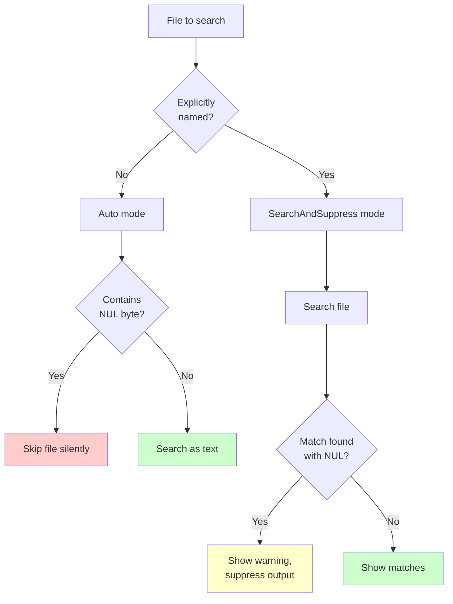

# Binary Data

Binary data handling is one of ripgrep's most important and nuanced features. Understanding how ripgrep detects and processes binary files is crucial for getting the results you expect, whether you're searching source code or working with mixed file types.

## Binary Detection Flow

!!! note "Source Reference"
    Binary detection behavior is defined in `crates/core/flags/lowargs.rs:233-252`

## When to Read This

This section helps you navigate the binary data documentation efficiently:

| If you want to... | Read this page |
|------------------|----------------|
| **Understand what binary detection is** | Start with [Binary Detection](./detection.md) |
| **Know which mode to use** | Read [Binary Modes](./modes.md) |
| **Understand why explicit files behave differently** | See [Explicit vs Implicit Files](./explicit-implicit.md) |
| **Look up flag usage** | Use [Binary Flags Reference](./flags.md) |
| **Solve a specific problem** | Jump to [Examples and Troubleshooting](./examples.md) |

## Flag Comparison

Choose the right flag for your use case:

| Behavior | Default (Auto) | `--binary` | `--text` / `-a` |
|----------|----------------|------------|-----------------|
| **Implicit files with NUL** | Skip silently | Show warning, suppress output | Search and display |
| **Explicit files with NUL** | Show warning, suppress output | Show warning, suppress output | Search and display |
| **NUL byte handling** | Detect and react | Detect and react | Ignored (treated as data) |
| **Performance** | Fast (skips binary) | Medium (searches but suppresses) | Slower (processes all data) |
| **Use when...** | Normal searching | Debugging why files are skipped | Known text-only files or need all data |
| **Risk** | May miss matches in binary | May miss matches in binary | May corrupt terminal output |

!!! tip "Choosing the Right Flag"
    - **Most of the time**: Use default (no flag) for best performance
    - **Debugging**: Use `--binary` to see which files contain NUL bytes
    - **Forced search**: Use `--text` when you know files are text despite NUL bytes
    - **Always combine** `--text` with other filters (`-g`, `-t`) to limit scope

!!! example "Source Reference"
    See `tests/binary.rs` for comprehensive test examples of each flag's behavior

## Summary

Binary data handling in ripgrep balances three concerns:

1. **Performance**: Skip irrelevant binary files quickly
2. **User intent**: Search files the user explicitly names
3. **Safety**: Avoid corrupting the terminal with binary output

Key takeaways:

- Binary detection uses NUL bytes as the heuristic
- Implicit files (recursive) are skipped silently; explicit files show warnings
- Use `--binary` to see warnings for all files
- Use `--text` to force searching everything as text (with caution)
- Memory-mapped and buffered searches detect binaries differently
- Library users must explicitly enable binary detection

## Related Topics

- **[File Encoding](../file-encoding.md)**: Understanding how ripgrep handles different text encodings, which can interact with binary detection
- **[Manual Filtering: File Types](../manual-filtering-types.md)**: Controlling which file types are searched, complementing binary detection
- **[Compressed Files](../compressed-files.md)**: Using `--search-zip` to search inside compressed archives (which are binary but may contain text)
