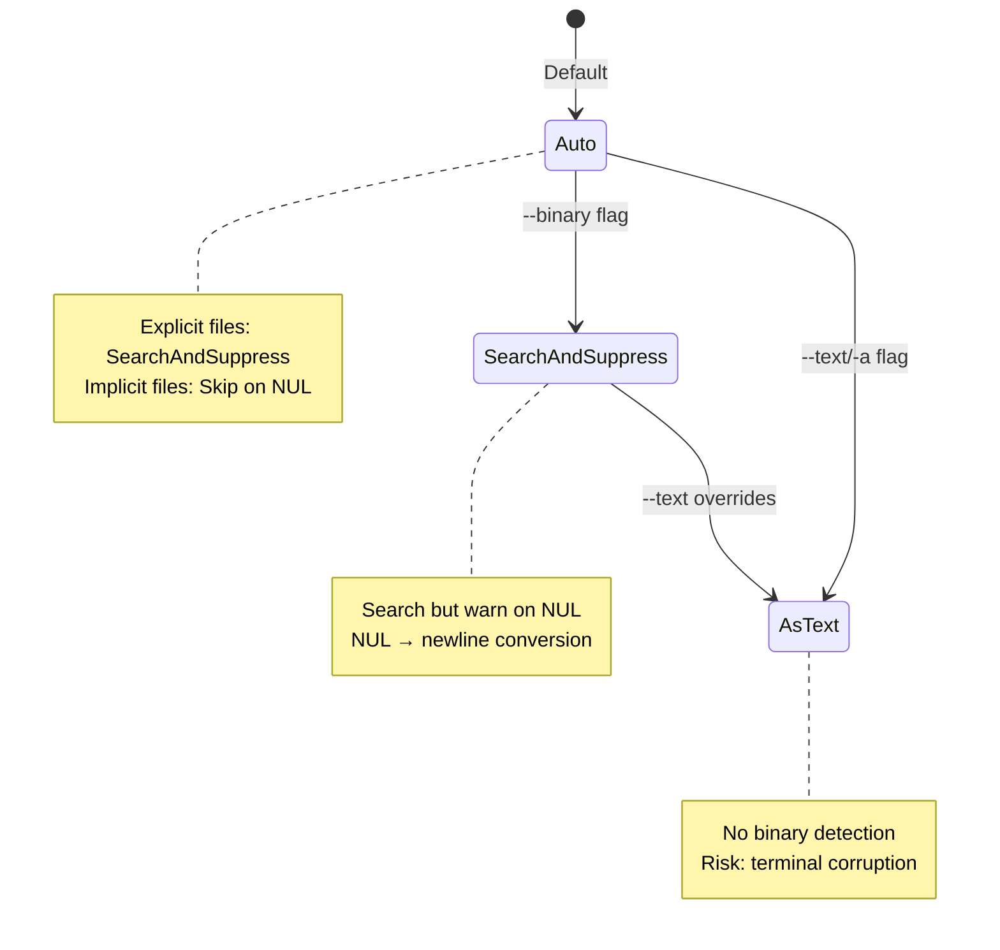
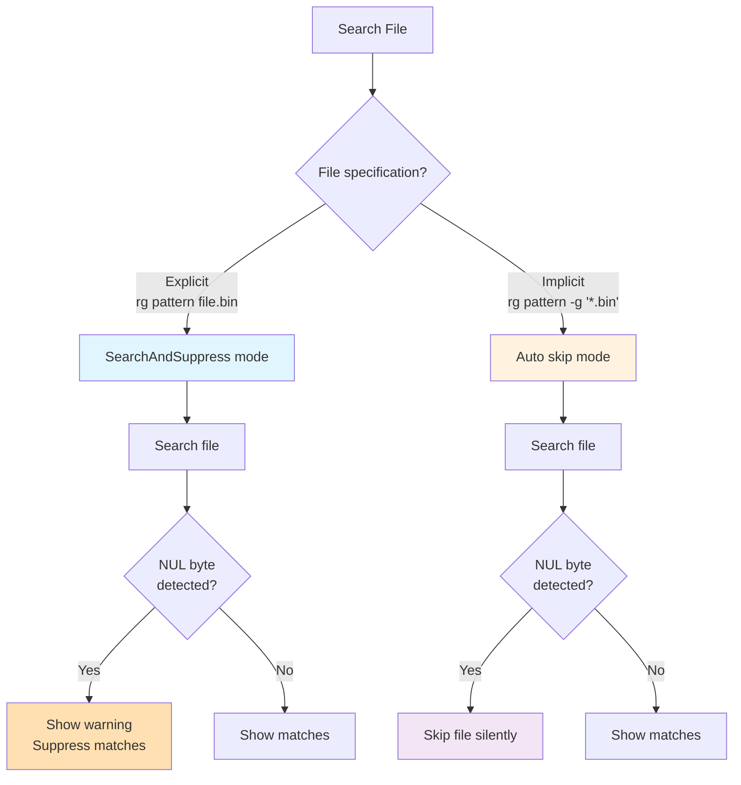

# Binary Modes

> Part of the [Binary Data](./index.md) page

Ripgrep supports three distinct binary handling modes, controlled by the `--binary` and `--text` flags:



**Figure**: Binary mode selection and transitions based on command-line flags.

## Auto Mode (Default)

The default mode automatically determines the binary handling strategy based on how the file is specified:

- **Explicit files** (e.g., `rg pattern file.bin`): Uses `SearchAndSuppress` mode—the file is searched, but if binary data is detected, a warning is shown instead of the matches
- **Implicit files** (e.g., `rg pattern` in a directory, or `rg pattern -g '*.bin'`): Quits searching immediately when binary data is detected, no output or warning

!!! tip "Design Rationale"
    This dual behavior balances precision (don't waste time on binary files) with recall (if the user explicitly named a file, they probably want to search it). See [Explicit vs Implicit Files](./explicit-implicit.md) for more details on this distinction.



**Figure**: Auto mode decision flow showing different behavior for explicit vs implicit files.

## SearchAndSuppress Mode

When you use the `--binary` flag, ripgrep will search binary files but suppress matches and emit warnings when NUL bytes are found:

```bash
rg --binary pattern  # (1)!
```

1. Searches binary files but shows warnings instead of matches when NUL bytes are found

In this mode, **NUL bytes are replaced with line terminators** during searching.

!!! note "Memory-Saving Heuristic"
    True binary data isn't line-oriented, so treating it as such without NUL-to-newline conversion could result in impractically large "lines" (imagine a 100MB binary file with no line breaks consuming all available memory).

## AsText Mode

The `--text` (or `-a`) flag completely disables binary detection, treating all files as plain text:

```bash
rg --text pattern  # (1)!
rg -a pattern      # (2)!
```

1. Force search binary files as text
2. Short form of `--text`

!!! warning "Terminal Corruption Risk"
    This may print raw binary data to your terminal, including escape sequences that could corrupt your terminal display or cause unexpected behavior. Use with caution and consider piping to `cat -v` or similar if you need to inspect the output safely.

The `--text` flag overrides `--binary` if both are specified.

## Performance Considerations

Binary detection has minimal performance impact:

- **Detection overhead:** Extremely low—just a byte-by-byte scan during normal reading
- **Performance benefit:** Can be significant by skipping binary files early, especially in recursive searches
- **Memory impact:** The NUL-to-newline conversion in `SearchAndSuppress` mode prevents excessive memory usage from treating binary data as single giant lines

!!! tip "Choosing the Right Mode"
    **When to use each mode:**

    | Mode | Use When | Performance Profile |
    |------|----------|-------------------|
    | **Auto (default)** | General-purpose searching | Best balance: skips binaries but searches explicit files |
    | **`--binary`** | Need to know about binary matches | Slightly slower: searches more files, but still stops early |
    | **`--text`** | Files incorrectly detected as binary | Potentially slower: may search irrelevant data |
    | **Disabled (library)** | Complete control needed | Fastest, but may produce garbage output |
