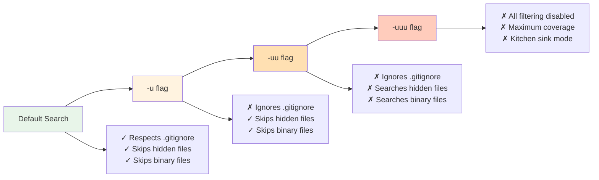
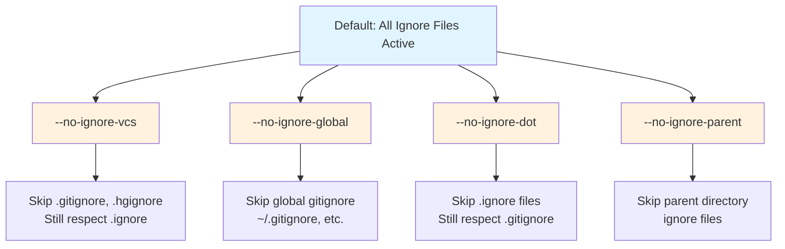

# File Filtering

> Part of the [Common Options](./index.md) page

These flags control which files are searched.

!!! tip "Quick reference: Common filtering patterns"
    - Search specific file types: `rg -trust pattern` or `rg -tpy pattern`
    - Search with globs: `rg -g '*.rs' pattern`
    - Search ignored files: `rg -u pattern`
    - Search everything (including hidden/binary): `rg -uuu pattern`
    - Exclude file types: `rg -Tlog pattern`
    - Limit search depth: `rg -d 2 pattern`

## File Type Filtering

- **`-t, --type TYPE`**: Only search files of this type
  ```bash
  # Search only Rust files
  rg -trust pattern

  # Search Python and JavaScript files
  rg -tpy -tjs pattern
  ```

- **`-T, --type-not TYPE`**: Exclude files of this type
  ```bash
  # Search everything except log files
  rg -Tlog pattern
  ```

- **`--type-list`**: Show all supported file types
  ```bash
  rg --type-list
  ```

- **`--type-add TYPESPEC`**: Define custom file types
  ```bash
  # Source: crates/core/flags/defs.rs:6936-6969
  # Define a custom type 'web' for web files
  rg --type-add 'web:*.{html,css,js}' -tweb pattern    # (1)!

  # Define 'config' type for configuration files
  rg --type-add 'config:*.{yml,yaml,toml,json}' -tconfig 'port'    # (2)!

  # Combine with multiple type definitions
  rg --type-add 'foo:*.foo' --type-add 'bar:*.bar' -tfoo -tbar pattern    # (3)!
  ```

  1. Format is `name:glob` - creates type 'web', then `-tweb` uses it
  2. Use brace expansion `{yml,yaml,toml,json}` for multiple extensions
  3. Chain multiple `--type-add` to define several types in one command

  The format is `name:glob`, where `name` is your custom type name and `glob` is a file pattern. Multiple globs can be specified using brace expansion `{ext1,ext2}`.

!!! note "Type persistence"
    Custom types defined with `--type-add` must be passed to every invocation. For persistent type definitions, use your [configuration file](../configuration-file.md).

Ripgrep knows about common file extensions for popular languages and formats. You can also define custom types in your configuration file.

## Glob Patterns

- **`-g, --glob PATTERN`**: Include/exclude files matching glob pattern
  ```bash
  # Only search .rs files
  rg -g '*.rs' pattern              # (1)!

  # Search .py files in src/ directory tree
  rg -g 'src/**/*.py' pattern       # (2)!

  # Exclude minified JavaScript
  rg -g '!*.min.js' pattern         # (3)!

  # Combine multiple globs
  rg -g '*.{rs,toml}' pattern       # (4)!

  # Match single character with ?
  rg -g 'test?.rs' pattern          # (5)!

  # Match character classes with [...]
  rg -g 'file[0-9].txt' pattern     # (6)!
  rg -g 'data[a-z].csv' pattern
  ```

  1. `*` matches any characters except `/` (directory separator)
  2. `**` matches across directories - use for recursive patterns
  3. `!` prefix negates the pattern - excludes matching files
  4. `{rs,toml}` expands to multiple extensions in one pattern
  5. `?` matches exactly one character - use for single-char variations
  6. `[0-9]` matches any single digit - `[a-z]` matches any lowercase letter

  **Glob syntax:**
  - `*` - Match any characters (except `/`)
  - `**` - Match any characters including `/` (directory recursion)
  - `?` - Match exactly one character
  - `[...]` - Match any character in the brackets (e.g., `[0-9]`, `[a-z]`, `[abc]`)
  - `!` prefix - Exclude files matching the pattern

- **`--iglob PATTERN`**: Like `--glob` but case-insensitive

## Unrestricted Search

The `-u` flag progressively removes ripgrep's smart filtering. Each `-u` adds more:



**Figure**: Progressive unrestricted search showing how each `-u` flag removes filtering layers.

!!! warning "Default behavior"
    By default, ripgrep respects `.gitignore`, skips hidden files, and ignores binary files. Use `-u` flags to override these behaviors.

- **`-u`**: Don't respect `.gitignore` and other ignore files
  ```bash
  # Search ignored files like those in .gitignore
  rg -u pattern
  ```

- **`-uu`**: Also search hidden files and binary files
  ```bash
  # Search everything including hidden and binary files
  rg -uu pattern
  ```

- **`-uuu`**: Disable all filtering (ignore files, hidden files, and binary detection)
  ```bash
  # The kitchen sink - search absolutely everything
  rg -uuu pattern
  ```
  This is the most permissive mode, combining all unrestricted behaviors: searches ignored files (`.gitignore`), hidden files (`.dotfiles`), and doesn't skip binary files.

Use `-u` when you need to search `.gitignore`d files, `-uu` when you also need hidden/binary files, and `-uuu` for maximum coverage.

### Granular Ignore Control

Instead of using `-u` flags, you can selectively disable specific ignore mechanisms:



**Figure**: Granular ignore control flags - each flag disables a specific ignore mechanism.

- **`--no-ignore-vcs`**: Don't respect version control ignore files (`.gitignore`, etc.)
  ```bash
  # Search files ignored by git, but still respect .ignore files
  rg --no-ignore-vcs pattern
  ```

- **`--no-ignore-global`**: Don't respect global ignore files
  ```bash
  # Ignore global gitignore settings
  rg --no-ignore-global pattern
  ```

- **`--no-ignore-dot`**: Don't respect `.ignore` files
  ```bash
  # Skip .ignore files but still respect .gitignore
  rg --no-ignore-dot pattern
  ```

- **`--no-ignore-parent`**: Don't respect ignore files in parent directories (see [Advanced Filtering](#advanced-filtering))
  ```bash
  # Only use ignore files in current directory
  rg --no-ignore-parent pattern
  ```

!!! tip "Combining granular flags"
    These flags can be combined for precise control over which ignore files are respected. Using `-u` is equivalent to enabling all of these flags at once.

## Hidden Files and Symlinks

- **`--hidden`**: Search hidden files and directories (those starting with `.`)
  ```bash
  # Search .config files
  rg --hidden 'database'
  ```
  By default, hidden files are skipped.

- **`-L, --follow`**: Follow symbolic links
  ```bash
  rg -L pattern
  ```

!!! warning "Symlink behavior"
    By default, symlinks are not followed to avoid cycles and duplication. Use `--follow` carefully in directories with complex symlink structures.

## Directory Depth

- **`-d, --max-depth NUM`**: Limit directory recursion depth
  ```bash
  # Search only current directory (no subdirectories)
  rg -d 1 pattern

  # Descend at most 3 levels
  rg -d 3 pattern
  ```

## File Size Limits

- **`--max-filesize NUM+SUFFIX`**: Ignore files larger than this size
  ```bash
  # Skip files larger than 100KB
  rg --max-filesize 100K pattern

  # Skip files larger than 5MB
  rg --max-filesize 5M pattern
  ```
  Suffixes: `K` (kilobytes), `M` (megabytes), `G` (gigabytes).

## Binary Files

!!! info "Binary detection"
    By default, ripgrep auto-detects binary files (by finding NUL bytes) and skips them to avoid polluting output.

- **`--binary`**: Force searching binary files (shows matches even if NUL bytes detected)
  ```bash
  # Search binary files for strings
  rg --binary 'pattern'
  ```

- **`-a, --text`**: Treat all files as text, disabling binary detection
  ```bash
  # Search everything as text
  rg -a pattern
  ```

- **`--max-columns-preview NUM`**: Tune binary detection threshold
  ```bash
  # Files with lines longer than 200 chars are considered binary
  rg --max-columns-preview 200 pattern
  ```
  Default is 150. Ripgrep checks the first preview bytes for NUL characters.

## Advanced Filtering

- **`--one-file-system`**: Don't cross filesystem boundaries when searching
  ```bash
  # Source: crates/core/flags/defs.rs:5077-5090
  # Stay on same filesystem (avoid mounted drives, network shares)
  rg --one-file-system pattern
  ```
  Useful to avoid searching network mounts or external drives.

- **`--no-ignore-parent`**: Don't respect ignore files in parent directories
  ```bash
  # Only use .gitignore in current directory, not parents
  rg --no-ignore-parent pattern
  ```
  By default, ripgrep traverses up and respects `.gitignore`/`.ignore` files in parent directories.

- **`--path-separator SEPARATOR`**: Use custom path separator in output
  ```bash
  # Use forward slashes on Windows for Unix-style paths
  rg --path-separator / pattern
  ```
  Useful for cross-platform scripts and consistent output formatting.
