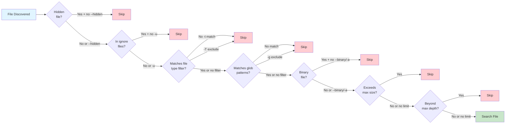
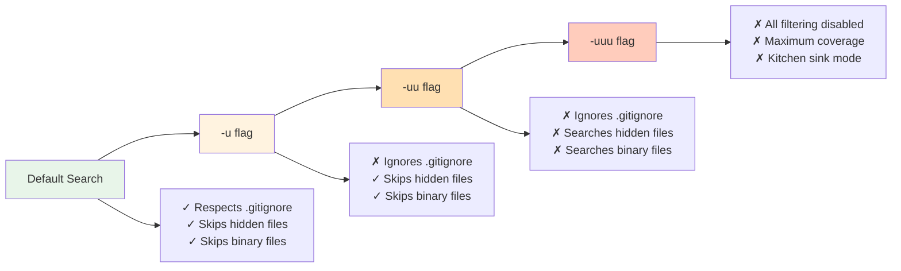
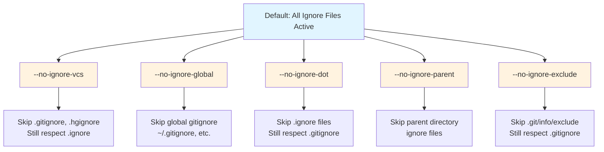

# File Filtering

These flags control which files are searched.

## Filtering Decision Flow

Ripgrep applies multiple filtering layers to determine which files to search:



**Figure**: File filtering decision flow showing how ripgrep evaluates files through multiple filtering layers.

!!! tip "Quick reference: Common filtering patterns"
    - Search specific file types: `rg -trust pattern` or `rg -tpy pattern`
    - Search with globs: `rg -g '*.rs' pattern`
    - Search ignored files: `rg -u pattern`
    - Search everything (including hidden/binary): `rg -uuu pattern`
    - Exclude file types: `rg -Tlog pattern`
    - Limit search depth: `rg -d 2 pattern`

## File Type Filtering

- **`-t, --type TYPE`**: Only search files of this type
  ```bash
  # Search only Rust files
  rg -trust pattern

  # Search Python and JavaScript files
  rg -tpy -tjs pattern
  ```

- **`-T, --type-not TYPE`**: Exclude files of this type
  ```bash
  # Search everything except log files
  rg -Tlog pattern
  ```

- **`--type-list`**: Show all supported file types
  ```bash
  rg --type-list
  ```

- **`--type-add TYPESPEC`**: Define custom file types
  ```bash
  # Source: crates/core/flags/defs.rs:6936-6969
  # Define a custom type 'web' for web files
  rg --type-add 'web:*.{html,css,js}' -tweb pattern    # (1)!

  # Define 'config' type for configuration files
  rg --type-add 'config:*.{yml,yaml,toml,json}' -tconfig 'port'    # (2)!

  # Combine with multiple type definitions
  rg --type-add 'foo:*.foo' --type-add 'bar:*.bar' -tfoo -tbar pattern    # (3)!

  # Compose types from other types using include:
  rg --type-add 'src:include:cpp,py,md' -tsrc pattern    # (4)!

  # Combine include: with additional globs
  rg --type-add 'src:include:cpp,py,md' --type-add 'src:*.foo' -tsrc pattern    # (5)!
  ```

  1. Format is `name:glob` - creates type 'web', then `-tweb` uses it
  2. Use brace expansion `{yml,yaml,toml,json}` for multiple extensions
  3. Chain multiple `--type-add` to define several types in one command
  4. Use `include:` syntax to compose a type from multiple existing types
  5. Add more globs to an included type definition for further customization

  The format is `name:glob`, where `name` is your custom type name and `glob` is a file pattern. Multiple globs can be specified using brace expansion `{ext1,ext2}`. You can also use `name:include:type1,type2,...` to compose a new type from existing types.

- **`--type-clear TYPE`**: Clear existing type definitions for a type
  ```bash
  # Source: crates/core/flags/defs.rs:7023-7033
  # Clear built-in Rust type definition before adding custom one
  rg --type-clear rust --type-add 'rust:*.rs' pattern

  # Clear multiple types
  rg --type-clear rust --type-clear cpp pattern
  ```
  This flag clears all glob patterns for the specified type, including built-in definitions. Useful when you want to completely redefine a type without inheriting default patterns.

!!! note "Type persistence"
    Custom types defined with `--type-add` must be passed to every invocation. For persistent type definitions, use your [configuration file](../configuration-file.md).

Ripgrep knows about common file extensions for popular languages and formats. You can also define custom types in your configuration file.

!!! example "Combining filtering mechanisms"
    You can combine file type filtering, glob patterns, and other flags for precise control:
    ```bash
    # Search Rust files, exclude target directory, include hidden files
    rg -trust -g '!target/' --hidden 'pattern'
    ```

## Glob Patterns

- **`-g, --glob PATTERN`**: Include/exclude files matching glob pattern
  ```bash
  # Only search .rs files
  rg -g '*.rs' pattern              # (1)!

  # Search .py files in src/ directory tree
  rg -g 'src/**/*.py' pattern       # (2)!

  # Exclude minified JavaScript
  rg -g '!*.min.js' pattern         # (3)!

  # Combine multiple globs
  rg -g '*.{rs,toml}' pattern       # (4)!

  # Match single character with ?
  rg -g 'test?.rs' pattern          # (5)!

  # Match character classes with [...]
  rg -g 'file[0-9].txt' pattern     # (6)!
  rg -g 'data[a-z].csv' pattern
  ```

  1. `*` matches any characters except `/` (directory separator)
  2. `**` matches across directories - use for recursive patterns
  3. `!` prefix negates the pattern - excludes matching files
  4. `{rs,toml}` expands to multiple extensions in one pattern
  5. `?` matches exactly one character - use for single-char variations
  6. `[0-9]` matches any single digit - `[a-z]` matches any lowercase letter

  **Glob syntax:**
  - `*` - Match any characters (except `/`)
  - `**` - Match any characters including `/` (directory recursion)
  - `?` - Match exactly one character
  - `[...]` - Match any character in the brackets (e.g., `[0-9]`, `[a-z]`, `[abc]`)
  - `!` prefix - Exclude files matching the pattern

- **`--iglob PATTERN`**: Like `--glob` but case-insensitive

- **`--glob-case-insensitive`**: Make all glob patterns case-insensitive
  ```bash
  # Make all -g/--glob patterns case-insensitive
  rg --glob-case-insensitive -g '*.TXT' -g '*.LOG' pattern
  ```
  This is equivalent to using `--iglob` for all glob patterns. Useful when you have multiple globs and want them all case-insensitive without converting each to `--iglob`.

!!! tip "Preview matched files"
    Use `rg --files -g 'pattern'` to preview which files match your glob patterns before searching. This helps verify your glob syntax is correct.

!!! example "Common glob pattern recipes"
    Here are common glob pattern use cases:

    === "Include by extension"
        ```bash
        # Single extension
        rg -g '*.rs' pattern

        # Multiple extensions
        rg -g '*.{rs,toml,md}' pattern

        # Specific directory tree
        rg -g 'src/**/*.rs' pattern
        ```

    === "Exclude patterns"
        ```bash
        # Exclude single pattern
        rg -g '!*.min.js' pattern

        # Exclude directory
        rg -g '!target/' pattern

        # Exclude multiple patterns
        rg -g '!*.test.js' -g '!*.spec.js' pattern
        ```

    === "Complex filters"
        ```bash
        # Include one type, exclude another
        rg -g '*.js' -g '!*.min.js' pattern

        # Specific files in specific directories
        rg -g 'src/**/*.{rs,toml}' -g '!**/target/**' pattern

        # Match by naming pattern
        rg -g '*test*.rs' pattern
        rg -g 'test_*.py' pattern
        ```

## Unrestricted Search

The `-u` flag progressively removes ripgrep's smart filtering. Each `-u` adds more:



**Figure**: Progressive unrestricted search showing how each `-u` flag removes filtering layers.

!!! warning "Default behavior"
    By default, ripgrep respects `.gitignore`, skips hidden files, and ignores binary files. Use `-u` flags to override these behaviors.

- **`-u`**: Don't respect `.gitignore` and other ignore files
  ```bash
  # Search ignored files like those in .gitignore
  rg -u pattern
  ```

- **`-uu`**: Also search hidden files (equivalent to `-u --hidden`)
  ```bash
  # Search ignored files and hidden files
  rg -uu pattern
  ```
  This combines `-u` (ignore .gitignore) with `--hidden` (search hidden files). Binary files may also be searched as a side effect in some contexts.

- **`-uuu`**: Disable all filtering (ignore files, hidden files, and binary detection)
  ```bash
  # The kitchen sink - search absolutely everything
  rg -uuu pattern
  ```
  This is the most permissive mode, combining all unrestricted behaviors: searches ignored files (`.gitignore`), hidden files (`.dotfiles`), and doesn't skip binary files.

Use `-u` when you need to search `.gitignore`d files, `-uu` when you also need hidden/binary files, and `-uuu` for maximum coverage.

### Granular Ignore Control

Instead of using `-u` flags, you can selectively disable specific ignore mechanisms:



**Figure**: Granular ignore control flags - each flag disables a specific ignore mechanism.

- **`--no-ignore-vcs`**: Don't respect version control ignore files (`.gitignore`, etc.)
  ```bash
  # Search files ignored by git, but still respect .ignore files
  rg --no-ignore-vcs pattern
  ```

- **`--no-ignore-global`**: Don't respect global ignore files
  ```bash
  # Ignore global gitignore settings
  rg --no-ignore-global pattern
  ```

- **`--no-ignore-dot`**: Don't respect `.ignore` files
  ```bash
  # Skip .ignore files but still respect .gitignore
  rg --no-ignore-dot pattern
  ```

- **`--no-ignore-parent`**: Don't respect ignore files in parent directories (see [Advanced Filtering](#advanced-filtering))
  ```bash
  # Only use ignore files in current directory
  rg --no-ignore-parent pattern
  ```

- **`--no-ignore-exclude`**: Don't respect `.git/info/exclude` files
  ```bash
  # Skip .git/info/exclude files
  rg --no-ignore-exclude pattern
  ```

!!! tip "Combining granular flags"
    These flags can be combined for precise control over which ignore files are respected. Using `-u` is equivalent to enabling all of these flags at once.

## Hidden Files and Symlinks

- **`--hidden`**: Search hidden files and directories (those starting with `.`)
  ```bash
  # Search .config files
  rg --hidden 'database'
  ```
  By default, hidden files are skipped.

- **`-L, --follow`**: Follow symbolic links
  ```bash
  rg -L pattern
  ```

!!! warning "Symlink behavior"
    By default, symlinks are not followed to avoid cycles and duplication. Use `--follow` carefully in directories with complex symlink structures.

## Directory Depth

- **`-d, --max-depth NUM`**: Limit directory recursion depth
  ```bash
  # Search only current directory (no subdirectories)
  rg -d 1 pattern

  # Descend at most 3 levels
  rg -d 3 pattern
  ```

## File Size Limits

- **`--max-filesize NUM+SUFFIX`**: Ignore files larger than this size
  ```bash
  # Skip files larger than 100KB
  rg --max-filesize 100K pattern

  # Skip files larger than 5MB
  rg --max-filesize 5M pattern
  ```
  Suffixes: `K` (kilobytes), `M` (megabytes), `G` (gigabytes).

## Binary Files

!!! info "Binary detection"
    By default, ripgrep auto-detects binary files (by finding NUL bytes) and skips them to avoid polluting output. For detailed binary handling strategies, see [Binary Data Detection](../binary-data/detection.md).

- **`--binary`**: Force searching binary files (shows matches even if NUL bytes detected)
  ```bash
  # Search binary files for strings
  rg --binary 'pattern'
  ```

- **`-a, --text`**: Treat all files as text, disabling binary detection
  ```bash
  # Search everything as text
  rg -a pattern
  ```

- **`--max-columns-preview NUM`**: Set number of bytes to preview for NUL detection
  ```bash
  # Check first 200 bytes for NUL characters during binary detection
  rg --max-columns-preview 200 pattern
  ```
  Default is 150. Ripgrep checks the first NUM bytes for NUL characters to determine if a file is binary. This does not control line length detection.

## Advanced Filtering

- **`--one-file-system`**: Don't cross filesystem boundaries when searching
  ```bash
  # Source: crates/core/flags/defs.rs:5077-5090
  # Stay on same filesystem (avoid mounted drives, network shares)
  rg --one-file-system pattern
  ```
  Useful to avoid searching network mounts or external drives.

- **`--no-ignore-parent`**: Don't respect ignore files in parent directories
  ```bash
  # Only use .gitignore in current directory, not parents
  rg --no-ignore-parent pattern
  ```
  By default, ripgrep traverses up and respects `.gitignore`/`.ignore` files in parent directories.

- **`--ignore-file PATH`**: Specify additional custom ignore files
  ```bash
  # Use project-specific ignore patterns from custom file
  rg --ignore-file .myproject-ignore pattern
  ```
  Allows adding custom ignore files beyond `.gitignore` and `.ignore`. Useful for project-specific filtering rules.

- **`--no-ignore-exclude`**: Don't respect `.git/info/exclude` files
  ```bash
  # Skip .git/info/exclude but still respect .gitignore
  rg --no-ignore-exclude pattern
  ```
  This is part of the granular ignore control flags, skipping exclude files while still respecting other ignore mechanisms.

- **`--path-separator SEPARATOR`**: Use custom path separator in output
  ```bash
  # Use forward slashes on Windows for Unix-style paths
  rg --path-separator / pattern
  ```
  Useful for cross-platform scripts and consistent output formatting.
