# Common Options

This chapter covers the most frequently used ripgrep flags that you'll need on a daily basis. For a complete list of all options, run `rg --help`. For a concise reference of just the common flags, use `rg -h`.

!!! tip "Quick Help Reference"
    Use `rg -h` for a concise list of common flags, or `rg --help` for the complete reference including all advanced options.

The common options are organized by use case to help you quickly find the right flag for your task:

```mermaid
graph TD
    CommonOpts[Common Options] --> SearchBehavior[Search Basics]
    CommonOpts --> OutputFormat[Output Formatting]
    CommonOpts --> FileFilter[File Filtering]
    CommonOpts --> OutputModes[Output Modes]

    SearchBehavior --> SB1["Pattern modes (-F, -w)"]
    SearchBehavior --> SB2["Case sensitivity (-i, -s)"]
    SearchBehavior --> SB3["Regex engines (-P)"]

    OutputFormat --> OF1["Line numbers (-n)"]
    OutputFormat --> OF2["Context lines (-A, -B, -C)"]
    OutputFormat --> OF3["Color (--color)"]

    FileFilter --> FF1["Type filtering (-t)"]
    FileFilter --> FF2["Glob patterns (-g)"]
    FileFilter --> FF3["Hidden files (--hidden)"]

    OutputModes --> OM1["JSON output (--json)"]
    OutputModes --> OM2["Count matches (-c)"]
    OutputModes --> OM3["List files (-l)"]

    style CommonOpts fill:#e1f5ff
    style SearchBehavior fill:#e8f5e9
    style OutputFormat fill:#fff3e0
    style FileFilter fill:#f3e5f5
    style OutputModes fill:#fce4ec
```

**Figure**: Organization of common options by use case, with key flags highlighted in each category.

- **Search behavior** - Control how ripgrep interprets patterns and matches text
- **Output formatting** - Customize how results are displayed
- **File filtering** - Select which files to search
- **Alternative output modes** - Generate machine-readable or specialized output formats

## Subsections

- **[Search Basics](./search-basics.md)** - Pattern matching modes, case sensitivity, regex engines, and matching strategies
- **[Output Formatting](./output-formatting.md)** - Line numbers, context lines, color, and display options
- **[File Filtering](./file-filtering.md)** - File type filtering, glob patterns, hidden files, and binary file handling
- **[Output Modes](./output-modes.md)** - Alternative output formats like JSON, quickfix, counting, and file listing
- **[Reference](./reference.md)** - Quick reference guide, flag combinations, and grep comparisons

!!! tip "Navigation Guide"
    Start with **Search Basics** if you're new to ripgrep. Once you understand pattern matching, explore **Output Formatting** to customize results, then **File Filtering** to narrow your search scope. The **Reference** page provides a quick lookup table of all common flags.

## See Also

!!! note "Related Topics"
    These advanced topics build on the common options covered in this chapter:

- [Regular Expressions](../basics/regex-basics.md) - Learn ripgrep's regex syntax
- [Replacements](../replacements.md) - Detailed guide to the `-r` flag and capture groups
- [Configuration File](../configuration-file.md) - Set default flags and custom file types
- [File Encoding](../file-encoding.md) - Handle different text encodings
