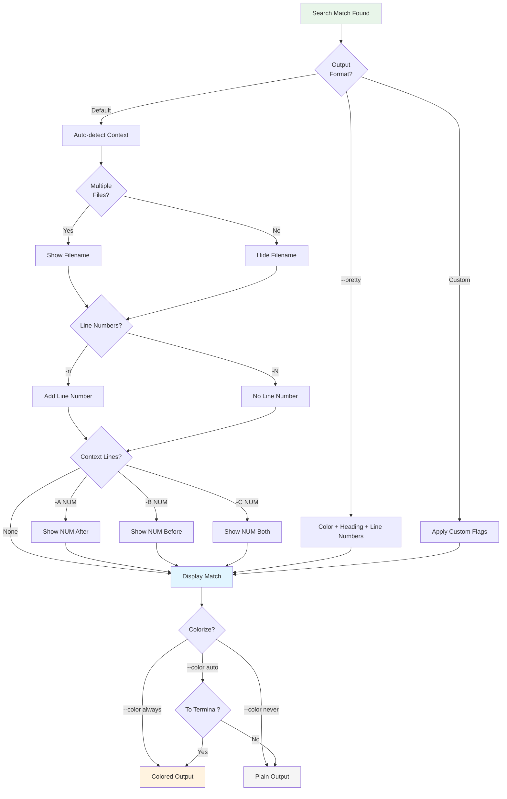

# Output Formatting

These flags control what information is displayed with each match.



**Figure**: Output formatting decision flow showing how ripgrep combines different formatting options.

## Alternative Output Formats

Ripgrep offers specialized output formats optimized for different use cases:

### Vim-Compatible Format

- **`--vimgrep`**: Print results in vim quickfix format
  <!-- Source: crates/core/flags/defs.rs:7348-7392 -->
  ```bash
  rg --vimgrep pattern
  # Output: file.txt:42:7:matching line
  #         path:line:column:text
  ```

  Each match appears on its own line with the format `path:line:column:text`. If a line contains multiple matches, it will be printed multiple times (once per match).

  !!! warning "Output Size Consideration"
      Lines with many matches will be printed multiple times, which can lead to significantly larger output. For editor integrations, consider using `--json` instead for more efficient programmatic consumption.

  !!! tip "Editor Integration"
      This format is designed for vim's quickfix list (`:copen`). Many editors can parse this format:
      ```bash
      rg --vimgrep pattern > quickfix.txt
      # In vim: :cfile quickfix.txt
      ```

### JSON Lines Format

- **`--json`**: Print results as JSON Lines for programmatic consumption
  <!-- Source: crates/core/flags/defs.rs:3434-3470 -->
  ```bash
  rg --json pattern
  ```

  Emits one JSON object per line with five message types:

  === "begin"
      Indicates a file is being searched and contains at least one match:
      ```json
      {"type":"begin","data":{"path":{"text":"src/main.rs"}}}
      ```

  === "match"
      Contains match details including line number, column, and matched text:
      ```json
      {"type":"match","data":{
        "path":{"text":"src/main.rs"},
        "lines":{"text":"fn main() {\n"},
        "line_number":1,
        "absolute_offset":0,
        "submatches":[{
          "match":{"text":"main"},
          "start":3,
          "end":7
        }]
      }}
      ```

  === "context"
      Context lines around matches (when using `-A`, `-B`, or `-C`):
      ```json
      {"type":"context","data":{
        "path":{"text":"src/main.rs"},
        "lines":{"text":"    println!(\"Hello\");\n"},
        "line_number":2,
        "absolute_offset":12
      }}
      ```

  === "end"
      Marks the end of results for a file:
      ```json
      {"type":"end","data":{"path":{"text":"src/main.rs"}}}
      ```

  === "summary"
      Final aggregate statistics:
      ```json
      {"type":"summary","data":{
        "elapsed_total":{"secs":0,"nanos":12345678},
        "stats":{
          "matched_lines":42,
          "matches":56,
          "searches":150,
          "searches_with_match":8
        }
      }}
      ```

  !!! note "Automatic Statistics"
      The `--stats` flag is implicitly enabled with `--json`, ensuring the summary message includes search statistics.

  !!! tip "Programmatic Processing"
      JSON Lines format is ideal for:

      - **Editor integrations** - Parse structured data instead of text output
      - **CI/CD pipelines** - Extract match counts and statistics
      - **Search result analysis** - Process with `jq`, Python, or other tools

      Example with `jq`:
      ```bash
      # Extract all matched file paths
      rg --json pattern | jq -r 'select(.type=="match") | .data.path.text' | sort -u

      # Count total matches
      rg --json pattern | jq -r 'select(.type=="summary") | .data.stats.matches'
      ```

## Line Numbers and Filenames

- **`-n, --line-number`**: Show line numbers (default when searching files)
  ```bash
  rg -n pattern
  # Output: file.txt:42:matching line
  ```

- **`-N, --no-line-number`**: Hide line numbers
  ```bash
  rg -N pattern
  ```

- **`-H, --with-filename`**: Show filenames (default when searching multiple files)
  ```bash
  rg -H pattern
  ```

- **`-I, --no-filename`**: Hide filenames
  ```bash
  rg -I pattern
  ```

- **`--column`**: Show column numbers of matches
  ```bash
  rg --column pattern        # (1)!
  # Output: file.txt:42:7:matching line
  #                    ^ column number
  ```

  1. Adds column position after line number, useful for editor integrations and precise navigation

### Field Separators

Customize the separators between output fields (filename, line number, column number, and text):

- **`--field-match-separator SEPARATOR`**: Set separator for match lines
  <!-- Source: crates/core/flags/defs.rs:1889-1920 -->
  ```bash
  # Use tab separator for easier parsing
  rg --field-match-separator $'\t' pattern
  # Output: file.txt<TAB>42<TAB>matching line

  # Use custom separator
  rg --field-match-separator ' | ' pattern
  # Output: file.txt | 42 | matching line
  ```

  Default is `:` (colon). Useful for generating machine-readable output or avoiding conflicts when searching for patterns containing colons.

- **`--field-context-separator SEPARATOR`**: Set separator for context lines
  ```bash
  # Different separator for context vs matches
  rg -C 2 --field-context-separator '-' pattern
  # Match:   file.txt:42:matching line
  # Context: file.txt-41-context line
  ```

  Default is `-` (hyphen). Helps distinguish context lines from actual matches in the output.

!!! tip "Programmatic Parsing"
    Use custom field separators when post-processing ripgrep output:
    ```bash
    # CSV-style output with tab separator
    rg --field-match-separator $'\t' pattern | while IFS=$'\t' read file line text; do
      echo "File: $file, Line: $line"
    done
    ```

## Context Lines

Show lines before and/or after each match to understand the surrounding code:

!!! tip "When to Use Context Lines"
    Context lines are especially useful when:

    - **Understanding function scope**: `-A 5` after finding a function definition to see its first few lines
    - **Finding usage patterns**: `-B 3 -A 3` around API calls to see how they're typically used
    - **Debugging**: `-C 10` around error messages to see what triggered them
    - **Code review**: `-C 5` to get enough context for understanding changes

- **`-A NUM, --after-context NUM`**: Show NUM lines after each match
  ```bash
  # Show 3 lines after each match
  rg -A 3 'fn main'
  ```

- **`-B NUM, --before-context NUM`**: Show NUM lines before each match
  ```bash
  # Show 2 lines before each match
  rg -B 2 'panic!'
  ```

- **`-C NUM, --context NUM`**: Show NUM lines before AND after each match
  ```bash
  # Show 5 lines of context around each match
  rg -C 5 'struct Config'   # (1)!
  ```

  1. Shorthand for `-B 5 -A 5` - shows the same number of lines before and after

### Context Separators

When showing context lines, ripgrep prints a separator between different match groups to clearly distinguish them:

- **`--context-separator SEPARATOR`**: Customize the separator string
  <!-- Source: crates/core/flags/defs.rs:1136-1170 -->
  ```bash
  # Use a custom separator
  rg -C 2 --context-separator '━━━' pattern

  # Use an empty line as separator
  rg -C 3 --context-separator '' pattern
  ```

  Default separator is `--`. You can specify any string, including empty strings or special characters.

- **`--no-context-separator`**: Disable the separator entirely
  ```bash
  # No separator between match groups
  rg -C 2 --no-context-separator pattern
  ```

  Useful when you want continuous output without visual breaks, or when post-processing the results programmatically.

!!! tip "Visual Distinction"
    The default `--` separator helps you quickly identify where one match context ends and another begins. Consider customizing it when:

    - Output might naturally contain `--` (e.g., searching code with command-line flags)
    - You need more visual separation with a longer separator like `═════`
    - Processing output programmatically and want a unique delimiter

## Match Output

- **`-o, --only-matching`**: Print only the matched part of lines, not the full line
  ```bash
  # Extract email addresses
  rg -o '\b\w+@\w+\.\w+\b'

  # Extract function names
  rg -o 'fn \w+' | rg -o '\w+$'
  ```
  Useful for extracting specific data from files.

- **`-r, --replace REPLACEMENT`**: Replace matched text in output (doesn't modify files)
  ```bash
  # Show how lines would look with replacements
  rg 'foo' -r 'bar'

  # Use capture groups
  rg '(\w+)@(\w+)' -r '$2@$1'
  ```

  !!! warning "Output Preview Only"
      The `--replace` flag only changes what ripgrep **displays**. It does **not** modify files on disk. To actually modify files, use tools like `sed` or your editor's find-and-replace. See the [Replacements chapter](../replacements.md) for more details.

- **`-b, --byte-offset`**: Show absolute byte offset in file for each match
  ```bash
  # Display byte positions for binary file analysis
  rg -b pattern
  # Output: file.txt:42:137:matching line
  #                    ^^^ byte offset
  ```
  Useful for precise location tracking and binary file analysis.

- **`--hyperlink-format FORMAT`**: Generate clickable terminal links using OSC 8 escape sequences
  ```bash
  # Use built-in editor formats
  rg --hyperlink-format vscode pattern
  rg --hyperlink-format cursor pattern

  # Custom format with variables: {path}, {line}, {column}, {host}
  rg --hyperlink-format 'file://{path}:{line}:{column}' pattern
  ```

  !!! note "Terminal Support Required"
      Requires a terminal emulator that supports OSC 8 hyperlinks (e.g., iTerm2, kitty, WezTerm, Windows Terminal).

  **Built-in Format Aliases:**
  <!-- Source: crates/printer/src/hyperlink/aliases.rs -->

  | Alias | Description | Format |
  |-------|-------------|--------|
  | `default` | RFC 8089 file:// scheme (platform-aware) | Platform-dependent |
  | `none` | Disable hyperlinks | - |
  | `cursor` | Cursor editor | `cursor://file{path}:{line}:{column}` |
  | `file` | RFC 8089 file:// with host | `file://{host}{path}` |
  | `grep+` | grep+ scheme | `grep+://{path}:{line}` |
  | `kitty` | kitty terminal with line anchor | `file://{host}{path}#{line}` |
  | `macvim` | MacVim editor | `mvim://open?url=file://...` |
  | `textmate` | TextMate editor | `txmt://open?url=file://...` |
  | `vscode` | Visual Studio Code | `vscode://file{path}:{line}:{column}` |
  | `vscode-insiders` | VS Code Insiders | `vscode-insiders://file{path}:{line}:{column}` |
  | `vscodium` | VSCodium | `vscodium://file{path}:{line}:{column}` |

  !!! tip "Custom Formats"
      You can define custom formats using template variables: `{path}`, `{line}`, `{column}`, `{host}`. For example:
      ```bash
      rg --hyperlink-format 'myeditor://open?file={path}&line={line}' pattern
      ```

## Color and Formatting

- **`--color WHEN`**: Control colored output
  - `auto` (default): Color if outputting to terminal
  - `always`: Force color even when piping
  - `never`: Disable color (useful for scripts)
  ```bash
  # Force color for paging
  rg --color always pattern | less -R      # (1)!

  # Disable color for clean output
  rg --color never pattern > results.txt   # (2)!
  ```

  1. Use `-R` flag with `less` to interpret color codes correctly
  2. Removes ANSI color codes from output file for clean text processing

- **`--colors TYPE:STYLE:VALUE`**: Fine-grained color customization
  ```bash
  # Customize match highlighting color to red
  rg --colors 'match:fg:red' pattern

  # Bold path names, green matches
  rg --colors 'path:style:bold' --colors 'match:fg:green' pattern

  # Use 256-color palette or 24-bit RGB
  rg --colors 'match:fg:0,128,255' pattern
  ```

  **Color Types:**
  <!-- Source: crates/core/flags/defs.rs -->

  - `path` - File path in output
  - `line` - Line numbers
  - `column` - Column numbers
  - `match` - Matched text

  **Style Properties:**

  - `fg` - Foreground (text) color
  - `bg` - Background color
  - `style` - Text style: `bold`, `intense`, `underline`, `italic`

  !!! example "Color Customization Examples"
      === "Named Colors"
          ```bash
          # Red foreground for matches
          rg --colors 'match:fg:red' pattern
          ```

      === "256-Color Palette"
          ```bash
          # Use extended color palette
          rg --colors 'match:fg:208' pattern
          ```

      === "RGB Colors"
          ```bash
          # 24-bit RGB (R,G,B)
          rg --colors 'match:fg:255,128,0' pattern
          ```

      === "Multiple Styles"
          ```bash
          # Combine styles for different elements
          rg --colors 'path:fg:blue' \
             --colors 'path:style:bold' \
             --colors 'line:fg:yellow' \
             --colors 'match:fg:red' \
             --colors 'match:style:intense' \
             pattern
          ```

- **`--heading`** / **`--no-heading`**: Control file grouping in output
  ```bash
  # Group matches by file with filename as header
  rg --heading pattern

  # Inline format: path:line:match on each line
  rg --no-heading pattern
  ```
  With `--heading`, matches are grouped under filenames. With `--no-heading`, every line shows the full path.

- **`-p, --pretty`**: Alias for `--color always --heading --line-number`
  ```bash
  # Human-friendly output with grouping and colors
  rg -p pattern              # (1)!
  ```

  1. Equivalent to `rg --color always --heading --line-number pattern`

!!! tip "Quick Readable Output"
    Use `-p` when you want nicely formatted output for human reading, especially when piping to `less`:
    ```bash
    rg -p pattern | less -R
    ```
    This combines color, file grouping, and line numbers in one convenient flag.

## Additional Output Options

### Statistics

- **`--stats`**: Print aggregate statistics about the search
  <!-- Source: crates/core/flags/defs.rs:6514-6546 -->
  ```bash
  rg --stats pattern
  ```

  Displays search summary including:
  - Number of matched lines
  - Number of files with matches
  - Number of files searched
  - Time elapsed

  Example output:
  ```
  42 matches
  8 matched lines
  3 files contained matches
  150 files searched
  0.012 seconds elapsed
  ```

  !!! note "JSON Format Integration"
      When using `--json`, statistics are automatically enabled and included in the summary message. This flag has no effect with `--files`, `--files-with-matches`, `--files-without-match`, or `--count`.

### Null-Separated Output

- **`-0, --null`**: Use NUL byte (`\0`) as separator instead of newline
  <!-- Source: crates/core/flags/defs.rs -->
  ```bash
  # Safe handling of filenames with spaces/newlines
  rg --files --null | xargs -0 grep pattern
  ```

  Essential for shell scripting when filenames may contain spaces, newlines, or other special characters.

- **`--null-data`**: Treat input as NUL-separated instead of line-separated
  ```bash
  # Search null-separated data (e.g., from find -print0)
  find . -name '*.txt' -print0 | rg --null-data pattern
  ```

  Useful when processing output from tools that use null separators.

### Output Buffering

- **`--line-buffered`**: Force line-by-line output buffering
  ```bash
  # Show results incrementally as they're found
  rg --line-buffered pattern | while read line; do
    # Process each result immediately
    process_result "$line"
  done
  ```

  Useful for real-time processing of search results in pipelines.

- **`--block-buffered`**: Use block buffering for better performance
  ```bash
  rg --block-buffered pattern > results.txt
  ```

  Default buffering mode that optimizes throughput at the cost of delayed output.

### Column Width Limiting

- **`-M NUM, --max-columns NUM`**: Don't print lines longer than NUM bytes
  ```bash
  # Skip very long lines (e.g., minified files)
  rg -M 500 pattern
  ```

  Lines exceeding this limit are silently skipped. Useful when searching code that may contain minified files or generated content with extremely long lines.

- **`--max-columns-preview`**: Print a preview of long lines instead of omitting them
  ```bash
  # Show truncated preview of long lines
  rg --max-columns-preview pattern
  ```

  When a line exceeds the column limit, ripgrep prints a preview instead of skipping it entirely, helping you identify what was truncated.

  !!! tip "Handling Minified Files"
      Combine with type exclusions for better control:
      ```bash
      rg --max-columns 1000 --max-columns-preview -g '!*.min.js' pattern
      ```
