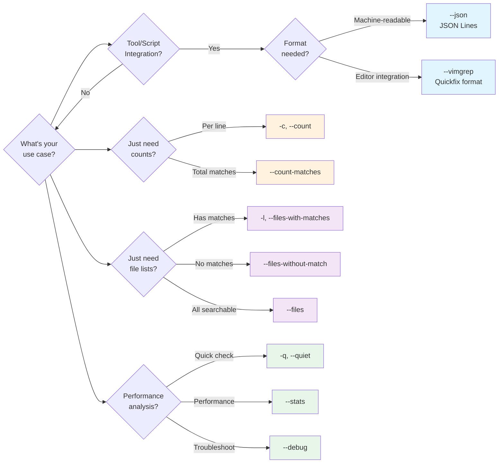

# Output Modes

Instead of showing matching lines, these flags produce alternative output formats.

## Choosing an Output Mode



**Figure**: Decision guide for selecting the appropriate output mode based on your use case.

## Structured Output

- **`--json`**: Output results in JSON Lines format (one JSON object per line)
  ```bash
  # Get machine-readable output for tooling
  rg --json 'pattern'
  ```
  Each line is a JSON object with a `type` field indicating the message type. Here are examples of each message type:

  === "Match"
      ```json
      {
        "type": "match",                    // (1)!
        "data": {
          "path": {
            "text": "src/main.rs"          // (2)!
          },
          "lines": {
            "text": "fn main() {\n"        // (3)!
          },
          "line_number": 1,                 // (4)!
          "absolute_offset": 0,             // (5)!
          "submatches": [                   // (6)!
            {
              "match": {
                "text": "main"
              },
              "start": 3,
              "end": 7
            }
          ]
        }
      }
      ```

      1. Message type - determines structure of `data` field
      2. File path where match was found
      3. Full content of the matching line (includes newline)
      4. Line number (1-indexed) where match occurred
      5. Byte offset from start of file to this line
      6. Array of all pattern matches on this line with positions

  === "Begin"
      ```json
      {
        "type": "begin",
        "data": {
          "path": {
            "text": "src/main.rs"
          }
        }
      }
      ```

  === "End"
      ```json
      {
        "type": "end",
        "data": {
          "path": {
            "text": "src/main.rs"
          },
          "binary_offset": null,
          "stats": {
            "elapsed": {
              "secs": 0,
              "nanos": 1234567,
              "human": "0.001235s"
            },
            "searches": 1,
            "searches_with_match": 1,
            "bytes_searched": 1024,
            "bytes_printed": 256,
            "matched_lines": 5,
            "matches": 5
          }
        }
      }
      ```

  === "Context"
      ```json
      {
        "type": "context",
        "data": {
          "path": {
            "text": "src/main.rs"
          },
          "lines": {
            "text": "    // Context line before match\n"
          },
          "line_number": 2,
          "absolute_offset": 15,
          "submatches": []
        }
      }
      ```

  === "Summary"
      ```json
      {
        "type": "summary",
        "data": {
          "elapsed_total": {
            "secs": 0,
            "nanos": 5678900,
            "human": "0.005679s"
          },
          "stats": {
            "elapsed": {
              "secs": 0,
              "nanos": 5000000,
              "human": "0.005000s"
            },
            "searches": 42,
            "searches_with_match": 15,
            "bytes_searched": 1048576,
            "bytes_printed": 4096,
            "matched_lines": 127,
            "matches": 135
          }
        }
      }
      ```

  !!! note "JSON Message Flow"
      Messages appear in a specific order during search execution:

      ```mermaid
      sequenceDiagram
          participant rg as ripgrep
          participant out as stdout

          rg->>out: Begin (file start)

          loop For each match/context line
              alt Match found
                  rg->>out: Match (with submatches)
              else Context line (-A/-B/-C)
                  rg->>out: Context (no submatches)
              end
          end

          rg->>out: End (file stats)

          Note over rg,out: After all files processed
          rg->>out: Summary (total stats)
      ```

      **Figure**: JSON message sequence showing how ripgrep streams results for each file, ending with aggregate statistics.

      Each message is a complete JSON object on a single line, enabling streaming processing. The `Begin` and `End` messages bracket all matches from a file, while `Summary` appears once at the end.

  !!! tip "Using JSON Output with jq"
      JSON Lines format is ideal for streaming parsers. Each line is a complete, valid JSON object that can be processed independently. Perfect for integration with tools like `jq`, custom scripts, or editor plugins.

      **Example pipeline**: Extract just the file paths and line numbers of matches:
      ```bash
      # Source: Common pattern for parsing ripgrep JSON output
      rg --json 'pattern' | jq -r 'select(.type == "match") | "\(.data.path.text):\(.data.line_number)"'
      ```

      Or count matches per file:
      ```bash
      rg --json 'TODO' | jq -s 'group_by(.data.path.text) | map({file: .[0].data.path.text, matches: length})'
      ```

- **`--vimgrep`**: Output in vim-compatible quickfix format
  ```bash
  # Generate vim quickfix format: path:line:col:text
  rg --vimgrep 'pattern'
  ```
  Format: `path:line:column:matching text`. Useful for IDE integration and editor plugins that support quickfix format.

  !!! warning "Performance Impact"
      The vimgrep format shows all matches on separate lines, even if multiple matches are on the same line. This can result in quadratic output when many matches occur on the same line.

## Counting

!!! example "Count vs Count-Matches"
    **Key difference**: `-c` counts *lines* with matches, `--count-matches` counts *total matches*.

    For a file with this content:
    ```rust
    // TODO: fix TODO: also fix TODO: and this
    // TODO: one more
    ```

    - `rg -c 'TODO'` returns `2` (two lines)
    - `rg --count-matches 'TODO'` returns `4` (four matches total)

- **`-c, --count`**: Show count of matching lines per file
  ```bash
  rg -c 'TODO'
  # src/main.rs:5
  # src/lib.rs:12
  ```

- **`--count-matches`**: Show count of all matches (not just lines)
  ```bash
  # Count total occurrences, not just lines
  rg --count-matches 'TODO'
  ```

## Listing Files

- **`-l, --files-with-matches`**: Only print filenames containing matches
  ```bash
  # List files with TODOs
  rg -l 'TODO'
  ```

- **`--files-without-match`**: Only print filenames with NO matches
  ```bash
  # Find files missing copyright headers
  rg --files-without-match 'Copyright'
  ```

- **`--files`**: List all files that would be searched (ignore pattern)
  ```bash
  # Show which files ripgrep would search
  rg --files

  # List all Rust files
  rg --files -trust
  ```

## Quiet Mode

!!! tip "Script Integration"
    Quiet mode is perfect for CI/CD checks and pre-commit hooks where you only care whether a pattern exists, not where it appears. Combined with exit codes, it enables clean conditional logic.

- **`-q, --quiet`**: Suppress all output, exit with code 0 if match found
  ```bash
  # Use in scripts for conditional logic
  if rg -q 'deprecated' src/; then
    echo "Found deprecated code!"
  fi
  ```
  Exits immediately on first match for performance.

## Performance and Limits

!!! tip "Performance-Oriented Output Modes"
    Different output modes have different performance characteristics:

    **Fastest** (exits on first match):

    - `-q, --quiet` - No output, immediate exit on match
    - `-l, --files-with-matches` - Stops at first match per file

    **Fast** (minimal output):

    - `-c, --count` - Just counts lines with matches
    - `--files-without-match` - Inverse search with early exit

    **Slower** (requires processing all matches):

    - `--count-matches` - Counts every match occurrence
    - `--vimgrep` - Duplicates lines with multiple matches
    - `--sort` - Buffers all results before displaying

    **Use case**: If you only need to verify pattern existence, use `-q` for instant results. If you need full details but have many matches, consider `--max-count` to limit output per file.

### Match Limits

- **`-m, --max-count NUM`**: Stop after NUM matches per file
  ```bash
  # Show just first 5 matches in each file
  rg -m 5 pattern
  ```
  Useful for quick sampling or improving performance on large codebases.

### Parallelism

!!! tip "Thread Tuning"
    Ripgrep auto-detects the optimal thread count based on your CPU. You rarely need to override this, but `-j 1` is useful for:

    - Deterministic output order (results appear in file order)
    - Debugging search behavior
    - Reducing CPU load on shared systems

    Higher thread counts don't always improve performance - I/O bandwidth often becomes the bottleneck before CPU.

- **`-j, --threads NUM`**: Number of threads to use (default: auto-detect)
  ```bash
  # Use 4 threads
  rg -j 4 pattern

  # Single-threaded (for debugging)
  rg -j 1 pattern
  ```

### Memory-Mapped I/O

- **`--mmap`**: Use memory-mapped I/O (sometimes faster)
- **`--no-mmap`**: Don't use memory mapping (the default)
  ```bash
  # Try mmap for potentially faster searches
  rg --mmap pattern
  ```

  !!! example "When to Use Memory Mapping"
      **Use `--mmap` when:**

      - Searching large files (>10MB) with ample system RAM
      - Files are likely to be in OS page cache (recently accessed)
      - Searching the same large files repeatedly

      **Use `--no-mmap` (default) when:**

      - Searching many small files (lower overhead)
      - Limited system memory (mmap competes with page cache)
      - Files are on network filesystems (NFS, SMB)
      - Binary or compressed files are common

      **Benchmark example:**
      ```bash
      # Compare performance on your codebase
      time rg --mmap 'pattern' > /dev/null
      time rg --no-mmap 'pattern' > /dev/null
      ```

### Sorting

Results can be sorted by various criteria, though this requires buffering all results and impacts performance:

- **`--sort SORTBY`**: Sort results in ascending order
- **`--sortr SORTBY`**: Sort results in descending order (reverse)
  ```bash
  # Sort by file path
  rg --sort path pattern

  # Sort by modification time (newest first)
  rg --sortr modified pattern

  # Sort by creation time
  rg --sort created pattern
  ```
  Available criteria: `path` (lexicographic), `modified` (modification time), `accessed` (access time), `created` (creation time).

  !!! example "Sort Direction Comparison"
      **`--sort modified`** (ascending - oldest first):
      ```
      old/legacy.rs:1:match
      src/deprecated.rs:5:match
      src/current.rs:42:match
      ```

      **`--sortr modified`** (descending - newest first):
      ```
      src/current.rs:42:match
      src/deprecated.rs:5:match
      old/legacy.rs:1:match
      ```

  !!! tip "Performance Impact"
      Sorting disables parallelism and buffers all results in memory before displaying them. This can significantly impact performance on large searches. Consider using external sorting tools if speed is critical.

### Line Length Limits

Long lines can slow down searches. These flags help manage that:

- **`--max-columns NUM`**: Don't print lines longer than NUM bytes
  ```bash
  # Skip very long lines (often minified code or data)
  rg --max-columns 500 pattern
  ```
  Lines exceeding this length are skipped entirely.

- **`--max-columns-preview NUM`**: For binary detection, check first NUM bytes for NUL
  ```bash
  # Adjust binary detection sensitivity
  rg --max-columns-preview 200 pattern
  ```
  Default is 150. Used to decide if a file is binary.

## Getting Help

- **`-h`**: Show short help with the most common flags
  ```bash
  rg -h
  ```
  This is a condensed version showing just what you need most often.

- **`--help`**: Show comprehensive help with all flags and detailed descriptions
  ```bash
  rg --help
  ```

- **`-V, --version`**: Show version information
  ```bash
  rg -V
  ```

- **`--type-list`**: List all recognized file types
  ```bash
  rg --type-list
  ```

- **`--pcre2-version`**: Show PCRE2 library version and JIT availability
  ```bash
  rg --pcre2-version
  ```

  !!! info "About JIT Compilation"
      JIT (Just-In-Time compilation) can significantly improve PCRE2 pattern matching performance by compiling regex patterns to native machine code. This flag shows if JIT support is available in your ripgrep build. Use this to verify PCRE2 support before using the `-P` flag for advanced regex features.

### Debugging and Performance Analysis

These flags help troubleshoot search behavior and analyze performance:

- **`--debug`**: Show debug information about search strategy and configuration
  ```bash
  rg --debug pattern
  ```
  Shows which files are searched, which are ignored, regex engine selection, and configuration details. Useful for understanding why certain files are included or excluded.

  !!! example "Debug Output Sample"
      The `--debug` flag reveals search internals:
      ```
      DEBUG|rg::config::default: Using default config
      DEBUG|rg: regex engine: rust
      DEBUG|rg: searching: src/main.rs
      DEBUG|rg: ignored: target/debug/app (gitignore)
      DEBUG|rg: searching: src/lib.rs
      ```

      This helps diagnose:

      - Why files are being skipped (gitignore, hidden, binary detection)
      - Which regex engine is selected (Rust native vs PCRE2)
      - Configuration source (CLI flags, config file, defaults)

- **`--trace`**: Show trace-level debug information (very verbose)
  ```bash
  rg --trace pattern 2> trace.log
  ```
  Even more detailed than `--debug`. Typically redirected to a file due to verbosity.

- **`--stats`**: Show search statistics after results
  ```bash
  rg --stats pattern
  ```
  Displays metrics including:
  - Elapsed time
  - Bytes searched and printed
  - Number of matched lines
  - Number of searches with matches

  Useful for performance analysis and understanding search scope.

  !!! example "Using Stats for Performance Analysis"
      Compare search strategies to find bottlenecks:

      ```bash
      # Baseline search
      $ rg --stats 'pattern'
      [... results ...]

      13 matches
      13 matched lines
      42 files searched
      1048576 bytes searched
      0.045 seconds spent searching
      0.001 seconds spent printing
      ```

      **Analyze the output:**

      - **High "bytes searched" but few files**: Consider adding file type filters (`-t rust`)
      - **Long search time, small printed output**: Optimize with `--max-count` or narrower patterns
      - **Print time >> search time**: Redirect output to file or use `--count` for large result sets
      - **Many files searched**: Use `.gitignore` or glob patterns to exclude directories

## See Also

- [File Filtering](file-filtering.md) - Control which files are searched with type filters and glob patterns
- [Output Formatting](output-formatting.md) - Customize how matches are displayed
- [Performance](../performance.md) - In-depth guide to optimizing search performance
- [Search Basics](search-basics.md) - Learn about regex patterns and search modes
