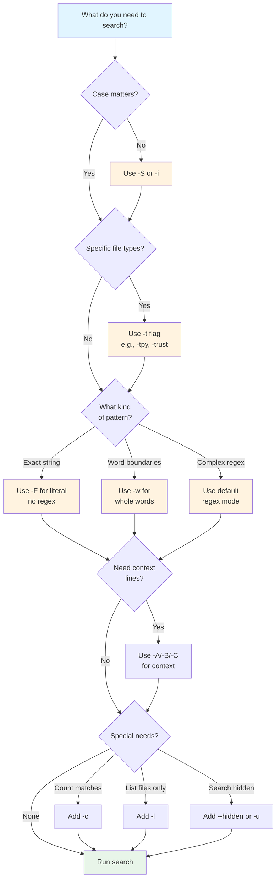

# Quick Reference

## Quick Reference

Here are the most essential flags for daily use:



**Figure**: Decision flowchart for selecting ripgrep flags based on your search requirements.

!!! tip "Pro Tip"
    Use `-S` (smart case) for flexible searching - it's case-insensitive unless you include uppercase letters. Combine with `-w` for precise whole-word matches.

| Flag | Purpose | Example |
|------|---------|---------|
| `-i` | Case-insensitive search | `rg -i error` |
| `-S` | Smart case (insensitive unless uppercase) | `rg -S Error` |
| `-w` | Match whole words only | `rg -w test` |
| `-F` | Literal string (not regex) | `rg -F '(.*)'` |
| `-v` | Invert match (non-matching lines) | `rg -v TODO` |
| `-c` | Count matches per file | `rg -c pattern` |
| `-l` | List files with matches | `rg -l pattern` |
| `-o` | Show only matched part | `rg -o '\w+@\w+'` |
| `-e` | Multiple patterns | `rg -e foo -e bar` |
| `-f` | Patterns from file | `rg -f patterns.txt` |
| `-A/-B/-C` | Show N lines after/before/around matches | `rg -C 3 pattern` |
| `-t` | Filter by file type | `rg -trust pattern` |
| `-g` | Filter by glob pattern | `rg -g '*.rs' pattern` |
| `-u/-uu/-uuu` | Search ignored/hidden/binary files (levels) | `rg -uuu pattern` |
| `--hidden` | Search hidden files | `rg --hidden pattern` |
| `--files` | List files that would be searched | `rg --files` |
| `--stats` | Show search statistics | `rg --stats pattern` |
| `--json` | Output results in JSON format | `rg --json pattern` |
| `--vimgrep` | Output in vim quickfix format | `rg --vimgrep pattern` |
| `--hyperlink-format` | Enable terminal hyperlinks to files | `rg --hyperlink-format default pattern` |

!!! warning "Performance Note"
    The `-uuu` flag searches everything including binary files, which is significantly slower. Use `-u` (ignores .gitignore) or `-uu` (+ hidden files) for better performance unless you specifically need to search binary files.

!!! note "Smart Case Behavior"
    `-S` (smart case) automatically becomes case-sensitive when your pattern contains uppercase letters. For example, `rg -S error` matches "error", "Error", "ERROR", but `rg -S Error` only matches "Error".

!!! tip "Editor Integration"
    For editor/IDE integration, combine `--vimgrep` (vim quickfix format) and `--hyperlink-format` (clickable file links):

    ```bash
    # Source: crates/core/flags/defs.rs (Vimgrep and HyperlinkFormat flags)
    rg --vimgrep --hyperlink-format default 'pattern'
    ```

    This produces output that's easy to parse by editors and includes clickable hyperlinks in supported terminals.

## Combining Flags

Many flags work well together:

!!! example "Common Combinations"
    These examples show how to combine flags for real-world search tasks:

    === "Search by File Type"
        ```bash
        # Smart case search in Python files with context
        # Source: tests/feature.rs (f70_smart_case test)
        rg -S -tpy -C 2 'Database'  # (1)!

        # Count TODOs in Rust files, including ignored files
        rg -c -trust -u 'TODO'      # (2)!
        ```

        1. `-S` (smart case) + `-tpy` (Python files) + `-C 2` (2 lines context before/after)
        2. `-c` (count) + `-trust` (Rust files) + `-u` (include .gitignore'd files)

    === "Pattern Matching"
        ```bash
        # Multiple patterns: find either foo or bar
        # Source: tests/feature.rs (multiple -e flags test)
        rg -e foo -e bar            # (1)!

        # Show only the matched email addresses, not full lines
        # Source: tests/multiline.rs (only-matching test)
        rg -o '\w+@\w+\.\w+'        # (2)!
        ```

        1. Multiple `-e` flags create an OR condition (matches either pattern)
        2. `-o` extracts only the matching part, not the entire line

    === "File Filtering"
        ```bash
        # List JavaScript files containing "deprecated", exclude minified files
        rg -l -tjs -g '!*.min.js' 'deprecated'  # (1)!

        # Get detailed statistics about your search
        # Source: tests/feature.rs (f411_single_threaded_search_stats test)
        rg --stats 'pattern' | tail -10         # (2)!
        ```

        1. `-l` (list files) + `-tjs` (JavaScript) + `-g '!'` (glob exclusion)
        2. `--stats` provides detailed performance metrics (files searched, matches, time)

## Comparison with grep

If you're coming from `grep`, here are some equivalents:

!!! note "Key Differences from grep"
    Ripgrep is recursive by default, respects `.gitignore` automatically, shows colors and line numbers by default, and is optimized for speed. Use `-u` to search ignored files or `--no-ignore` to disable `.gitignore` handling.

| grep | ripgrep | Notes |
|------|---------|-------|
| `grep -r` | `rg` | Recursive by default |
| `grep -i` | `rg -i` | Case-insensitive |
| `grep -n` | `rg -n` | Line numbers (default in rg) |
| `grep -v` | `rg -v` | Invert match |
| `grep -c` | `rg -c` | Count matches |
| `grep -l` | `rg -l` | List files with matches |
| `grep -w` | `rg -w` | Word boundaries |
| `grep -F` | `rg -F` | Fixed strings (literal) |
| `grep -A/-B/-C` | `rg -A/-B/-C` | Context lines |

Ripgrep respects `.gitignore` by default (use `-u` to disable), shows colors automatically, and is generally faster.
