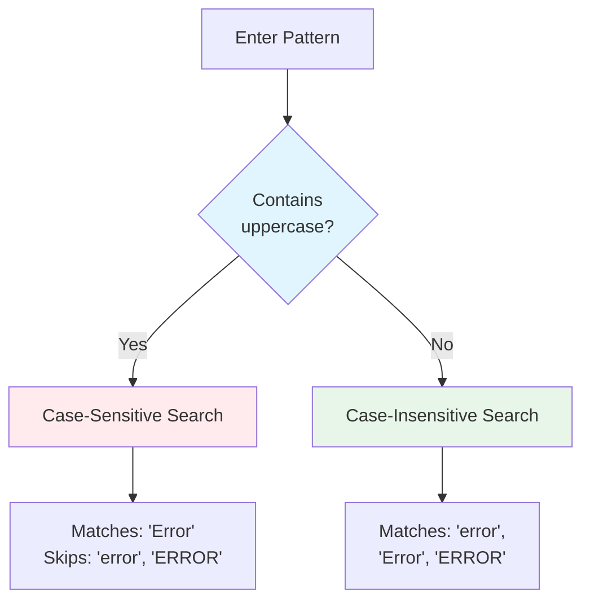
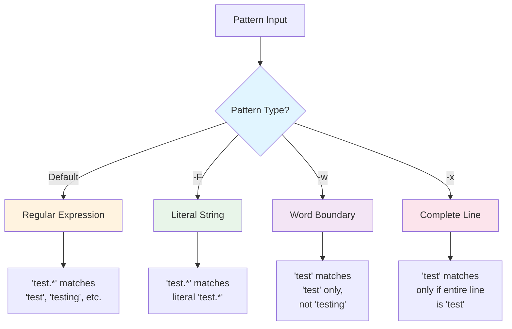
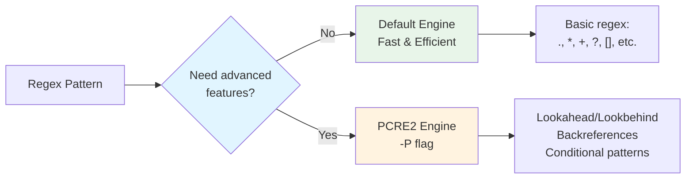

# Search Basics

These flags control how patterns are interpreted and matched against text.

## Case Sensitivity

By default, ripgrep uses **smart case**: if your pattern is all lowercase, the search is case-insensitive; if it contains any uppercase letters, the search becomes case-sensitive.



**Figure**: Smart case behavior - pattern case determines match sensitivity.

!!! tip "Smart Case Default Behavior"
    Ripgrep's smart case is usually what you want: `rg error` finds all variations, while `rg Error` finds only the capitalized form. Override with `-i` (always ignore case) or `-s` (always match case) when needed.

- **`-i, --ignore-case`**: Force case-insensitive search regardless of pattern
  ```bash
  # Find "error", "ERROR", "Error", etc.
  rg -i error
  ```
  Useful when searching prose or when you want to catch all case variations.

- **`-s, --case-sensitive`**: Force case-sensitive search
  ```bash
  # Only find exact case match "Error"
  rg -s Error
  ```
  Useful when searching code where case matters (e.g., distinguishing `Error` from `error`).

- **`-S, --smart-case`**: Enable smart case (the default)
  ```bash
  rg -S pattern  # Lowercase pattern → case-insensitive
  rg -S Pattern  # Uppercase present → case-sensitive
  ```

## Pattern Types

By default, ripgrep treats patterns as regular expressions. These flags change that behavior:



**Figure**: Pattern type selection determines how ripgrep interprets your search pattern.

- **`-F, --fixed-strings`**: Treat pattern as a literal string, not a regex
  ```bash
  # Find literal text "(.*)" without regex interpretation
  rg -F '(.*)'
  ```

  !!! tip "When to Use Fixed Strings"
      Use `-F` when searching for code snippets or text containing regex metacharacters like `.*`, `[]`, `()`, `{}`, `$`, `^`. This avoids regex syntax errors and matches exactly what you type.

- **`-w, --word-regexp`**: Only match whole words
  ```bash
  # Find "test" as a word, not "testing" or "attest"
  rg -w test
  ```
  Uses word boundaries to ensure the pattern isn't part of a larger word.

- **`-x, --line-regexp`**: Only match complete lines
  ```bash
  # Find lines that contain exactly "import sys"
  rg -x 'import sys'
  ```

## Multiline Matching

By default, patterns match within single lines. For patterns that span multiple lines:

- **`-U, --multiline`**: Enable multiline mode where patterns can match across line boundaries
  ```bash
  # Match function definitions spanning multiple lines
  rg -U 'fn \w+\([^)]*\)\s*->'

  # Find multi-line comments
  rg -U '/\*.*?\*/'
  ```

- **`--multiline-dotall`**: Make `.` match newlines in multiline mode
  ```bash
  # Match struct definitions with any content between braces
  rg -U --multiline-dotall 'struct \w+ \{.*?\}'
  ```

  !!! warning "Multiline Gotcha: Dot Behavior"
      In multiline mode (`-U`), the `.` metacharacter **still doesn't match newlines** by default. You must add `--multiline-dotall` to make `.` match `\n`. Without it, `.*` stops at line boundaries even in multiline mode.

## Regex Engine Selection

Ripgrep uses Rust's regex engine by default, which is very fast. For advanced regex features, you can switch to the PCRE2 engine:



**Figure**: Regex engine selection - use PCRE2 only when you need advanced features.

- **`-P, --pcre2`**: Use PCRE2 engine for advanced features like lookahead/lookbehind and backreferences
  ```bash
  # Lookahead: find "foo" only if followed by "bar"
  rg -P 'foo(?=bar)'

  # Lookbehind: find "bar" only if preceded by "foo"
  rg -P '(?<=foo)bar'

  # Backreferences: find repeated words
  rg -P '(\w+)\s+\1'
  ```

  !!! warning "PCRE2 Performance Impact"
      PCRE2 is **significantly slower** than the default Rust regex engine. Only use `-P` when you genuinely need lookahead, lookbehind, or backreferences. For simple patterns, the default engine is much faster.

  See the [Regular Expressions](../basics/regex-basics.md) chapter for detailed regex syntax and PCRE2 features.

- **`--engine ENGINE`**: Explicitly choose regex engine
  ```bash
  # Force PCRE2 engine
  rg --engine pcre2 'pattern'

  # Force default Rust regex
  rg --engine default 'pattern'

  # Auto-select based on pattern (default)
  rg --engine auto 'pattern'
  ```

## Invert Match

- **`-v, --invert-match`**: Show lines that DON'T match the pattern
  ```bash
  # Show all lines except comments
  rg -v '^#'

  # Find files without TODOs
  rg -v TODO
  ```
  Useful for filtering out noise or finding the absence of something.

## Multiple Patterns

- **`-e, --regexp PATTERN`**: Specify multiple patterns (match any)
  ```bash
  # Find lines with "error" OR "warning"
  rg -e error -e warning
  ```

- **`-f, --file FILE`**: Read patterns from a file (one per line)
  ```bash
  # Search for all patterns listed in patterns.txt
  rg -f patterns.txt
  ```

!!! example "Combining Multiple Patterns"
    Use `-e` for OR logic (match any pattern):
    ```bash
    # Find any severity level
    rg -e ERROR -e WARNING -e INFO

    # Search for multiple function names
    rg -e 'fn initialize' -e 'fn setup' -e 'fn configure'
    ```

    For complex pattern lists, use `-f` with a file:
    ```bash
    # patterns.txt
    TODO
    FIXME
    HACK
    XXX

    # Find all code annotations
    rg -f patterns.txt
    ```
