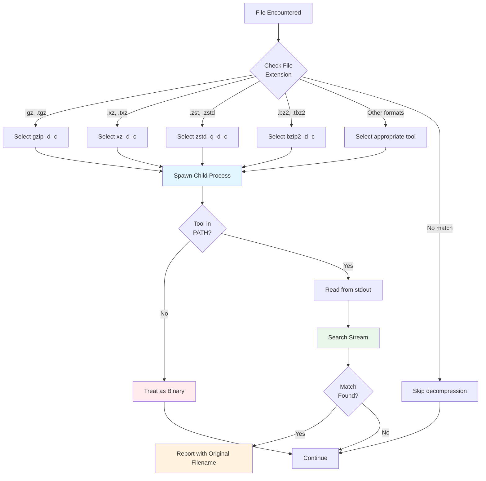

# Compressed Files

ripgrep provides built-in support for searching compressed files through the `-z/--search-zip` flag, automatically decompressing content on-the-fly without requiring manual extraction.

## Overview

The `-z` or `--search-zip` flag enables ripgrep to transparently search inside compressed files across eight different compression formats. When enabled, ripgrep automatically detects the compression format based on file extension and uses the appropriate external decompression tool during search.

This feature differs from the custom `--pre` preprocessor in that it uses built-in rules for common compression formats and integrates seamlessly with ripgrep's parallel search capabilities.

## Supported Compression Formats

ripgrep's `-z` flag supports the following compression formats:

| Format | Extensions | External Tool | Description |
|--------|-----------|---------------|-------------|
| **Brotli** | `.br` | `brotli` | Modern compression algorithm with high compression ratios |
| **Bzip2** | `.bz2`, `.tbz2` | `bzip2` | Block-sorting compression, good for text |
| **Gzip** | `.gz`, `.tgz` | `gzip` | Widely used compression, fast decompression |
| **LZ4** | `.lz4` | `lz4` | Extremely fast compression and decompression |
| **LZMA** | `.lzma` | `xz` | High compression ratio, slower than others |
| **XZ** | `.xz`, `.txz` | `xz` | LZMA-based with additional features |
| **Zstandard** | `.zst`, `.zstd` | `zstd` | Modern algorithm balancing speed and compression ratio |
| **Compress** | `.Z` | `uncompress` | Legacy Unix compress format |

!!! note "External Dependencies Required"
    The external decompression tools must be available in your system's PATH for the corresponding formats to work. See the [External Dependencies](#external-dependencies) section for installation instructions.

## Basic Usage

### Searching Compressed Files

Enable compressed file search with the `-z` flag:

```bash
# Search all files including compressed ones
rg -z 'pattern'

# Long form
rg --search-zip 'pattern'
```

### Examples

Search log files compressed with gzip:

```bash
rg -z 'error' logs/
```

Search through compressed source code archives:

```bash
rg -z 'function calculateTotal' release.tar.gz
```

Find patterns in bzip2-compressed data:

```bash
rg -z 'TODO' backup.tar.bz2
```

## How It Works

### Automatic Format Detection

ripgrep detects the compression format based on file extension:

1. Checks file extension against known compression formats (using glob patterns)
2. Selects the appropriate external decompression command (`gzip -d -c`, `xz -d -c`, etc.)
3. Spawns the decompression command as a child process
4. Reads decompressed content from the command's stdout
5. Searches the decompressed stream
6. Reports matches with the original compressed filename



**Figure**: Decompression workflow showing format detection, tool selection, and fallback behavior.

!!! info "Implementation Details"
    Format detection is implemented in `crates/cli/src/decompress.rs:490-531`. Each compression format is mapped to its file extensions and decompression command. For example:

    ```rust
    // Source: crates/cli/src/decompress.rs:491-498
    const ARGS_GZIP: &[&str] = &["gzip", "-d", "-c"];
    const ARGS_BZIP: &[&str] = &["bzip2", "-d", "-c"];
    const ARGS_XZ: &[&str] = &["xz", "-d", "-c"];
    const ARGS_LZ4: &[&str] = &["lz4", "-d", "-c"];
    const ARGS_LZMA: &[&str] = &["xz", "--format=lzma", "-d", "-c"];
    const ARGS_BROTLI: &[&str] = &["brotli", "-d", "-c"];
    const ARGS_ZSTD: &[&str] = &["zstd", "-q", "-d", "-c"];
    const ARGS_UNCOMPRESS: &[&str] = &["uncompress", "-c"];
    ```

### Out-of-Process Decompression

Decompression happens in separate child processes using external tools to:

- Isolate decompression failures (corrupted files won't crash ripgrep)
- Enable parallel decompression across multiple files
- Leverage optimized native decompression tools
- Handle missing decompression tools gracefully (falls back to treating as binary)
- Avoid security issues on Windows by resolving commands via PATH

!!! tip "Debugging Missing Tools"
    If a decompression tool is not available in PATH, ripgrep will fall back to reading the file without decompression and log a debug message. Enable debug logging with `RUST_LOG=debug rg -z 'pattern'` to see which tools are missing.

## Combining with Other Flags

### With File Type Filtering

Combine compression support with file type filtering:

!!! tip "Reduce Decompression Overhead"
    Use file type filtering (`-t`) to avoid decompressing files you don't need to search, significantly improving performance when working with mixed-content archives.

```bash
# Search only Rust files in compressed archives
rg -z -t rust 'pattern'                    # (1)!

# Search Python files in gzipped logs
rg -z -t py 'import' logs.tar.gz           # (2)!
```

1. Only decompresses files matching Rust file patterns (*.rs), skipping other files entirely
2. Combines format detection with type filtering for targeted searches

### With Context Lines

Add context around matches in compressed files:

```bash
# Show 3 lines of context in compressed logs
rg -z -C 3 'ERROR' logs.gz
```

### With Output Formatting

Use JSON output for compressed file matches:

```bash
# JSON output for scripting
rg -z --json 'pattern' archive.tar.xz
```

## Performance Considerations

!!! warning "Decompression Overhead"
    Each compressed file requires spawning a decompression process, which adds CPU overhead compared to plain text search. Parallel processing helps amortize decompression costs, but for frequently searched archives, consider extracting them once rather than decompressing repeatedly.

### Decompression Overhead

- Each compressed file requires spawning a decompression process
- Decompression adds CPU overhead compared to plain text search
- Parallel processing helps amortize decompression costs

### Optimization Tips

1. **Use file type filtering** to avoid decompressing unnecessary files
2. **Limit search scope** with glob patterns or directory restrictions
3. **Consider extracting** archives if searching repeatedly
4. **Use faster formats** like LZ4 or Zstandard when possible

### Benchmarking

Compare search performance with and without compression:

```bash
# Compressed search
time rg -z 'pattern' archive.tar.gz

# Extracted search (for comparison)
tar xzf archive.tar.gz
time rg 'pattern' extracted/
```

## External Dependencies

The `-z/--search-zip` feature requires external decompression tools to be installed and available in your system's PATH.

!!! note "Pre-installed Tools"
    `gzip` is usually pre-installed on Unix-like systems (Linux, macOS). Other tools must be installed separately.

### Installing Decompression Tools

=== "Debian/Ubuntu"
    ```bash
    # Install all common compression tools
    sudo apt update
    sudo apt install bzip2 xz-utils liblz4-tool brotli zstd ncompress

    # Or install individually
    sudo apt install bzip2        # .bz2 files
    sudo apt install xz-utils     # .xz, .lzma files
    sudo apt install liblz4-tool  # .lz4 files
    sudo apt install brotli       # .br files
    sudo apt install zstd         # .zst files
    sudo apt install ncompress    # .Z files
    ```

=== "macOS (Homebrew)"
    ```bash
    # Install all common compression tools
    brew install bzip2 xz lz4 brotli zstd ncompress

    # Or install individually
    brew install bzip2    # .bz2 files
    brew install xz       # .xz, .lzma files
    brew install lz4      # .lz4 files
    brew install brotli   # .br files
    brew install zstd     # .zst files
    brew install ncompress # .Z files
    ```

=== "Fedora/RHEL"
    ```bash
    # Install all common compression tools
    sudo dnf install bzip2 xz lz4 brotli zstd ncompress

    # Or install individually
    sudo dnf install bzip2    # .bz2 files
    sudo dnf install xz       # .xz, .lzma files
    sudo dnf install lz4      # .lz4 files
    sudo dnf install brotli   # .br files
    sudo dnf install zstd     # .zst files
    sudo dnf install ncompress # .Z files
    ```

=== "Arch Linux"
    ```bash
    # Install all common compression tools
    sudo pacman -S bzip2 xz lz4 brotli zstd ncompress

    # Or install individually
    sudo pacman -S bzip2      # .bz2 files
    sudo pacman -S xz         # .xz, .lzma files
    sudo pacman -S lz4        # .lz4 files
    sudo pacman -S brotli     # .br files
    sudo pacman -S zstd       # .zst files
    sudo pacman -S ncompress  # .Z files
    ```

### Verifying Installation

Check which decompression tools are available:

```bash
# Check all tools at once
for tool in gzip bzip2 xz lz4 brotli zstd uncompress; do
    which $tool >/dev/null 2>&1 && echo "✓ $tool" || echo "✗ $tool"
done
```

If a required tool is missing, ripgrep will skip decompression for that file and treat it as binary data.

## Comparison with Preprocessor

ripgrep offers two ways to handle special file formats:

| Feature | `-z/--search-zip` | `--pre` |
|---------|-------------------|---------|
| **Setup** | Built-in glob patterns | Requires custom script |
| **Dependencies** | External decompression tools | Any tools your script needs |
| **Performance** | Process per file | Process per file |
| **Formats** | 8 compression formats | Any format with conversion tool |
| **Flexibility** | Fixed format support | Unlimited extensibility |
| **Use case** | Standard compressed files | Custom formats (PDF, Office, etc.) |

### When to Use Each

!!! tip "Quick Decision Guide"
    Use `-z` for standard compressed files (gzip, xz, zstd, etc.). Use `--pre` for custom formats (PDF, Office docs) or when you need preprocessing logic beyond simple decompression.

**Use `-z/--search-zip` for:**
- Standard compressed archives (`.gz`, `.xz`, `.zst`, etc.)
- Built-in glob pattern matching
- Systems where decompression tools are already installed

**Use `--pre` for:**
- Custom file formats (PDF, Word documents, etc.)
- Encryption/decryption workflows
- Format conversions not supported by `-z`
- When you need custom preprocessing logic

### Combining Both

You can use both flags together:

```bash
# Search compressed PDFs with custom preprocessor
rg -z --pre ./pdf-preprocessor --pre-glob '*.pdf' 'pattern'
```

## Examples

### Example 1: Searching Compressed Logs

```bash
# Find errors in rotated gzip logs
rg -z 'ERROR|FATAL' /var/log/*.gz
```

### Example 2: Searching Tarballs

```bash
# Search through compressed source archives
rg -z 'vulnerability' releases/*.tar.xz
```

### Example 3: Multiple Compression Formats

```bash
# Search across different compression formats
rg -z 'config' backups/
```

### Example 4: With File Type and Context

```bash
# Search Rust code in compressed archives with context
rg -z -t rust -C 5 'unsafe' archive.tar.gz
```

## Troubleshooting

### Compressed File Not Searched

**Issue**: Compressed file is skipped

**Solutions**:
- Verify file has correct extension (`.gz`, `.xz`, etc.)
- Check that `-z` flag is enabled
- Ensure file is actually compressed (use `file` command)
- Verify the required decompression tool is in PATH (e.g., `which gzip`)

### Missing Decompression Tool

**Issue**: File treated as binary instead of being decompressed

!!! tip "Quick Diagnosis"
    Enable debug logging to see exactly which tools ripgrep is looking for: `RUST_LOG=debug rg -z 'pattern'`

**Solutions**:
- Check if the tool is installed: `which gzip` / `which xz` / `which zstd`
- Install the missing tool (see External Dependencies section)
- Enable debug logging to see which tools are missing: `RUST_LOG=debug rg -z 'pattern'`

### Decompression Errors

**Issue**: Errors about decompression failures

**Solutions**:
- Verify archive is not corrupted (test with native tool: `gzip -t file.gz`)
- Check that compression format matches extension
- Try decompressing manually to validate: `gzip -dc file.gz | less`
- Check stderr output from the decompression process

### Performance Issues

**Issue**: Search is very slow with `-z`

**Solutions**:
- Use file type filtering to reduce files being decompressed
- Consider extracting archives for repeated searches
- Check if archives are unusually large
- Use faster compression formats (LZ4, Zstandard) for new archives

## Best Practices

!!! tip "Performance Best Practices"
    - Enable `-z` only when needed (adds overhead to every file)
    - Use `-t` type filtering to skip irrelevant files
    - For frequently searched archives, extract once rather than decompressing repeatedly
    - Prefer faster compression formats (LZ4, Zstandard) for new archives

Additional recommendations:
- Combine with glob patterns to target specific compressed files
- Monitor decompression overhead with `--stats` flag
- Verify tools are installed before running searches on shared systems

## See Also

- [Preprocessor](preprocessor.md) - Custom file preprocessing for other formats
- [Performance](performance.md) - Performance tuning and optimization
