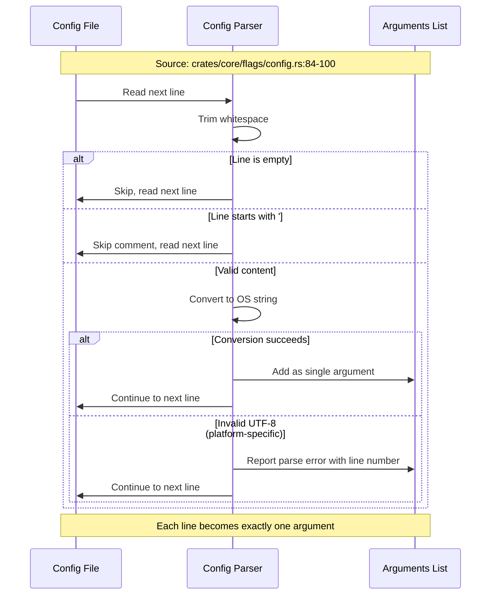
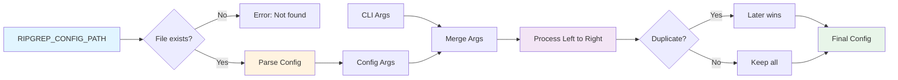
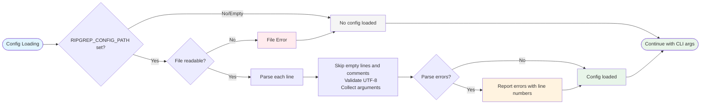

# Configuration File

ripgrep supports configuration files to set default options for all searches. This is useful when shell aliases aren't convenient, for complex multi-flag configurations, or when you want consistent behavior across different shells and environments.

> **Quick Reference:** See the [FAQ entry on configuration files](https://github.com/BurntSushi/ripgrep/blob/master/FAQ.md#config) for common questions.

## Setting Up a Configuration File

ripgrep **does not** automatically look for configuration files in predetermined locations. Instead, you must explicitly tell ripgrep where to find your configuration file using the `RIPGREP_CONFIG_PATH` environment variable.

### Environment Variable Setup

Set the `RIPGREP_CONFIG_PATH` environment variable to the path of your configuration file:

=== "Linux/macOS"
    ```bash
    # In your shell configuration (.bashrc, .zshrc, etc.)
    export RIPGREP_CONFIG_PATH="$HOME/.ripgreprc"
    ```

=== "Windows (PowerShell)"
    ```powershell
    # In your PowerShell profile
    $env:RIPGREP_CONFIG_PATH = "$HOME\.ripgreprc"
    ```

=== "Windows (Command Prompt)"
    ```cmd
    # Set permanently via System Properties → Environment Variables
    setx RIPGREP_CONFIG_PATH "%USERPROFILE%\.ripgreprc"
    ```

!!! note "Important Notes"
    - If `RIPGREP_CONFIG_PATH` is not set, ripgrep will not load any configuration file
    - Setting `RIPGREP_CONFIG_PATH` to an empty value disables configuration file loading
    - The file path can be absolute or relative to your current directory
    - Windows users should use appropriate path syntax (e.g., `C:\Users\username\.ripgreprc`)

## Configuration File Format

The configuration file format is simple with only two rules:

1. **Every line is a shell argument**, after trimming whitespace
2. **Lines starting with `#`** (optionally preceded by whitespace) are comments

!!! tip "Key Points"
    - Each line is treated as a single command-line argument verbatim
    - No escaping is supported
    - Empty lines are allowed and ignored
    - Comments help document your configuration choices

### Line-by-Line Parsing Process

ripgrep processes each line in your configuration file using this algorithm:



**Figure**: The line-by-line parsing algorithm showing how ripgrep processes configuration files. After trimming whitespace, empty lines and comments are skipped, while valid content becomes a single command-line argument.

### Example Configuration File

Here's a comprehensive example showing common configuration patterns:

```conf title=".ripgreprc"
# Don't let ripgrep vomit really long lines to my terminal, and show a preview.
--max-columns=150            # (1)!
--max-columns-preview        # (2)!

# Add my 'web' type.
--type-add                   # (3)!
web:*.{html,css,js}*

# Search hidden files / directories (e.g. dotfiles) by default
--hidden                     # (4)!

# Using glob patterns to include/exclude files or folders
--glob=!.git/*               # (5)!

# or
--glob
!.git/*

# Set the colors.
--colors=line:none           # (6)!
--colors=line:style:bold

# Because who cares about case!?
--smart-case                 # (7)!
```

1. Limits output line length to 150 characters for terminal readability
2. Shows a preview of content beyond the column limit
3. Defines a custom file type 'web' for HTML, CSS, and JavaScript files
4. Includes hidden files (dotfiles) in searches by default
5. Excludes .git directories from search results
6. Customizes color output for better visibility
7. Case-insensitive search unless pattern contains uppercase letters

## Formatting Flags with Values

There are two valid ways to format flags that take values:

### Option 1: Using `=` on One Line

```conf
--max-columns=150
--type-add=web:*.{html,css,js}*
```

### Option 2: Flag and Value on Separate Lines

```conf
--max-columns
150

--type-add
web:*.{html,css,js}*
```

Both formats are exactly equivalent and are a matter of personal style preference.

!!! warning "Why You Can't Use Spaces on One Line"
    If you write `--max-columns 150` on one line in the config file, ripgrep's argument parser sees `"--max-columns 150"` as a single argument (because each line is one argument). The parser doesn't know this is supposed to be a flag with a value. Using `=` or separate lines solves this problem.

## Flag Precedence and Overriding

Configuration file arguments are **prepended** to your command-line arguments. This means:

- Config file settings are processed first
- Command-line flags are processed second
- **Later flags override earlier flags**



**Figure**: Configuration resolution showing how config file arguments are prepended to command-line arguments, with later flags overriding earlier ones.

### Example: Overriding Config Settings

If your config file contains:

```conf
--max-columns=150
```

But you want unlimited columns for a specific search:

```bash
rg pattern --max-columns=0
# or the short form:
rg pattern -M0
```

The command-line `--max-columns=0` overrides the config file's `--max-columns=150`, giving you unlimited columns for that search.

This override behavior works for most flags. Check each flag's documentation to see which other flags override it.

## Disabling Configuration Files

Sometimes you need to ensure ripgrep runs without any configuration file influence:

```bash
rg pattern --no-config
```

The `--no-config` flag:

- Prevents reading any configuration file
- Ignores the `RIPGREP_CONFIG_PATH` environment variable
- Will disable any future auto-discovery features if added to ripgrep
- Useful for ensuring clean, predictable behavior in scripts

## Debugging Configuration Files

If you're unsure what configuration file ripgrep is reading or what arguments it's parsing:

```bash
rg pattern --debug
```

The `--debug` flag shows:

- Which configuration file was loaded (if any)
- What arguments were read from the configuration file
- Other diagnostic information about ripgrep's behavior

### Common Troubleshooting Steps

1. **Check environment variable**: `echo $RIPGREP_CONFIG_PATH`
2. **Verify file exists**: `ls -l "$RIPGREP_CONFIG_PATH"`
3. **Check file is readable**: Ensure proper file permissions
4. **Use `--debug`**: See exactly what arguments ripgrep parsed from your config
5. **Test with `--no-config`**: Verify behavior without config file

## Error Handling

ripgrep handles configuration file errors as follows:



**Figure**: Error handling flow showing how ripgrep processes configuration file errors. File read errors prevent all config loading, while parse errors are reported with line numbers but don't stop processing. Source: `crates/core/flags/config.rs:26-40,84-100`

### File Read Errors

- If the config file specified in `RIPGREP_CONFIG_PATH` doesn't exist or isn't readable, ripgrep will report an error and not load any configuration
- File permission errors prevent all config loading

### Parse Errors

- Invalid arguments on individual lines are reported with line numbers
- ripgrep continues parsing the rest of the file after encountering errors
- You'll see which specific lines caused problems

### Platform-Specific Behavior

- **Invalid UTF-8**:
  - Unix-like systems: Generally allow non-UTF-8 content
  - Windows: May reject files with invalid UTF-8 encoding

## Use Cases and Best Practices

### When to Use Configuration Files

- **Cross-shell consistency**: Same settings in bash, zsh, fish, etc.
- **Complex configurations**: Multiple flags that are tedious to type or maintain as aliases
- **Project-specific defaults**: Different configs for different projects (using different `RIPGREP_CONFIG_PATH` values)
- **Shared team settings**: Commit a ripgrep config to your repository and document how to use it

### Configuration Recommendations

- **Document your choices**: Use comments to explain why each setting exists
- **Start simple**: Begin with a few commonly-used flags
- **Test incrementally**: Add flags one at a time and verify behavior
- **Consider impact**: Remember that your config affects **all** ripgrep invocations
- **Know your overrides**: Understand which command-line flags override config settings

!!! tip "Testing Your Configuration"
    After creating or modifying your config file:

    1. Use `rg --debug pattern` to see what arguments were loaded
    2. Test with a simple search to verify expected behavior
    3. Use `rg pattern --no-config` to compare behavior without config
    4. Add flags incrementally - don't copy large configs without understanding each option

### Example Project-Specific Setup

You might use different configurations for different projects:

```bash
# In project A's documentation
export RIPGREP_CONFIG_PATH="$HOME/.ripgreprc-project-a"

# In project B's documentation
export RIPGREP_CONFIG_PATH="$HOME/.ripgreprc-project-b"
```

## Common Configuration Patterns

!!! example "Common Patterns"
    These patterns show popular configuration combinations for different use cases.

### Pattern 1: Readable Output

```conf
# Limit column width for terminal readability
--max-columns=150
--max-columns-preview

# Add context lines
--context=2
```

### Pattern 2: Include Hidden Files

```conf
# Search hidden files and directories
--hidden

# But exclude .git
--glob=!.git/*
```

### Pattern 3: Custom File Types

```conf
# Add custom file type for web development
--type-add
web:*.{html,css,js,jsx,ts,tsx}*

# Add custom type for configuration files
--type-add
config:*.{json,yaml,yml,toml,ini}*
```

### Pattern 4: Color Customization

```conf
# Custom color scheme
--colors=match:fg:red
--colors=match:style:bold
--colors=path:fg:blue
--colors=line:fg:yellow
```

### Pattern 5: Smart Searching

```conf
# Case-insensitive unless pattern has uppercase
--smart-case

# Follow symbolic links
--follow

# Sort results by file path
--sort=path
```

## See Also

- [File Type Filtering](./manual-filtering-types.md) - for `--type-add` patterns
- [Globbing Patterns](./manual-filtering-globs.md) - for `--glob` patterns
- [GUIDE.md Configuration Section](https://github.com/BurntSushi/ripgrep/blob/master/GUIDE.md#configuration-file) - original comprehensive guide
