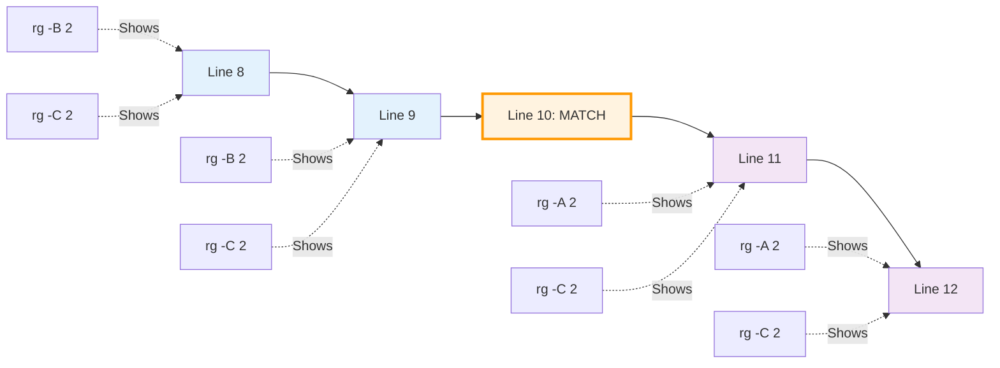
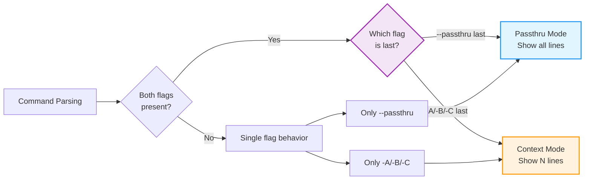
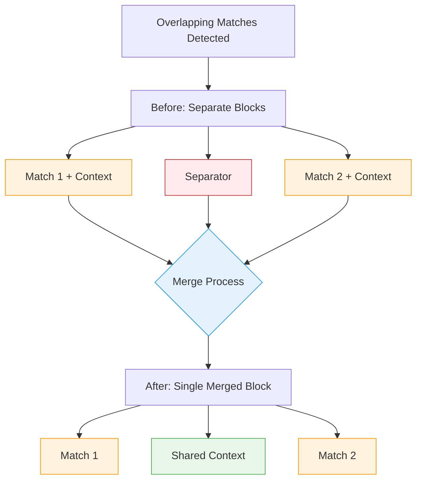

# Context Lines

When searching for patterns, it's often helpful to see the lines surrounding each match to understand the context. ripgrep provides powerful options for displaying context lines before and after matches.

## Overview

Context lines help you understand the surrounding code or text when a pattern matches. This is particularly useful when debugging, code review, or understanding how a term is used in context.

## Basic Context Options

ripgrep provides three main flags for controlling context:

```bash
# Show 2 lines after each match
rg -A 2 pattern

# Show 2 lines before each match
rg -B 2 pattern

# Show 2 lines before and after each match
rg -C 2 pattern
```



**Figure**: Context flag visualization showing which lines are displayed relative to the matching line.

!!! note
    Context values can be very large (up to the maximum value supported by your system) for edge cases where you need extensive surrounding context. However, typical usage is 2-10 lines.

## After Context

Display lines after each match:

```bash
# Long form
rg --after-context 3 pattern

# Short form
rg -A 3 pattern
```

This is useful when:
- Reading function implementations
- Understanding the effect of a statement
- Seeing what happens after an error message

## Before Context

Display lines before each match:

```bash
# Long form
rg --before-context 3 pattern

# Short form
rg -B 3 pattern
```

This is useful when:
- Finding what leads to a match
- Understanding variable declarations
- Seeing setup code before execution

## Symmetric Context

Display the same number of lines before and after:

```bash
# Long form
rg --context 3 pattern

# Short form
rg -C 3 pattern
```

This is equivalent to `-A 3 -B 3` and provides balanced context.

## Context Separators

By default, ripgrep separates groups of matches with `--`:

```
file1.txt:10:matching line
file1.txt-11-context line after
file1.txt-12-context line after
--
file1.txt:20:another matching line
file1.txt-21-context line after
```

### Customizing Separators

Change the separator between match groups:

```bash
# Use custom separator
rg -C 2 --context-separator '=====' pattern

# Use empty separator (still shows line breaks)
rg -C 2 --context-separator '' pattern

# Use escape sequences
rg -C 2 --context-separator '\t===\t' pattern
```

### Disabling Separators Completely

To remove all separation between match groups (including line breaks):

```bash
# Completely disable context separators
rg -C 2 --no-context-separator pattern
```

!!! tip "Visual Difference"
    The distinction between empty separator and `--no-context-separator`:

    === "Empty separator: `--context-separator ''`"
        ```
        file.txt:10:first match
        file.txt-11-context line
        file.txt-12-context line

        file.txt:20:second match
        file.txt-21-context line
        ```
        *Note the blank line between match groups*

    === "No separator: `--no-context-separator`"
        ```
        file.txt:10:first match
        file.txt-11-context line
        file.txt-12-context line
        file.txt:20:second match
        file.txt-21-context line
        ```
        *No blank line - output flows continuously*

    **Summary:**

    - `--context-separator ''` removes the `--` separator but keeps a blank line between groups
    - `--no-context-separator` removes all separation, making match groups flow continuously

## Line Number Display

Context lines are marked differently from matching lines:

- Matching lines use `:` after line number: `file.txt:42:match`
- Context lines use `-` after line number: `file.txt-43-context`

```bash
# With line numbers (often default)
rg -n -C 2 pattern

# Without line numbers
rg -N -C 2 pattern
```

### Customizing Field Separators

The separator between line numbers and content can be customized:

```bash
# Change context line field separator (default is '-')
rg -C 2 --field-context-separator '|' pattern  # (1)!

# Change match line field separator (default is ':')
rg -C 2 --field-match-separator '::' pattern  # (2)!

# Combine both for custom formatting
rg -C 2 --field-context-separator ' | ' --field-match-separator ' > ' pattern  # (3)!
```

1. Changes the separator after line numbers for context lines (non-matching lines)
2. Changes the separator after line numbers for matching lines
3. Combines both customizations for consistent formatting across all output

This produces output like:
```
file.txt 42 > matching line
file.txt 43 | context line after
```

!!! example "Escape Sequences"
    Field separators support escape sequences for special characters:

    ```bash
    # Use tab separator for easier parsing
    rg --field-match-separator '\t' pattern

    # Use null byte separator (useful for machine parsing)
    rg --field-match-separator '\x00' pattern

    # Use hex escapes for non-printable characters
    rg --field-context-separator '\xFF' pattern
    ```

    Common escape sequences: `\t` (tab), `\n` (newline), `\r` (carriage return), `\x00` (null byte), `\xFF` (hex byte).

## Combining with Other Options

### Context with Multiple Patterns

```bash
# Show context for any match
rg -C 2 -e pattern1 -e pattern2
```

### Context with File Filtering

```bash
# Show context only in Python files
rg -C 3 -tpy 'def '
```

### Context with Replacements

```bash
# Show context with replacement preview
rg -C 2 -r 'new_value' 'old_value'
```

### Context vs Passthru

The `--passthru` flag shows ALL lines from files that contain matches, not just context around matches:

```bash
# Show all lines from files with matches
rg --passthru pattern

# Flag ordering determines behavior - last flag wins
rg --passthru -C 2 pattern  # Context mode: only 2 lines of context
rg -C 2 --passthru pattern  # Passthru mode: all lines shown
```



**Figure**: Flag precedence logic showing how ripgrep resolves conflicts between `--passthru` and context flags.

!!! warning "Flag Precedence"
    When both `--passthru` and context flags (`-A/-B/-C`) are specified, the last flag wins:

    - If `--passthru` comes last, it enables passthru mode (showing all lines)
    - If `-A/-B/-C` comes last, it enables context mode (showing only specified context)

    Use `--passthru` when you want to see the entire file with matches highlighted. Use `-A/-B/-C` when you only need specific context around matches.

## Examples

### Example 1: Understanding Function Context

```bash
# Find function definitions with implementation preview
rg -A 10 'fn main' src/
```

### Example 2: Error Context

```bash
# Find error messages with surrounding code
rg -C 5 'error\|ERROR\|Error' logs/
```

### Example 3: Configuration Values

```bash
# Find config keys with neighboring settings
rg -C 3 'database_url' config/
```

### Example 4: Custom Separator

```bash
# More visible match group separation
rg -C 2 --context-separator '─────────────' 'TODO'
```

### Example 5: Disabling Context Separators

```bash
# Remove all separators between match groups for continuous output
rg -C 3 --no-context-separator 'import\|use'

# Useful when piping to other tools that don't expect separators
rg -C 2 --no-context-separator pattern | grep specific_context
```

## Best Practices

- Start with `-C 2` for general purpose context
- Use `-A` when you care about what follows (e.g., function bodies)
- Use `-B` when you care about what precedes (e.g., comments, setup)
- Increase context size for complex code, decrease for simple searches
- Use custom separators to make output more readable
- Combine with `--heading` for clearer file organization in multi-file searches

### Using --heading with Context

The `--heading` flag groups matches by filename, printing each filename once as a header instead of on every line. This makes context blocks much easier to read in multi-file searches:

Without `--heading`:
```
src/main.rs:10:matching line
src/main.rs-11-context line
src/main.rs-12-context line
--
src/utils.rs:5:matching line
src/utils.rs-6-context line
```

With `--heading`:
```
src/main.rs
10:matching line
11-context line
12-context line

src/utils.rs
5:matching line
6-context line
```

Enable it for cleaner context output:
```bash
rg -C 3 --heading pattern
```

## Performance Considerations

- Context lines have minimal performance impact
- Larger context sizes slightly increase memory usage
- Context doesn't significantly affect search speed
- Consider reducing context when output is very large

## Troubleshooting

### Overlapping Matches

When matches are close together and their context windows overlap, ripgrep merges them into a single contiguous block without duplicating lines or adding separators between them.



**Figure**: Context merging behavior when matches are close together (using `-C 2`).

For example, with `-C 2` (2 lines of context):
```
10: first match
11- context
12- context
--
13- context
14- context
15: second match (3 lines after first match)
16- context
17- context
```

Since the context windows overlap (lines 13-14 appear in both contexts), ripgrep merges them:
```
10: first match
11- context
12- context
13- context
14- context
15: second match
16- context
17- context
```

No separator appears because the matches share context.

!!! tip "Understanding Context Merging"
    Ripgrep intelligently merges overlapping context windows to avoid duplicate lines. This happens when matches are closer together than twice the context size. For example, with `-C 3` (3 lines of context), matches within 6 lines of each other will have their contexts merged.

### No Separator Appearing

Separators only appear when there are multiple distinct match groups. Single matches or overlapping contexts won't show separators.

## See Also

- [Basics](basics/index.md) - Basic search usage
- [Output Formats](output-formats.md) - Other output customization options
- [Common Options](common-options/index.md) - Frequently used flags
