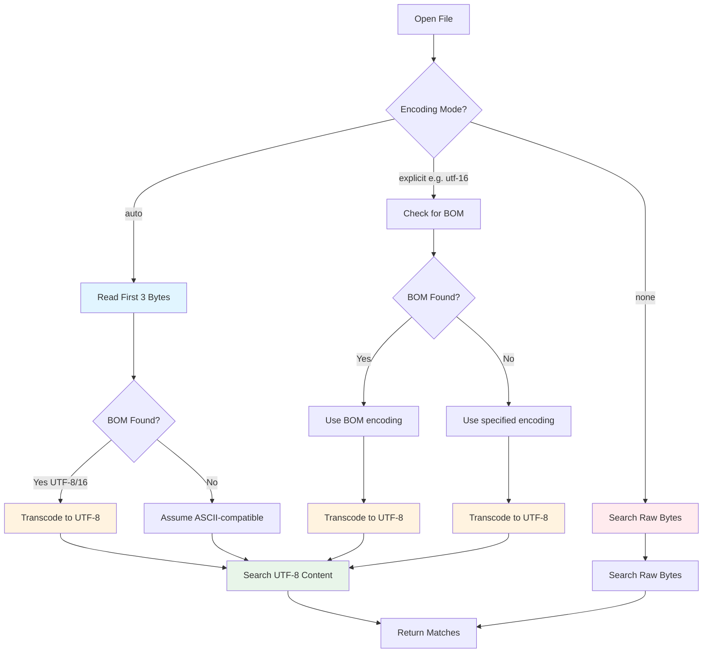
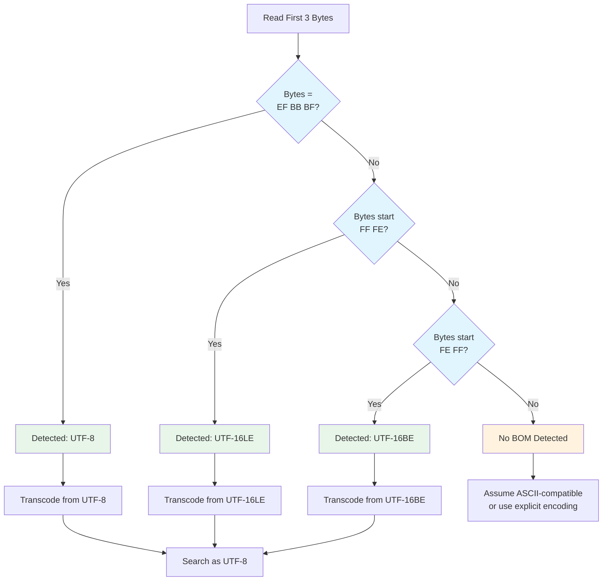
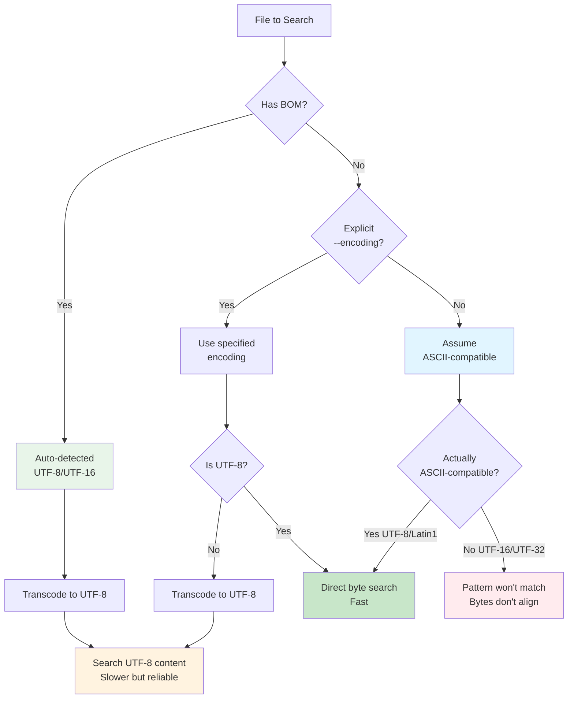

# File Encoding

[Text encoding](https://en.wikipedia.org/wiki/Character_encoding) is a complex topic, but this chapter will help you understand how ripgrep handles different file encodings and how to search non-UTF-8 files effectively.

## Understanding the Basics

Files are generally just bundles of bytes with no reliable way to know their encoding. For ripgrep to search them effectively:

* Either the encoding of the pattern must match the encoding of the files being searched, or
* A transcoding step must convert the file content to match the pattern's encoding

ripgrep works best on plain text files, especially those encoded in:
* **ASCII** - The most basic encoding
* **latin1** (ISO-8859-1) - Common for Western European text
* **UTF-8** - The most popular modern encoding
* **UTF-16** - Prevalent in Windows environments

## The --encoding Flag

The `-E/--encoding` flag lets you control how ripgrep handles file encodings.

**Syntax:**
```bash
rg -E ENCODING pattern
rg --encoding ENCODING pattern
```

**Values:**
* `auto` - Default mode: automatic BOM detection only
* `none` - Disables all encoding detection, searches raw bytes
* Any [WHATWG encoding label](https://encoding.spec.whatwg.org/#concept-encoding-get) - Forces specific encoding (e.g., `utf-16`, `latin1`, `gbk`, `shift_jis`)

**Examples:**
```bash
# Use default automatic mode (BOM detection)
rg pattern files/

# Force UTF-16 encoding
rg -E utf-16 pattern files/

# Search raw bytes without any transcoding
rg -E none pattern files/

# Search Cyrillic text encoded in Windows-1251
rg -E windows-1251 'текст' files/
```

**Short form:** `-E` is the short form of `--encoding`

**Reset to auto:** Use `--no-encoding` to reset encoding mode back to automatic, useful when overriding config files or earlier flags.

## Encoding Modes

ripgrep operates in three distinct encoding modes:

| Mode | Flag | Behavior |
|------|------|----------|
| **Auto** | `--encoding=auto` (default) or `--no-encoding` | BOM sniffing only, assumes ASCII-compatible otherwise |
| **Explicit** | `--encoding=<label>` (e.g., `utf-16`, `latin1`) | Forces specific encoding with BOM override capability |
| **Disabled** | `--encoding=none` | No encoding detection, searches raw bytes including BOM |

### Auto Mode (Default)

When using `--encoding=auto` or not specifying any encoding flag:

1. **BOM Sniffing** - ripgrep checks the first 3 bytes of each file for a byte-order mark
2. **If BOM found** - File is transcoded from detected encoding (UTF-8, UTF-16LE, or UTF-16BE) to UTF-8
3. **If no BOM** - File is assumed to be ASCII-compatible and searched as-is

### Explicit Mode

When you specify an encoding like `--encoding=utf-16`:

1. All files are assumed to be in that encoding
2. **Exception:** If a BOM is found, it overrides your explicit encoding
3. Files are transcoded to UTF-8 before searching
4. Invalid bytes are replaced with the Unicode replacement character (U+FFFD)

### Disabled Mode

When using `--encoding=none`:

1. All encoding detection is disabled
2. BOM bytes are treated as regular content
3. No transcoding occurs
4. Searches operate on raw bytes

This mode is useful when searching for byte sequences or when you want complete control.



**Figure**: Encoding detection and transcoding flow showing how ripgrep processes files in different modes.

## BOM Sniffing

A **Byte Order Mark (BOM)** is a special sequence of bytes at the start of a file that indicates its encoding.

**ripgrep detects BOMs for these encodings only:**
* `EF BB BF` - UTF-8 BOM
* `FF FE` - UTF-16 Little Endian BOM
* `FE FF` - UTF-16 Big Endian BOM

Other encodings in the WHATWG standard that have BOMs are not automatically detected and require explicit `--encoding` specification.

**How it works:**

1. ripgrep reads the first 3 bytes of each file
2. If they match a known BOM, ripgrep detects the encoding automatically
3. The file is transcoded from that encoding to UTF-8
4. Your UTF-8 pattern is then searched against the transcoded content

**BOM sniffing is enabled by default** in auto mode and can be disabled with `--encoding=none`.



**Figure**: BOM detection process showing the three supported byte-order marks and transcoding paths.

!!! warning "BOM Override Behavior"
    Even if you specify an explicit encoding like `--encoding=latin1`, a file with a BOM will override your setting. For example:

    ```bash
    # Even though we specify latin1, the UTF-16 BOM is detected and used instead
    rg -E latin1 'pattern' utf16-file-with-bom
    # ripgrep uses UTF-16 (from BOM) not latin1
    ```

    This ensures files are read correctly, but may be unexpected if you're trying to force a specific encoding.

## Transcoding

When ripgrep detects or is told about a non-UTF-8 encoding, it performs **transcoding** - converting the file from its source encoding to UTF-8 before searching.

**When transcoding occurs:**
* A BOM is detected (in auto mode)
* An explicit encoding is specified with `-E/--encoding`
* The encoding is not UTF-8

**How invalid bytes are handled:**
* Invalid byte sequences in the source encoding are replaced with `U+FFFD` (�)
* This ensures searching can continue even with corrupted or mixed-encoding files

**Performance impact:**
* Transcoding adds overhead compared to searching UTF-8 directly
* Searches on transcoded files will be slower
* For best performance, use UTF-8 files when possible

**Example:** Searching a UTF-16 file
```bash
# Automatic detection via BOM
rg 'Шерлок' some-utf16-file

# Explicit encoding (if no BOM)
rg -E utf-16 'Шерлок' some-utf16-file
```

## ASCII Compatibility Assumption

!!! note "Performance Optimization"
    **By default, ripgrep assumes files are ASCII-compatible.** This is a critical assumption that affects how searches work.

    This assumption is a performance optimization: ASCII-compatible files can be searched directly without transcoding overhead, making searches significantly faster than if every file required transcoding to UTF-8.

**ASCII-compatible encodings:**
* ASCII itself
* Latin-1 (ISO-8859-1)
* UTF-8
* Most 8-bit single-byte encodings

In these encodings, bytes 0x00-0x7F represent the same ASCII characters, so ASCII patterns will match as expected.

**Non-ASCII-compatible encodings:**
* UTF-16
* UTF-32
* Some multi-byte encodings without BOM

These encodings require explicit `--encoding` specification or a BOM for reliable searching.



**Figure**: ASCII compatibility assumption and its impact on search behavior. Files without BOM or explicit encoding are assumed ASCII-compatible for performance.

!!! warning "Why it matters"
    If you search UTF-16 text without BOM detection or explicit encoding, your ASCII pattern will be looking for single bytes, but UTF-16 represents each character with two bytes. The pattern won't match.

    ```bash
    # Won't work - searching for ASCII bytes in UTF-16 file without BOM
    rg 'hello' utf16-file-no-bom

    # Works - explicit encoding specified
    rg -E utf-16 'hello' utf16-file-no-bom
    ```

## Supported Encodings

ripgrep supports all encodings from the [WHATWG Encoding Standard](https://encoding.spec.whatwg.org/#concept-encoding-get) via the `encoding_rs` crate. The `encoding_rs` crate provides a complete implementation of the WHATWG Encoding Standard, ensuring reliable encoding detection and transcoding.

**Common encodings:**

| Encoding | Use Case |
|----------|----------|
| `utf-8` | Modern Unicode text (most common) |
| `utf-16le` | Windows files, little-endian |
| `utf-16be` | Big-endian UTF-16 |
| `iso-8859-1` (latin1) | Western European text |
| `windows-1252` | Windows Western European (superset of latin1) |
| `gbk` | Simplified Chinese |
| `shift_jis` | Japanese text |
| `euc-jp` | Japanese text (alternative) |
| `euc-kr` | Korean text |
| `windows-1251` | Cyrillic text |
| `iso-8859-5` | Cyrillic text (alternative) |

**For the complete list**, see the [WHATWG Encoding Standard](https://encoding.spec.whatwg.org/#names-and-labels).

## Practical Examples

=== "UTF-16 Files"

    **Automatic detection (with BOM):**

    Most UTF-16 files have a BOM, so this works automatically:

    ```bash
    rg 'pattern' utf16-file-with-bom
    ```

    **Force UTF-16 (without BOM):**

    For UTF-16 files without a BOM:

    ```bash
    rg -E utf-16 'pattern' utf16-file-no-bom
    ```

=== "Legacy Encodings"

    **Cyrillic (Windows-1251):**

    ```bash
    rg -E windows-1251 'текст' legacy-cyrillic-files/
    ```

    **Chinese (GBK):**

    ```bash
    rg -E gbk '搜索' chinese-files/
    ```

    **Japanese (Shift JIS):**

    ```bash
    rg -E shift_jis '検索' japanese-files/
    ```

=== "Raw Bytes"

    **Search raw byte sequences:**

    Disable all encoding detection and search raw bytes:

    ```bash
    rg -E none '(?-u)\x00\x48\x00\x65\x00\x6c\x00\x6c\x00\x6f' utf16-file
    ```

    The `(?-u)` flag disables Unicode mode in the regex, allowing byte-level matching.

## Unicode Regex Features and Encoding

ripgrep's regex engine includes Unicode support by default. After transcoding to UTF-8, these features work on the transcoded content:

* `\w` - Matches Unicode word characters (not just ASCII `[a-zA-Z0-9_]`)
* `\d` - Matches Unicode decimal digits
* `\s` - Matches Unicode whitespace
* `.` - Matches any Unicode codepoint (not any byte)

**These features assume UTF-8**, so:
* On UTF-8 files, they work naturally
* On transcoded files (UTF-16, GBK, etc.), they work on the UTF-8 transcoded version
* On raw bytes without transcoding, they only work reliably on valid UTF-8 sequences

### Disabling Unicode Features

You can disable Unicode matching within patterns using the `(?-u)` flag:

```bash
# Match any byte (not any Unicode codepoint)
rg '(?-u:.)'

# Match ASCII word chars followed by any byte followed by Unicode word char
rg '\w(?-u:\w)\w'
```

This is useful when:
* Searching binary files where `.` should match any byte including invalid UTF-8
* Mixing ASCII and Unicode patterns
* Searching raw bytes with `--encoding=none`

For more details on regex flags, see the [Advanced Patterns](advanced-patterns/index.md) chapter.

## Performance Considerations

!!! tip "Performance Best Practices"
    **Transcoding overhead:**

    * Transcoding from non-UTF-8 encodings adds processing time
    * UTF-16 transcoding can significantly slow down searches on large files
    * For best performance, convert files to UTF-8 if possible

    **BOM sniffing cost:**

    * Minimal - only reads first 3 bytes of each file
    * Negligible impact on performance

    **Tips for better performance:**

    * Use UTF-8 files when possible (no transcoding needed)
    * If searching many files in the same encoding, consider bulk conversion to UTF-8
    * Use `--encoding=none` only when necessary (skips BOM detection overhead)

## Troubleshooting Common Encoding Issues

### Pattern doesn't match known content

**Likely cause:** Encoding mismatch

**Solutions:**
1. Use `--debug` to see encoding detection: `rg --debug pattern file` (shows which encoding was detected or transcoding performed)
2. Check if file has a BOM: `hexdump -C file | head -n 1`
3. Try explicit encoding: `rg -E utf-16 pattern file`
4. Try disabling encoding: `rg -E none pattern file` (search raw bytes)

### Getting garbled output

**Likely cause:** Wrong encoding specified or BOM override

**Solutions:**
1. Let ripgrep auto-detect: `rg --no-encoding pattern file`
2. Try different encoding: `rg -E windows-1252 pattern file`
3. Check if file is actually UTF-8: `file file`

### Searching for non-ASCII pattern fails

**Likely cause:** Pattern encoding doesn't match file encoding

**Solutions:**
1. Ensure your terminal/shell uses UTF-8
2. Specify correct file encoding: `rg -E gbk '中文' file`
3. Use hex escapes for byte-level search: `rg '(?-u)\xe4\xb8\xad\xe6\x96\x87' file`

## Interaction with Other Flags

**`--text` or `-a` flag:**
* Forces ripgrep to search binary files as if they were text
* Encoding detection and transcoding still apply
* Useful in combination: `rg -a -E utf-16 pattern binary-file`
* See [Binary Data](binary-data/index.md) chapter for details

**`--no-encoding` flag:**
* Resets encoding to `auto` mode
* Useful for overriding config file settings
* Equivalent to `--encoding=auto`

**Unicode regex flags:**
* `(?-u)` disables Unicode mode for a pattern section
* Works on the transcoded UTF-8 version of files
* See [Advanced Patterns](advanced-patterns/index.md) chapter

## Summary

* ripgrep defaults to **auto encoding mode** with BOM sniffing
* Use `-E/--encoding` to specify explicit encodings or disable detection
* **BOM sniffing** automatically detects UTF-8 and UTF-16 files
* **Transcoding** converts non-UTF-8 files to UTF-8 before searching (with performance cost)
* ripgrep assumes **ASCII-compatible** encodings by default
* All [WHATWG encodings](https://encoding.spec.whatwg.org/#concept-encoding-get) are supported
* Unicode regex features work on UTF-8 (transcoded) content
* Use `(?-u)` to disable Unicode features when needed
* For best performance, use UTF-8 files when possible
