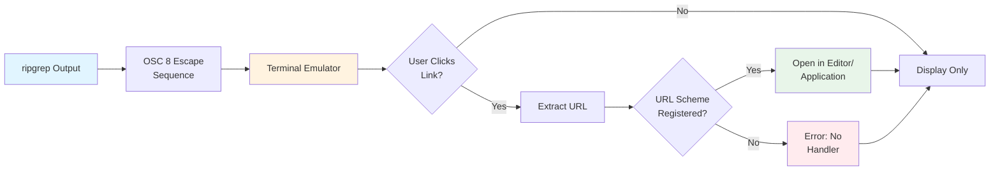

# Hyperlinks

Modern terminals support clickable hyperlinks through OSC 8 escape sequences. ripgrep can generate these hyperlinks for search results, making it easy to jump directly to matches in your editor.

## Overview

Hyperlink support allows terminal emulators to display clickable file paths that open directly in your preferred editor or application. This is particularly useful when:
- Reviewing search results interactively
- Working in a terminal-heavy workflow
- Quickly navigating between files
- Integrating with IDE-like terminal experiences



**Figure**: How terminal hyperlinks work - from ripgrep output to editor integration.

## Enabling Hyperlinks

Use the `--hyperlink-format` flag to enable hyperlink generation:

```bash
# Basic hyperlink format
rg --hyperlink-format default pattern
```

!!! tip "Test Your Terminal First"
    Before configuring hyperlinks globally, verify your terminal supports OSC 8 sequences:
    ```bash
    printf '\e]8;;http://example.com\e\\This is a link\e]8;;\e\\\n'
    ```
    If "This is a link" appears clickable, your terminal supports hyperlinks.

## Built-in Aliases

Instead of writing full hyperlink format strings, ripgrep provides convenient built-in aliases for common editors and schemes:

<!-- Source: crates/printer/src/hyperlink/aliases.rs:6-68 -->

| Alias | Expands to |
|-------|-----------|
| `default` | Platform-aware file:// scheme (see below) |
| `file` | `file://{host}{path}` |
| `vscode` | `vscode://file/{path}:{line}:{column}` |
| `vscode-insiders` | `vscode-insiders://file/{path}:{line}:{column}` |
| `vscodium` | `vscodium://file/{path}:{line}:{column}` |
| `cursor` | `cursor://file/{path}:{line}:{column}` |
| `macvim` | `mvim://open?url=file://{path}&line={line}&column={column}` |
| `textmate` | `txmt://open?url=file://{path}&line={line}&column={column}` |
| `kitty` | `file://{host}{path}#{line}` |
| `grep+` | `grep+://{path}:{line}` |
| `none` | Explicitly disable hyperlinks |

**The `default` alias** is platform-aware and expands differently per platform:
- Unix/Linux/macOS: `file://{host}{path}` (includes hostname)
- Windows: `file://{path}` (omits hostname for compatibility)

The default alias follows RFC 8089 file:// URI specification and is the recommended choice for general use.

!!! note "Platform-Aware Behavior"
    The `default` alias automatically adapts to your platform. On Unix/Linux/macOS it includes the hostname for network compatibility. On Windows it omits the hostname to prevent compatibility issues with some applications.

    The `file` alias always includes the hostname regardless of platform. Use `default` for cross-platform scripts and configurations.

**The `none` alias** can be used to explicitly disable hyperlinks, which is useful for overriding config file settings:

```bash
# Disable hyperlinks even if config file sets them
rg --hyperlink-format none pattern
```

## Hyperlink Formats

You can use built-in aliases or create custom hyperlink formats using a template syntax:

```bash
# Using a built-in alias
rg --hyperlink-format vscode pattern

# Using default platform-aware format
rg --hyperlink-format default pattern

# Custom format with line number
rg --hyperlink-format 'file://{path}:{line}' pattern
```

## Format Variables

Available variables for hyperlink templates:

| Variable | Description | Auto-populated |
|----------|-------------|----------------|
| `{path}` | Absolute or relative file path | Required in format |
| `{line}` | Line number of the match | From search result |
| `{column}` | Column number of the match | From search result |
| `{host}` | Machine hostname | From system hostname |
| `{wslprefix}` | WSL distro prefix (e.g., `wsl$/Ubuntu`) | From `WSL_DISTRO_NAME` env var (Windows/WSL only) |

!!! tip "Variable Usage Notes"
    - `{host}` is useful for network file shares or remote development environments
    - `{wslprefix}` enables proper file:// URLs when working in Windows Subsystem for Linux
    - `{path}` is required in every hyperlink format
    - `{column}` requires `{line}` to also be present in the format

## Terminal Support

Not all terminals support OSC 8 hyperlinks. Compatible terminals include:

### Well Supported
- **iTerm2** (macOS): Full support
- **Windows Terminal**: Full support
- **WezTerm**: Full support
- **Hyper**: Full support
- **Kitty**: Full support

### Partial Support
- **GNOME Terminal**: Supported in recent versions
- **Konsole**: Supported in recent versions
- **Alacritty**: Support in progress

### Not Supported
- **Traditional Terminal.app** (macOS): No support
- **Basic xterm**: No support
- **Most older terminal emulators**: No support

## URL Schemes

Different URL schemes enable different behaviors:

### File Scheme

Open files in default application:

```bash
# Using the built-in 'file' alias
rg --hyperlink-format file pattern

# Equivalent custom format
rg --hyperlink-format 'file://{path}' pattern
```

### Editor Schemes

Open files directly in specific editors using built-in aliases:

```bash
# VS Code
rg --hyperlink-format vscode pattern

# VS Code Insiders
rg --hyperlink-format vscode-insiders pattern

# VSCodium
rg --hyperlink-format vscodium pattern

# Cursor
rg --hyperlink-format cursor pattern

# MacVim
rg --hyperlink-format macvim pattern

# TextMate
rg --hyperlink-format textmate pattern

# Kitty terminal editor integration
rg --hyperlink-format kitty pattern

# grep+ macOS application
rg --hyperlink-format grep+ pattern
```

### Custom Editor Integration

For editors not included in the built-in aliases, you can create custom hyperlink formats:

!!! warning "Community Formats - Registration Required"
    These are community-suggested formats that require custom URL scheme handlers to be registered with your OS. They are not built into ripgrep and may not work without additional setup.

```bash
# IntelliJ/PyCharm/WebStorm (community format)
rg --hyperlink-format 'idea://open?file={path}&line={line}' pattern

# Sublime Text (community format)
rg --hyperlink-format 'subl://open?url=file://{path}&line={line}' pattern

# Neovim remote (community format)
rg --hyperlink-format 'nvim://edit/{path}:+{line}' pattern
```

See the [URL Scheme Registration](#url-scheme-registration) section below for platform-specific setup instructions.

## Configuration

Set up hyperlinks globally via your ripgrep config file:

```bash
# ~/.ripgreprc or $RIPGREP_CONFIG_PATH

# Using a built-in alias (recommended)
--hyperlink-format=vscode

# Or using a custom format
--hyperlink-format=vscode://file/{path}:{line}:{column}
```

## Examples

!!! example "Quick Start: VS Code Integration"
    The fastest way to get started is using a built-in alias:
    ```bash
    # Search with VS Code hyperlinks
    rg --hyperlink-format vscode TODO
    ```
    Click on any result to open the file at the exact line in VS Code. This is equivalent to the full format `vscode://file/{path}:{line}:{column}` but more concise.

### Example 1: VS Code Integration with Built-in Alias

```bash
# Search with VS Code hyperlinks (using built-in alias)
rg --hyperlink-format vscode TODO
```

Click on any result to open the file at the exact line in VS Code. This is equivalent to the full format `vscode://file/{path}:{line}:{column}` but more concise.

### Example 2: Using the Default Platform-Aware Format

```bash
# Use default format (includes hostname on Unix, omits on Windows)
rg --hyperlink-format default pattern
```

On Unix/Linux/macOS, this expands to `file://{host}{path}`. On Windows, it expands to `file://{path}`.

### Example 3: Kitty Terminal Editor Integration

```bash
# Open results using kitty's file:// handler (with line number fragment)
rg --hyperlink-format kitty pattern
```

### Example 4: Disabling Hyperlinks

```bash
# Explicitly disable hyperlinks (useful to override config file)
rg --hyperlink-format none pattern
```

### Example 5: Custom Editor Integration

```bash
# Neovim remote integration (custom format)
rg --hyperlink-format 'nvim://edit/{path}:+{line}' pattern
```

Note: Custom formats require URL scheme registration with your operating system.

## Best Practices

!!! tip "Configuration Recommendations"
    1. **Test first**: Verify terminal compatibility before global configuration
    2. **Use built-in aliases**: Prefer `vscode` over custom `vscode://...` formats
    3. **Start with default**: Use `--hyperlink-format default` for cross-platform compatibility
    4. **Configure globally**: Add to `~/.ripgreprc` for consistent behavior
    5. **Include position**: Use formats with `{line}` and `{column}` for precise navigation

- Test hyperlinks in your terminal before relying on them
- Configure your terminal to handle custom URL schemes
- Use absolute paths for hyperlinks when working with remote files
- Include line and column numbers for precise navigation
- Set up config file for consistent hyperlink behavior
- Verify URL scheme registration for your editor

## Troubleshooting

### Hyperlinks Not Clickable

Possible causes:
1. Terminal doesn't support OSC 8 sequences
2. Hyperlink format is invalid
3. URL scheme not registered with OS
4. Terminal hyperlink feature disabled

Solutions:
```bash
# Test if terminal supports hyperlinks
printf '\e]8;;http://example.com\e\\This is a link\e]8;;\e\\\n'

# Check ripgrep version (hyperlinks require recent version)
rg --version

# Verify URL scheme registration
# macOS: Check in /System/Library/CoreServices/SystemVersion.plist
# Linux: Check .desktop files in ~/.local/share/applications/
```

### Wrong Application Opens

The URL scheme might be registered to a different application:

=== "macOS"
    ```bash
    # Check default handler for a URL scheme
    defaults read ~/Library/Preferences/com.apple.LaunchServices/com.apple.launchservices.secure.plist

    # Register VS Code as handler (if needed)
    # Usually automatic when VS Code is installed
    ```

=== "Linux"
    ```bash
    # Update default application for vscode:// scheme
    xdg-mime default code.desktop x-scheme-handler/vscode

    # Verify registration
    xdg-mime query default x-scheme-handler/vscode
    ```

=== "Windows"
    ```powershell
    # Check registry for URL scheme handler
    # HKEY_CLASSES_ROOT\vscode\shell\open\command

    # Usually registered automatically by editor installation
    ```

### Path Resolution Issues

Use absolute paths to avoid ambiguity:

```bash
# Use absolute paths in hyperlinks
rg --hyperlink-format 'file://{path}' pattern "$(pwd)"
```

## Advanced Usage

### Escaping Special Characters

To include literal braces in your hyperlink format, use double braces:

```bash
# Include literal { and } characters in format
rg --hyperlink-format 'myscheme://{{literal}}/{path}' pattern

# This expands to: myscheme://{literal}/path/to/file
```

Use `{{` for a literal `{` and `}}` for a literal `}`.

### Format Validation Requirements

Hyperlink formats must meet these validation constraints:

- Must contain at least a `{path}` variable
- If `{column}` is used, `{line}` must also be present
- Format must start with a valid URL scheme (alphanumeric characters, `+`, `-`, or `.`)

!!! warning "Invalid Format Examples"
    ```bash
    # Invalid: Missing {path}
    rg --hyperlink-format 'file://{line}' pattern

    # Invalid: {column} without {line}
    rg --hyperlink-format 'file://{path}:{column}' pattern

    # Invalid: No URL scheme
    rg --hyperlink-format '{path}:{line}' pattern
    ```

### Conditional Hyperlinks

Only use hyperlinks when output is to terminal:

```bash
# In shell script
if [ -t 1 ]; then
  rg --hyperlink-format vscode pattern
else
  rg pattern
fi
```

### Custom Link Processing

Process hyperlinks with other tools:

```bash
# Extract paths from hyperlinks
rg --hyperlink-format file pattern | sed 's/.*file:\/\/\([^[:space:]]*\).*/\1/'
```

## URL Scheme Registration

To use custom editor hyperlink formats, you need to register URL scheme handlers with your operating system:

=== "macOS"
    **Method 1: Using an application's built-in registration**

    Most editors (VS Code, Sublime Text, etc.) automatically register their URL schemes during installation.

    **Method 2: Creating a custom .app bundle**

    For custom schemes, create an application bundle with an `Info.plist` that declares the URL scheme:
    ```xml
    <key>CFBundleURLTypes</key>
    <array>
        <dict>
            <key>CFBundleURLName</key>
            <string>Custom Editor</string>
            <key>CFBundleURLSchemes</key>
            <array>
                <string>myeditor</string>
            </array>
        </dict>
    </array>
    ```

=== "Linux"
    Create a `.desktop` file in `~/.local/share/applications/`:

    ```ini
    [Desktop Entry]
    Name=My Editor Handler
    Exec=/path/to/editor --open-url %u
    Type=Application
    MimeType=x-scheme-handler/myeditor;
    ```

    Then register it:
    ```bash
    xdg-mime default myeditor.desktop x-scheme-handler/myeditor
    ```

=== "Windows"
    Add registry entries for the URL scheme:

    ```registry
    HKEY_CLASSES_ROOT
        myeditor
            (Default) = "URL:My Editor Protocol"
            URL Protocol = ""
            shell
                open
                    command
                        (Default) = "C:\Path\To\Editor.exe" "%1"
    ```

    Most editors register their schemes automatically during installation.

## Security Considerations

!!! warning "URL Scheme Security"
    Be cautious when registering custom URL schemes:

    - **Validate sources**: Only use hyperlink formats from trusted sources
    - **Review handlers**: Some URL schemes can execute arbitrary commands
    - **Audit custom schemes**: Review what custom URL handlers do before registration
    - **Disable in sensitive contexts**: Consider `--hyperlink-format none` in security-sensitive environments

- Be cautious with hyperlink formats from untrusted sources
- Validate URL schemes before registering handlers
- Some terminals may execute arbitrary commands via URL schemes
- Consider disabling hyperlinks in security-sensitive environments

## See Also

- [Output Formats](output-formats.md) - Other output customization options
- [Configuration File](configuration-file.md) - Setting up persistent configuration
- [Common Options](common-options/output-formatting.md) - Output formatting options
