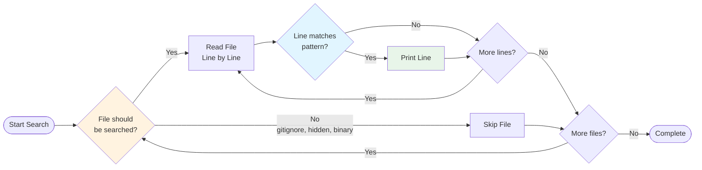

# Introduction

ripgrep is a line-oriented search tool that recursively searches the current directory for a regex pattern. By default, ripgrep will respect gitignore rules and automatically skip hidden files/directories and binary files.

## What is ripgrep?

ripgrep is a command line tool that searches your files for patterns that you give it. ripgrep behaves as if reading each file line by line. If a line matches the pattern provided to ripgrep, then that line will be printed. If a line does not match the pattern, then the line is not printed.



**Figure**: ripgrep's search process showing automatic file filtering and line-by-line pattern matching.

This documentation covers ripgrep version 14.1.1.

## Why ripgrep?

ripgrep combines the usability of The Silver Searcher (ag) with the raw performance of GNU grep. It's designed to be fast while providing smart defaults that respect your project's structure:

- **Performance**: Often faster than other search tools due to aggressive optimizations and intelligent use of parallelism
- **Smart filtering**: Automatically respects `.gitignore` and skips hidden/binary files without needing manual configuration
- **Feature-rich**: Supports PCRE2 regex, searching compressed files, multiline search, and replacement operations
- **Batteries included**: Works out of the box with sensible defaults while providing extensive customization options

For comprehensive performance benchmarks and feature comparisons with grep, ag, ack, and other tools, see the [README](https://github.com/BurntSushi/ripgrep#readme).

!!! tip "When to Use ripgrep"
    ripgrep excels at searching code repositories and text files where you want smart defaults (respecting `.gitignore`, skipping binaries). For searching all files unconditionally or working with specialized formats, you may need to adjust flags or use specialized tools.

## Key Features

- **Fast**: ripgrep is built on top of Rust's regex engine, which uses finite automata, SIMD, and aggressive literal optimizations to make searching very fast.
- **Respects ignore files**: By default, ripgrep respects `.gitignore`, `.ignore`, and `.rgignore` files.
- **Automatic filtering**: Hidden files, binary files, and symbolic links are automatically filtered by default.
- **Cross-platform**: Works on Linux, macOS, and Windows.
- **Powerful filtering**: Support for glob patterns and file type filtering.
- **Multiple encoding support**: Handles UTF-8, UTF-16, and other encodings with BOM detection.
- **PCRE2 regex support**: Use advanced regex features like look-around and backreferences with the `-P/--pcre2` flag.
- **Compressed file search**: Search inside gzip, bzip2, xz, lz4, lzma, brotli, and zstd compressed files automatically.
- **Preprocessor support**: Transform files before searching using custom preprocessors for specialized file formats.
- **Configuration files**: Define default settings in configuration files for consistent behavior across projects.
- **Multiline search**: Search patterns that span multiple lines with the `-U/--multiline` flag.
- **Replacement support**: Replace matched patterns with the `-r/--replace` flag.
- **JSON output**: Machine-readable JSON output format for integration with other tools.
- **Hyperlink support**: Terminal hyperlinks for clickable file paths with `--hyperlink-format` (built-in support for VSCode, file://, and custom formats).
- **Performance statistics**: Track and display search metrics with `--stats` for understanding search performance.

## Installation

### Quick Installation

**Precompiled binaries** are available for most platforms:

Download the latest release from [GitHub Releases](https://github.com/BurntSushi/ripgrep/releases) and extract the archive.

=== "macOS"
    ```bash
    # Using Homebrew
    brew install ripgrep
    ```

=== "Windows"
    ```bash
    # Using Chocolatey
    choco install ripgrep
    ```

=== "Debian/Ubuntu"
    ```bash
    sudo apt install ripgrep
    ```

=== "Fedora/Red Hat"
    ```bash
    sudo dnf install ripgrep
    ```

=== "Arch Linux"
    ```bash
    sudo pacman -S ripgrep
    ```

=== "From Source"
    ```bash
    # Using cargo (Rust package manager)
    cargo install ripgrep
    ```

For comprehensive installation instructions including package managers for other platforms, see the [README](https://github.com/BurntSushi/ripgrep#installation).

## Quick Start

Once installed, you can start using ripgrep immediately:

```bash
# Search for 'pattern' in current directory
rg pattern                          # (1)!

# Search for 'pattern' in a specific file
rg pattern path/to/file             # (2)!

# Search for 'pattern' in a specific directory
rg pattern path/to/dir              # (3)!

# Case-insensitive search
rg -i pattern                       # (4)!

# Search only in specific file types
rg -tpy pattern                     # (5)!

# List all files that would be searched
rg --files                          # (6)!
```

1. Recursively searches current directory, respecting `.gitignore` and skipping hidden/binary files
2. Search within a single file (useful for confirming matches in a specific location)
3. Limit search scope to a specific directory and its subdirectories
4. The `-i` flag makes the search case-insensitive (matches "pattern", "Pattern", "PATTERN", etc.)
5. Use `-t` followed by file type (e.g., `py`, `rs`, `js`) to filter by language
6. Preview which files ripgrep would search without actually searching for a pattern

### ripgrep-Specific Features

!!! tip "Smart Default Behavior"
    ripgrep automatically respects your project's `.gitignore` files and skips hidden and binary files by default. This means you get relevant results without needing to configure exclusion rules.

```bash
# This automatically skips files in .gitignore, .git/, node_modules/, etc.
rg TODO

# Search ALL files including ignored ones (disable smart filtering)
rg --no-ignore --hidden TODO
```

!!! note "Advanced Regex with PCRE2"
    Use the `-P/--pcre2` flag to enable advanced regex features like look-around assertions and backreferences:

```bash
# Use look-ahead to find functions that use a specific API
rg -P 'fn \w+.*(?=.*api_call)'

# Use backreferences to find repeated words
rg -P '\b(\w+)\s+\1\b'
```

!!! example "Multiline Search"
    The `-U/--multiline` flag allows patterns to match across multiple lines:

```bash
# Find struct definitions with specific fields (multiline search)
rg -U 'struct User \{[^}]*email[^}]*\}'
```

## Getting Help

- Use `rg -h` for a condensed help output
- Use `rg --help` for detailed help (pipe into a pager)
- Explore the chapters in this book for in-depth coverage of ripgrep's features
- Visit the [FAQ](https://github.com/BurntSushi/ripgrep/blob/master/FAQ.md) for common questions
- Check the [GUIDE](https://github.com/BurntSushi/ripgrep/blob/master/GUIDE.md) for additional usage examples

## Assumptions

This guide assumes that:
- ripgrep is [installed](https://github.com/BurntSushi/ripgrep#installation)
- You have passing familiarity with using command line tools
- You are using a Unix-like system (although most commands translate easily to any command line shell environment)
