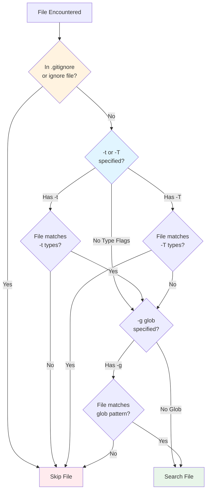

# Manual Filtering: File Types

File type filtering allows you to search specific file types by language or format. Instead of using glob patterns, you can use predefined types like "rust", "python", or "markdown". Ripgrep ships with 200+ built-in file types and supports custom type definitions. This is more convenient than globs for common cases like "search all Python files" or "exclude all JavaScript files."

## Quick Start

!!! tip "Quick Reference"
    File types provide a more convenient way to filter than glob patterns for common cases. Use `-t` to include types, `-T` to exclude them, and `--type-add` to define custom types.

Here are the most common file type filtering commands:

```bash
# Search only Rust files
rg pattern -t rust

# Search Python and JavaScript files
rg TODO -t python -t js

# Search all files EXCEPT JavaScript
rg pattern -T js

# List all available file types
rg --type-list

# Define and use a custom file type
rg --type-add 'web:*.{html,css,js}' -t web pattern

# Search only files with recognized types (whitelist mode)
rg --type all pattern
```

## Basic Type Selection (-t/--type)

Use `-t` or `--type` to search only files matching a specific file type:

```bash
# Search only Rust files (*.rs)
rg pattern -t rust

# Search only Python files (*.py, *.pyi)
# Source: crates/ignore/src/default_types.rs:217
rg TODO -t python

# Search only JSON files
rg "api_key" -t json
```

### Multiple Type Selection

You can specify multiple `-t` flags to search multiple file types:

```bash
# Search Python and JavaScript files
rg TODO -t python -t js

# Search web-related files
rg "function" -t html -t css -t javascript

# Search configuration files
rg "database" -t yaml -t toml -t json
```

### Short Form Syntax

The `-t` flag supports a compact short form where you can combine `-t` with the type name:

```bash
# These are equivalent
rg error -t rust
rg error -trust

# Multiple types in short form
rg TODO -tpython -tgo -trust
```

This is particularly useful for quick searches at the command line.

## Type Negation (-T/--type-not)

Use `-T` or `--type-not` to exclude files matching a specific file type:

```bash
# Search all files EXCEPT JavaScript
rg pattern -T js

# Exclude multiple types
rg FIXME -T json -T yaml -T html

# Exclude test files (if defined in built-in types)
rg TODO -T test
```

### Combining -t and -T

You can combine `-t` and `-T` flags for complex filtering:

```bash
# Search Rust files but not test files
rg TODO -t rust -T test

# Search source code but exclude minified JavaScript
rg pattern -t js -T jsmin

# Search all Python files except those in __pycache__
rg error -t python -T pyc
```

The `-T` flag also supports short form syntax like `-t`:

```bash
# These are equivalent
rg pattern -T rust
rg pattern -Trust
```

## Listing Available Types (--type-list)

Use `--type-list` to see all available file types and their associated glob patterns:

```bash
# List all available file types
rg --type-list

# Example output:
# ada: *.adb, *.ads
# agda: *.agda, *.lagda
# rust: *.rs
# python: *.py, *.pyi
# javascript: *.js, *.jsx, *.mjs, *.cjs, *.vue
# ...
```

The output format is: `type_name: glob1, glob2, ...`

This shows all built-in types plus any custom types you've defined with `--type-add`. It's useful for discovering what types are available and what file patterns they match.

### Type Aliases

Many built-in types have short aliases for convenience. When a type has an alias, both names refer to the same type definition. Common aliases include:

- `py` → `python`
- `js` → `javascript`
- `ts` → `typescript`
- `md` → `markdown`
- `rs` → `rust`

You can use either the full name or the alias:

```bash
# These are equivalent
rg pattern -t python
rg pattern -t py

# These are equivalent
rg pattern -t javascript
rg pattern -t js
```

To see which types have aliases, check the output of `--type-list`. Types with aliases appear on the same line separated by commas (e.g., 'markdown, md:' or 'py, python:'), with all names referring to the same glob patterns.

```bash
# Example output from --type-list showing aliases:
# py, python: *.py, *.pyi
# js, javascript: *.js, *.jsx, *.mjs, *.cjs, *.vue
# md, markdown: *.md, *.markdown
```

You can also search for a specific type's definition:

```bash
# Check what the rust type includes
rg --type-list | grep rust
```

## Custom Type Definitions (--type-add)

Use `--type-add` to define your own file types with custom glob patterns:

### Basic Custom Types

```bash
# Define a custom type with a single extension
rg --type-add 'foo:*.foo' -t foo pattern  # (1)!

# Define a type with multiple extensions
rg --type-add 'web:*.{html,css,js}' -t web TODO  # (2)!

# Define a type for specific filenames
rg --type-add 'config:Makefile,*.conf' -t config pattern  # (3)!
```

1. Creates a new type named 'foo' matching *.foo files
2. Use brace expansion `{html,css,js}` for multiple extensions
3. Mix specific filenames (Makefile) with patterns (*.conf)

The syntax is: `--type-add 'name:glob_pattern'`

!!! warning "Type Name Restrictions"
    Type names must consist only of Unicode letters or numbers. Punctuation characters like hyphens (-) or underscores (_) are not allowed. Use `mytype` instead of `my-type` or `my_type`.

```bash
# Valid type names
rg --type-add 'web:*.html' -t web pattern
rg --type-add 'mytype123:*.txt' -t mytype123 pattern

# Invalid type names (will fail)
rg --type-add 'my-type:*.txt' pattern      # hyphen not allowed
rg --type-add 'my_type:*.txt' pattern      # underscore not allowed
```

### Composing Types with include:

!!! tip "Building Reusable Type Categories"
    The `include:` directive lets you build on existing type definitions, making it easy to create project-specific categories like "all source files" or "all config files."

You can create types that include other types using the special `include:` directive:

```bash
# Create a type that combines C++ and Python
rg --type-add 'src:include:cpp,py' -t src FIXME  # (1)!

# Compose multiple built-in types
rg --type-add 'code:include:rust,python,go,java' -t code pattern  # (2)!

# Include types and add extra globs
rg --type-add 'config:include:json,yaml' --type-add 'config:*.conf' -t config  # (3)!
```

1. Use `include:` to reference existing types (cpp and py)
2. Build project-specific categories by combining language types
3. Mix `include:` with additional glob patterns for the same type

The `include:` directive lets you build on existing type definitions. This is particularly useful for creating project-specific type categories like "all source files" or "all config files."

### Multiple Definitions for Same Type

You can use `--type-add` multiple times for the same type to add additional globs:

```bash
# Start with JSON and YAML
rg --type-add 'config:include:json,yaml'
# Add .conf files
rg --type-add 'config:*.conf'
# Add .ini files
rg --type-add 'config:*.ini'
# Now use it
rg -t config "database"
```

All the globs accumulate for that type.

## Clearing Type Definitions (--type-clear)

!!! note "Clearing vs Adding"
    Without `--type-clear`, `--type-add` adds to existing globs. With `--type-clear`, you completely replace the type's definition.

Use `--type-clear` to remove the built-in glob definitions for a file type before adding your own:

```bash
# Clear built-in rust type and define your own
rg --type-clear rust --type-add 'rust:*.rs' -t rust pattern

# Override the default C type definition
rg --type-clear c --type-add 'c:*.c' -t c TODO
```

This is useful when you want to completely override a default type definition rather than extend it. After clearing, the type has no globs until you add them with `--type-add`.

```bash
# Without --type-clear: adds to existing globs
rg --type-add 'rust:*.foo' -t rust pattern   # Searches *.rs AND *.foo

# With --type-clear: replaces existing globs
rg --type-clear rust --type-add 'rust:*.foo' -t rust pattern   # Only *.foo
```

## Special Type Values

### Whitelist Mode (--type all)

Use `--type all` to enable whitelist mode, where ripgrep only searches files with recognized types:

```bash
# Search only files with recognized types
rg --type all pattern

# Equivalent to providing -t for every known type
rg -t rust -t python -t javascript -t ... pattern
```

This is useful when you want to skip unrecognized files (like binaries or obscure formats) and only search files that ripgrep knows about.

### Blacklist Mode (--type-not all)

Use `--type-not all` to enable blacklist mode, where ripgrep only searches files WITHOUT recognized types:

```bash
# Search only files WITHOUT recognized types
rg --type-not all pattern
```

This is the opposite of whitelist mode. It's useful for finding matches in uncommon file formats or files that don't match any standard type.

## Built-in File Types

Ripgrep includes 200+ built-in file types. Here are some commonly used ones:

**Programming Languages:**
- `rust`: *.rs
- `python` (alias `py`): *.py, *.pyi
  <!-- Source: crates/ignore/src/default_types.rs:217 -->
- `go`: *.go
- `java`: *.java, *.jsp, *.jspx
- `javascript` (alias `js`): *.js, *.jsx, *.mjs, *.cjs, *.vue
- `typescript` (alias `ts`): *.ts, *.tsx
- `c`: *.c, *.h
- `cpp` (C++): *.cpp, *.cc, *.cxx, *.h, *.hpp
- `ruby`: *.rb, *.rbw, *.rake, *.gemspec, Rakefile, Gemfile, config.ru, .irbrc
- `php`: *.php, *.php3, *.php4, *.php5, *.php7, *.php8, *.pht, *.phtml
  <!-- Source: crates/ignore/src/default_types.rs:203-207 -->

**Web Development:**
- `html`: *.html, *.htm
- `css`: *.css, *.scss
- `json`: *.json
- `xml`: *.xml

**Note:** Both the `css` and `sass` types include *.scss files. The `css` type (source: crates/ignore/src/default_types.rs:61) includes *.css and *.scss, while the `sass` type (source: crates/ignore/src/default_types.rs:242) includes *.sass and *.scss. When searching with `-t css` or `-t sass`, *.scss files will be included in both cases.

**Documentation:**
- `markdown` (alias `md`): *.md, *.markdown
- `rst`: *.rst
- `asciidoc`: *.adoc, *.asciidoc

**Configuration:**
- `yaml`: *.yaml, *.yml
- `toml`: *.toml
- `ini`: *.ini
- `config`: Various config file patterns

**Build Systems:**
- `make`: Makefile, *.mk, *.mak
- `cmake`: CMakeLists.txt, *.cmake

For a complete list with exact glob patterns, run:

```bash
rg --type-list
```

The complete definitions are in `crates/ignore/src/default_types.rs` in the ripgrep source code.

## Practical Examples

!!! example "Common Workflows"
    These examples show typical use cases for type filtering in real-world projects.

### Search Source Code Files

```bash
# Find TODOs in source code files
rg TODO -t rust -t python -t go

# Search for function definitions across multiple languages
rg "^fn |^def |^func " -t rust -t python -t go
```

### Search Configuration Files

```bash
# Find database configuration
rg "database" -t yaml -t toml -t json

# Search for API keys in config files
rg "api_key" -t yaml -t json -t ini
```

### Search Documentation

```bash
# Find installation instructions
rg "installation" -t markdown -t rst

# Search for examples in docs
rg "example" -t md -t asciidoc
```

### Exclude Generated or Vendor Files

```bash
# Search source but exclude test files
rg pattern -t rust -T test

# Search code but skip minified JavaScript
rg function -t js -T jsmin
```

### Project-Specific Type Categories

```bash
# Create a "frontend" type for web development
rg --type-add 'frontend:include:js,css,html' -t frontend "TODO"

# Create a "backend" type for server code
rg --type-add 'backend:include:rust,python' -t backend "FIXME"

# Create an "infra" type for infrastructure files
rg --type-add 'infra:*.{tf,tfvars,yaml,yml}' -t infra "region"
```

## Type vs Glob Filtering

While file types are convenient, sometimes you need glob patterns for more precise control. Here's when to use each:

=== "Use -t/--type When"
    **Searching common file types**
    ```bash
    # Search all Python files
    rg pattern -t python
    ```

    **Concise, readable commands**
    ```bash
    # Much shorter than glob equivalent
    rg TODO -t rust -t go -t python
    ```

    **Building on existing definitions**
    ```bash
    # Leverage built-in type knowledge
    rg --type-add 'code:include:rust,python,go' -t code
    ```

=== "Use -g/--glob When"
    **Specific path patterns**
    ```bash
    # Only search in src/ directory
    rg pattern -g 'src/**/*.rs'
    ```

    **Filtering by directory names**
    ```bash
    # Exclude test directories
    rg pattern -g '!tests/**'
    ```

    **Complex inclusion/exclusion**
    ```bash
    # Include src/ but exclude generated/
    rg pattern -g 'src/**' -g '!src/generated/**'
    ```

    **Custom naming conventions**
    ```bash
    # Match files ending in .test.js
    rg pattern -g '*.test.js'
    ```

You can combine both approaches:

```bash
# Search Rust files only in the src/ directory
rg pattern -t rust -g 'src/**'

# Search Python files but exclude test directories
rg pattern -t python -g '!tests/**'
```

## Type Filtering Precedence

!!! warning "Precedence Hierarchy"
    Type filtering has lower precedence than glob patterns and ignore files. Files in `.gitignore` won't be searched even with `-t`, and `-g` glob patterns override type matching.

```bash
# If src/file.rs is in .gitignore, -t won't include it
rg pattern -t rust  # Won't search src/file.rs if it's ignored

# Explicit file paths override ignore rules
rg pattern src/file.rs  # Will search even if ignored

# Glob patterns have higher precedence than types
rg pattern -t rust -g '!*.rs'  # Won't search ANY Rust files
```

To search files that would normally be ignored:

```bash
# Disable ignore files
rg pattern -t rust --no-ignore

# Search specific file regardless of ignore rules
rg pattern path/to/file.rs
```

## Configuration File Persistence

!!! tip "Making Custom Types Permanent"
    Type definitions aren't persisted between commands. For commonly used custom types, add them to `~/.ripgreprc` so they're available in every search.

Type settings are not persisted between invocations. Each time you run `rg`, you need to specify `--type-add` again.

For permanent custom types, add them to a ripgrep configuration file:

**~/.ripgreprc or .ripgreprc:**
```
--type-add
web:*.{html,css,js}
--type-add
config:include:json,yaml,toml
--type-add
docs:include:markdown,rst,asciidoc
```

Then ripgrep will automatically load these type definitions for every search.

See the Configuration chapter for more details on configuration files.

## How Type Matching Works

Under the hood, file types are implemented as named collections of glob patterns. When you use `-t rust`, ripgrep internally applies the glob pattern `*.rs` to match files.



**Figure**: Type matching flow showing precedence of ignore files, type flags, and glob patterns.

The type system is built on the `Types` struct in `crates/ignore/src/types.rs`, which:
1. Maintains a mapping of type names to glob patterns
2. Builds a `GlobSet` for efficient pattern matching
3. Supports composition via the `include:` directive
4. Handles precedence between multiple type rules

This design allows ripgrep to efficiently filter millions of files by type with minimal overhead.

For implementation details, see:
- `crates/core/flags/defs.rs`: CLI flag definitions
- `crates/ignore/src/types.rs`: Type matching implementation
- `crates/ignore/src/default_types.rs`: Built-in type definitions

## Troubleshooting

### Type not found

```bash
$ rg -t mytype pattern
error: invalid value 'mytype' for '--type <TYPE>'
```

**Solution:** Use `--type-list` to see available types, or define it with `--type-add`:

```bash
rg --type-add 'mytype:*.mt' -t mytype pattern
```

### Custom type not working

```bash
$ rg --type-add 'my-type:*.foo' -t my-type pattern
error: invalid type name
```

**Solution:** Type names must be alphanumeric only (no hyphens, underscores, or other punctuation):

```bash
rg --type-add 'mytype:*.foo' -t mytype pattern
```

### Type matches unwanted files

```bash
$ rg -t python pattern
# Searches too many files
```

**Solution:** Check what globs the type uses with `--type-list`, then either:
- Use `--type-clear` and redefine it
- Combine with `-g` for more precise filtering
- Create a custom type with exactly the globs you want

### Type settings disappear

```bash
$ rg --type-add 'web:*.html'
$ rg -t web pattern  # Later invocation
error: invalid value 'web' for '--type <TYPE>'
```

**Solution:** Type definitions aren't persisted. Either:
- Add `--type-add` to every command
- Put type definitions in a configuration file (~/.ripgreprc)
- Use shell aliases for commonly used custom types
