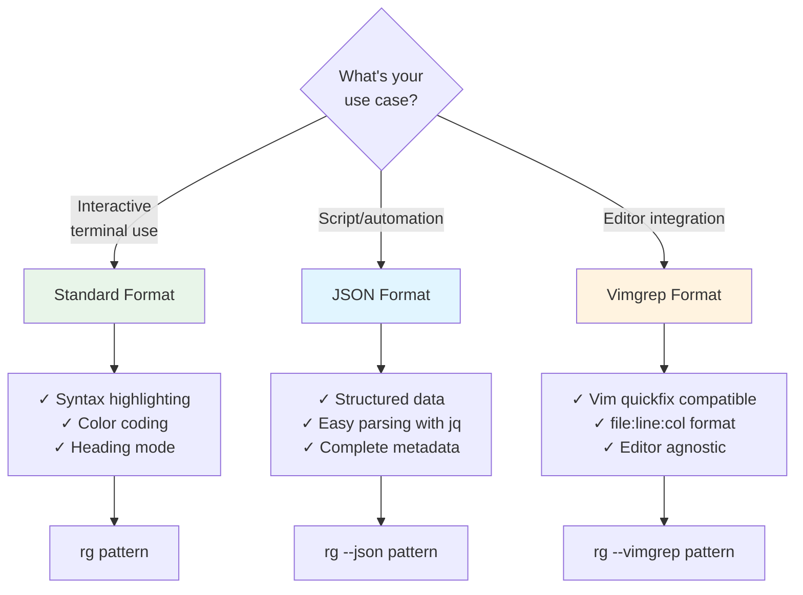
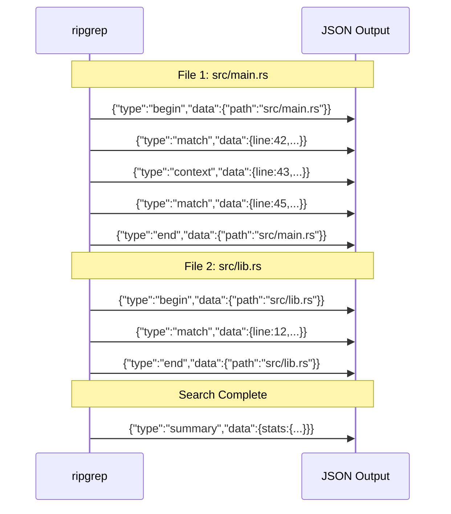

# Output Formats

ripgrep provides multiple output formats and customization options to tailor search results to your needs, from standard grep-like output to JSON for programmatic consumption.

## Overview

By default, ripgrep outputs search results in a grep-compatible format. However, it offers extensive formatting options including JSON output, custom colors, field separators, and specialized formats like vimgrep. This chapter covers all output formatting capabilities.

### Choosing an Output Format

Different output formats serve different purposes:



**Figure**: Decision guide for choosing the appropriate output format based on your use case.

=== "Standard (Human-Readable)"
    ```bash
    rg pattern
    ```

    **Best for:** Interactive terminal use, quick searches

    **Features:** Syntax highlighting, color coding, heading mode

    **Output:**
    ```
    src/main.rs
    42:    let pattern = regex::Regex::new(pattern)?;
    ```

=== "JSON (Machine-Readable)"
    ```bash
    rg --json pattern
    ```

    **Best for:** Scripts, automation, parsing with tools like `jq`

    **Features:** Structured data, easy parsing, complete metadata

    **Output:**
    ```json
    {"type":"match","data":{"path":{"text":"src/main.rs"},"lines":{"text":"    let pattern = regex::Regex::new(pattern)?;\n"},"line_number":42,"absolute_offset":1234,"submatches":[{"match":{"text":"pattern"},"start":8,"end":15}]}}
    ```

=== "Vimgrep (Editor Integration)"
    ```bash
    rg --vimgrep pattern
    ```

    **Best for:** Editor integration, quickfix lists

    **Features:** Compatible with vim, standard format

    **Output:**
    ```
    src/main.rs:42:8:    let pattern = regex::Regex::new(pattern)?;
    ```

## Standard Output Format

The default output format shows matching lines with optional file paths, line numbers, and column numbers:

```bash
# Basic output
# Source: crates/printer/src/standard.rs
rg pattern

# With line numbers (default in many cases)
rg -n pattern

# Disable line numbers
rg -N pattern
rg --no-line-number pattern

# With column numbers
rg --column pattern

# Control file path display
rg --with-filename pattern   # Always show file paths
rg --no-filename pattern     # Never show file paths

# Include files with zero matches
rg --include-zero pattern
```

## JSON Output

JSON output is useful for programmatic consumption and integration with other tools:

```bash
# Output results as JSON Lines (one JSON object per line)
# Source: crates/printer/src/json.rs
rg --json pattern

# Pretty-printed JSON (using -p or --pretty)
rg --json -p pattern
rg --pretty pattern
```

### JSON Output Structure

Each line of JSON output is a separate object with a `type` field indicating the kind of message:

- **`match`**: Represents a matching line with match data including path, line number, text, and submatches
- **`context`**: Context lines around matches (when using `-A`, `-B`, or `-C` flags)
- **`begin`**: Marks the beginning of results for a file
- **`end`**: Marks the end of results for a file
- **`summary`**: Search summary with statistics like total matches and files searched

Each message type has a corresponding `data` field containing type-specific information. For `match` messages, the data includes file path, line number, matching text, and submatch positions.



**Figure**: JSON message sequence showing how ripgrep structures output per file, with begin/end markers and a final summary.

!!! note "Statistics in JSON Format"
    You can combine `--json` with `--stats` to get structured statistics output. The summary message will include detailed statistics like elapsed time, files searched, lines searched, and matches found. This is particularly useful for programmatic analysis of search performance.

## Color Customization

ripgrep supports extensive color customization:

```bash
# Control color output
rg --color always pattern  # Always use colors
rg --color never pattern   # Never use colors
rg --color auto pattern    # Auto-detect (default)
rg --color ansi pattern    # Use ANSI colors only

# Custom color specifications
# Source: crates/printer/src/color.rs
rg --colors 'match:fg:red' --colors 'match:bg:yellow' pattern
```

!!! warning "Color Output in Scripts"
    Never use colored output in scripts or when piping to other commands. Color codes are ANSI escape sequences that will corrupt your data. Always use `--color never` or rely on auto-detection, which disables colors when output is not a terminal.

### Color Specifications

Available color types:
- `match`: Matching text
- `path`: File paths
- `line`: Line numbers
- `column`: Column numbers
- `highlight`: Highlighted matching text (for alternate match highlighting)

Color attributes:
- Foreground: `fg:color` (e.g., `fg:red`, `fg:blue`, `fg:green`)
- Background: `bg:color` (e.g., `bg:yellow`, `bg:white`)
- Style: `none`, `bold`, `intense`, `underline`

Colors can be specified using standard color names (black, blue, green, red, cyan, magenta, yellow, white) or 256-color palette codes.

!!! tip "Color Combinations for Readability"
    Combine foreground colors with bold or intense styles for better visibility on different terminal backgrounds. For example, `--colors 'match:fg:green' --colors 'match:style:bold'` works well on both light and dark terminals.

## Field Separators

Customize separators between different fields in the output:

```bash
# Custom match separator
rg --field-match-separator ':' pattern

# Custom context separator
rg --field-context-separator '-' pattern
```

## Vimgrep Format

Special format compatible with vim's quickfix:

```bash
# Vimgrep format: file:line:column:text
rg --vimgrep pattern
```

## Heading Mode

Control whether file paths are printed as headings or on each line:

```bash
# Enable heading mode (file paths as headers)
rg --heading pattern

# Disable heading mode (file path on each line)
rg --no-heading pattern
```

## Null Separators

Use null bytes as separators for safe handling of filenames with special characters:

```bash
# Null byte separator for file paths
rg --null pattern

# Print NUL byte after each file path
rg -0 pattern

# Use NUL as line terminator instead of newline
rg --null-data pattern
```

## Buffering Modes

Control output buffering behavior:

```bash
# Line-buffered output (flush after each line)
rg --line-buffered pattern

# Block-buffered output (default)
rg --block-buffered pattern
```

!!! note "When to Use Line Buffering"
    Line buffering is crucial when piping ripgrep to commands that process results incrementally (like `head`, `tail`, or `grep`). Without it, results may be buffered and not appear until the search completes or the buffer fills, creating the appearance of a hang.

## Additional Output Options

### Hyperlink Support

ripgrep supports OSC 8 terminal hyperlinks for clickable file paths in compatible terminals:

```bash
# Enable hyperlinks with default format (file://)
rg --hyperlink-format default pattern          # (1)!

# VS Code (opens files in VS Code)
# Source: crates/printer/src/hyperlink/aliases.rs:54-57
rg --hyperlink-format vscode pattern           # (2)!

# VS Code Insiders
rg --hyperlink-format vscode-insiders pattern  # (3)!

# VSCodium
rg --hyperlink-format vscodium pattern

# MacVim
rg --hyperlink-format macvim pattern

# TextMate
rg --hyperlink-format textmate pattern

# Cursor editor
rg --hyperlink-format cursor pattern

# Custom hyperlink format
rg --hyperlink-format 'vscode://file{path}:{line}:{column}' pattern  # (4)!
```

1. Uses standard `file://` URLs compatible with most terminals
2. Opens files directly in VS Code at the matched line and column
3. Variant for VS Code Insiders preview builds
4. Template supports `{path}`, `{line}`, and `{column}` placeholders

This feature allows compatible terminals (like iTerm2, WezTerm, or recent versions of GNOME Terminal) to make file paths clickable, opening them directly in your editor or file manager.

!!! tip "Editor Integration"
    Use the built-in format aliases for your editor to enable one-click file opening. For example, `--hyperlink-format vscode` creates hyperlinks that open files directly in VS Code at the correct line and column.

### Only Matching Text

Print only the matched portions of lines:

```bash
rg -o pattern
rg --only-matching pattern
```

### Byte Offsets

Show byte offsets instead of line numbers:

```bash
rg -b pattern
rg --byte-offset pattern
```

### Trim Whitespace

Trim ASCII whitespace from matching lines:

```bash
rg --trim pattern
```

### Max Columns

Control maximum column width for matches:

```bash
# Limit columns shown
rg --max-columns 100 pattern

# Show preview of long lines
rg --max-columns-preview pattern
```

### Context Separators

Customize the separator used between groups of context lines:

```bash
# Custom context separator
rg --context-separator '---' -C 2 pattern
```

## Examples

### Example 1: JSON Output for Scripting

```bash
# Search and parse with jq
rg --json 'TODO' | jq -r 'select(.type == "match") | "\(.data.path.text):\(.data.line_number)"'
```

### Example 2: Custom Colors for Readability

```bash
# Green matches on dark background
rg --colors 'match:fg:green' --colors 'match:style:bold' pattern
```

### Example 3: Vimgrep Integration

```bash
# Search and load results in vim quickfix
rg --vimgrep pattern > /tmp/results.txt
vim -q /tmp/results.txt
```

## Best Practices

!!! tip "Automation and Scripting"
    Always use `--json` for scripts and automation. It provides structured, predictable output that's easy to parse programmatically and won't break if colors or formatting change.

!!! tip "Editor Integration"
    Use `--vimgrep` for seamless editor integration. This format is compatible with quickfix lists in vim and similar features in other editors.

!!! warning "Piping and Redirection"
    Always use `--color never` when piping ripgrep output to other commands or redirecting to files. Color codes can interfere with text processing and create invalid output in scripts.

!!! tip "Special Characters in Filenames"
    Use `--null` when handling filenames with special characters, spaces, or newlines. This ensures safe parsing by separating results with null bytes instead of newlines.

!!! tip "Human-Readable Output"
    - Use `--heading` for human-readable output when you have many matches across multiple files
    - Use `--no-heading` when processing output line-by-line or when you need each result to be self-contained

!!! tip "Performance in Pipelines"
    Use `--line-buffered` when piping ripgrep output to another command that processes results incrementally (like `head` or `tail`). This ensures results appear immediately rather than being buffered.

## Performance Considerations

- JSON output has minimal performance overhead
- Colored output may be slightly slower on some terminals
- Buffering modes can affect perceived performance in pipelines
- `--only-matching` can be slower for complex patterns

## See Also

- [Replacements](replacements.md) - Modify output with replacements
- [Common Options](common-options/index.md) - Other frequently used flags
- [Context Lines](context-lines.md) - Add context to matches
