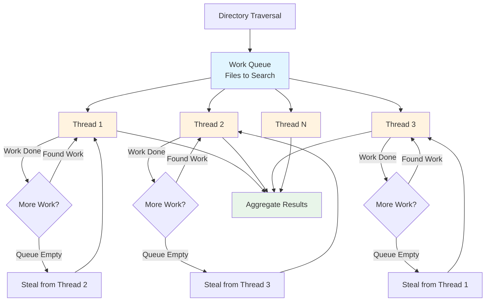
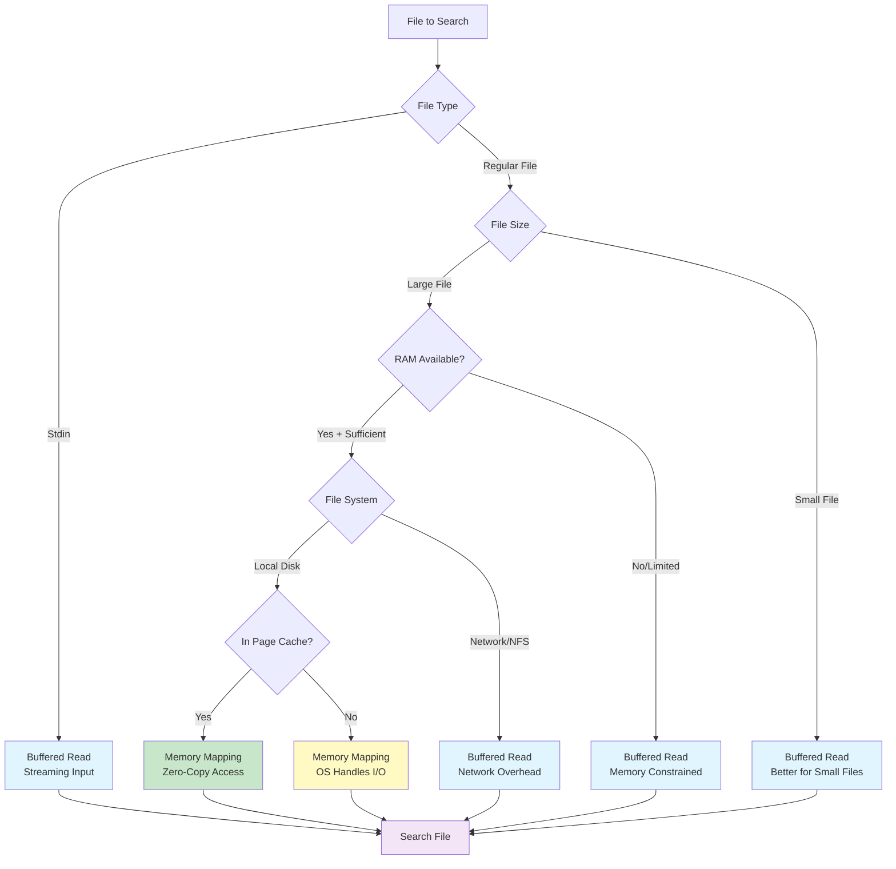
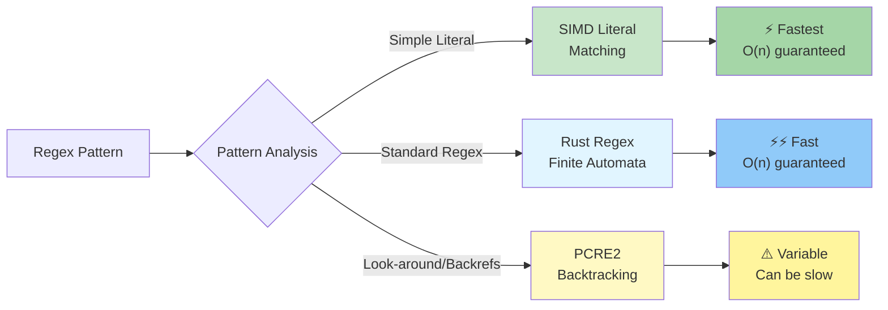

# Performance

Ripgrep is designed for speed. This chapter explains ripgrep's performance characteristics, the optimizations that make it fast, and how to tune performance for different use cases.

## Performance Philosophy

Ripgrep achieves its speed through several architectural decisions:

- **Parallelism by default**: Multi-threaded directory traversal and searching
- **Smart I/O**: Automatic selection between memory-mapped and incremental reading
- **SIMD acceleration**: Hardware-accelerated literal matching where available
- **Efficient regex engines**: Finite automata (default) for predictable performance, PCRE2 for advanced features
- **Minimal allocations**: Careful memory management to reduce overhead

## Parallel Search

By default, ripgrep uses multiple threads to search files in parallel, providing significant speedups on multi-core systems.

### Thread Count Control

Use the `-j`/`--threads` flag to control the number of threads:

```bash
# Use 4 threads
rg -j 4 pattern                # (1)!

# Single-threaded mode
rg --threads 1 pattern         # (2)!

# Use number of logical CPUs (default)
rg pattern                     # (3)!
```

1. Explicitly set thread count for performance tuning
2. Forces sequential processing—useful for debugging or deterministic output
3. Default behavior: automatically uses all available logical CPUs

The default behavior uses the number of logical CPUs available.

!!! tip "When to Use Single-Threaded Mode"
    Single-threaded mode (`--threads 1`) is useful for:

    - Debugging performance issues
    - Ensuring deterministic output order
    - Systems with limited resources

### Work Stealing Architecture

Ripgrep uses a work-stealing scheduler for parallel iteration. When one thread finishes its work early, it can "steal" work from other threads, ensuring all cores stay busy and maximizing throughput.

This lock-free parallel iteration (using atomic operations for work distribution) means ripgrep scales well across many cores without contention overhead.



**Figure**: Work-stealing parallel search showing how threads dynamically balance load using lock-free atomic operations.

### When Parallelism is Disabled

Some operations disable parallel search automatically:

- **Sorting** (`--sort`, `--sortr`): Requires collecting all results before outputting
- **Context lines with overlap**: Complex context merging requires sequential processing in some cases

## Memory Mapping

Ripgrep can use memory-mapped I/O for large files, which allows the operating system to handle file reading more efficiently.

### Automatic Selection

By default, ripgrep automatically chooses whether to use memory mapping based on file size and type. Generally:
- Large files benefit from memory mapping
- Small files are faster with incremental buffered reads



**Figure**: I/O strategy selection showing how ripgrep automatically chooses between memory mapping and buffered reads based on file characteristics.

### Manual Control

Force memory mapping on or off:

```bash
# Force memory mapping
rg --mmap pattern              # (1)!

# Disable memory mapping
rg --no-mmap pattern           # (2)!
```

1. Override automatic selection and force memory-mapped I/O
2. Force buffered reading even for large files

Memory mapping is beneficial when:
- Searching very large files (>10 MB)
- The file is likely to be in the OS page cache
- You have sufficient RAM

Avoid memory mapping when:
- Searching many small files (<1 MB)
- Working with network file systems (NFS, SMB)
- Memory is constrained

!!! warning "macOS Memory Mapping"
    Memory mapping is disabled by default on macOS due to performance overhead in the kernel's mmap implementation. You can enable it with `--mmap` if benchmarking shows it's beneficial for your specific use case.

### Stdin Handling

When reading from stdin (piped input), ripgrep automatically uses optimized buffered reading instead of memory mapping, since stdin cannot be memory-mapped. The buffer strategy is tuned for streaming input to provide good performance when processing piped data:

```bash
# Ripgrep automatically optimizes stdin handling
cat large_file.txt | rg pattern

# Or using process substitution
rg pattern < large_file.txt
```

## Low-Level Optimizations

Ripgrep uses several low-level optimizations to maximize search speed.

### SIMD Acceleration

Modern CPUs support SIMD (Single Instruction, Multiple Data) instructions that can process multiple bytes at once. Ripgrep automatically uses SIMD when available for:

- Fast literal string matching
- Multi-pattern searching
- BOM detection

!!! note "Automatic SIMD Detection"
    No configuration needed—ripgrep detects and uses available CPU features automatically. This includes SSE2, SSSE3, AVX2, and other instruction sets depending on your CPU.

### Literal Extraction

When you provide a regex pattern, ripgrep analyzes it to extract literal strings that must appear in any match. For example:

```bash
# Pattern requires "TODO" to appear
rg 'TODO.*urgent'
```

Ripgrep first uses fast literal matching to find "TODO", then applies the full regex only to those candidates. This makes complex regex searches nearly as fast as literal searches.

### Binary Detection

Ripgrep quickly detects binary files by scanning for NUL bytes. By default, binary files are skipped or have binary data suppressed.

Control binary handling:

```bash
# Search binary files as text
rg --binary pattern

# Skip binary files (default for most file types)
rg pattern
```

The heuristic-based detection is very fast and avoids wasting time on non-text content.

### Automatic Internal Optimizations

Ripgrep includes several internal optimizations that work automatically without configuration:

**RegexSet for Glob Matching** (Source: crates/globset/src/lib.rs)

When filtering files by globs or file types, ripgrep uses `RegexSet` to compile multiple patterns into a single optimized finite automaton. This allows testing a path against hundreds of patterns in a single pass, making file filtering nearly free compared to the actual search cost.

**UTF-8 DFA Decoding** (Source: crates/searcher/src/searcher/)

The regex engine includes optimized UTF-8 validation integrated directly into the DFA execution. This means ripgrep can validate text encoding while searching, eliminating a separate validation pass and improving cache locality.

These optimizations are built into ripgrep's core and provide performance benefits automatically—no flags or configuration needed.

## Regex Engine Tuning

Ripgrep provides options to control the regex engine's memory usage and behavior.

### DFA Size Limits

The default regex engine uses deterministic finite automata (DFA). Control DFA memory:

```bash
# Set DFA cache size limit (in bytes)
rg --dfa-size-limit 2G pattern   # (1)!
```

1. Increase DFA cache from default 1000 MB to 2 GB for extremely complex patterns

<!-- Source: crates/regex/src/config.rs:59 -->

The default is 1000 MB (approximately 1 GB). Increase this if you see warnings about DFA cache thrashing on very large or complex patterns.

!!! tip "When to Increase DFA Size"
    If you see "DFA cache capacity exceeded" warnings (rare with the 1000 MB default), you can increase further to 2G or more. The trade-off is higher memory usage for faster matching.

    The default of 1000 MB is quite generous and handles most real-world patterns well. Only increase if you're working with extremely complex regex patterns or see actual DFA cache warnings.

### Regex Size Limits

Limit the compiled size of the regex:

```bash
# Set regex bytecode size limit (in bytes)
rg --regex-size-limit 10M pattern
```

<!-- Source: crates/regex/src/config.rs:58 -->

The default is 100 MB (104,857,600 bytes) for the compiled regex bytecode size. This is separate from the DFA cache limit. Useful in memory-constrained environments or when dealing with extremely large patterns.

!!! note "Bytecode Size vs. DFA Cache"
    This limit controls the size of the compiled regex bytecode, not the DFA cache size during matching. The bytecode is the compiled representation of your pattern. The DFA cache (controlled by `--dfa-size-limit`) is used during matching execution.

### Engine Selection

Choose between regex engines:

```bash title="Selecting Regex Engine"
# Use default Rust regex (finite automata)
rg pattern

# Use PCRE2 (supports backtracking features)
rg -P 'pattern'

# Automatic engine selection
rg --engine auto pattern
```

!!! example "Performance Characteristics"
    **Default (Rust regex)**: Finite automata provide guaranteed linear time complexity. Best for most use cases.

    **PCRE2**: Backtracking engine supports advanced features (look-around, backreferences) but can be slower and has worst-case exponential behavior on certain patterns.

    **Auto**: Attempts to choose the best engine based on pattern analysis.



**Figure**: Regex engine selection showing performance characteristics and when each engine is used.

## Buffer and Memory Tuning

Control how ripgrep buffers output and manages memory.

### Buffer Size

Ripgrep uses a 64 KB default buffer for reading files. This is automatically managed but understanding the buffer size can help diagnose memory usage patterns and performance characteristics.

### Buffering Modes

```bash
# Line buffered output (flush after each line)
rg --line-buffered pattern

# Block buffered output (default, better performance)
rg --block-buffered pattern
```

Line buffering is useful when piping to another program that needs immediate output. Block buffering (default) provides better throughput.

### Heap Limits

Ripgrep has internal heap limit controls to prevent excessive memory usage. While these are automatically managed, you can configure heap allocation behavior through other memory parameters like `--dfa-size-limit` to indirectly influence heap usage. These controls are important when:
- Searching extremely large files
- Using complex patterns with many capture groups
- Running in memory-constrained environments

The default heap allocation strategy is eager allocation, which provides good performance for most use cases. In constrained environments, reducing memory limits through flags like `--dfa-size-limit` and `--regex-size-limit` helps control heap usage.

## Additional Performance Tuning Flags

### Limiting Output and Resources

Several flags help control resource usage and improve performance in specific scenarios:

#### Max Count (`-m`/`--max-count`)

```bash
# Source: crates/core/flags/defs.rs:3872-3909
# Stop after finding N matching lines per file
rg --max-count 10 pattern

# Quick sampling - get first match from each file
rg -m 1 pattern
```

Stops searching a file after finding N matching lines. Useful for:
- Quick sampling of large codebases
- Finding representative examples without processing all matches
- Improving performance when you only need a few results

!!! tip "Performance Boost"
    Using `--max-count 1` can speed up searches by 10-100x when you only need to know if a pattern exists, not count all occurrences. Combine with `--files-with-matches` to quickly identify which files contain matches without processing all occurrences.

#### Max Columns (`-M`/`--max-columns`)

```bash
# Source: crates/core/flags/defs.rs:3759-3789
# Omit lines longer than 500 bytes
rg --max-columns 500 pattern

# Skip very long lines (common in minified files)
rg -M 1000 pattern
```

Omits lines longer than the specified byte limit. Instead of printing long lines, only the number of matches in that line is shown. Useful for:
- Preventing excessive memory usage on files with very long lines
- Avoiding output flooding from minified JavaScript/CSS files
- Improving performance when searching logs with extremely long entries

!!! warning "Byte Limit, Not Character Limit"
    This limits line length in **bytes**, not characters. Multibyte UTF-8 characters count as multiple bytes. A line with 100 emoji characters could be 400+ bytes.

!!! tip "Minified File Handling"
    When searching web projects, use `--max-columns 500` to avoid processing minified JavaScript/CSS files that often have 10,000+ character lines. This prevents memory spikes and output floods.

#### One File System (`--one-file-system`)

```bash
# Source: crates/core/flags/defs.rs:5090-5114
# Don't cross filesystem boundaries
rg --one-file-system pattern

# Avoid searching network mounts
rg --one-file-system pattern /home/user
```

Prevents ripgrep from crossing filesystem boundaries during directory traversal. Useful for:
- Avoiding slow network filesystems (NFS, SMB)
- Skipping mounted external drives
- Preventing searches from traversing into Docker volumes or other mounts

Similar to `find`'s `-xdev` or `-mount` flag.

!!! note
    This applies per path argument. Searching multiple paths on different filesystems will still search all of them, but won't cross boundaries within each path's tree.

## Sorting Results

Ripgrep can sort results, but with a performance cost.

```bash
# Sort by file path
rg --sort path pattern

# Sort by modification time (newest first)
rg --sort modified pattern

# Sort in reverse order
rg --sortr path pattern
```

**Available sort keys:**
- `path`: File path
- `modified`: Last modification time
- `accessed`: Last access time
- `created`: Creation time

**Performance impact:**
- Disables parallel search (must collect all results first)
- Requires buffering all output before displaying
- Slower for large result sets

!!! warning "Sorting Performance Cost"
    Sorting disables parallel search entirely, which can make searches 4-10x slower on multi-core systems. Only use sorting when deterministic order is required (e.g., for diffing outputs, generating reports).

    For most interactive searches, the performance cost outweighs the benefit of sorted output.

## Performance Statistics

Use `--stats` to see detailed performance metrics:

```bash title="Performance Statistics"
rg --stats pattern
```

**Example output:**
```text
3 matches
3 matched lines
1 file contained matches
1 file searched
500 bytes printed
1500 bytes searched
0.002 seconds spent searching
0.005 seconds
```

!!! tip "Understanding Performance Metrics"
    **Key metrics:**

    - **Bytes searched**: Total data scanned
    - **Time spent searching**: Actual regex matching time
    - **Total time**: Includes file traversal, filtering, output formatting

    Use statistics to:

    - Identify performance bottlenecks
    - Compare different search strategies
    - Verify optimization effectiveness
    - Debug unexpected slowness

## Benchmarking

When benchmarking ripgrep, consider these factors:

### Warm vs. Cold Cache

File system caches dramatically affect performance:

```bash
# Cold cache (first run after clearing cache)
sudo purge  # macOS
sudo sh -c 'echo 3 > /proc/sys/vm/drop_caches'  # Linux

# Warm cache (subsequent runs)
rg pattern  # Fast due to OS caching
```

For realistic benchmarks, run searches multiple times and measure warm cache performance.

### Fair Comparisons

When comparing ripgrep to other tools:
- Use equivalent search parameters (case sensitivity, file filtering, etc.)
- Compare on same directory structure and file contents
- Run on same hardware with same background load
- Measure wall clock time, not just CPU time
- Account for file system cache effects

### Performance Factors

Performance depends on:
- **Pattern complexity**: Literal strings vs. complex regex
- **File size distribution**: Many small files vs. few large files
- **Match density**: Few matches vs. many matches per file
- **File system**: SSD vs. HDD, local vs. network
- **CPU features**: SIMD availability, core count
- **Memory**: Available RAM for file caching

### Reproducible Benchmarks

For consistent results:

```bash title="Benchmark Best Practices"
# Run multiple iterations
hyperfine 'rg pattern' --warmup 3 --runs 10

# Pin to specific CPU cores (Linux)
taskset -c 0-3 rg pattern

# Use --stats to see internal metrics
rg --stats pattern
```

!!! tip
    Use [hyperfine](https://github.com/sharkdp/hyperfine) for reliable benchmarking with statistical analysis. It automatically handles warmup runs and provides min/mean/max timing with standard deviation.

## Performance Tips

### For Large Codebases

```bash
# Source: crates/core/flags/defs.rs
# Use file type filtering
rg -t rust pattern

# Limit search depth
rg --max-depth 3 pattern

# Skip large files
rg --max-filesize 1M pattern

# Skip directories on other file systems (avoid network mounts)
rg --one-file-system pattern

# Stop after N matches for quick sampling
rg --max-count 100 pattern

# Omit very long lines to prevent memory issues
rg --max-columns 500 pattern
```

### For Network File Systems

```bash
# Disable memory mapping (often slower on NFS)
rg --no-mmap pattern

# Reduce thread count to avoid overwhelming network
rg -j 2 pattern
```

### For Memory-Constrained Environments

```bash
# Reduce thread count
rg --threads 2 pattern

# Set conservative limits (reduce from 1000 MB and 100 MB defaults)
rg --dfa-size-limit 10M --regex-size-limit 5M pattern

# Disable memory mapping
rg --no-mmap pattern
```

### For Maximum Speed

```bash
# Use literal search when possible
rg -F 'exact string'

# Use simple patterns instead of complex regex
rg 'foo.*bar' # Good
rg 'foo[^\n]*bar' # Slower

# Filter by file type
rg -t py pattern  # Faster than searching all files
```

## Common Performance Pitfalls

### Avoid These Patterns

!!! warning "Common Performance Mistakes"
    1. **Overly complex regex**: Use literal search (`-F`) when possible—it's 10-50x faster
    2. **Unnecessary PCRE2**: Default engine is faster for most patterns unless you need look-around/backreferences
    3. **Sorting when not needed**: Disables parallelism (4-10x slower on multi-core systems)
    4. **Too many threads**: Overhead can exceed benefit (usually > 16 threads)
    5. **Memory mapping small files**: Buffered I/O is faster for files under a few MB

### Troubleshooting Slow Searches

If ripgrep seems slow:

1. **Check what's being searched**:
   ```bash
   rg --files | wc -l  # How many files?
   rg --stats pattern  # How much data?
   ```

2. **Verify file filtering**:
   ```bash
   rg --debug pattern 2>&1 | grep -i ignore
   ```

3. **Test with simpler pattern**:
   ```bash
   rg -F 'literal'  # Is regex the bottleneck?
   ```

4. **Check for network file systems**: Much slower than local disks

5. **Measure with --stats**: Identify time spent in different phases

## Summary

Ripgrep's performance comes from:
- Parallel multi-threaded search by default
- Automatic memory mapping for large files
- SIMD-accelerated literal matching
- Efficient regex engines with smart optimizations
- Careful memory management

For most use cases, the defaults are optimal. Use the tuning options described in this chapter when you have specific performance requirements or constraints.
