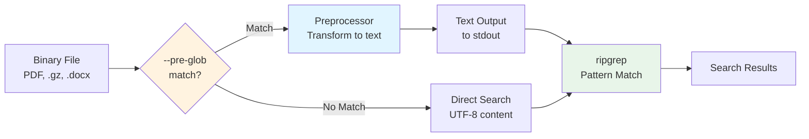
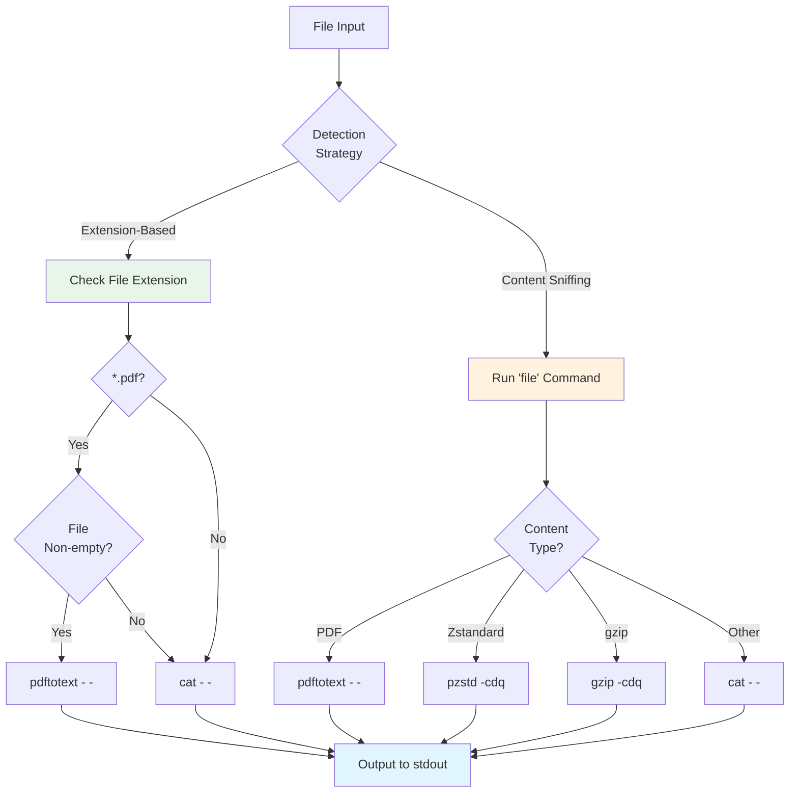

# Preprocessor

The preprocessor feature allows ripgrep to search virtually any file type by transforming content before searching. This chapter covers how to use preprocessors to search PDFs, compressed files, and other non-text formats.

!!! tip "Quick Reference"
    **Key Flags:**

    - `--pre COMMAND` - Run command to transform files before searching
    - `--pre-glob GLOB` - Only preprocess files matching pattern (strongly recommended)
    - `-z/--search-zip` - Built-in compression support (gzip, bzip2, xz, lz4, lzma, brotli, zstd)

    **Common Use Cases:**

    - PDFs: `rg --pre pdftotext --pre-glob '*.pdf' 'pattern'`
    - Office docs: `rg --pre ./preprocessor --pre-glob '*.{doc,docx}' 'pattern'`
    - Encrypted files: `rg --pre ./decrypt --pre-glob '*.gpg' 'pattern'`

## Overview

A preprocessor is a command that transforms file content before ripgrep searches it. This enables searching binary formats, encrypted files, compressed archives, and any content that can be converted to text.

The `--pre` flag takes a command that receives:
- **File path** as the first argument
- **File content** on stdin

The preprocessor outputs the transformed content to stdout, which ripgrep then searches.

### How It Works



**Figure**: Preprocessor execution flow showing conditional transformation based on `--pre-glob` patterns.

## Basic Usage: Searching PDFs

One common use case is searching PDF files. While PDFs are primarily visual documents, they often contain searchable text streams.

### The Problem

Let's try searching a PDF without a preprocessor:

```bash
$ rg 'The Commentz-Walter algorithm' 1995-watson.pdf
$
```

No results! Even though the text exists in the PDF, ripgrep can't find it because PDFs use a binary format where text may not be encoded as simple UTF-8.

### The Solution

First, convert the PDF manually to verify the text is there:

```bash
$ pdftotext 1995-watson.pdf > 1995-watson.txt
$ rg 'The Commentz-Walter algorithm' 1995-watson.txt
316:The Commentz-Walter algorithms : : : : : : : : : : : : : : :
7165:4.4 The Commentz-Walter algorithms
10062:in input string S , we obtain the Boyer-Moore algorithm. The Commentz-Walter algorithm
```

Great! The text is searchable after conversion. Now let's automate this with a preprocessor.

### Creating a Simple Preprocessor

Create a shell script that wraps `pdftotext`:

```bash title="preprocess"
#!/bin/sh

exec pdftotext - -
```

Make it executable:

```bash
$ chmod +x preprocess
```

Now search the PDF directly:

```bash
$ rg --pre ./preprocess 'The Commentz-Walter algorithm' 1995-watson.pdf
316:The Commentz-Walter algorithms : : : : : : : : : : : : : : :
7165:4.4 The Commentz-Walter algorithms
10062:in input string S , we obtain the Boyer-Moore algorithm. The Commentz-Walter algorithm
```

The preprocessor must be resolvable as a command. Either:
- Place it in a directory in your `PATH`
- Use an absolute or relative path (like `./preprocess`)

### Performance Benefits

Preprocessor-based PDF search can be faster than specialized tools due to ripgrep's parallelism:

```bash
$ time rg --pre ./preprocess 'The Commentz-Walter algorithm' 1995-watson.pdf -c
6

real    0.697
user    0.684
sys     0.007

$ time pdfgrep 'The Commentz-Walter algorithm' 1995-watson.pdf -c
6

real    1.336
user    1.310
sys     0.023
```

When searching many PDFs, ripgrep's parallel processing makes the difference even more significant.

## Building a Robust Preprocessor

The simple preprocessor above fails on non-PDF files:

```bash
$ echo foo > not-a-pdf
$ rg --pre ./preprocess 'foo' not-a-pdf
not-a-pdf: preprocessor command failed: '"./preprocess" "not-a-pdf"':
-------------------------------------------------------------------------------
Syntax Warning: May not be a PDF file (continuing anyway)
Syntax Error: Couldn't find trailer dictionary
```

### Handling Multiple File Types

Make the preprocessor conditional on file type using two approaches:



**Figure**: Two file type detection strategies showing trade-offs between speed (extension-based) and accuracy (content sniffing).

=== "Extension-Based Detection"

    ```bash title="preprocessor"
    #!/bin/sh

    case "$1" in
    *.pdf)
      # The -s flag ensures that the file is non-empty.
      if [ -s "$1" ]; then
        exec pdftotext - -
      else
        exec cat
      fi
      ;;
    *)
      exec cat
      ;;
    esac
    ```

    **Pros:** Fast, simple, works for well-named files

    **Cons:** Fails if files lack proper extensions

=== "Content Sniffing"

    ```bash title="processor"
    #!/bin/sh

    case "$1" in
    *.pdf)
      # Handle PDFs by extension first
      if [ -s "$1" ]; then
        exec pdftotext - -
      else
        exec cat
      fi
      ;;
    *)
      # Sniff content type for files without clear extensions
      case $(file "$1") in
      *Zstandard*)
        exec pzstd -cdq
        ;;
      *gzip*)
        exec gzip -cdq
        ;;
      *)
        exec cat
        ;;
      esac
      ;;
    esac
    ```

    **Pros:** Works even when files lack proper extensions

    **Cons:** Slower due to `file` command invocation

## Optimizing with `--pre-glob`

!!! warning "Performance Impact"
    Running a preprocessor on every file spawns a new process per file, which can significantly slow down searches. Always use `--pre-glob` to limit preprocessing to specific file types.

The `--pre-glob` flag limits preprocessing to files matching a glob pattern.

### Performance Impact

Compare searching without and with `--pre-glob`:

```bash
# Preprocessor runs on ALL files
$ time rg --pre preprocessor 'fn is_empty' -c
crates/globset/src/lib.rs:1
crates/matcher/src/lib.rs:2
crates/ignore/src/overrides.rs:1

real    0.138
user    0.485
sys     0.209

# Preprocessor runs ONLY on PDF files
$ time rg --pre preprocessor --pre-glob '*.pdf' 'fn is_empty' -c
crates/globset/src/lib.rs:1
crates/matcher/src/lib.rs:2
crates/ignore/src/overrides.rs:1

real    0.008
user    0.010
sys     0.002
```

The performance difference is dramatic: **17x faster** by limiting the preprocessor to PDF files only.

### Usage Pattern

```bash
# Only preprocess PDFs
rg --pre ./preprocessor --pre-glob '*.pdf' 'search term'

# Preprocess multiple file types
rg --pre ./preprocessor --pre-glob '*.{pdf,doc,docx}' 'search term'

# Multiple glob patterns
rg --pre ./preprocessor --pre-glob '*.pdf' --pre-glob '*.doc' 'search term'
```

!!! tip "Best Practice"
    Always use `--pre-glob` when you know which file types need preprocessing. This keeps searches fast by avoiding unnecessary process spawning.

## Preprocessor Use Cases

Beyond PDFs, preprocessors enable searching many file types:

### PDF Text Extraction

```bash
#!/bin/sh
# Requires: poppler-utils (for pdftotext)
[ -s "$1" ] && exec pdftotext - - || exec cat
```

### Compressed Files

!!! note "Built-in Compression Support"
    Ripgrep has built-in support for compressed files via `-z/--search-zip`:

    - gzip (.gz, .tgz)
    - bzip2 (.bz2, .tbz2)
    - xz (.xz, .txz)
    - lz4 (.lz4)
    - lzma (.lzma)
    - brotli (.br)
    - zstd (.zst, .zstd)
    - uncompress (.Z)

    <!-- Source: crates/cli/src/decompress.rs:490-532 -->

    Use `--pre` only for compression formats not covered by `-z`.

```bash
#!/bin/sh
case $(file "$1") in
  *Zstandard*) exec pzstd -cdq ;;
  *) exec cat ;;
esac
```

### Encrypted Files

```bash
#!/bin/sh
# Decrypt GPG-encrypted files
case "$1" in
  *.gpg) exec gpg --decrypt "$1" 2>/dev/null ;;
  *) exec cat ;;
esac
```

### Encoding Conversion

```bash
#!/bin/sh
# Convert from various encodings to UTF-8
# Requires: iconv
exec iconv -f AUTO -t UTF-8
```

### Document Format Conversion

```bash
#!/bin/sh
# Convert Microsoft Office documents
# Requires: pandoc or catdoc
case "$1" in
  *.docx) exec pandoc -t plain "$1" ;;
  *.doc) exec catdoc "$1" ;;
  *) exec cat ;;
esac
```

## Relationship with `-z/--search-zip`

Ripgrep provides two ways to handle special file formats:

- **`-z/--search-zip`**: Built-in support for common compressed formats including gzip (.gz, .tgz), bzip2 (.bz2, .tbz2), xz (.xz, .txz), lz4 (.lz4), lzma (.lzma), brotli (.br), zstd (.zst, .zstd), and uncompress (.Z)
- **`--pre`**: Custom preprocessing for any file transformation

**When to use each:**

| Use `-z/--search-zip` | Use `--pre` |
|----------------------|-------------|
| Standard compression formats | Custom formats (PDF, Office docs) |
| Built-in, no external tools | Requires external tools |
| Faster (no process spawning) | More flexible |
| Automatic detection | You control the logic |

You can combine both flags if needed:

```bash
# Search compressed PDFs
rg -z --pre ./pdf-preprocessor --pre-glob '*.pdf' 'search term'
```

## Performance Considerations

### Overhead

Each preprocessor invocation spawns a new process per file. This overhead can be significant:

- **Without `--pre-glob`**: New process for every file searched
- **With `--pre-glob`**: New process only for matching files
- **Parallelism helps**: Multiple files processed simultaneously

Note: The `-z/--search-zip` flag also spawns decompression processes (one per compressed file), but uses optimized glob matching to automatically detect compression formats by file extension, avoiding the need for manual glob specification.

### Optimization Tips

1. **Use `--pre-glob`** to limit preprocessing to necessary files
2. **Keep preprocessors fast**: Avoid expensive transformations if possible
3. **Use built-in features** when available (`-z` instead of `--pre` for compression)
4. **Test preprocessors independently** before using with ripgrep
5. **Consider preprocessing once**: For repeated searches, convert files ahead of time

### Benchmarking

Test preprocessor impact on your workflow:

```bash
# Measure overhead
time rg --pre ./preprocessor 'pattern'
time rg --pre ./preprocessor --pre-glob '*.pdf' 'pattern'
time rg 'pattern'  # without preprocessor for comparison
```

## Security Considerations

!!! warning "Security Alert"
    Preprocessors execute arbitrary commands with access to file content. Be cautious when:

    - Using untrusted preprocessor scripts
    - Searching files from untrusted sources
    - Handling file paths in preprocessors

!!! danger "CVE-2021-3013"
    A security vulnerability (CVE-2021-3013) was fixed related to preprocessor command handling. Always use the latest ripgrep version.

    <!-- Source: CHANGELOG.md:374-432 -->

### Safe Scripting Practices

=== "Input Validation"

    ```bash
    # Check file exists and is readable
    [ -f "$1" ] && [ -r "$1" ] || exit 1
    ```

    Verify file properties before processing to prevent errors and potential security issues.

=== "Command Injection Prevention"

    ```bash
    # BAD: Vulnerable to command injection
    eval "pdftotext $1 -"

    # GOOD: Properly quoted
    exec pdftotext "$1" -
    ```

    Always quote variables and avoid `eval` with user-controlled input.

=== "Absolute Paths"

    ```bash
    exec /usr/bin/pdftotext "$1" -
    ```

    Use absolute paths for tools when possible to prevent PATH-based attacks.

=== "Error Handling"

    ```bash
    pdftotext "$1" - 2>/dev/null || cat
    ```

    Handle failures gracefully to prevent preprocessor errors from blocking searches.

## Testing and Debugging

!!! tip "Development Workflow"
    Always test preprocessors independently before integrating with ripgrep. This isolates issues and makes debugging faster:

    1. Test the preprocessor command directly on sample files
    2. Verify output is correct plain text
    3. Check exit codes (0 for success)
    4. Then integrate with ripgrep using `--pre`

### Testing Preprocessors Independently

Test your preprocessor before using it with ripgrep:

```bash
# Test manually
./preprocessor test.pdf | head -20

# Verify exit code
./preprocessor test.pdf > /dev/null
echo $?  # Should be 0 for success
```

### Common Issues

!!! failure "Preprocessor not found"
    ```
    error: preprocessor command could not be found: 'preprocess'
    ```

    **Solution:** Use absolute/relative path or add to `PATH`

!!! failure "Preprocessor fails"
    ```
    file.pdf: preprocessor command failed: '"./preprocess" "file.pdf"'
    ```

    **Solution:** Check preprocessor handles file type correctly

!!! failure "No output"
    ```
    $ rg --pre ./preprocess 'pattern' file.pdf
    $
    ```

    **Solution:** Verify preprocessor outputs to stdout:
    ```bash
    ./preprocess file.pdf | rg 'pattern'
    ```

### Debugging Flags

Use ripgrep's debugging output to see what's happening:

```bash
# See which files are preprocessed
RUST_LOG=debug rg --pre ./preprocessor 'pattern' 2>&1 | grep -i preproc
```

## Examples

### Complete Multi-Format Preprocessor

A production-ready preprocessor handling multiple formats:

```bash title="multi-preprocessor"
#!/bin/sh
# multi-preprocessor - Handle PDFs, Office docs, and compressed files
# Compression formats based on built-in support in crates/cli/src/decompress.rs:490-532

set -e  # (1)!

FILE="$1"

# Check file is non-empty
[ -s "$FILE" ] || exec cat  # (2)!

# Try extension-based matching first
case "$FILE" in
  *.pdf)
    exec pdftotext - -  # (3)!
    ;;
  *.docx)
    exec pandoc -t plain "$FILE"  # (4)!
    ;;
  *.doc)
    exec catdoc "$FILE"
    ;;
  *.xlsx|*.xls)
    exec ssconvert -T Gnumeric_stf:stf_csv "$FILE" fd://1  # (5)!
    ;;
esac

# Fall back to content sniffing
case $(file -b "$FILE") in  # (6)!
  *PDF*)
    exec pdftotext - -
    ;;
  *Zstandard*)
    exec pzstd -cdq
    ;;
  *gzip*)
    exec gzip -cdq
    ;;
  *bzip2*)
    exec bzip2 -cdq
    ;;
  *)
    exec cat  # (7)!
    ;;
esac
```

1. Exit immediately on any error to prevent partial transformations
2. Return empty output for empty files instead of failing
3. Uses stdin (`-`) for input and stdout (`-`) for output
4. Converts DOCX to plain text format for searching
5. Converts spreadsheets to CSV format on file descriptor 1 (stdout)
6. Falls back to magic number detection for files without proper extensions
7. Pass through unchanged if no transformation needed

Usage:

```bash
# Search all supported formats in current directory
rg --pre ./multi-preprocessor --pre-glob '*.{pdf,doc,docx,xlsx}' 'search term'
```

## Summary

The preprocessor feature makes ripgrep a universal search tool:

- **`--pre COMMAND`**: Run command to transform files before searching (implementation in crates/core/flags/defs.rs:5453-5625)
- **`--pre-glob GLOB`**: Only preprocess files matching glob pattern
- **Use cases**: PDFs, compressed files, Office documents, encrypted content
- **Performance**: Use `--pre-glob` to minimize overhead
- **Security**: Validate inputs and avoid command injection
- **Alternative**: Use `-z/--search-zip` for built-in compression support

With preprocessors, ripgrep can search virtually any file format that can be converted to text.
