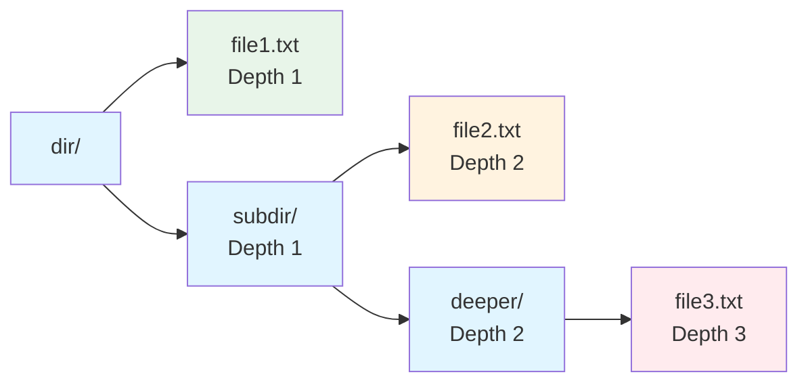
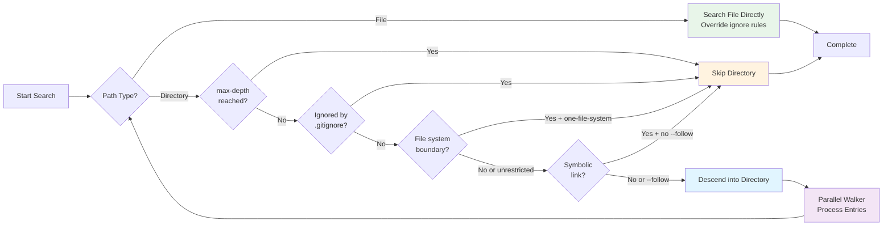

# Recursive Search

One of ripgrep's fundamental features is its ability to recursively search directories. When you provide a directory path as a search argument, ripgrep automatically descends into that directory and all its subdirectories, searching every file it encounters (subject to ignore rules and filtering).

## Default Recursive Behavior

When you specify a directory as a search path, ripgrep will recursively search all files within that directory and its subdirectories. This is the default behavior and requires no special flags:

```bash
# Search for "TODO" in the src/ directory and all subdirectories
rg TODO src/

# Search recursively from the current directory
rg pattern ./
```

This recursive traversal continues through the entire directory tree unless limited by `--max-depth`, ignore files, or other filtering options.

## File vs Directory Paths

ripgrep treats file and directory paths differently:

- **File paths**: Searched directly and override glob/ignore rules
- **Directory paths**: Trigger recursive traversal with respect to ignore rules

You can mix both in a single command:

```bash
# Search file.txt directly AND recursively search dir/
rg pattern file.txt dir/
```

!!! note "Explicit File Paths Override Ignore Rules"
    File paths specified on the command line are always searched, even if they would normally be filtered by `.gitignore` or other ignore files. This allows you to explicitly search specific files regardless of ignore rules.

    **Example:**
    ```bash
    # .gitignore contains: *.log

    # This skips error.log (directory search respects .gitignore)
    rg "ERROR" ./

    # This searches error.log (explicit file overrides .gitignore)
    rg "ERROR" error.log

    # This searches error.log directly AND recursively searches src/
    rg "ERROR" error.log src/
    ```

## Controlling Recursion Depth

Use the `--max-depth` flag (short form: `-d`, alias: `--maxdepth`) to limit how deep ripgrep descends into the directory tree:

```bash
# Only search direct children of dir/ (depth 1)
rg --max-depth 1 pattern dir/            # (1)!

# Only search paths explicitly given (depth 0 - no recursion)
rg --max-depth 0 pattern dir/            # (2)!

# Limit to 3 levels deep
rg -d 3 FIXME ./                         # (3)!
```

1. Searches only files directly inside `dir/`, not subdirectories
2. No recursion - only searches explicitly named paths (usually not useful for directories)
3. Short form `-d` is equivalent to `--max-depth`

!!! info "Depth Semantics"
    - `--max-depth 0`: Only searches the explicitly given paths themselves (no recursion). If you specify a directory with depth 0, it's effectively a no-op because the directory won't be descended into.
    - `--max-depth 1`: Searches only the direct children of the given directory
    - `--max-depth 2`: Searches children and grandchildren, etc.



**Figure**: Directory structure showing depth levels - green (depth 1), orange (depth 2), red (depth 3).

Example showing depth behavior:

```bash
# Given directory structure:
# dir/
#   file1.txt
#   subdir/
#     file2.txt
#     deeper/
#       file3.txt

# Depth 0: no files searched (dir/ itself is not descended)
rg --max-depth 0 pattern dir/

# Depth 1: only file1.txt searched
rg --max-depth 1 pattern dir/

# Depth 2: file1.txt and file2.txt searched
rg --max-depth 2 pattern dir/

# No limit: all files searched
rg pattern dir/
```

## Following Symbolic Links

By default, ripgrep does not follow symbolic links to directories during recursive traversal. This prevents potential infinite loops and unexpected behavior.

To enable following symlinks, use the `-L` or `--follow` flag:

```bash
# Follow symbolic links during directory traversal
rg -L pattern /var/

# Combine with other options
rg -L --max-depth 3 TODO ./
```

!!! warning "Symlink Loop Detection"
    When using `-L`, be aware that symlink cycles in the directory structure can cause issues. ripgrep detects symlink loops and reports an error when encountered, but this may result in incomplete search results. Use `--max-depth` to limit traversal depth as an additional safeguard.

## File System Boundaries

Use `--one-file-system` to prevent ripgrep from crossing file system boundaries during recursive search:

```bash
# Stay on the same file system (useful when searching from root)
rg --one-file-system pattern /

# Avoid traversing mounted file systems
rg --one-file-system TODO /home/
```

!!! tip "Use Case: Searching from Root"
    This flag is particularly useful when searching from the root directory, preventing ripgrep from descending into mounted file systems like network shares, `/proc`, `/sys`, or external drives.

## Interaction with Automatic Filtering

During recursive traversal, ripgrep automatically respects ignore files (`.gitignore`, `.ignore`, etc.) to skip filtered paths. The directory walker is integrated with the ignore system, so ignored directories are never descended into.

For example:

```bash
# Recursively searches src/, but skips any paths matching .gitignore rules
rg pattern src/
```

To search ignored files during recursive traversal, use `--no-ignore` or related flags. See the [Automatic Filtering](./automatic-filtering.md) chapter for complete details on how ignore files affect directory walking.

## How Directory Traversal Works

<!-- Source: crates/ignore/src/walk.rs -->
Under the hood, ripgrep uses an efficient parallel directory walker (`WalkBuilder` and `WalkParallel`) that:

- Traverses directories in parallel for better performance
- Respects configuration options like `max_depth`, `follow_links`, and `same_file_system`
- Integrates with the ignore file system to skip filtered paths during traversal
- Handles errors gracefully (e.g., permission denied on directories)

This implementation allows ripgrep to efficiently search large directory trees while respecting ignore rules and user-specified filters.

!!! info "Performance Optimization"
    For details on how ripgrep's parallel directory walker is optimized for performance, including threading strategies and memory management, see the [Performance](./performance.md) chapter.



**Figure**: Directory traversal decision flow showing how ripgrep processes paths and respects filtering rules.

## Practical Examples

### Basic Recursive Search

```bash
# Search for "TODO" comments in source code
rg TODO src/

# Search from current directory
rg "fn main" .
```

### Limited Depth Search

```bash
# Only search top-level of current directory
rg --max-depth 1 FIXME .

# Search up to 2 levels deep
rg -d 2 "panic!" ./
```

### Multiple Paths

```bash
# Search multiple directories and specific files
rg error logs/ src/ config.yaml

# Mix files and directories
rg pattern README.md src/ tests/
```

### Following Symlinks

```bash
# Follow symlinks when searching system directories
rg -L "error" /var/log/

# Follow symlinks with depth limit
rg -L --max-depth 2 pattern ./
```

### Single File System

```bash
# Search from root but stay on one file system
rg --one-file-system config /

# Avoid network mounts when searching
rg --one-file-system TODO /mnt/
```

## Summary of Recursion Flags

| Flag | Short | Description |
|------|-------|-------------|
| `--max-depth NUM` | `-d` | Limit directory traversal depth (0 = no recursion) |
| `--maxdepth NUM` | | Alias for `--max-depth` |
| `--follow` | `-L` | Follow symbolic links during traversal |
| `--one-file-system` | | Don't cross file system boundaries |

## Troubleshooting

### Permission Errors

If you encounter permission errors during recursive search, ripgrep will print a warning but continue searching accessible directories:

```bash
# Some directories may be inaccessible
rg pattern /var/
# Warning: Permission denied: /var/some-protected-dir
```

Use appropriate permissions or `sudo` if you need to search restricted directories.

### Symlink Loops

When using `-L/--follow`, ripgrep will detect symlink loops and report errors. If you see loop detection errors, you can use `--max-depth` to limit traversal depth and avoid reaching the problematic symlinks:

```bash
# Source: crates/ignore/src/walk.rs:1892-1913
# Limit depth to avoid symlink loops
rg -L --max-depth 10 pattern ./
```

ripgrep's loop detection works by tracking directory handles and comparing them with ancestor paths, reporting an error when a cycle is detected.

### Slow Recursive Search

If recursive search is slower than expected:

- Check if you're searching very large directory trees
- Ensure ignore files are working (`.gitignore` should skip `node_modules`, `target/`, etc.)
- Use `--max-depth` to limit traversal scope
- Consider using more specific path arguments

!!! tip "Performance Optimization"
    For large projects, ensure your `.gitignore` properly excludes common large directories like `node_modules/`, `target/`, `.git/`, or `build/`. These directories can contain thousands of files that dramatically slow down searches.

## See Also

- [Automatic Filtering](./automatic-filtering.md) - How ignore files affect recursive traversal
- [Manual Filtering: Globs](./manual-filtering-globs.md) - Using glob patterns to filter paths
- [Introduction](./introduction.md) - Introduction to ripgrep usage
