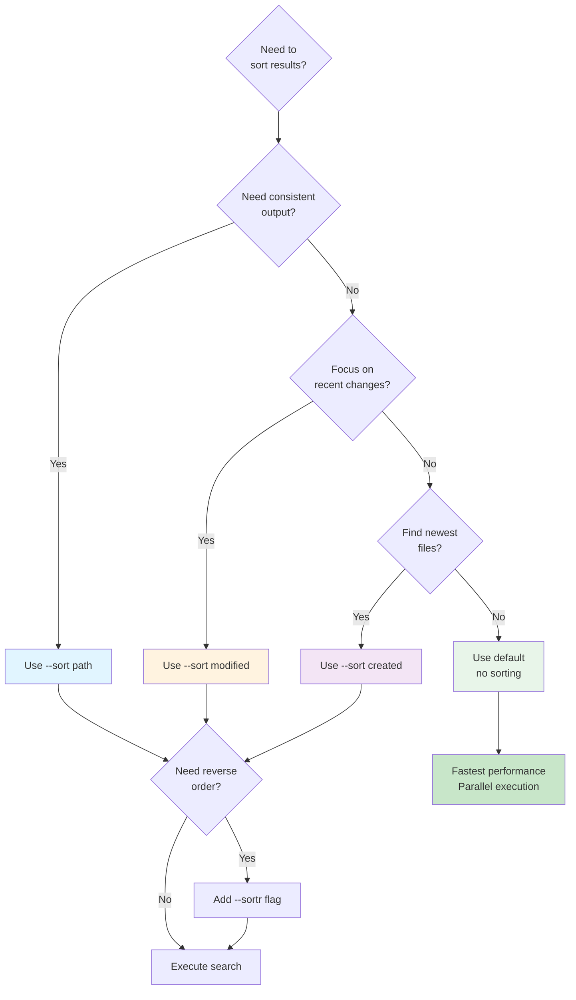
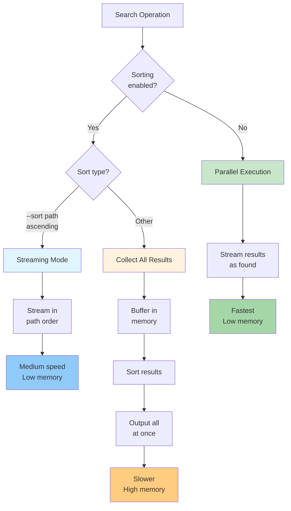

# Sorting Results

By default, ripgrep outputs results in an undefined order optimized for performance. However, you can sort results by various criteria when you need predictable or organized output.

## Overview

Sorting is useful when:
- You need consistent output across multiple runs
- You want to find the most recently modified files
- You're generating reports or documentation
- You need to process results in a specific order

!!! note "Performance Impact"
    Sorting disables parallelism, which impacts performance on large searches.



**Figure**: Decision flowchart for selecting the appropriate sort option based on your use case.

## Sort Options

ripgrep provides several sorting criteria:

=== "Path"

    ```bash
    # Sort by file path (ascending)
    rg --sort path pattern
    ```

=== "Modified Time"

    ```bash
    # Sort by last modified time (newest first)
    rg --sort modified pattern
    ```

=== "Accessed Time"

    ```bash
    # Sort by last accessed time (newest first)
    rg --sort accessed pattern
    ```

=== "Created Time"

    ```bash
    # Sort by creation time (newest first)
    rg --sort created pattern
    ```

=== "None"

    ```bash
    # Explicitly disable sorting (useful to override config files)
    rg --sort none pattern
    ```

!!! tip
    The `--sort=none` option explicitly disables sorting, which is useful for overriding configuration files or previous command-line flags that may have enabled sorting.

### Deprecated Options

!!! warning "Deprecated Flag"
    The `--sort-files` flag is deprecated. Use `--sort=path` instead for equivalent functionality. This change was made to consolidate all sorting options under the unified `--sort` flag.

## Reverse Sorting

Reverse the sort order:

```bash
# Sort by path in reverse (descending)
rg --sortr path pattern

# Oldest modified files first
rg --sortr modified pattern
```

!!! note "Memory Usage"
    Reverse path sorting (`--sortr path`) collects and sorts all paths in memory, unlike forward path sorting which can stream results. This means `--sortr path` has higher memory usage than `--sort path`.

## Sorting by Path

Path sorting uses lexicographic ordering:

```bash
rg --sort path 'TODO'
```

Output order:
```
./README.md
./src/cli.rs
./src/main.rs
./tests/integration.rs
```

This is useful for:
- Consistent output in scripts
- Alphabetical organization
- Predictable file ordering

!!! tip "Performance Optimization"
    When using `--sort path` in ascending order (without reverse), ripgrep uses an optimized streaming path that processes paths in their natural traversal order without buffering all results in memory. This makes ascending path sorting more memory-efficient than other sort modes.

## Sorting by Modified Time

Find matches in recently changed files:

```bash
# Most recently modified first
rg --sort modified 'function'

# Oldest modifications first
rg --sortr modified 'function'
```

This is useful for:
- Finding recent changes
- Focusing on active development areas
- Tracking down recent additions

## Sorting by Accessed Time

Find matches in recently read files:

```bash
# Most recently accessed first
rg --sort accessed 'pattern'
```

This is useful for:
- Finding frequently used code
- Identifying recently viewed files
- Understanding file access patterns

## Sorting by Created Time

Find matches based on file creation:

```bash
# Newest files first
rg --sort created 'pattern'

# Oldest files first
rg --sortr created 'pattern'
```

This is useful for:
- Finding new code
- Identifying legacy files
- Tracking project evolution

## Performance Impact

Sorting affects performance in several ways:

1. **Disables Parallelism**: Sorting requires collecting all results before output, which automatically disables parallelism in the directory walker, forcing sequential processing. Exception: `--sort path` in ascending order uses an optimized streaming path that avoids this overhead.
2. **Memory Usage**: All results must be held in memory before sorting (except for `--sort path` in ascending order)
3. **Startup Delay**: No results appear until the entire search completes



**Figure**: Performance comparison showing how different sort modes affect parallelism and memory usage.

Performance comparison:
```bash
# Fastest - parallel, no sorting
rg pattern

# Slower - sequential for consistent output
rg --sort path pattern
```

Example timing for large codebases (actual values depend on hardware, file count, and filesystem):
- Unsorted: ~100ms
- Sorted by path: ~500ms
- Sorted by time: ~600ms (requires stat calls)

## Combining with Other Options

### Sorted Output with Context

```bash
rg --sort modified -C 3 'pattern'
```

### Sorted Results by File Type

```bash
rg --sort path -trs 'fn '
```

### Sorted JSON Output

```bash
rg --sort modified --json 'TODO'
```

## Examples

!!! example "Practical Use Cases"
    The following examples demonstrate common scenarios where sorting improves search results. Each example shows the command and explains when to use it.

### Example 1: Recent Changes Audit

```bash
# Find TODOs in recently modified files
rg --sort modified -C 2 'TODO|FIXME'
```

### Example 2: Alphabetical Grep Replacement

```bash
# Traditional grep behavior with sorted output
rg --sort path 'pattern' | less
```

### Example 3: Finding New Features

```bash
# Find specific pattern in newest files first
rg --sort created 'new_feature'
```

### Example 4: Legacy Code Search

```bash
# Find patterns in oldest files (potential legacy code)
rg --sortr created 'deprecated_function'
```

## Best Practices

!!! tip "Choosing the Right Sort Mode"
    Match your sort criterion to your goal: use `--sort path` for reproducible scripts, `--sort modified` for recent development work, and default (no sorting) for maximum performance in interactive searches.

- Use `--sort none` (default) for best performance
- Use `--sort path` for consistent output in scripts or CI
- Use `--sort modified` when focusing on recent development
- Use `--sortr` variants to reverse the order
- Avoid sorting when searching large codebases interactively
- Combine with file type filters to reduce sort overhead
- Use sorting when piping to tools that benefit from ordered input

## When Not to Sort

Don't use sorting when:
- You just want to see any match quickly
- Searching very large codebases (>10GB)
- Running in watch mode or continuous integration
- You don't care about output order
- Maximum performance is critical

## Sorting Across Platforms

Time-based sorting behavior may vary:
- **Linux**: Reliable modified, accessed, and created times
- **macOS**: Reliable modified and created times
- **Windows**: All timestamps available but may have different precision

!!! warning "Error Handling"
    When a requested sort criterion is unavailable on the filesystem (for example, creation time on ext4 filesystems), ripgrep will detect this, print an error message, and exit without performing the search. This ensures that you're aware when the requested sorting cannot be reliably performed.

When sorting by timestamps, files with metadata errors (such as permission denied or missing filesystem metadata) are handled gracefully:
- With ascending sort (`--sort`): Files with errors appear last in the output
- With descending sort (`--sortr`): Files with errors appear first in the output

This ensures predictable behavior even when some files cannot be fully accessed.

## See Also

- [Performance](performance.md) - Performance tuning and optimization
- [Output Formats](output-formats.md) - Other output customization
- [Common Options](common-options/index.md) - Frequently used flags
