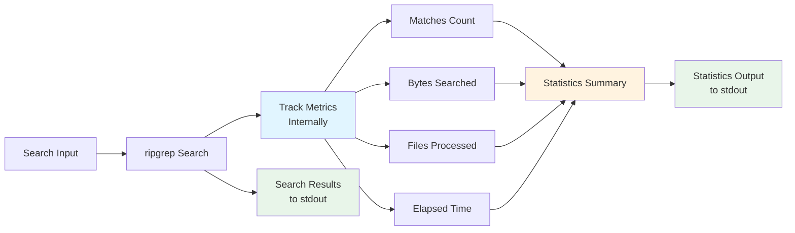
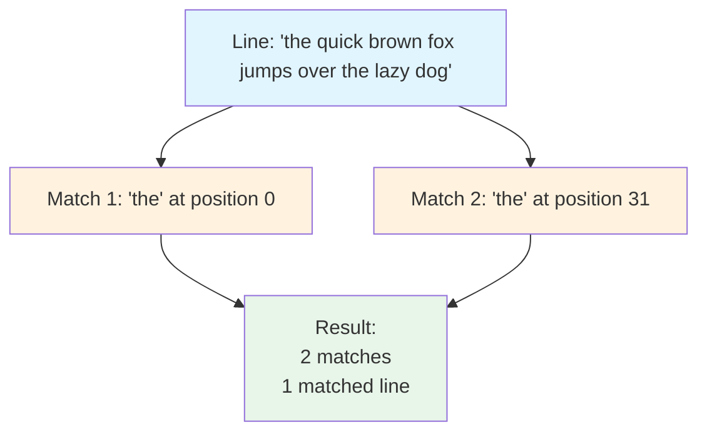
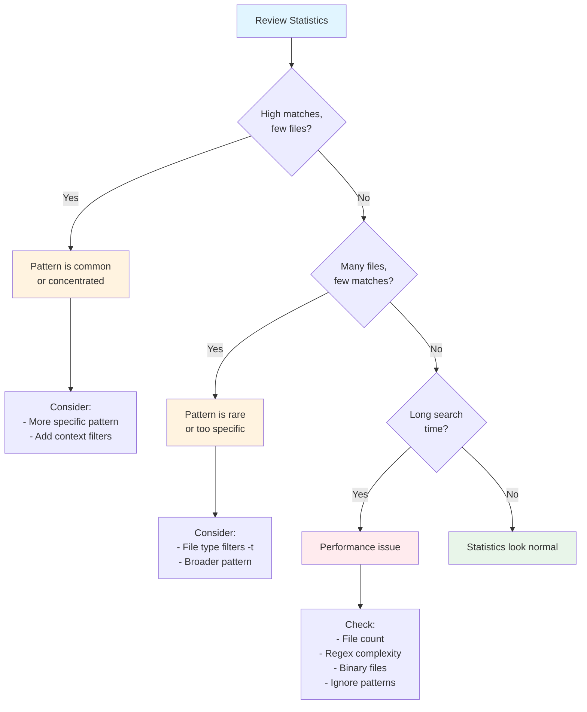

# Statistics and Metrics

ripgrep can output detailed statistics about the search operation, providing insights into performance, match counts, and files processed.

## Overview

Statistics are useful for:
- Understanding search performance
- Debugging slow searches
- Analyzing codebases
- Gathering metrics for reporting
- Optimizing search patterns

## Enabling Statistics

Enable statistics output with the `--stats` flag:

```bash
rg --stats pattern
```

This prints statistics after all search results.

## Statistics Output Format

The statistics output includes several categories of information. Statistics are printed to stdout after all search results.



**Figure**: Statistics collection flow showing how ripgrep tracks metrics during search and outputs them after results.

```
3 matches
2 matched lines
1 files contained matches
5 files searched
150 bytes printed
1500 bytes searched
0.025000 seconds spent searching
0.001000 seconds total
```

!!! note
    Time values are formatted with 6 decimal places of precision.

## Key Metrics

The statistics data structure tracks the following metrics:

```rust
// Source: crates/printer/src/stats.rs:13-21
pub struct Stats {
    elapsed: Duration,              // (1)!
    searches: u64,                  // (2)!
    searches_with_match: u64,       // (3)!
    bytes_searched: u64,            // (4)!
    bytes_printed: u64,             // (5)!
    matched_lines: u64,             // (6)!
    matches: u64,                   // (7)!
}
```

1. Time spent searching across all threads
2. Total number of files examined
3. Number of files containing at least one match
4. Total bytes read and searched
5. Total bytes output (results + context lines)
6. Number of lines containing matches
7. Total number of pattern matches found

### Match Statistics

- **Matches**: Total number of pattern matches found
- **Matched lines**: Number of lines containing matches. With multiline patterns (`--multiline` or `-U`), this counts all lines that participate in or are part of any match, not just the first line of each match.
- **Files contained matches**: Count of files with at least one match

### Search Scope

- **Files searched**: Total number of files examined
- **Bytes searched**: Total bytes read and searched
- **Bytes printed**: Amount of data output (including context)

### Performance Metrics

- **Seconds spent searching**: Actual search time across all threads
- **Seconds total**: Wall-clock time for the entire operation

!!! tip "Performance Overhead"
    The `--stats` flag itself has minimal performance overhead since ripgrep tracks these metrics internally regardless. Enabling `--stats` only adds the cost of formatting and printing the final summary.

## Understanding the Metrics

### Matches vs. Matched Lines

A line can contain multiple matches:

```bash
# Search for 'the'
echo "the quick brown fox jumps over the lazy dog" | rg --stats 'the'
```

Output:
```
the quick brown fox jumps over the lazy dog

2 matches
1 matched lines
```



**Figure**: Illustration of how a single line can contain multiple matches. The line count is 1, but the match count is 2.

### Thread Time vs. Wall Time

With parallel search:
- **Searching time**: Sum of time across all threads (can exceed wall time)
- **Total time**: Actual elapsed time

!!! info "Understanding Thread Time"
    The "seconds spent searching" metric accumulates CPU time across all threads. With parallel search, this will typically exceed wall-clock time. A ratio close to your thread count indicates good parallelization. For example, if you have 4 threads and the ratio is ~4x, your search is efficiently using all threads.

Example:
```
0.400000 seconds spent searching  (4 threads × 0.1s each)
0.100000 seconds total  (wall-clock time)
```

In this case, the 4:1 ratio (0.4s / 0.1s = 4) shows that all 4 threads were fully utilized during the search.

```mermaid
gantt
    title Parallel Search Thread Utilization (4 threads)
    dateFormat X
    axisFormat %L ms

    section Thread 1
    Searching :t1, 0, 100
    section Thread 2
    Searching :t2, 0, 100
    section Thread 3
    Searching :t3, 0, 100
    section Thread 4
    Searching :t4, 0, 100

    section Wall Time
    Total elapsed :crit, wall, 0, 100
```



**Figure**: Visual representation of parallel search showing 4 threads running simultaneously. Wall-clock time is 100ms, but total CPU time is 400ms (4 threads × 100ms each), giving a 4:1 ratio indicating full parallelization.

## Use Cases

### Performance Analysis

Compare different search strategies:

```bash
# Compare regex vs. fixed string
time rg --stats 'complex.*pattern'
time rg --stats -F 'literal_string'
```

### Codebase Metrics

Analyze code patterns:

```bash
# Count TODO comments
rg --stats 'TODO|FIXME|XXX'

# Find test coverage
rg --stats -trs '#\[test\]'
```

### Search Optimization

Identify slow searches:

```bash
# Check if binary files slow down search
rg --stats --binary pattern
rg --stats --no-binary pattern
```

## Combining with Other Options

### Statistics with File Counts

```bash
# Count matches per file type
rg --stats -tpy 'import'
rg --stats -tjs 'import'
```

### Statistics with Quiet Mode

```bash
# Just get statistics, suppress output
rg --stats -q pattern
```

!!! warning "Performance Impact with --quiet"
    When combining `--stats` with `--quiet`, ripgrep will search all files completely to collect accurate statistics, even though `--quiet` alone would normally exit after the first match. This means `--stats` disables `--quiet`'s early-exit optimization. If you're just checking for pattern existence in a large codebase, using both flags together will be much slower than `--quiet` alone, as it must search all files to completion.

### Statistics Output Formats

Statistics can be output in two formats:

=== "Text Format"
    ```bash
    rg --stats pattern
    ```

    Human-readable output appended after search results:
    ```
    3 matches
    2 matched lines
    1 files contained matches
    5 files searched
    150 bytes printed
    1500 bytes searched
    0.025000 seconds spent searching
    0.001000 seconds total
    ```

    **Best for:** Interactive use, quick performance checks

=== "JSON Format"
    ```bash
    rg --json --stats pattern
    ```

    Machine-readable JSON with `"type": "summary"` message:
    ```json
    {
      "type": "summary",
      "data": {
        "elapsed_total": {
          "human": "0.001000s",
          "secs": 0,
          "nanos": 1000000
        },
        "stats": {
          "elapsed": {
            "secs": 0,
            "nanos": 25000000
          },
          "searches": 5,
          "searches_with_match": 1,
          "bytes_searched": 1500,
          "bytes_printed": 150,
          "matched_lines": 2,
          "matches": 3
        }
      }
    }
    ```

    **Best for:** Scripts, automation, metric collection systems

!!! tip "JSON Statistics Parsing"
    The `elapsed_total` object includes a `human` field with formatted time for readability, plus precise `secs` and `nanos` fields for programmatic use. Use `jq` to extract specific metrics: `rg --json --stats pattern | tail -1 | jq '.data.stats.matches'`

## Examples

### Example 1: Find Most Common Pattern

```bash
# Compare prevalence of different patterns
echo "Searching for error handling patterns:"
rg --stats -trs 'Result<' | grep matches
rg --stats -trs 'Option<' | grep matches
rg --stats -trs '\.unwrap\(' | grep matches
```

### Example 2: Performance Benchmark

```bash
# Measure search performance on large codebase
echo "Performance test:"
rg --stats --no-ignore 'pattern' /usr/share/
```

### Example 3: Codebase Analysis

```bash
# Analyze function definitions
rg --stats -trs 'pub fn ' | tee fn-stats.txt
```

### Example 4: Debugging Slow Search

```bash
# Identify why search is slow
rg --stats --debug 'pattern' 2>&1 | less
```

## Interpreting Results



**Figure**: Decision flow for interpreting statistics and identifying optimization opportunities.

### High Match Count, Few Files

Suggests:
- Pattern is very common
- Matches concentrated in specific files
- May benefit from more specific pattern

### Many Files Searched, Few Matches

Suggests:
- Pattern is rare
- Good filtering by file type may help
- Pattern might be too specific

### Long Search Time

Possible causes:
- Large number of files
- Complex regex pattern
- Binary files being searched
- Inefficient ignore patterns

## Performance Tips Based on Statistics

If statistics show:

1. **High files searched count**: Use file type filters (`-t`) or glob patterns
2. **High bytes searched**: Consider excluding large files or binary data
3. **High search time**: Simplify regex patterns or use fixed strings (`-F`)
4. **Low parallelism benefit**: Check if sorting or other options disabled threading

## Statistics in Scripts

Capture statistics for reporting.

For production scripts, prefer JSON output for reliable parsing:

```bash
#!/bin/bash
OUTPUT=$(rg --json --stats 'pattern' | tail -1)
MATCHES=$(echo "$OUTPUT" | jq '.data.stats.matches')
FILES=$(echo "$OUTPUT" | jq '.data.stats.searches_with_match')
echo "Found $MATCHES matches across $FILES files"
```

Alternatively, you can parse text output for simpler cases:

```bash
#!/bin/bash
OUTPUT=$(rg --stats 'pattern' 2>&1)
MATCHES=$(echo "$OUTPUT" | grep "^[0-9]* matches" | cut -d' ' -f1)
FILES=$(echo "$OUTPUT" | grep "files contained matches" | cut -d' ' -f1)
echo "Found $MATCHES matches across $FILES files"
```

## Best Practices

- Use `--stats` to verify search coverage
- Compare statistics when optimizing patterns
- Monitor search time for performance regression testing
- Use statistics to understand codebase composition
- Include `--stats` in documentation examples for transparency
- Combine with `--debug` for detailed troubleshooting

## Limitations

- Statistics are written to stdout after search results
- Thread time may exceed wall time with parallel execution (this is normal for parallel searches)
- Byte counts include full file scans, not just matched content

## See Also

- [Performance](performance.md) - Performance tuning and optimization
