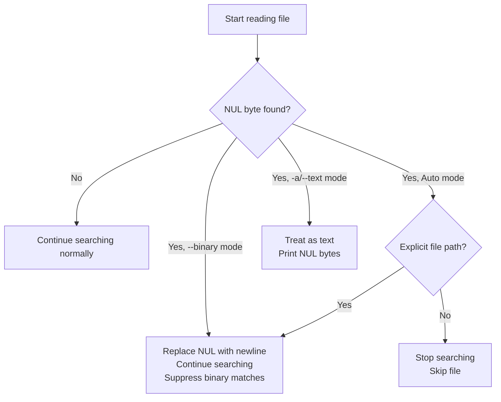
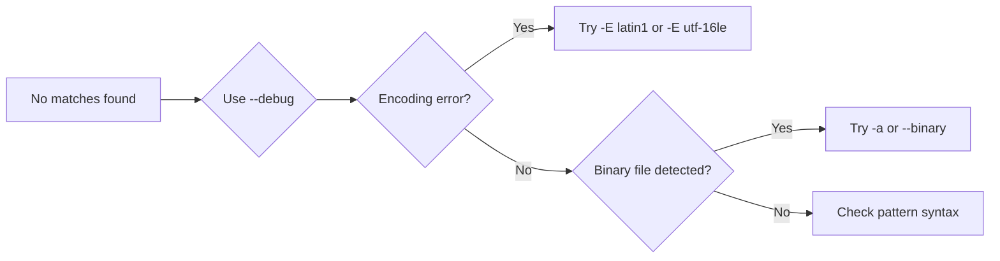

# Binary and Encoding Problems

## How ripgrep Detects Binary Files

ripgrep uses a simple heuristic: if it encounters a NUL byte (`\0`) in the data it reads, it treats the file as binary and handles it according to the current binary mode.

**Detection Details:**

- **Buffer size**: ripgrep reads files in chunks of 64 KB by default <!-- Source: crates/searcher/src/line_buffer.rs:6 -->
- **Detection byte**: A NUL byte (`\0`, byte value 0) triggers binary classification
- **When it happens**: Detection occurs during normal reading as data is buffered
- **Detection modes**: <!-- Source: crates/searcher/src/line_buffer.rs:51-64 -->
    - `Quit` mode: Stops reading immediately when NUL is found (default for recursive searches)
    - `Convert` mode: Replaces NUL bytes with line terminators to prevent huge lines (used with `--binary`)
    - `None` mode: No detection, reads all bytes as-is (used with `-a/--text`)

!!! note "Why NUL bytes indicate binary data"
    Text files rarely contain NUL bytes, while binary files (executables, images, compressed files) commonly have them throughout. This heuristic is fast and accurate for most cases.

**Binary Mode Behaviors:** <!-- Source: crates/core/flags/lowargs.rs:233-248 -->



## Searching Binary Files

If you need to search binary files, ripgrep provides several options depending on your needs:

!!! tip "Quick Reference"
    Use `-a/--text` for guaranteed text treatment, `--binary` for searching binaries without garbage output, or `--binary-files=without-match` to skip them silently in scripts.

### Flag Comparison

| Flag | Behavior | Use When | Notes |
|------|----------|----------|-------|
| `-a` / `--text` | Treat all files as text, print NUL bytes | You know files are text or need to see all bytes | Unconditional, ignores binary detection |
| `--binary` | Search binary files, replace NUL with newlines, suppress binary output | Searching mixed content, want to know about matches without seeing garbage | Converts NUL to prevent huge lines |
| `--binary-files=without-match` | Skip binary files silently | Scripting, want clean output | No warnings emitted |
| (default) | Auto mode: quit on NUL for recursive, suppress for explicit paths | Normal usage | Balances performance and usability |

### Examples

=== "Search and print everything"

    ```bash
    # Source: common usage pattern
    rg -a "pattern"  # -a is short for --text
    ```

    Searches all files as text, prints matches even if they contain NUL bytes.

    !!! warning "Performance impact"
        This can be slow on large binary files and may produce garbled output.

=== "Search but suppress binary"

    ```bash
    # Source: common usage pattern
    rg --binary "pattern"
    ```

    Searches binary files but replaces NUL bytes with newlines and suppresses matches that appear to be binary.

    !!! tip
        Good for finding text strings in compiled binaries or databases without garbage output.

=== "Skip binary files silently"

    ```bash
    # Source: crates/core/flags/complete/rg.zsh:275-276
    rg --binary-files=without-match "pattern"
    ```

    Silently skips binary files without warnings. Useful in scripts.

### Diagnosing Binary Detection

Use `--debug` to see which files are being skipped as binary:

```bash
$ rg --debug "pattern"
DEBUG|grep_searcher::searcher: binary file matches (but not printed): ./file.bin
```

!!! tip "Finding Hidden Matches"
    If you see "binary file matches (but not printed)", use `--binary` or `-a` to reveal those matches. This often happens with log files containing occasional binary data.

## Encoding Issues

If files aren't UTF-8 encoded, ripgrep may fail to search them correctly. This manifests in several ways.

!!! note "Default Encoding"
    ripgrep defaults to UTF-8 for all files. Use `-E/--encoding` to specify alternative encodings like `latin1`, `utf-16le`, or `iso-8859-1`.

### Common Encoding Problems

=== "UTF-8 decoding failures"

    **Symptom:**
    ```bash
    $ rg --debug "pattern"
    DEBUG|grep_searcher::searcher: encoding error: invalid utf-8 sequence
    ```

    **Fix:**
    Specify the correct encoding:
    ```bash
    $ rg -E latin1 "pattern"
    $ rg -E iso-8859-1 "pattern"
    ```

=== "UTF-16 without BOM"

    **Symptom:** No matches found in UTF-16 files that should match.

    **Why:** ripgrep defaults to UTF-8. UTF-16 uses 2 bytes per character, often including NUL bytes.

    **Fix:**
    ```bash
    $ rg -E utf-16le "pattern"  # (1)!
    $ rg -E utf-16be "pattern"  # (2)!
    ```

    1. Little-endian UTF-16 (Windows standard)
    2. Big-endian UTF-16 (less common, some Unix systems)

    !!! tip "Windows Files"
        Windows text files (`.txt`, `.log`) are often UTF-16LE. If `-a` shows garbled output with lots of NUL bytes, try `-E utf-16le`.

=== "BOM bytes in output"

    **Symptom:** Strange characters like `` (UTF-8 BOM) at start of matches.

    **Why:** Byte Order Mark (BOM) is metadata, not content, but appears in search results.

    **Fix:**
    - Use `--encoding` to handle properly
    - Use `-N/--no-line-number` to reduce visual clutter
    - Strip BOM in post-processing if needed

=== "Mixed encoding files"

    **Symptom:** Some lines match, others produce encoding errors.

    **Why:** File contains multiple encodings (common in logs from different sources).

    **Fix:**
    ```bash
    $ rg -a "pattern"  # Treat as binary, may show some matches
    $ rg -E latin1 "pattern"  # Try common encoding
    ```

    !!! note
        No perfect solution for mixed encodings. May need to re-encode files.

### Pattern Encoding vs File Encoding

!!! warning "Common Pitfall: Encoding Mismatch"
    Your search pattern must match the file's encoding. If searching for "café" in a Latin1 file:

    ```bash
    # Pattern is UTF-8 by default (café = c a f c3 a9)
    $ rg "café"  # Won't match Latin1 (café = c a f e9)

    # Tell ripgrep the file is Latin1
    $ rg -E latin1 "café"  # Now matches
    ```

    The `-E/--encoding` flag tells ripgrep how to **decode the file**, but your pattern is always interpreted as UTF-8 unless you use raw hex patterns.

### Diagnosis Workflow



For comprehensive encoding information, see the [file encoding chapter](../file-encoding.md).
