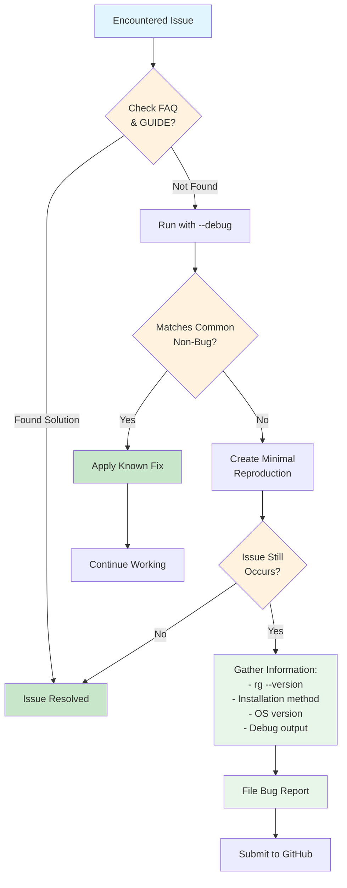

# When to File a Bug

## Before Filing a Bug Report

Before filing a bug report, please check:



**Figure**: Bug reporting decision flow - check documentation and common issues before filing.

!!! note "Pre-Flight Checklist"
    1. **Review the FAQ and GUIDE** - Your issue may be a known behavior or already documented
    2. **Run with `--debug`** - Gather diagnostic information
    3. **Test with a minimal example** - Simplify your reproduction case

!!! warning "Common Non-Bugs"
    Check if your issue matches these common scenarios:

    - **Pattern starting with `-`** → Use `rg -- -pattern` or `rg -e -pattern`
    - **Old Rust version for building** → Use latest stable Rust
    - **Package manager issues** → Contact package maintainer
    - **Snap package permission issues** → Use GitHub binary releases instead

## Preparing a Good Bug Report

!!! tip "Essential Information"
    A good bug report includes:

    1. **Output of `rg --version`**
    2. **How you installed ripgrep** (cargo, apt, homebrew, etc.)
    3. **Operating system and version**
    4. **Command run with `--debug` flag**
    5. **Complete `--debug` output**
    6. **Minimal reproduction case** (pattern and sample file if possible)
    7. **Expected vs. actual behavior**

    See the [bug report template](https://github.com/BurntSushi/ripgrep/blob/master/.github/ISSUE_TEMPLATE/bug_report.yml) for the complete format.

!!! example "Example Bug Report Structure"
    ```
    **Version**: rg 14.0.3 (installed via homebrew)
    **OS**: macOS 14.1 (Sonoma)
    **Command**: rg --debug "pattern" file.txt

    **Expected**: Should match lines containing "pattern"
    **Actual**: No matches found, but pattern exists in file

    **Debug Output**: [paste complete --debug output]

    **Reproduction**:
    1. Create file.txt with content: [minimal example]
    2. Run: rg "pattern" file.txt
    3. Observe: No matches (but should match line 3)
    ```

## Additional Resources

- **FAQ**: Common questions and answers - see `FAQ.md` in the project root
- **User Guide**: Comprehensive documentation - see `GUIDE.md` in the project root
- **GitHub Issues**: Search for known issues and solutions
- **Configuration**: See the [configuration file chapter](../configuration-file.md) for persistent settings
- **File Encoding**: See the [file encoding chapter](../file-encoding.md) for encoding details
- **Common Options**: See the [common options chapter](../common-options/index.md) for flag reference
