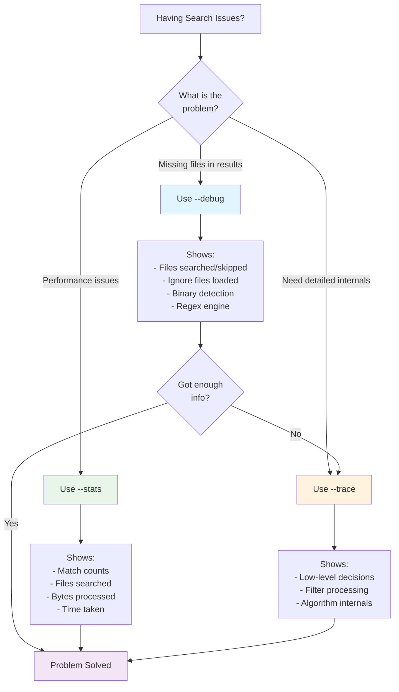

# Debug Flags

ripgrep provides several flags to help you understand what it's doing and diagnose search issues:



**Figure**: Decision flowchart for choosing the right debug flag based on your troubleshooting needs.

## `--debug`

The `--debug` flag shows detailed information about ripgrep's search decisions, including:

- Which files are being searched
- Which files are being skipped and why
- Which ignore files are being loaded (`.gitignore`, `.ignore`, etc.)
- Binary file detection results
- Configuration file loading
- Regex engine selection (default Rust regex vs PCRE2)

!!! example "Example output"
    ```
    $ rg --debug "pattern" mydir
    DEBUG|ignore::walk|...: ignoring ./mydir/.git: Ignore(IgnoreMatch(GitIgnore, .gitignore, node_modules/*, <...>))
    DEBUG|ignore::walk|...: ignoring ./mydir/target: Ignore(IgnoreMatch(GitIgnore, .gitignore, target/, <...>))
    DEBUG|grep_regex::literal|...: literal prefixes detected: Literals { lits: [Complete(pattern)], limit_size: 250, limit_class: 10 }
    ```

    !!! note
        Line numbers and file paths in debug output are illustrative and will vary by version.

**Use `--debug` when:**
- Files you expect to be searched are missing from results
- You need to understand which ignore files are affecting the search
- You're troubleshooting performance issues

!!! tip "Start with --debug"
    Always try `--debug` first before moving to `--trace`. In most cases, `--debug` provides sufficient information to diagnose search issues without overwhelming you with output.

!!! tip "Saving Debug Output"
    Debug and trace output goes to stderr, not stdout. To save debug output to a file for analysis:

    === "Linux / macOS"
        Save debug output only:
        ```bash
        rg --debug pattern . 2> debug.log
        ```

        View both search results and debug output:
        ```bash
        rg --debug pattern . 2>&1 | less
        ```

    === "Windows (PowerShell)"
        Save debug output only:
        ```powershell
        rg --debug pattern . 2> debug.log
        ```

        View both search results and debug output:
        ```powershell
        rg --debug pattern . 2>&1 | Out-Host -Paging
        ```

    === "Windows (cmd.exe)"
        Save debug output only:
        ```cmd
        rg --debug pattern . 2> debug.log
        ```

        View both search results and debug output:
        ```cmd
        rg --debug pattern . 2>&1 | more
        ```

## `--trace`

The `--trace` flag provides even more detailed output than `--debug`, showing trace-level debug information about all aspects of ripgrep's operation, including:

- Low-level search decisions
- Detailed filter processing
- Internal algorithm behavior

!!! warning "Very Verbose Output"
    `--trace` produces extremely verbose output that can be overwhelming. Use it only when `--debug` doesn't provide enough information to diagnose the issue.

!!! tip "Performance Impact"
    Debug flags add minimal overhead. `--debug` and `--trace` primarily affect output volume, not search speed. You can safely use `--stats` in production scripts to gather performance metrics.

## `--stats`

The `--stats` flag shows statistics about the search after completion. Statistics include:

- **matches** - Total number of individual matches found
- **matched lines** - Number of lines containing matches
- **files contained matches** - Number of files that had at least one match
- **files searched** - Total number of files searched
- **bytes printed** - Total bytes output to stdout
- **bytes searched** - Total bytes searched across all files
- **seconds spent searching** - Time spent in search phase
- **seconds total** - Total process time including startup and I/O

!!! example "Example output"
    ```bash
    # Source: crates/core/main.rs:464-472
    $ rg "Sherlock" --stats
    [normal search output]

    2 matches                    # (1)!
    2 matched lines              # (2)!
    1 files contained matches    # (3)!
    1 files searched             # (4)!
    142 bytes printed            # (5)!
    4567 bytes searched          # (6)!
    0.002390 seconds spent searching  # (7)!
    0.003120 seconds total       # (8)!
    ```

    1. Total number of individual matches found
    2. Total number of lines that matched the pattern
    3. Number of files that had at least one match
    4. Total files examined (regardless of matches)
    5. Total bytes written to stdout
    6. Total bytes examined during search
    7. Time spent in search phase
    8. Total process time including startup and I/O

!!! tip "Structured Output"
    `--stats` is implicitly enabled when `--json` is used, providing structured statistics in JSON format.

!!! info "When Stats Has No Effect"
    `--stats` has no effect when used with:

    - `--files` (just list files)
    - `--files-with-matches` (files with matches only)
    - `--files-without-match` (files without matches only)

**Use `--stats` to:**

- Verify how many files were actually searched
- Check performance metrics
- Understand the scope of your search

## Comparison Table

The following table shows what information each debug flag provides:

| Information Type | `--debug` | `--trace` | `--stats` |
|-----------------|---------|---------|---------|
| Files searched/skipped | ✓ | ✓ | ✓ (count only) |
| Ignore file matches | ✓ | ✓ | ✗ |
| Regex engine selection | ✓ | ✓ | ✗ |
| Binary detection | ✓ | ✓ | ✗ |
| Configuration loading | ✓ | ✓ | ✗ |
| Filter processing details | ✗ | ✓ | ✗ |
| Algorithm internals | ✗ | ✓ | ✗ |
| Performance metrics | ✗ | ✗ | ✓ |
| Match/line counts | ✗ | ✗ | ✓ |
| Bytes processed | ✗ | ✗ | ✓ |

## Common Debug Scenarios

Here are some practical examples for using debug flags to diagnose specific issues:

!!! example "Finding why a file is being skipped"
    ```bash
    rg --debug pattern . 2>&1 | grep 'ignoring.*myfile'
    ```

!!! example "Identifying which .gitignore is excluding files"
    ```bash
    rg --debug pattern . 2>&1 | grep gitignore
    ```

!!! example "Checking which regex engine is selected"
    ```bash
    rg --debug -P 'pattern' . 2>&1 | grep engine
    ```

!!! example "Profiling search to find performance bottlenecks"
    ```bash
    rg --stats pattern large-dir/
    ```
