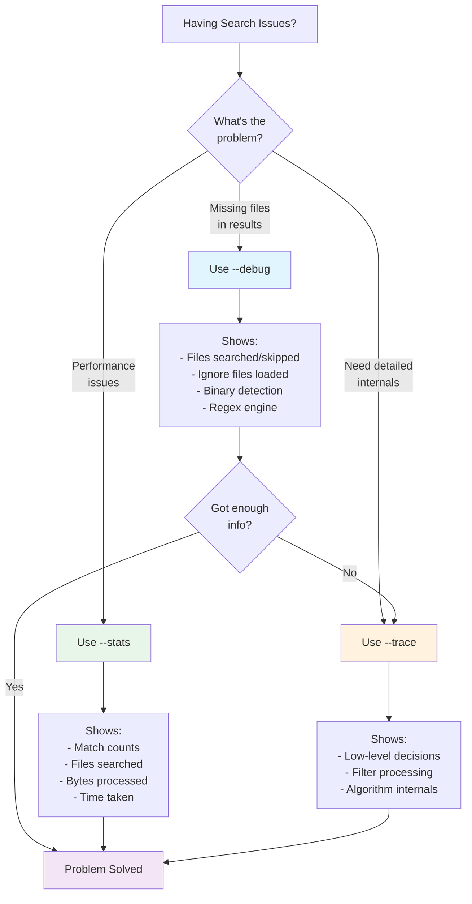

# Debug Flags

> Part of the [Troubleshooting](./index.md) page

ripgrep provides several flags to help you understand what it's doing and diagnose search issues:



**Figure**: Decision flowchart for choosing the right debug flag based on your troubleshooting needs.

## `--debug`

The `--debug` flag shows detailed information about ripgrep's search decisions, including:

- Which files are being searched
- Which files are being skipped and why
- Which ignore files are being loaded (`.gitignore`, `.ignore`, etc.)
- Binary file detection results
- Configuration file loading
- Regex engine selection (default Rust regex vs PCRE2)

!!! example "Example output"
    ```
    $ rg --debug "pattern" mydir
    DEBUG|ignore::walk|...: ignoring ./mydir/.git: Ignore(IgnoreMatch(GitIgnore, .gitignore, node_modules/*, <...>))
    DEBUG|ignore::walk|...: ignoring ./mydir/target: Ignore(IgnoreMatch(GitIgnore, .gitignore, target/, <...>))
    DEBUG|grep_regex::literal|...: literal prefixes detected: Literals { lits: [Complete(pattern)], limit_size: 250, limit_class: 10 }
    ```

    !!! note
        Line numbers and file paths in debug output are illustrative and will vary by version.

**Use `--debug` when:**
- Files you expect to be searched are missing from results
- You need to understand which ignore files are affecting the search
- You're troubleshooting performance issues

!!! tip "Start with --debug"
    Always try `--debug` first before moving to `--trace`. In most cases, `--debug` provides sufficient information to diagnose search issues without overwhelming you with output.

## `--trace`

The `--trace` flag provides even more detailed output than `--debug`, showing trace-level debug information about all aspects of ripgrep's operation, including:

- Low-level search decisions
- Detailed filter processing
- Internal algorithm behavior

!!! warning "Very Verbose Output"
    `--trace` produces extremely verbose output that can be overwhelming. Use it only when `--debug` doesn't provide enough information to diagnose the issue.

## `--stats`

The `--stats` flag shows statistics about the search after completion. Statistics include:

- **matched lines** - Number of lines containing matches
- **files contained matches** - Number of files that had at least one match
- **files searched** - Total number of files searched
- **bytes searched** - Total bytes searched across all files
- **bytes printed** - Total bytes output to stdout
- **seconds** - Time spent searching

!!! example "Example output"
    ```bash
    # Source: tests/feature.rs:425-430
    $ rg "Sherlock" --stats
    [normal search output]

    2 matched lines              # (1)!
    1 files contained matches    # (2)!
    1 files searched             # (3)!
    0.002390 seconds             # (4)!
    ```

    1. Total number of lines that matched the pattern
    2. Number of files that had at least one match
    3. Total files examined (regardless of matches)
    4. Time spent performing the search

!!! tip "Structured Output"
    `--stats` is implicitly enabled when `--json` is used, providing structured statistics in JSON format.

!!! info "When Stats Has No Effect"
    `--stats` has no effect when used with:

    - `--files` (just list files)
    - `--files-with-matches` (files with matches only)
    - `--files-without-match` (files without matches only)

**Use `--stats` to:**

- Verify how many files were actually searched
- Check performance metrics
- Understand the scope of your search
